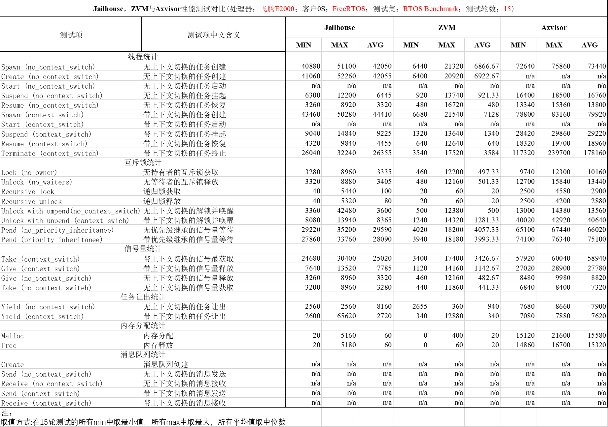
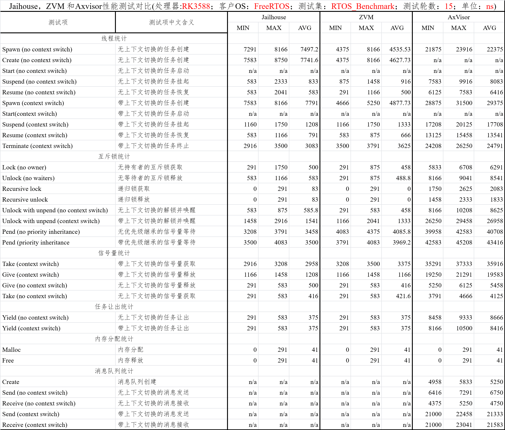
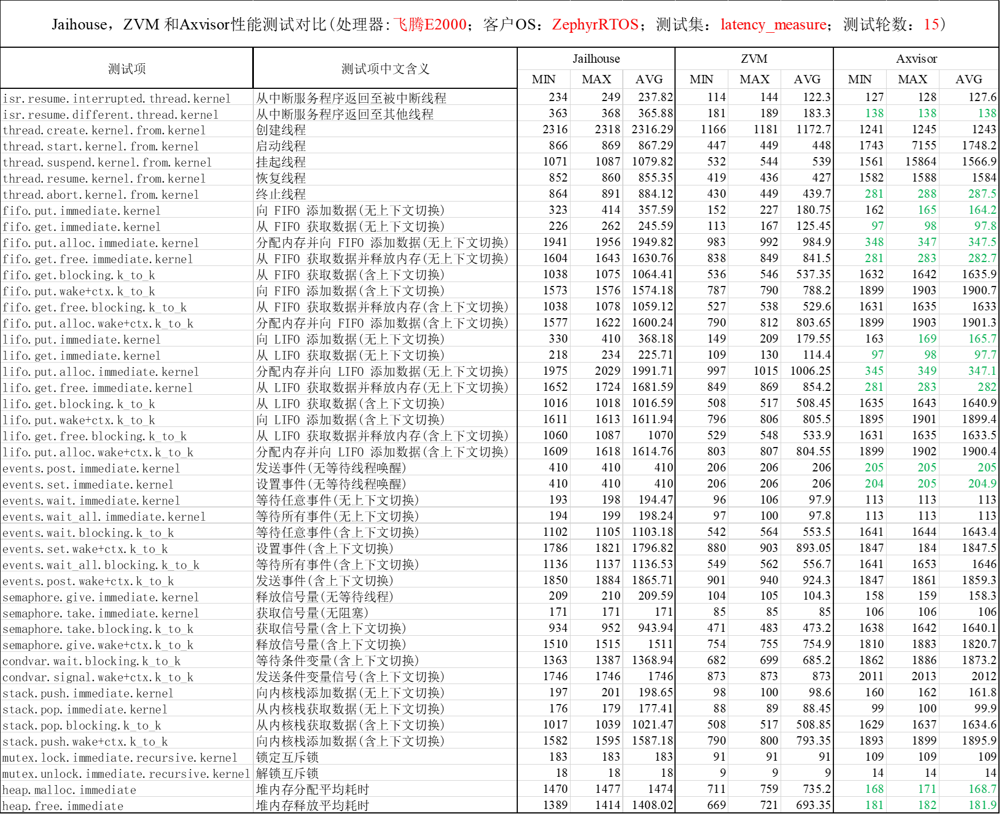
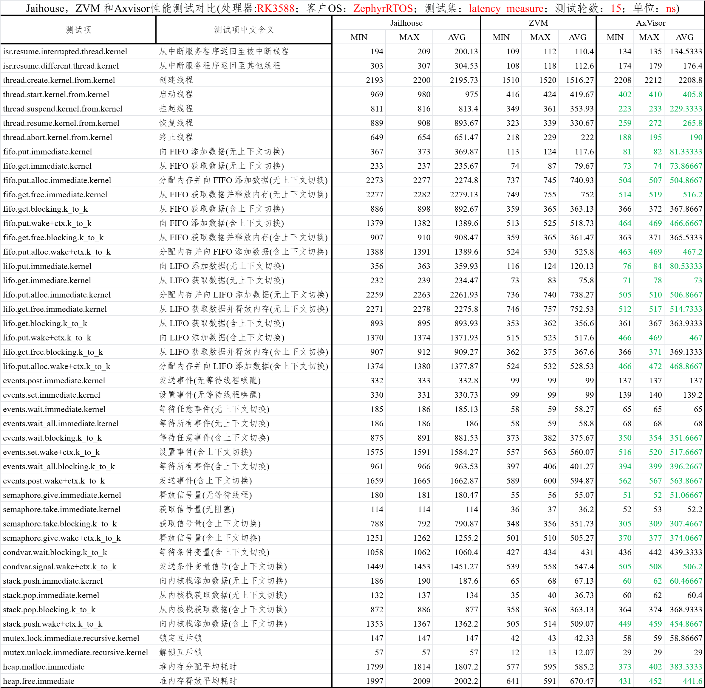

在飞腾E2000和RK3588处理器平台上，通过freertos和zephyr操作系统的性能测试，对比Axvisor和同类型的两个hypervisor（Jailhouse和ZVM）的性能。性能测试涉及任务创建、上下文切换、中断响应和线程调度等多项指标。

## 一、 RTOS Benchmark
在 RTOS Benchmark 测试中，我们选取了 FreeRTOS 作为客户机系统，对任务创建、消息传递、上下文切换等典型实时操作进行了对比。从结果来看，Axvisor 的性能相比zvm和jailhouse还有一点差距。

### Phytium E2000

### RK3588

从图中可以看到，Axvisor 在多个测试项上的耗时控制较为平稳，说明其在轻量级 RTOS 场景下能够较好地兼顾虚拟化开销与实时性需求。这也表明 Axvisor 更适合对任务响应速度和调度确定性有要求的嵌入式应用场景。
结合 RK3588 平台的测试结果来看，Axvisor 在不同硬件平台上的整体表现具有一定一致性，说明其 RTOS 虚拟化路径具备较好的可迁移性。不过从部分测例来看，Axvisor 与 ZVM、Jailhouse 之间仍然存在一定差距，后续还可以继续围绕任务切换和调度路径做针对性优化。

## 二、latency_measure
在 latency_measure 测试中，我们使用 Zephyr 客户机进一步评估中断响应和短路径调度延迟。该测试更关注系统在高频事件触发下的即时响应能力，能够更直观地反映 hypervisor 对实时性的影响。

### Phytium E2000

### RK3588

测试结果表明，Axvisor 在延迟测量中展现出较稳定的响应特征，整体延迟分布较为集中，没有出现明显的大幅抖动。Axvisor 在 很多测例中用时更少，在实时响应能力方面，具备部分领先优势。
从 RK3588 的测试图中也可以看到，Axvisor 在不少测例中依然保持了较短的响应时间，说明这种优势并不局限于单一平台。两组结果结合起来，能够更好地说明 Axvisor 在 Zephyr 场景下已经具备较强的实时响应能力与平台适应性。

从总体结果来看，Axvisor 在部分性能指标上具备明显优势，说明其在理想运行条件下可以提供非常快的实时任务响应能力。但同时，最大延迟偏大的现象也说明在个别时刻仍存在较大的抖动空间，这部分还有进一步优化的余地。综合来看，Axvisor 已经展现出较强的实时调度潜力，但在极端情况下的尾延迟控制方面仍值得持续改进。
