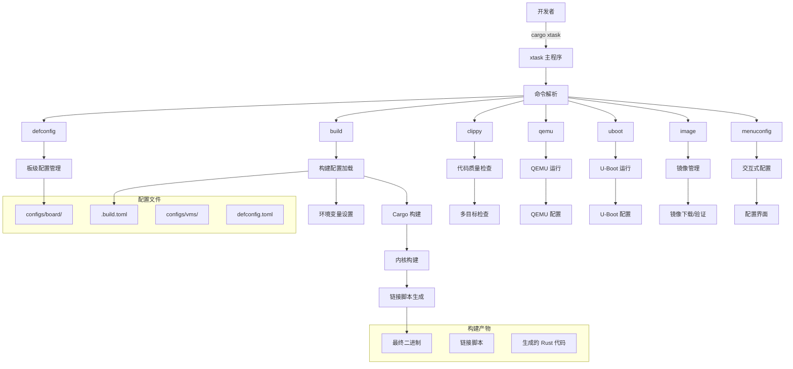
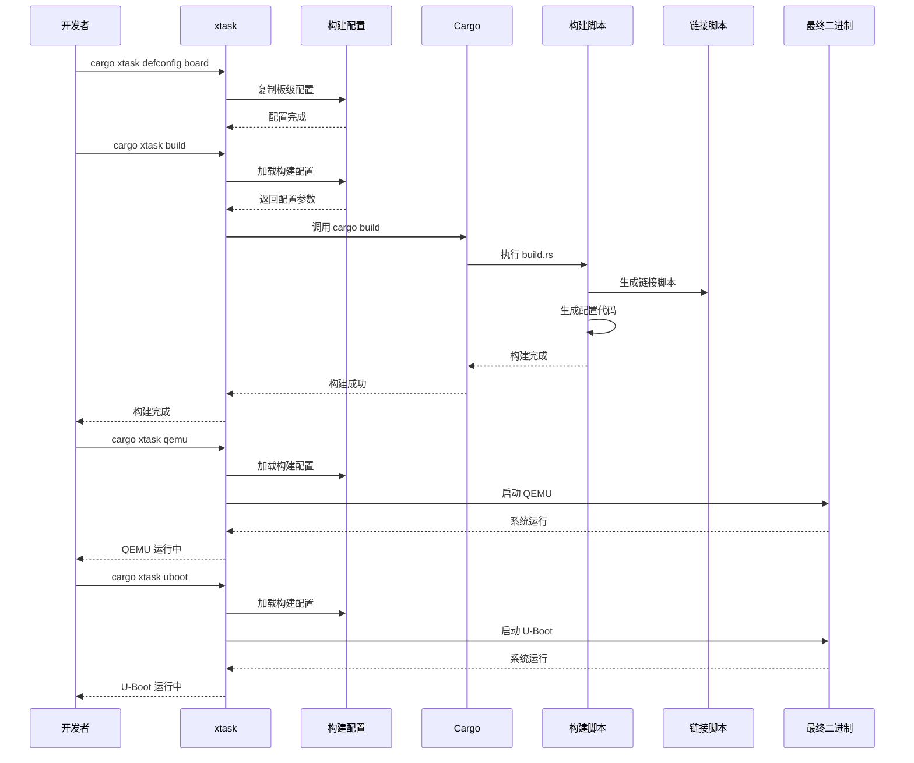

# 构建系统

Axvisor 是一个基于 Rust 的虚拟机监视器（Hypervisor）项目，采用了 `Cargo xtask` 构建系统来支持复杂的多平台、多架构的虚拟化解决方案。本文档将从源码角度详细分析 Axvisor 的构建系统，包括 xtask 的实现细节、构建配置管理、链接脚本生成、多平台支持等方面，帮助开发者深入理解项目的工作原理和构建流程。

## 总体架构

作为一个虚拟机监视器项目，Axvisor 需要支持多种硬件平台（如 ARM、x86、RISC-V）和不同的开发板（如 QEMU、Orange Pi、Phytium Pi 等），同时还要管理多个虚拟机配置以及处理在不同开发板上的开发调试。

这种复杂性要求一个高度灵活且可扩展的构建系统，最终我们选择采用 `Cargo xtask` 这套解决方案。为此，我们分别添加实现了构建和调试相关的命令，即支持一键构建，也可以一键调试！

### 构建系统架构图

下图展示了 Axvisor 构建系统的整体架构，包括各个组件之间的关系和数据流向：



### 构建流程时序图

下面的时序图展示了 Axvisor 构建系统的主要工作流程，从配置设置到最终构建完成的整个过程：



## 什么是 Cargo xtask？

Cargo xtask 是 Rust 生态系统中的一种常见模式，用于管理项目的开发任务和构建流程。它本质上是一个独立的 Rust 二进制程序，通常位于项目的 `xtask/` 目录下，通过 Cargo 运行来执行各种项目特定的任务。

与传统使用 Makefile 或其他构建工具不同，xtask 允许开发者使用 Rust 语言本身来编写构建脚本，这样可以充分利用 Rust 的类型系统、错误处理和生态系统。对于像 Axvisor 这样的复杂项目，xtask 提供了更加灵活和强大的构建管理能力。

### xtask 的优势

1. **一致性**：使用熟悉的 Rust 生态系统和工具链，开发者不需要学习新的构建语言或工具
2. **可扩展性**：可以轻松添加新的构建任务和功能，利用 Rust 的模块化特性组织代码
3. **跨平台**：与 Cargo 一样，支持多平台构建，无需为不同平台编写不同的构建脚本
4. **集成性**：与现有 Rust 工具链无缝集成，可以直接使用 Cargo 的各种功能和插件
5. **类型安全**：利用 Rust 的类型系统，在编译时就能发现构建脚本中的错误
6. **丰富的生态系统**：可以使用 Cargo 生态系统中的所有库来编写构建脚本

## `ostool` 库

Axvisor 的整个 xtask 系统构建在 `ostool` 库之上，这是一个专门为嵌入式和操作系统开发而设计的功能完整的 Rust 工具库，提供了从构建配置到系统运行的全流程支持。

### 核心架构

`ostool` 采用模块化工作空间架构，包含四个核心子项目，每个子项目负责特定的功能领域：

```
ostool/
├── ostool/          # 核心工具库和CLI
├── jkconfig/        # 配置编辑器和TUI框架
├── fitimage/        # U-Boot FIT镜像构建工具
└── uboot-shell/     # U-Boot通信库
```

### 主要功能

`ostool` 库为 Axvisor 提供了以下核心功能：

1. **构建系统抽象**：支持 Cargo 和自定义构建系统，提供统一的构建接口
2. **多平台运行支持**：集成 QEMU 和 U-Boot 运行环境，支持虚拟化和真实硬件测试
3. **配置管理**：基于 JSON Schema 的类型安全配置系统，支持交互式编辑
4. **二进制处理**：自动处理 ELF 到二进制格式的转换，支持多种架构
5. **环境变量管理**：智能处理构建和运行时环境变量，支持变量替换

### 核心组件详解

#### AppContext

[`AppContext`](ostool/ostool/src/ctx.rs:18) 是 `ostool` 的核心数据结构，封装了构建和运行过程中的所有状态信息：

```rust
#[derive(Default, Clone)]
pub struct AppContext {
    pub workspace_folder: PathBuf,
    pub manifest_dir: PathBuf,
    pub debug: bool,
    pub elf_path: Option<PathBuf>,
    pub bin_path: Option<PathBuf>,
    pub arch: Option<Architecture>,
    pub build_config: Option<BuildConfig>,
    pub build_config_path: Option<PathBuf>,
}
```

这个上下文对象提供了以下关键功能：

- **路径管理**：统一管理工作空间和清单目录路径
- **构建状态**：跟踪 ELF 和二进制文件路径，自动检测目标架构
- **配置管理**：存储和管理构建配置，支持配置验证
- **命令执行**：提供统一的命令执行接口，支持环境变量替换

#### 构建系统支持

`ostool` 支持两种构建系统，通过 [`BuildSystem`](ostool/ostool/src/build/config.rs:11) 枚举定义：

```rust
#[derive(Debug, Clone, Serialize, Deserialize, JsonSchema, PartialEq)]
pub enum BuildSystem {
    Custom(Custom),
    Cargo(Cargo),
}
```

**Cargo 构建系统**提供了完整的 Rust 项目构建支持：

- **特性管理**：自动处理 Rust 特性标志，支持日志级别自动配置
- **目标架构**：支持多目标架构编译，自动选择适当的工具链
- **环境变量**：智能设置构建环境变量，支持自定义配置
- **前后置命令**：支持构建前后执行自定义命令，实现复杂构建流程

**自定义构建系统**支持非 Rust 项目：

- **命令执行**：执行任意构建命令，支持 Make 等传统构建工具
- **路径处理**：自动处理构建产物路径，支持后续运行和调试
- **二进制转换**：自动将 ELF 文件转换为纯二进制格式

#### 运行环境支持

`ostool` 提供了完整的运行环境支持，通过 [`CargoRunnerKind`](ostool/ostool/src/run/cargo.rs:10) 枚举定义：

```rust
pub enum CargoRunnerKind {
    Qemu {
        qemu_config: Option<PathBuf>,
        debug: bool,
        dtb_dump: bool,
    },
    Uboot {
        uboot_config: Option<PathBuf>,
    },
}
```

**QEMU 运行支持**：
- **自动配置**：根据目标架构自动选择 QEMU 版本和参数
- **调试支持**：集成 GDB 调试，支持断点和单步执行
- **设备树**：支持设备树文件生成和转储，便于调试

**U-Boot 运行支持**：
- **串口通信**：通过串口与真实硬件通信，支持多种波特率
- **文件传输**：支持 YMODEM 协议传输文件到目标设备
- **网络启动**：支持 TFTP 网络启动，便于远程开发

### 子项目

#### jkconfig

[`jkconfig`](ostool/jkconfig/) 是一个基于 JSON Schema 的配置编辑器，提供了现代化的 TUI 界面：

**核心特性**：
- **类型安全**：基于 JSON Schema 的类型验证和自动完成
- **交互式编辑**：支持多种数据类型的交互式编辑界面
- **实时验证**：编辑时实时验证配置正确性
- **多格式支持**：支持 TOML、JSON 等多种配置格式

**技术实现**：
- 使用 `cursive` TUI 框架构建用户界面
- 基于 `schemars` 库生成 JSON Schema
- 支持自定义编辑器组件和验证规则

#### fitimage

[`fitimage`](ostool/fitimage/) 是用于创建 U-Boot 兼容的 FIT (Flattened Image Tree) 镜像的专业工具：

**核心功能**：
- **标准兼容**：完全符合 U-Boot FIT 规范
- **多组件支持**：支持内核、设备树、ramdisk 等多种组件
- **压缩支持**：支持 gzip 等多种压缩算法
- **校验支持**：支持 CRC32、SHA1 等多种校验算法

**技术实现**：
- 使用 `device_tree` 和 `vm-fdt` 库处理设备树
- 支持多种压缩和哈希算法
- 提供灵活的配置 API

#### uboot-shell

[`uboot-shell`](ostool/uboot-shell/) 提供了与 U-Boot 引导程序的通信功能：

**核心功能**：
- **串口通信**：通过串口与 U-Boot 进行命令交互
- **文件传输**：支持 YMODEM 协议传输文件
- **命令执行**：支持执行 U-Boot 命令并获取返回结果
- **环境变量**：支持读取和设置 U-Boot 环境变量

**技术实现**：
- 使用 `serialport` 库进行串口通信
- 实现完整的 YMODEM 协议
- 提供异步和同步两种通信模式

### 配置系统

`ostool` 的配置系统基于 JSON Schema，提供了类型安全的配置管理：

**配置文件结构**：
- `.build.toml`：构建配置，定义如何编译项目
- `.qemu.toml`：QEMU 运行配置，定义虚拟机参数
- `.uboot.toml`：U-Boot 运行配置，定义硬件启动参数

**配置验证**：
- 自动生成 JSON Schema 文件（`.build-schema.json`）
- 支持 IDE 自动完成和错误检查
- 运行时配置验证，提供详细错误信息

**环境变量支持**：
- 支持环境变量替换，格式为 `${env:VAR_NAME:-default}`
- 提供默认值机制，增强配置灵活性
- 支持路径变量，如 `${workspaceFolder}`

### 高级特性

`ostool` 提供了许多高级特性，支持复杂的开发场景：

1. **远程配置**：支持从 URL 下载配置文件，便于团队协作
2. **并行构建**：支持多核并行构建，提高构建效率
3. **增量构建**：智能检测文件变化，只构建必要的部分
4. **缓存支持**：支持构建产物缓存，加速重复构建
5. **插件系统**：支持自定义插件扩展功能

### 使用示例

- **基本构建流程**：

	```rust
	use ostool::ctx::AppContext;

	let mut ctx = AppContext::new();
	let build_config = ctx.perpare_build_config(None, false).await?;
	ctx.build_cargo(&build_config).await?;
	```

- **QEMU 运行**：

	```rust
	use ostool::run::cargo::CargoRunnerKind;

	let runner = CargoRunnerKind::Qemu {
	    qemu_config: Some(PathBuf::from(".qemu.toml")),
	    debug: true,
	    dtb_dump: false,
	};
	ctx.cargo_run(&build_config, &runner).await?;
	```

- **U-Boot 运行**：

	```rust
	let runner = CargoRunnerKind::Uboot {
	    uboot_config: Some(PathBuf::from(".uboot.toml")),
	};
	ctx.cargo_run(&build_config, &runner).await?;
	```

`ostool` 库为 Axvisor 项目提供了强大而灵活的构建和运行支持，使得复杂的虚拟化系统开发变得简单高效。通过模块化设计和类型安全的配置系统，`ostool` 不仅提高了开发效率，还确保了系统的可靠性和可维护性。

## Axvisor 的 xtask 架构

Axvisor 的 xtask 实现采用了模块化设计，将不同的功能分散到独立的模块中，每个模块负责特定的任务。这种设计使得代码结构清晰，易于维护和扩展。

### 项目结构

每个模块都有明确的职责分工，这种模块化设计使得代码更加清晰和易于维护。例如，`image.rs` 专门负责虚拟机镜像的下载、验证和管理，而 `clippy.rs` 则专注于代码质量检查。

```
xtask/
├── Cargo.toml          # xtask 依赖配置
└── src/
    ├── main.rs         # 主入口点和命令行解析
    ├── cargo.rs        # Cargo 相关操作（QEMU、U-Boot 运行）
    ├── clippy.rs       # 代码质量检查
    ├── ctx.rs          # 上下文管理
    ├── image.rs        # 客户机镜像管理
    ├── menuconfig.rs   # 交互式配置
    ├── tbuld.rs        # 构建配置管理
    └── vmconfig.rs     # 虚拟机配置
```

### 核心组件

#### 主入口点

[`main.rs`](xtask/src/main.rs:1) 是 xtask 的入口点，使用 `clap` 库进行命令行参数解析。该文件定义了所有可用的命令和它们的参数结构。通过使用 Rust 的强类型系统和 `clap` 的派生宏，代码既简洁又类型安全。

```rust
#[derive(Parser)]
#[command(name = "xtask")]
#[command(about = "ArceOS build configuration management tool")]
struct Cli {
    #[command(subcommand)]
    command: Commands,
}

#[derive(Subcommand)]
enum Commands {
    /// Set default build configuration from board configs
    Defconfig { board_name: String },
    Build,
    /// Run clippy checks across all targets and feature combinations
    Clippy(ClippyArgs),
    Qemu(QemuArgs),
    Uboot(UbootArgs),
    Vmconfig,
    Menuconfig,
    /// Guest Image management
    Image(image::ImageArgs),
}
```

这种设计模式使得添加新命令变得非常简单，只需要在 `Commands` 枚举中添加新的变体，并在 `main` 函数中添加相应的处理逻辑即可。每个命令都可以有自己的参数结构，实现了高度的可扩展性。

#### 与 ostool 的集成

[`ctx.rs`](xtask/src/ctx.rs:1) 提供了构建上下文管理，这是整个 xtask 系统的核心数据结构。它封装了构建过程中需要的所有状态信息，包括工作目录、构建配置路径和虚拟机配置列表等。

```rust
pub struct Context {
    pub ctx: AppContext,
    pub build_config_path: Option<std::path::PathBuf>,
    pub vmconfigs: Vec<String>,
}
```

通过将状态集中管理，避免了在各个模块之间传递大量参数，简化了代码结构。`AppContext` 来自 `ostool` 库，它是 Axvisor 的 xtask 系统与 `ostool` 紧密集成的桥接点，而 `Context` 在此基础上扩展了 Axvisor 特定的需求。这种集成方式带来了以下优势：

1. **功能复用**：充分利用 `ostool` 的成熟功能，避免重复开发
2. **类型安全**：通过 Rust 类型系统确保配置和操作的类型安全
3. **扩展性**：可以轻松扩展 `ostool` 的功能，而不影响 xtask 的核心逻辑
4. **维护性**：将通用功能集中在 `ostool` 中，降低维护成本

#### 构建配置管理

[`tbuld.rs`](xtask/src/tbuld.rs:1) 定义了构建配置结构和管理逻辑，这是 xtask 系统中最复杂的模块之一。它负责解析构建配置文件，验证参数，并将配置转换为 Cargo 可以理解的格式。

```rust
#[derive(Debug, Clone, Serialize, Deserialize, JsonSchema, PartialEq)]
pub struct Config {
    /// target triple
    pub target: String,
    /// features to enable
    pub features: Vec<String>,
    /// log level feature
    pub log: Option<LogLevel>,
    /// other cargo args
    pub cargo_args: Vec<String>,
    /// whether to output as binary
    pub to_bin: bool,
    pub smp: Option<usize>,
    pub vm_configs: Vec<String>,
}
```

这个配置结构体使用了多个 derive 宏，包括 `Serialize`、`Deserialize` 和 `JsonSchema`，使得配置可以被序列化为多种格式（TOML、JSON 等），并且可以自动生成 JSON Schema 用于验证。这种设计使得配置系统既灵活又类型安全，可以在编译时捕获配置错误。

该模块还实现了配置加载逻辑，包括路径解析、文件读取、错误处理等复杂功能。它支持相对路径和绝对路径，可以自动扩展环境变量，并提供了详细的错误信息来帮助用户诊断配置问题。

## 构建流程

Axvisor 的构建流程是一个高度复杂但设计精良的系统，它需要处理多平台支持、多种配置选项和复杂的依赖关系。整个构建流程从配置管理开始，经过代码生成、编译、链接，最终生成可运行的二进制文件。

### 工作空间结构

Axvisor 使用 Cargo 工作空间来管理多个相关 crate，这是 Rust 生态系统中管理大型项目的标准方式。通过工作空间，可以将项目分解为多个逻辑独立的模块，每个模块有自己的 `Cargo.toml` 文件，但共享同一个依赖解析和构建流程。

```toml
[workspace]
members = [
  "crates/*",
  "modules/*",
  "platform/*",
  "xtask",
  "kernel",
]
resolver = "3"
```

这种结构有几个重要优势：
- **模块化**：不同功能模块可以独立开发和测试
- **依赖管理**：工作空间确保所有 crate 使用相同版本的依赖
- **构建优化**：可以并行构建多个 crate，提高构建效率
- **代码共享**：模块之间可以轻松共享代码和类型定义

工作空间中的每个目录都有特定的用途：
- `crates/`：包含项目的核心功能库
- `modules/`：包含 ArceOS 相关的模块
- `platform/`：包含平台特定的代码
- `xtask/`：构建工具本身
- `kernel/`：内核主代码

### 构建配置

Axvisor 的构建配置系统是其最复杂的部分之一，需要支持多种硬件平台、不同的虚拟机配置和灵活的构建选项。配置系统采用分层设计，从全局默认配置到板级特定配置，再到虚拟机配置，每一层都可以覆盖和扩展上一层的设置。

#### 板级配置

项目支持多种开发板的配置，存储在 [`configs/board/`](configs/board/) 目录下。每个开发板都有自己的特定配置，包括目标架构、编译特性、调试选项等。这种设计使得同一个代码库可以支持多种不同的硬件平台，而无需修改核心代码。

支持的开发板包括：
- [`qemu-aarch64.toml`](configs/board/qemu-aarch64.toml:1)：QEMU 模拟的 ARM64 平台
- [`orangepi-5-plus.toml`](configs/board/orangepi-5-plus.toml:1)：Orange Pi 5 Plus 开发板
- [`phytiumpi.toml`](configs/board/phytiumpi.toml:1)：Phytium Pi 开发板
- [`roc-rk3568-pc.toml`](configs/board/roc-rk3568-pc.toml:1)：ROC-RK3568-PC 开发板

每个板级配置文件定义了目标架构、特性、日志级别等构建参数：

```toml
cargo_args = []
features = [
    "ept-level-4",
    "axstd/myplat",
    "axstd/bus-mmio",
]
log = "Info"
target = "aarch64-unknown-none-softfloat"
to_bin = true
vm_configs = []
```

这些配置参数控制着构建过程的各个方面：
- `cargo_args`：传递给 Cargo 的额外参数
- `features`：启用的 Rust 特性标志
- `log`：日志级别设置
- `target`：目标三元组，定义目标架构和系统
- `to_bin`：是否生成二进制文件
- `vm_configs`：虚拟机配置文件列表

#### 虚拟机配置

虚拟机配置存储在 [`configs/vms/`](configs/vms/) 目录下，定义了每个虚拟机的详细参数。这些配置比板级配置更加详细，包括内存布局、设备配置、中断处理等虚拟化相关的设置。每个虚拟机配置文件都包含了虚拟机的完整定义：

```toml
[base]
id = 1
name = "arceos-qemu"
vm_type = 1
cpu_num = 1
phys_cpu_ids = [0]

[kernel]
entry_point = 0x8020_0000
image_location = "memory"
kernel_path = "/tmp/axvisor/qemu_arceos_aarch64/qemu-aarch64"
kernel_load_addr = 0x8020_0000
```

虚拟机配置分为几个主要部分：
- `base`：基本信息，包括虚拟机 ID、名称、类型和 CPU 配置
- `kernel`：内核相关配置，包括入口点、镜像位置和加载地址
- `memory_regions`：内存区域定义，指定虚拟机的内存布局
- `devices`：设备配置，包括直通设备和模拟设备
- `interrupt_mode`：中断模式配置

这种详细的配置系统使得 Axvisor 可以支持复杂的虚拟化场景，包括多种客户机操作系统、不同的设备配置和灵活的资源分配。

### 构建脚本

构建脚本是 Axvisor 构建系统的核心，它们在编译时执行，负责生成代码、处理配置和设置编译选项。Axvisor 使用了多个构建脚本，每个都有特定的职责。

#### 内核构建脚本

[`kernel/build.rs`](kernel/build.rs:1) 是构建系统的核心组件之一，负责处理最复杂的构建逻辑。这个脚本在内核编译时执行，主要职责包括：

1. **读取虚拟机配置文件**：从环境变量或配置文件中读取虚拟机配置
2. **生成链接脚本**：根据目标架构和平台参数生成适当的链接脚本
3. **处理环境变量**：解析各种环境变量，如 `AXVISOR_SMP` 和 `AXVISOR_VM_CONFIGS`
4. **生成 Rust 代码**：将配置数据嵌入到 Rust 代码中，供运行时使用

关键功能实现：

```rust
fn main() -> anyhow::Result<()> {
    let arch = std::env::var("CARGO_CFG_TARGET_ARCH").unwrap();
    let mut smp = None;
    if let Ok(s) = std::env::var("AXVISOR_SMP") {
        smp = Some(s.parse::<usize>().unwrap_or(1));
    }

    let platform = if arch == "aarch64" {
        "aarch64-generic".to_string()
    } else if arch == "x86_64" {
        "x86-qemu-q35".to_string()
    } else {
        "dummy".to_string()
    };

    println!("cargo:rustc-cfg=platform=\"{platform}\"");

    if platform != "dummy" {
        gen_linker_script(&arch, platform.as_str(), smp.unwrap_or(1)).unwrap();
    }

    // 处理虚拟机配置...
}
```

这个构建脚本展示了 Rust 构建系统的强大功能：它可以读取环境变量、执行复杂的逻辑、生成文件，并通过 `println!` 宏向 Cargo 发送指令。这些指令可以影响编译过程，比如设置 `cfg` 条件编译标志。

#### 链接脚本生成

链接脚本是构建过程中最关键的部分之一，它定义了最终二进制文件的内存布局。Axvisor 需要支持多种架构和平台，每种都有不同的内存布局要求，因此构建系统必须能够动态生成适当的链接脚本。

构建系统根据目标架构和平台参数动态生成链接脚本：

```rust
fn gen_linker_script(arch: &str, platform: &str, smp: usize) -> io::Result<()> {
    let fname = format!("linker_{platform}.lds");
    let output_arch = if arch == "x86_64" {
        "i386:x86-64"
    } else if arch.contains("riscv") {
        "riscv"
    } else {
        arch
    };
    let ld_content = std::fs::read_to_string("../scripts/lds/linker.lds.S")?;
    let ld_content = ld_content.replace("%ARCH%", output_arch);
    let ld_content = ld_content.replace("%KERNEL_BASE%", &format!("{:#x}", 0x800000000000usize));
    let ld_content = ld_content.replace("%SMP%", &format!("{smp}",));

    // 写入生成的链接脚本...
}
```

这个过程展示了构建系统的灵活性：它使用模板文件（`linker.lds.S`），然后根据目标架构和运行时参数替换占位符，生成最终的链接脚本。这种方法避免了为每个平台维护单独的链接脚本，减少了维护工作量和出错的可能性。

#### 链接脚本模板

[`scripts/lds/linker.lds.S`](scripts/lds/linker.lds.S:1) 是链接脚本的模板，使用占位符支持参数化。这个模板定义了内核的内存布局，包括各个段的排列、对齐要求和符号定义。

```ld
OUTPUT_ARCH(%ARCH%)

BASE_ADDRESS = %KERNEL_BASE%;
SMP = %SMP%

ENTRY(_start)
SECTIONS
{
    . = BASE_ADDRESS;
    _skernel = .;

    .text : ALIGN(4K) {
        _stext = .;
        *(.text.boot)
        *(.text .text.*)
        . = ALIGN(4K);
        _etext = .;
    }
    
    // 其他段定义...
}
```

这个链接脚本模板有几个重要特点：
- **参数化**：使用 `%ARCH%`、`%KERNEL_BASE%` 和 `%SMP%` 等占位符，允许在构建时定制
- **段对齐**：所有段都按 4K 边界对齐，这是页面大小对齐的要求
- **符号定义**：定义了 `_stext`、`_etext` 等符号，供运行时代码使用
- **特殊段**：包含了 `.percpu` 段，用于支持多核处理器的 per-cpu 数据

这种设计使得同一个链接脚本模板可以支持多种不同的配置，大大简化了构建系统的复杂性。

## xtask 命令

Axvisor 的 xtask 系统提供了丰富的命令集，涵盖了从配置管理到构建、测试、运行的完整开发流程。每个命令都经过精心设计，既提供了简单的默认行为，又支持高级用户进行细粒度控制。

### defconfig 命令

defconfig 命令用于设置默认构建配置，这是开发者开始新项目时的第一步。它将预定义的板级配置复制为当前项目的构建配置，大大简化了初始设置过程。

使用方法：

```bash
cargo xtask defconfig qemu-aarch64
```

实现逻辑：

```rust
fn defconfig_command(board_name: &str) -> Result<()> {
    println!("Setting default configuration for board: {board_name}");

    // 验证板级配置是否存在
    let board_config_path = format!("configs/board/{board_name}.toml");
    if !Path::new(&board_config_path).exists() {
        return Err(anyhow!(
            "Board configuration '{board_name}' not found. Available boards: qemu-aarch64, orangepi-5-plus"
        ));
    }

    // 备份现有配置
    backup_existing_config()?;

    // 复制板级配置到 .build.toml
    copy_board_config(board_name)?;

    println!("Successfully set default configuration to: {board_name}");
    Ok(())
}
```

defconfig 命令的核心功能是生成 `.build.toml` 文件，该过程包括以下几个步骤：

1. **验证板级配置存在性**：检查 `configs/board/{board_name}.toml` 文件是否存在
2. **备份现有配置**：如果当前目录已存在 `.build.toml`，会创建带时间戳的备份文件
3. **复制板级配置**：将选定的板级配置文件复制为 `.build.toml`

板级配置文件定义了构建所需的所有参数，例如：

```toml
cargo_args = []
features = [
    "ept-level-4",
    "axstd/myplat",
    "axstd/bus-mmio",
]
log = "Info"
target = "aarch64-unknown-none-softfloat"
to_bin = true
vm_configs = []
```

这个命令的设计考虑了用户体验和安全性：
- **验证**：确保请求的板级配置存在，避免用户输入错误
- **备份**：自动备份现有配置，防止意外丢失用户自定义设置
- **反馈**：提供清晰的成功/失败消息，让用户了解操作结果

### build 命令

build 命令是 xtask 系统的核心，负责执行完整的项目构建过程。它不仅仅是简单地调用 `cargo build`，而是包含了配置加载、环境变量设置、依赖检查等复杂逻辑。

使用方法：

```bash
cargo xtask build
```

build 命令的执行流程：

1. **加载配置**：调用 `load_config()` 加载和处理构建配置
2. **环境变量设置**：根据配置设置必要的环境变量
3. **调用 ostool**：使用 `ostool` 库执行实际的 Cargo 构建

```rust
pub async fn run_build(&mut self) -> anyhow::Result<()> {
    let config = self.load_config()?;
    self.ctx.build_cargo(&config).await?;
    Ok(())
}
```

这个命令的复杂性在于它需要处理多种配置选项和环境变量，确保构建过程的一致性和可重现性。通过自动生成 Schema 文件和严格的配置验证，构建系统能够在编译前捕获配置错误，提高开发效率。

build 命令的核心是 [`load_config()`](xtask/src/tbuld.rs:27) 函数，它负责加载和处理构建配置：

1. **生成 JSON Schema**：使用 `schemars` 库为 `Config` 结构体生成 JSON Schema
2. **写入 .build-schema.json**：将生成的 Schema 写入 `.build-schema.json` 文件，用于配置验证
3. **读取 .build.toml**：从工作目录读取 `.build.toml` 配置文件
4. **解析配置**：使用 `toml` 库解析配置文件内容为 `Config` 结构体
5. **处理虚拟机配置**：验证和扩展虚拟机配置路径
6. **转换为 Cargo 配置**：将配置转换为 `ostool` 库所需的 `Cargo` 结构体

实现细节：

```rust
pub fn load_config(&mut self) -> anyhow::Result<Cargo> {
    // 1. 生成 JSON Schema
    let json = schema_for!(Config);
    
    // 2. 确定配置文件路径
    let mut config_path = self.ctx.workspace_folder.join(".build.toml");
    if let Some(c) = &self.build_config_path {
        config_path = c.clone();
    }
    
    // 3. 写入 Schema 文件
    std::fs::write(
        config_path.parent().unwrap().join(".build-schema.json"),
        serde_json::to_string_pretty(&json).unwrap(),
    )?;
    
    // 4. 读取和解析配置文件
    let config_str = std::fs::read_to_string(&config_path)?;
    let config: Config = toml::from_str(&config_str)?;
    
    // 5. 处理虚拟机配置路径
    let mut vm_configs = config.vm_configs.to_vec();
    vm_configs.extend(self.vmconfigs.iter().cloned());
    
    // 6. 转换为 Cargo 配置
    let mut cargo = Cargo {
        target: config.target,
        package: "axvisor".to_string(),
        features: config.features,
        log: config.log,
        args: config.cargo_args,
        to_bin: config.to_bin,
        ..Default::default()
    };
    
    // 7. 设置环境变量
    if let Some(smp) = config.smp {
        cargo.env.insert("AXVISOR_SMP".to_string(), smp.to_string());
    }
    
    if !vm_config_paths.is_empty() {
        let value = vm_config_paths
            .iter()
            .map(|p| format!("{}", p.display()))
            .collect::<Vec<_>>()
            .join(";");
        cargo.env.insert("AXVISOR_VM_CONFIGS".to_string(), value);
    }
    
    Ok(cargo)
}
```

`.build-schema.json` 文件是构建系统的重要组成部分，它提供了配置文件的 JSON Schema 定义，用于：

1. **配置验证**：确保 `.build.toml` 文件的结构和类型正确
2. **IDE 支持**：为编辑器提供自动完成和错误检查功能
3. **文档生成**：自动生成配置选项的文档

生成过程：

1. **Schema 生成**：使用 `schemars::schema_for!` 宏为 `Config` 结构体生成 Schema
2. **序列化**：将 Schema 序列化为格式化的 JSON 字符串
3. **文件写入**：将 JSON 写入 `.build-schema.json` 文件

Schema 包含了所有配置字段的详细信息：

```json
{
  "$schema": "http://json-schema.org/draft-07/schema#",
  "title": "Config",
  "description": "Build configuration for Axvisor",
  "type": "object",
  "properties": {
    "target": {
      "description": "target triple",
      "type": "string"
    },
    "features": {
      "description": "features to enable",
      "type": "array",
      "items": {
        "type": "string"
      }
    },
    "log": {
      "description": "log level feature",
      "anyOf": [
        {
          "type": "string"
        }
      ]
    },
    "cargo_args": {
      "description": "other cargo args",
      "type": "array",
      "items": {
        "type": "string"
      }
    },
    "to_bin": {
      "description": "whether to output as binary",
      "type": "boolean"
    },
    "smp": {
      "description": "Number of CPU cores",
      "type": "integer",
      "minimum": 1
    },
    "vm_configs": {
      "description": "VM configuration files",
      "type": "array",
      "items": {
        "type": "string"
      }
    }
  },
  "required": [
    "target",
    "features",
    "to_bin"
  ]
}
```

### clippy 命令

clippy 命令实现了全面的代码质量检查，远超标准的 `cargo clippy` 功能。它支持多目标架构、多特性组合的检查，并提供了详细的统计报告和自动修复功能。

使用方法：

```bash
cargo xtask clippy
```

[`clippy.rs`](xtask/src/clippy.rs:1) 实现了全面的代码检查：

1. **多目标架构检查**：自动检查所有支持的目标架构
2. **特性组合检查**：测试各种特性组合，确保兼容性
3. **详细的统计报告**：提供通过、失败、跳过的检查数量统计
4. **自动修复和干运行模式**：支持自动修复常见问题和预览模式

这个命令对于维护代码质量至关重要，特别是在一个支持多平台的项目中，它能确保代码在所有目标平台上都能正确编译和工作。

### qemu 命令

qemu 命令简化了在 QEMU 模拟器中运行构建系统的过程。它自动处理架构检测、配置文件生成和 QEMU 启动，让开发者可以快速测试构建结果。

使用方法：

```bash
cargo xtask qemu
```

实现逻辑：

```rust
pub async fn run_qemu(&mut self, config_path: Option<PathBuf>) -> anyhow::Result<()> {
    let build_config = self.load_config()?;
    
    let arch = if build_config.target.contains("aarch64") {
        Arch::Aarch64
    } else if build_config.target.contains("x86_64") {
        Arch::X86_64
    } else {
        return Err(anyhow::anyhow!(
            "Unsupported target architecture: {}",
            build_config.target
        ));
    };
    
    // 设置 QEMU 配置...
}
```

这个命令的智能之处在于它能够自动检测目标架构并选择适当的 QEMU 版本和配置，大大简化了测试流程。

### uboot 命令

uboot 命令提供了在 U-Boot 环境中运行构建系统的功能，这对于在真实硬件上测试 Axvisor 特别重要。U-Boot（Universal Boot Loader）是一个广泛使用的开源引导加载程序，支持多种计算机体系结构。

使用方法：

```bash
cargo xtask uboot
```

实现逻辑：

```rust
pub async fn run_uboot(&mut self, config_path: Option<PathBuf>) -> anyhow::Result<()> {
    let build_config = self.load_config()?;

    let config_path = config_path.unwrap_or_else(|| PathBuf::from(".uboot.toml"));

    let kind = CargoRunnerKind::Uboot {
        uboot_config: Some(config_path),
    };

    self.ctx.cargo_run(&build_config, &kind).await?;

    Ok(())
}
```

这个命令的设计考虑了真实硬件部署的需求：
- **配置文件管理**：支持自定义 U-Boot 配置文件，默认使用 `.uboot.toml`
- **硬件兼容性**：通过 `ostool` 库与 U-Boot 工具链集成
- **自动化流程**：简化了从构建到在真实硬件上运行的复杂过程

U-Boot 命令与 QEMU 命令的主要区别在于：
- **目标环境**：QEMU 用于虚拟化测试，U-Boot 用于真实硬件
- **配置复杂度**：U-Boot 需要处理更多硬件特定的配置
- **调试方式**：U-Boot 环境下的调试通常需要硬件调试器支持

这个命令对于在真实开发板上部署和测试 Axvisor 至关重要，特别是在产品开发阶段。

### image 命令

image 命令提供了完整的客户机镜像管理功能，包括列出、下载、验证和删除镜像。这对于虚拟机监视器项目特别重要，因为它需要管理多个客户机操作系统镜像。

使用方法：

```bash
cargo xtask image ls
cargo xtask image download evm3588_arceos --output-dir ./images
cargo xtask image rm evm3588_arceos
```

[`image.rs`](xtask/src/image.rs:1) 实现了完整的镜像管理功能：

1. **列出可用镜像**：显示所有支持的镜像及其描述
2. **下载并验证镜像**：自动下载并使用 SHA-256 验证完整性
3. **自动解压镜像**：下载后自动解压到指定目录
4. **删除本地镜像**：清理临时文件和已下载的镜像

这个命令的设计考虑了网络可靠性和存储效率，包括断点续传、完整性验证和自动清理等功能。

### vmconfig 命令

vmconfig 命令用于生成虚拟机配置的 JSON Schema 文件，为虚拟机配置提供验证和 IDE 支持功能。

使用方法：

```bash
cargo xtask vmconfig
```

实现逻辑：

```rust
pub async fn run_vmconfig(&mut self) -> anyhow::Result<()> {
    let json = schemars::schema_for!(axvmconfig::AxVMCrateConfig);
    std::fs::write(
        ".vmconfig-schema.json",
        serde_json::to_string_pretty(&json).unwrap(),
    )
    .with_context(|| "Failed to write schema file .vmconfig-schema.json")?;
    Ok(())
}
```

与 `.build-schema.json` 类似，`.vmconfig-schema.json` 文件也是通过 `schemars` 库自动生成的：

1. **Schema 生成**：使用 `schemars::schema_for!` 宏为 `axvmconfig::AxVMCrateConfig` 结构体生成 Schema
2. **序列化**：将 Schema 序列化为格式化的 JSON 字符串
3. **文件写入**：将 JSON 写入 `.vmconfig-schema.json` 文件

这个 Schema 文件包含了虚拟机配置的所有字段定义和验证规则，确保虚拟机配置文件的结构正确性。它与 `.build-schema.json` 共同构成了 Axvisor 配置系统的验证基础。

### menuconfig 命令

menuconfig 命令提供了交互式配置界面，让开发者可以通过图形界面修改构建配置，而不需要手动编辑 TOML 文件。

使用方法：

```bash
cargo xtask menuconfig
```

这个命令使用 `jkconfig` 库实现了一个基于终端的配置界面，支持：
- 特性选择
- 参数配置
- 实时验证
- 配置保存和加载

## 高级特性

Axvisor 的构建系统包含了许多高级特性，这些特性使得它能够处理复杂的虚拟化场景和多平台支持需求。这些特性的设计体现了现代软件开发的最佳实践，特别是在处理复杂的系统级软件时。

### 多架构支持

构建系统支持多种目标架构，这是虚拟机监视器项目的基本要求。每个架构都有特定的编译选项、链接脚本和运行时需求，构建系统必须能够智能地处理这些差异。

支持的目标架构：

- `aarch64-unknown-none-softfloat`：ARM64 架构，无操作系统，软浮点
- `x86_64-unknown-none`：x86_64 架构，无操作系统
- `riscv64gc-unknown-none-elf`：RISC-V 64位架构，通用，无操作系统

通过 [`rust-toolchain.toml`](rust-toolchain.toml:1) 配置：

```toml
[toolchain]
profile = "minimal"
channel = "nightly-2025-05-20"
components = ["rust-src", "llvm-tools", "rustfmt", "clippy"]
targets = ["x86_64-unknown-none", "riscv64gc-unknown-none-elf", "aarch64-unknown-none-softfloat"]
```

这种配置确保了所有开发者使用相同版本的 Rust 工具链，避免了因工具链版本不一致导致的问题。同时，通过指定 `nightly` 版本，项目可以使用最新的 Rust 特性和优化，这对于系统级软件开发特别重要。

多架构支持的实现还包括：
- **条件编译**：使用 `cfg` 属性根据目标架构编译不同的代码
- **架构特定优化**：为不同架构提供特定的编译选项和优化
- **链接脚本适配**：根据架构生成不同的内存布局和链接配置
- **测试覆盖**：确保所有架构的代码都经过充分测试

### 特性管理

项目支持多种构建特性，这些特性控制着编译时包含的功能和优化。特性系统允许同一个代码库支持不同的配置需求，从最小化的嵌入式系统到功能齐全的虚拟化平台。

主要构建特性：

- `ept-level-4`: 4级EPT页表支持，用于大内存虚拟化
- `fs`: 文件系统支持，用于客户机文件访问
- `axstd/myplat`: 自定义平台支持，用于特定硬件平台
- `axstd/bus-mmio`: MMIO总线支持，用于内存映射I/O设备

特性系统的设计使得开发者可以根据具体需求定制构建，减少不必要的代码和内存占用。这对于嵌入式和虚拟化环境特别重要，因为资源通常有限。

特性管理的实现包括：
- **依赖解析**：自动处理特性之间的依赖关系
- **冲突检测**：防止不兼容的特性组合
- **默认配置**：为常见使用场景提供合理的默认特性组合
- **文档化**：为每个特性提供清晰的文档和使用示例

### 环境变量控制

构建系统通过环境变量提供了灵活的配置机制，这些变量可以在不修改配置文件的情况下调整构建行为。这种设计使得构建系统可以与 CI/CD 系统和其他工具链集成，提供了额外的灵活性。

主要环境变量：

- `AXVISOR_SMP`: 设置CPU核心数，用于多核处理器支持
- `AXVISOR_VM_CONFIGS`: 指定虚拟机配置文件路径，支持多个配置文件
- `AX_CONFIG_PATH`: ArceOS配置文件路径，用于底层系统配置

环境变量系统的设计考虑了：
- **默认值**：为所有环境变量提供合理的默认值
- **验证**：检查环境变量值的有效性，提供清晰的错误信息
- **文档**：在构建脚本中记录所有支持的环境变量及其用途
- **兼容性**：确保环境变量与配置文件系统的一致性

### 代码质量保证

[`clippy.rs`](xtask/src/clippy.rs:1) 实现了全面的代码质量检查系统，这是确保项目长期可维护性的关键组件。代码质量检查不仅仅是发现错误，更是维护代码风格、性能和安全性的重要工具。

代码质量检查功能：

1. **多目标架构检查**：确保代码在所有支持的目标架构上都能正确编译
2. **特性组合检查**：测试各种特性组合，避免特性冲突
3. **自动修复支持**：自动修复常见的代码问题，提高开发效率
4. **详细的统计报告**：提供全面的检查结果统计，帮助跟踪代码质量趋势

这个系统的设计考虑了大型项目的实际需求，包括：
- **并行检查**：利用多核处理器并行执行检查，提高效率
- **增量检查**：只检查修改的文件，减少不必要的重复工作
- **分类报告**：将问题按严重程度分类，帮助开发者优先处理重要问题
- **集成支持**：与 CI/CD 系统集成，自动阻止低质量代码合并

代码质量保证还包括：
- **性能分析**：检查潜在的性能问题和优化机会
- **安全审计**：识别常见的安全漏洞和不良实践
- **文档检查**：确保公共 API 有适当的文档
- **测试覆盖**：监控测试覆盖率，确保代码充分测试
