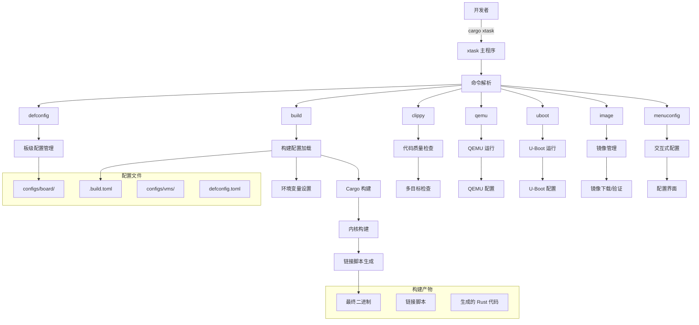
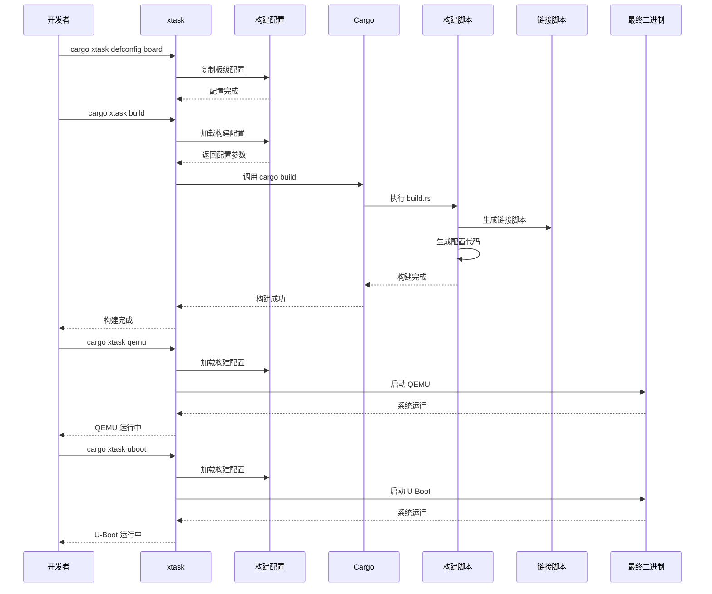

# 总体架构

Axvisor 是一个基于 Rust 的虚拟机监视器（Hypervisor）项目，采用了 `Cargo xtask` 构建系统来支持复杂的多平台、多架构的虚拟化解决方案。本文档将从源码角度详细分析 Axvisor 的构建系统，包括 xtask 的实现细节、构建配置管理、链接脚本生成、多平台支持等方面，帮助开发者深入理解项目的工作原理和构建流程。

## 概述

作为一个虚拟机监视器项目，Axvisor 需要支持多种硬件平台（如 ARM、x86、RISC-V）和不同的开发板（如 QEMU、Orange Pi、Phytium Pi 等），同时还要管理多个虚拟机配置以及处理在不同开发板上的开发调试。

这种复杂性要求一个高度灵活且可扩展的构建系统，最终我们选择采用 `Cargo xtask` 这套解决方案。为此，我们分别添加实现了构建和调试相关的命令，即支持一键构建，也可以一键调试！

### 构建系统架构图

下图展示了 Axvisor 构建系统的整体架构，包括各个组件之间的关系和数据流向：



### 构建流程时序图

下面的时序图展示了 Axvisor 构建系统的主要工作流程，从配置设置到最终构建完成的整个过程：



## 什么是 Cargo xtask？

Cargo xtask 是 Rust 生态系统中的一种常见模式，用于管理项目的开发任务和构建流程。它本质上是一个独立的 Rust 二进制程序，通常位于项目的 `xtask/` 目录下，通过 Cargo 运行来执行各种项目特定的任务。

与传统使用 Makefile 或其他构建工具不同，xtask 允许开发者使用 Rust 语言本身来编写构建脚本，这样可以充分利用 Rust 的类型系统、错误处理和生态系统。对于像 Axvisor 这样的复杂项目，xtask 提供了更加灵活和强大的构建管理能力。

### xtask 的优势

1. **一致性**：使用熟悉的 Rust 生态系统和工具链，开发者不需要学习新的构建语言或工具
2. **可扩展性**：可以轻松添加新的构建任务和功能，利用 Rust 的模块化特性组织代码
3. **跨平台**：与 Cargo 一样，支持多平台构建，无需为不同平台编写不同的构建脚本
4. **集成性**：与现有 Rust 工具链无缝集成，可以直接使用 Cargo 的各种功能和插件
5. **类型安全**：利用 Rust 的类型系统，在编译时就能发现构建脚本中的错误
6. **丰富的生态系统**：可以使用 Cargo 生态系统中的所有库来编写构建脚本

## Axvisor 的 xtask 架构

Axvisor 的 xtask 实现采用了模块化设计，将不同的功能分散到独立的模块中，每个模块负责特定的任务。这种设计使得代码结构清晰，易于维护和扩展。

### 项目结构

每个模块都有明确的职责分工，这种模块化设计使得代码更加清晰和易于维护。例如，`image.rs` 专门负责虚拟机镜像的下载、验证和管理，而 `clippy.rs` 则专注于代码质量检查。

```
xtask/
├── Cargo.toml          # xtask 依赖配置
└── src/
    ├── main.rs         # 主入口点和命令行解析
    ├── cargo.rs        # Cargo 相关操作（QEMU、U-Boot 运行）
    ├── clippy.rs       # 代码质量检查
    ├── ctx.rs          # 上下文管理
    ├── image.rs        # 客户机镜像管理
    ├── menuconfig.rs   # 交互式配置
    ├── tbuld.rs        # 构建配置管理
    └── vmconfig.rs     # 虚拟机配置
```

### 主入口点

[`main.rs`](https://github.com/arceos-hypervisor/axvisor/tree/next/xtask/src/main.rs) 是 xtask 的入口点，使用 `clap` 库进行命令行参数解析。该文件定义了所有可用的命令和它们的参数结构。通过使用 Rust 的强类型系统和 `clap` 的派生宏，代码既简洁又类型安全。

```rust
#[derive(Parser)]
#[command(name = "xtask")]
#[command(about = "ArceOS build configuration management tool")]
struct Cli {
    #[command(subcommand)]
    command: Commands,
}

#[derive(Subcommand)]
enum Commands {
    /// Set default build configuration from board configs
    Defconfig { board_name: String },
    Build,
    /// Run clippy checks across all targets and feature combinations
    Clippy(ClippyArgs),
    Qemu(QemuArgs),
    Uboot(UbootArgs),
    Vmconfig,
    Menuconfig,
    /// Guest Image management
    Image(image::ImageArgs),
}
```

这种设计模式使得添加新命令变得非常简单，只需要在 `Commands` 枚举中添加新的变体，并在 `main` 函数中添加相应的处理逻辑即可。每个命令都可以有自己的参数结构，实现了高度的可扩展性。

### 与 ostool 的集成

[`ctx.rs`](https://github.com/arceos-hypervisor/axvisor/tree/next/xtask/src/ctx.rs) 提供了构建上下文管理，这是整个 xtask 系统的核心数据结构。它封装了构建过程中需要的所有状态信息，包括工作目录、构建配置路径和虚拟机配置列表等。

```rust
pub struct Context {
    pub ctx: AppContext,
    pub build_config_path: Option<std::path::PathBuf>,
    pub vmconfigs: Vec<String>,
}
```

通过将状态集中管理，避免了在各个模块之间传递大量参数，简化了代码结构。`AppContext` 来自 `ostool` 库，它是 Axvisor 的 xtask 系统与 `ostool` 紧密集成的桥接点，而 `Context` 在此基础上扩展了 Axvisor 特定的需求。这种集成方式带来了以下优势：

1. **功能复用**：充分利用 `ostool` 的成熟功能，避免重复开发
2. **类型安全**：通过 Rust 类型系统确保配置和操作的类型安全
3. **扩展性**：可以轻松扩展 `ostool` 的功能，而不影响 xtask 的核心逻辑
4. **维护性**：将通用功能集中在 `ostool` 中，降低维护成本

### 构建配置管理

[`tbuld.rs`](https://github.com/arceos-hypervisor/axvisor/tree/next/xtask/src/tbuld.rs) 定义了构建配置结构和管理逻辑，这是 xtask 系统中最复杂的模块之一。它负责解析构建配置文件，验证参数，并将配置转换为 Cargo 可以理解的格式。

```rust
#[derive(Debug, Clone, Serialize, Deserialize, JsonSchema, PartialEq)]
pub struct Config {
    /// target triple
    pub target: String,
    /// features to enable
    pub features: Vec<String>,
    /// log level feature
    pub log: Option<LogLevel>,
    /// other cargo args
    pub cargo_args: Vec<String>,
    /// whether to output as binary
    pub to_bin: bool,
    pub smp: Option<usize>,
    pub vm_configs: Vec<String>,
}
```

这个配置结构体使用了多个 derive 宏，包括 `Serialize`、`Deserialize` 和 `JsonSchema`，使得配置可以被序列化为多种格式（TOML、JSON 等），并且可以自动生成 JSON Schema 用于验证。这种设计使得配置系统既灵活又类型安全，可以在编译时捕获配置错误。

该模块还实现了配置加载逻辑，包括路径解析、文件读取、错误处理等复杂功能。它支持相对路径和绝对路径，可以自动扩展环境变量，并提供了详细的错误信息来帮助用户诊断配置问题。
