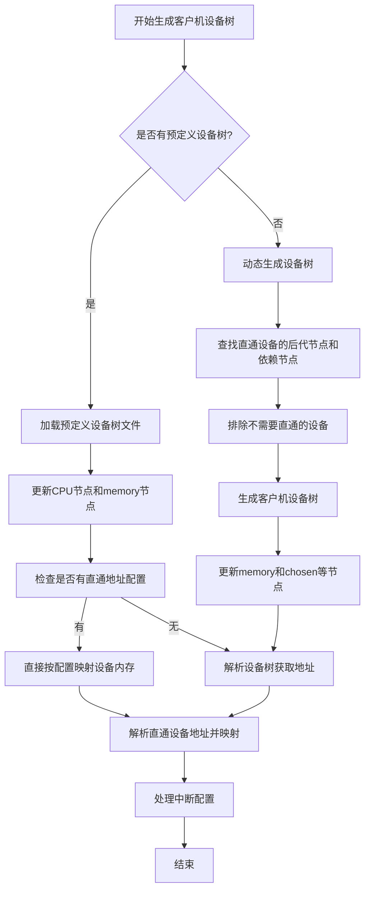

# 设备树生成流程

### 1 设备树生成流程图



### 2 流程图与代码实现对照

#### 2.1 获取主机设备树：get_host_fdt 函数

在流程开始之前，AxVisor 首先需要获取主机（宿主机）的设备树信息。这是整个客户机设备树生成的基础。

**获取原理**：
AxVisor 通过系统启动参数（bootarg）获取主机设备树的内存地址，然后解析设备树头部信息来获取完整的数据。

```rust
// kernel/src/vmm/fdt/parser.rs:12-33
pub fn get_host_fdt() -> &'static [u8] {
    const FDT_VALID_MAGIC: u32 = 0xd00d_feed;  // 设备树魔数
    let bootarg: usize = std::os::arceos::modules::axhal::get_bootarg();
    
    // 解析设备树头部
    let header = unsafe {
        core::slice::from_raw_parts(bootarg as *const u8, core::mem::size_of::<FdtHeader>())
    };
    let fdt_header = FdtHeader::from_bytes(header)
        .map_err(|e| format!("Failed to parse FDT header: {e:#?}"))
        .unwrap();

    // 验证设备树魔数
    if fdt_header.magic.get() != FDT_VALID_MAGIC {
        error!(
            "FDT magic is invalid, expected {:#x}, got {:#x}",
            FDT_VALID_MAGIC,
            fdt_header.magic.get()
        );
    }

    // 获取完整的设备树数据
    unsafe { 
        core::slice::from_raw_parts(bootarg as *const u8, fdt_header.total_size()) 
    }
}
```

**关键解析步骤**：
1. **获取启动参数地址**：通过 `axhal::get_bootarg()` 获取 Bootloader 传递的设备树地址
2. **解析设备树头部**：读取设备树的前 16 字节（FdtHeader），获取魔数和总大小
3. **验证魔数**：确保这是一个有效的设备树文件（魔数应为 0xd00d_feed）
4. **返回完整数据**：根据头部中的总大小，返回完整的设备树数据切片

**数据流程**：
```
Bootloader → Bootarg (设备树地址) → FDT Header → 完整设备树数据
```

#### 2.2 流程起点：handle_fdt_operations 主入口函数

流程图中的起点 **A[开始生成客户机设备树]** 对应 `handle_fdt_operations` 函数，该函数负责：
- 解析主机设备树
- 根据 `dtb_path` 配置决定生成模式
- 调用地址映射和中断处理函数

**关键决策逻辑**：
```rust
if let Some(provided_dtb) = get_developer_provided_dtb(vm_config, vm_create_config) {
    // 预定义模式：使用现有设备树文件
    update_provided_fdt(&provided_dtb, host_fdt_bytes, vm_create_config);
} else {
    // 动态生成模式：根据配置构建设备树
    setup_guest_fdt_from_vmm(host_fdt_bytes, vm_config, vm_create_config);
}
```

#### 2.3 预定义设备树处理分支 (B → C → D → E → G/H)

**步骤 C**：`get_developer_provided_dtb` 函数从内存或文件系统加载预定义DTB

```rust
pub fn get_developer_provided_dtb(vm_cfg: &AxVMConfig, crate_config: &AxVMCrateConfig) -> Option<Vec<u8>> {
    match crate_config.kernel.image_location.as_deref() {
        Some("memory") => {
            // 从内存加载DTB
            // ... 具体实现逻辑
            return Some(dtb_data);
        }
        Some("fs") => {
            // 从文件系统加载DTB
            // ... 文件读取逻辑
            return Some(dtb_buffer);
        }
        _ => unimplemented!("Unsupported image_location"),
    }
    None
}
```

**步骤 D**：`update_provided_fdt` 函数调用 `update_cpu_node` 更新CPU节点信息

```rust
pub fn update_provided_fdt(provided_dtb: &[u8], host_dtb: &[u8], crate_config: &AxVMCrateConfig) {
    // 解析预定义DTB和主机DTB
    // 调用update_cpu_node更新CPU节点信息
    // 缓存更新后的设备树
}
```

**步骤 E**：检查是否配置了完整的直通设备地址，决定地址映射方式

#### 2.4 动态生成设备树处理分支 (B → I → J → L → M → N)

**步骤 I**：`setup_guest_fdt_from_vmm` 函数启动动态生成流程

```rust
// kernel/src/vmm/fdt/parser.rs:36-48
pub fn setup_guest_fdt_from_vmm(
    fdt_bytes: &[u8],
    vm_cfg: &mut AxVMConfig,
    crate_config: &AxVMCrateConfig,
) {
    let fdt = Fdt::from_bytes(fdt_bytes)
        .map_err(|e| format!("Failed to parse FDT: {e:#?}"))
        .expect("Failed to parse FDT");

    // 步骤 J：查找直通设备的后代节点和依赖节点
    let passthrough_device_names = super::device::find_all_passthrough_devices(vm_cfg, &fdt);

    // 步骤 M：生成客户机设备树
    let dtb_data = super::create::crate_guest_fdt(&fdt, &passthrough_device_names, crate_config);
    
    // 缓存生成的设备树
    crate_guest_fdt_with_cache(dtb_data, crate_config);
}
```

**步骤 J**：`find_all_passthrough_devices` 函数执行四阶段设备发现

```rust
// kernel/src/vmm/fdt/device.rs:18-85
pub fn find_all_passthrough_devices(vm_cfg: &mut AxVMConfig, fdt: &Fdt) -> Vec<String> {
    // Phase 1: 发现后代节点
    for device_name in &initial_device_names {
        let descendant_paths = get_descendant_nodes_by_path(&node_cache, device_name);
        // 处理后代节点...
    }

    // Phase 2: 递归查找设备依赖节点
    while let Some(device_node_path) = devices_to_process.pop() {
        let dependencies = find_device_dependencies(&device_node_path, &phandle_map, &node_cache);
        // 处理依赖设备...
    }

    // Phase 3: 排除不需要直通的设备
    let excluded_set: BTreeSet<String> = all_excludes_devices.into_iter().collect();
    all_device_names.retain(|device_name| {
        let should_keep = !excluded_set.contains(device_name);
        should_keep
    });
}
```

**步骤 M**：`crate_guest_fdt` 函数根据 `determine_node_action` 的决策结果构建设备树

```rust
// kernel/src/vmm/fdt/create.rs:23-128
pub fn crate_guest_fdt(
    fdt: &Fdt,
    passthrough_device_names: &[String],
    crate_config: &AxVMCrateConfig,
) -> Vec<u8> {
    let mut fdt_writer = FdtWriter::new().unwrap();
    let all_nodes: Vec<Node> = fdt.all_nodes().collect();

    for (index, node) in all_nodes.iter().enumerate() {
        let node_path = super::build_node_path(&all_nodes, index);
        let node_action = determine_node_action(node, &node_path, passthrough_device_names);

        match node_action {
            NodeAction::RootNode => { /* 处理根节点 */ }
            NodeAction::CpuNode => { 
                let need = need_cpu_node(&phys_cpu_ids, node, &node_path);
                if need { /* 包含CPU节点 */ }
            }
            NodeAction::Skip => { continue; } // 跳过节点
            _ => { /* 包含直通设备相关节点 */ }
        }
        
        // 复制所有节点属性
        for prop in node.propertys() {
            fdt_writer.property(prop.name, prop.raw_value()).unwrap();
        }
    }
    
    fdt_writer.finish().unwrap()
}
```

**节点决策算法**：
```rust
fn determine_node_action(node: &Node, node_path: &str, passthrough_device_names: &[String]) -> NodeAction {
    match node.name() {
        "/" => NodeAction::RootNode,
        name if name.starts_with("memory") => NodeAction::Skip,
        _ if node_path.starts_with("/cpus") => NodeAction::CpuNode,
        _ if passthrough_device_names.contains(&node_path.to_string()) => NodeAction::IncludeAsPassthroughDevice,
        _ if is_descendant_of_passthrough_device(node_path, node.level, passthrough_device_names) => NodeAction::IncludeAsChildNode,
        _ if is_ancestor_of_passthrough_device(node_path, passthrough_device_names) => NodeAction::IncludeAsAncestorNode,
        _ => NodeAction::Skip,
    }
}
```

#### 2.5 地址解析与中断处理 (E → G/H → O → P)

**步骤 E**：`parse_passthrough_devices_address` 函数检查是否有预配置的直通地址

```rust
pub fn parse_passthrough_devices_address(vm_cfg: &mut AxVMConfig, dtb: &[u8]) {
    let devices = vm_cfg.pass_through_devices().to_vec();
    
    if !devices.is_empty() && devices[0].length != 0 {
        // 步骤 G：直接按配置映射设备内存
        for device in devices.iter() {
            add_device_address_config(vm_cfg, &device.name, device.base_gpa, device.length, index, None);
        }
    } else {
        // 步骤 H：解析设备树获取地址信息
        let fdt = Fdt::from_bytes(dtb).expect("Failed to parse DTB image");
        
        // 遍历所有设备树节点
        for node in fdt.all_nodes() {
            if node.name().starts_with("pcie@") {
                // PCIe设备特殊处理：解析ranges属性，支持Config/IO/Mem32/Mem64四种空间
                add_pci_ranges_config(vm_cfg, &node_name, &range, index);
            } else {
                // 普通设备处理：解析reg属性获取地址和大小
                add_device_address_config(vm_cfg, &node_name, base_address, size, index, None);
            }
        }
    }
}
```

**步骤 P**：`parse_vm_interrupt` 函数处理中断配置

```rust
pub fn parse_vm_interrupt(vm_cfg: &mut AxVMConfig, dtb: &[u8]) {
    const GIC_PHANDLE: usize = 1;
    let fdt = Fdt::from_bytes(dtb).expect("Failed to parse DTB image");

    // 遍历所有设备节点查找中断配置
    for node in fdt.all_nodes() {
        // 跳过内存节点和中断控制器节点
        if name.starts_with("memory") || name.starts_with("interrupt-controller") {
            continue;
        }

        // 收集所有GIC_SPI中断
        if let Some(interrupts) = node.interrupts() {
            // 验证中断父节点是否为GIC
            // 提取中断信息：<GIC_SPI/GIC_PPI, IRQn, trigger_mode>
            // 只处理GIC_SPI类型的中断
            // 将中断信息添加到VM配置
        }
    }
}
```

### 3 详细步骤说明

**步骤 1：开始生成客户机设备树文件**

- 系统启动时，AxVisor会根据配置决定是使用预定义设备树还是动态生成设备树
- 主入口函数 `handle_fdt_operations` 负责整个流程的调度和控制

 **步骤 2：检查预定义客户机设备树**

- **指定了dtb_path** → 进入步骤3（预定义处理流程）
- **未指定dtb_path** → 进入步骤4（动态生成流程）

 **步骤 3：预定义设备树处理**

1. **加载预定义设备树**：解析用户提供的DTB文件
2. **节点更新**：根据`phys_cpu_ids`配置更新CPU信息，更新memory节点
3. **保留原有结构**：尽可能保持预定义设备树的完整性
4. **地址映射处理**：如配置了完整直通设备地址，直接按配置映射

 **步骤 4：动态生成设备树**

 1. 查找直通设备后代节点
 2. 查找设备依赖节点
 3. 排除不需要直通的设备
 4. 生成客户机设备树
 5. 更新memory和chosen等节点

 **步骤 5：解析直通设备地址并映射给客户机**

1. **PCIe设备特殊处理**：
   - 解析`ranges`属性
   - 支持Configuration/I/O/Memory32/Memory64四种空间
   - 处理ECAM（Extended Configuration Access Mechanism）空间

2. **普通设备处理**：
   - 解析`reg`属性获取地址和大小
   - 支持多地址段设备
   - 自动处理地址对齐和大小计算

 **步骤 6：处理中断配置**

1. **遍历所有设备节点**：查找`interrupts`属性
2. **验证中断父节点**：确保是GIC（Generic Interrupt Controller）
3. **过滤中断类型**：只处理GIC_SPI类型的中断
4. **提取中断信息**：获取中断号和触发方式
5. **配置中断路由**：将中断信息添加到VM配置

 **步骤 7：完成设备树生成**

-  客户机设备树生成完成
-  设备树已加载到客户机内存
-  所有直通设备地址已映射

