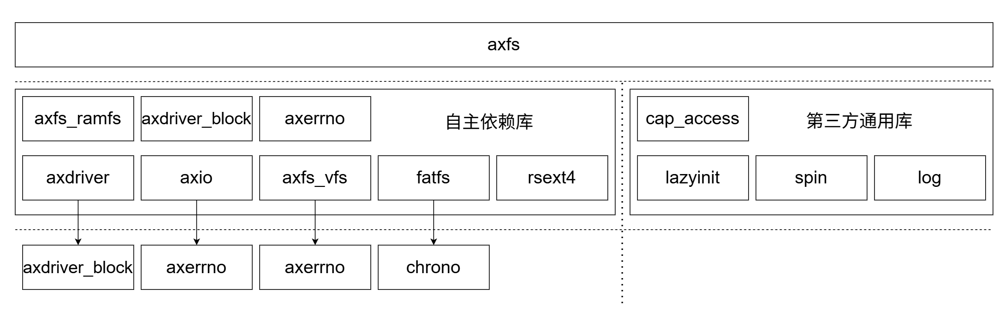

# 组件设计

AxFS（ArceOS File System）是 AxVisor 虚拟化平台的核心文件系统组件，负责为操作系统内核和应用提供统一的文件系统访问接口。它作为虚拟化环境中的存储抽象层，支持多种文件系统类型（Ext4、FAT32、RAMFS等），并为用户空间提供类POSIX的文件操作API。

主要职责为：

1. **统一文件系统抽象**：为不同类型的底层文件系统提供统一的VFS（虚拟文件系统）接口
2. **多文件系统支持**：支持Ext4、FAT32、内存文件系统等多种文件系统并行运行
3. **挂载点管理**：管理多文件系统的挂载和卸载，提供统一的命名空间
4. **路径解析**：提供路径解析、规范化和跨挂载点查找功能
5. **权限控制**：基于能力的访问控制机制，确保文件操作的安全性
6. **设备抽象**：为块设备提供统一接口，支持从GPT分区表动态发现和挂载分区


## 核心概念

### VFS 抽象

AXFS 基于外部 crate `axfs_vfs` 提供的 VFS 抽象：

```rust
// 文件系统操作接口
pub trait VfsOps {
    fn root_dir(&self) -> VfsNodeRef;
    fn mount(&self, mount_point: &str, parent: VfsNodeRef) -> VfsResult<()>;
    fn umount(&self) -> VfsResult<()>;
}

// 文件/目录节点操作接口
pub trait VfsNodeOps {
    fn get_attr(&self) -> VfsResult<VfsNodeAttr>;
    fn lookup(self: Arc<Self>, path: &str) -> VfsResult<VfsNodeRef>;
    fn create(&self, path: &str, ty: VfsNodeType) -> VfsResult;
    fn read_at(&self, offset: u64, buf: &mut [u8]) -> VfsResult<usize>;
    fn write_at(&self, offset: u64, buf: &[u8]) -> VfsResult<usize>;
    // ...
}
```

**设计要点**：
- 所有文件系统必须实现 `VfsOps` trait
- 所有文件/目录节点必须实现 `VfsNodeOps` trait
- 返回类型为 `Arc<dyn VfsNodeOps>`，支持动态分发

### 挂载点管理

根文件系统通过 `RootDirectory` 统一管理多个挂载点：

```rust
pub struct RootDirectory {
    main_fs: Arc<dyn VfsOps>,           // 主文件系统
    mounts: Vec<MountPoint>,            // 挂载点列表
}

struct MountPoint {
    path: String,                        // 挂载点路径
    fs: Arc<dyn VfsOps>,                 // 挂载的文件系统
}
```

**设计要点**：
- 主文件系统 (`main_fs`) 通常是第一个挂载的分区或 ramfs
- 路径解析时优先匹配最长前缀的挂载点
- 当前目录跟踪 (`CURRENT_DIR_PATH`，`CURRENT_DIR`)

### 设备抽象

块设备通过 `Disk` 和 `Partition` 两层抽象：

```rust
// 完整磁盘设备
pub struct Disk {
    block_id: u64,                       // 当前块号
    offset: usize,                       // 块内偏移
    dev: Arc<Mutex<AxBlockDevice>>,      // 底层块设备
}

// 分区设备（磁盘切片）
pub struct Partition {
    inner: Arc<Disk>,                    // 关联的磁盘
    start_lba: u64,                      // 起始 LBA
    end_lba: u64,                        // 结束 LBA
}

impl Partition {
    pub fn new(disk: Arc<Disk>, start_lba: u64, size_bytes: u64) -> Self { ... }
    pub fn read_one(&mut self, buf: &mut [u8]) -> DevResult<usize> { ... }
    pub fn write_one(&mut self, buf: &[u8]) -> DevResult<usize> { ... }
}
```

**设计要点**：
- `Partition` 复用 `Disk` 实现，通过 LBA 偏移转发
- 统一 `read_one` / `write_one` 接口
- 512 字节块大小对齐

### 分区扫描与检测

通过 GPT 分区表解析和文件系统魔数识别：

```rust
pub fn scan_gpt_partitions(disk: &mut Disk) -> AxResult<Vec<PartitionInfo>> {
    // 1. 尝试解析 GPT
    match parse_gpt_partitions(disk) {
        Ok(partitions) if !partitions.is_empty() => return Ok(partitions),
        Ok(_) => { /* 尝试 MBR */ }
        Err(_) => { /* 尝试 MBR */ }
    }
    // 2. 解析 MBR
    parse_mbr_partitions(disk)
}

pub enum FilesystemType {
    Fat,      // FAT32/FAT16
    Ext4,     // ext4/ext3/ext2
    Unknown,
}
```

**检测策略**：
1. 读取分区前几个扇区
2. 识别 FAT32 (0xEB, 0xAA, 0x55) 和 ext4 (0x53, 0xEF) 魔数
3. 填充 `PartitionInfo.filesystem_type`

### OpenOptions 配置

文件打开选项通过 `OpenOptions` 结构体配置：

```rust
pub struct OpenOptions {
    read: bool,           // 可读
    write: bool,          // 可写
    append: bool,         // 追加模式
    truncate: bool,       // 截断（清空）文件
    create: bool,         // 文件不存在则创建
    create_new: bool,     // 强制创建新文件（已存在则失败）
    _custom_flags: i32,  // 系统特定标志
    _mode: u32,           // 文件权限模式
}
```

**权限模型**：
- 基于 `cap_access` crate 的能力令牌
- 打开时捕获令牌、后续操作验证权限


## API 设计

### 高级 API

提供 `std::fs` 风格的接口：

```rust
// 文件操作
pub fn read(path: &str) -> io::Result<Vec<u8>>
pub fn read_to_string(path: &str) -> io::Result<String>
pub fn write(path: &str, contents: C) -> io::Result<()>
pub fn metadata(path: &str) -> io::Result<Metadata>

// 目录操作
pub fn read_dir(path: &str) -> io::Result<ReadDir>
pub fn create_dir(path: &str) -> io::Result<()>
pub fn remove_dir(path: &str) -> io::Result<()>
pub fn remove_file(path: &str) -> io::Result<()>

// 路径操作
pub fn canonicalize(path: &str) -> io::Result<String>
pub fn current_dir() -> io::Result<String>
pub fn set_current_dir(path: &str) -> io::Result<()>
```

### 低级 API

提供带权限的文件操作：

```rust
pub struct File {
    node: WithCap<VfsNodeRef>,  // 带权限令牌的节点
    is_append: bool,
    offset: u64,
}

impl File {
    pub fn open(path: &str) -> io::Result<Self>;
    pub fn create(path: &str) -> io::Result<Self>;
    pub fn read(&mut self, buf: &mut [u8]) -> io::Result<usize>;
    pub fn write(&mut self, buf: &[u8]) -> io::Result<usize>;
    pub fn seek(&mut self, pos: SeekFrom) -> io::Result<u64>;
}

pub struct Directory {
    node: WithCap<VfsNodeRef>,
    entry_idx: usize,
}

impl Directory {
    pub fn open(path: &str) -> io::Result<Self>;
    pub fn read_entry(&mut self) -> io::Result<Option<DirEntry>>;
}
```


## 组件依赖


axfs 尽量保证对其他组件较少的依赖程度，仅依赖于 axdriver、axio、axfs_vfs 等核心组件，且其他组件的依赖关系尽量简单，以降低组件之间的耦合度，提高系统的可维护性和可扩展性。大部分依赖库为自主开发，部分依赖库为第三方开源通用库。

### 自主依赖库
- axdriver：提供统一的设备驱动抽象层，为块设备提供标准化的接口，是文件系统与硬件设备之间的桥梁

- axdriver_block：提供块设备驱动接口，支持块设备的读写操作

- axio：输入输出抽象层，提供统一的I/O操作接口，支持内存分配

- axfs_vfs：虚拟文件系统层，提供统一的文件系统抽象接口，支持多种文件系统的挂载和操作

- fatfs：FAT文件系统具体实现，提供对FAT32文件系统的支持

- rsext4：ext4文件系统的具体实现，提供对ext4文件系统的读写等功能的支持

- axfs_ramfs：内存文件系统，提供基于内存的文件系统实现，用于临时文件存储

- axerrno：提供统一的错误处理机制，定义文件系统操作中的错误类型和处理方式

### 第三方通用库

- cap_access：提供能力访问控制，管理文件系统访问权限

- lazyinit：提供延迟初始化机制，优化系统启动性能，按需初始化

- spin：提供自旋锁实现，在多核环境下保护共享数据

- log：提供日志记录功能，记录文件系统操作和调试信息