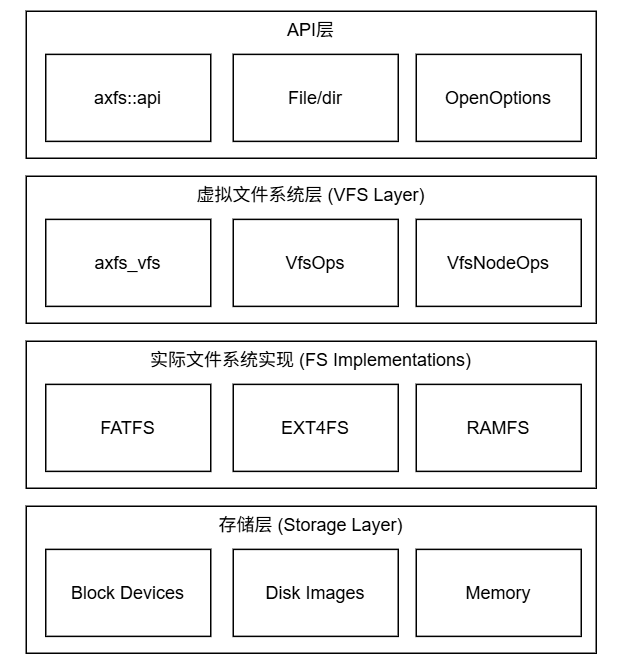

# 总体框架

Axvisor 文件系统是一个为现代操作系统设计的模块化、分层文件系统架构。它采用虚拟文件系统(VFS)抽象层设计，支持多种文件系统类型，包括 FAT32、EXT4、内存文件系统(RAMFS)等，具有高度的可扩展性和灵活性。

## 设计理念

Axvisor 文件系统的设计遵循以下核心原则：

- **模块化设计**：各组件独立开发、测试和维护，降低系统复杂度
- **分层架构**：清晰的抽象层次，便于理解和扩展
- **统一接口**：通过 VFS 提供一致的文件操作接口
- **高性能**：优化的数据结构和算法，支持并发访问
- **可扩展性**：易于添加新的文件系统类型支持

## 架构层次

Axvisor 文件系统采用清晰的分层架构，从上到下分为以下几个层次：



### API 层
API 层为用户提供了一组高级文件操作接口，包括文件读写、目录操作、文件属性管理等。这一层屏蔽了底层文件系统的差异，提供了一致的编程接口。

### 虚拟文件系统层
VFS 是文件系统的核心抽象层，负责：
- 路径解析和名称管理
- 文件系统挂载和卸载管理
- 文件描述符管理
- 统一的文件操作接口转换
- 缓存管理和优化

### 具体文件系统层
这一层包含各种具体文件系统的实现，每个文件系统都实现了标准的 VFS 接口：
- **FAT32**：支持 FAT12/FAT16/FAT32 文件系统
- **EXT4**：支持 Linux 标准的 EXT4 文件系统
- **RAMFS**：内存文件系统，用于临时文件存储
- **PROCFS**：进程文件系统，提供进程信息访问

### 存储设备层
存储设备层负责与具体的存储设备进行交互，包括：
- 设备初始化和驱动加载
- 分区扫描和管理
- I/O 操作和调度


## 实现代码结构
```
axfs/
├── src/
│   ├── lib.rs          # 模块入口和初始化
│   ├── api/            # 高级API接口
│   │   ├── mod.rs      # API模块导出
│   │   ├── file.rs     # 文件操作API
│   │   └── dir.rs      # 目录操作API
│   ├── fops.rs         # 底层文件系统操作
│   ├── root.rs         # 根目录和挂载管理
│   ├── mounts.rs       # 文件系统挂载实现
│   ├── dev.rs          # 设备抽象层
│   ├── fs/             # 具体文件系统实现
│   │   ├── mod.rs      # 文件系统模块导出
│   │   ├── fatfs.rs    # FAT文件系统
│   │   └─── ext4fs.rs   # EXT4文件系统
│   └── partition.rs    # 磁盘分区管理
└── Cargo.toml
```

#### 核心模块说明

- **lib.rs**：文件系统模块的入口点，负责初始化和导出公共接口
- **api/**：提供高级文件操作 API，包括文件和目录操作
- **fops.rs**：实现底层文件系统操作，是 VFS 和具体文件系统之间的桥梁
- **root.rs**：管理根目录和全局挂载点
- **mounts.rs**：实现文件系统的挂载和卸载逻辑
- **dev.rs**：设备抽象层，提供统一的设备访问接口
- **fs/**：包含各种具体文件系统的实现
- **partition.rs**：处理磁盘分区识别和管理
