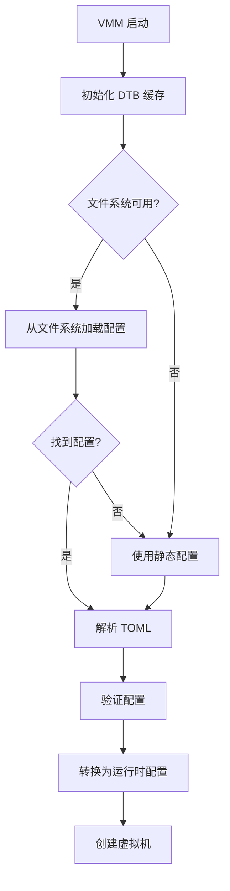
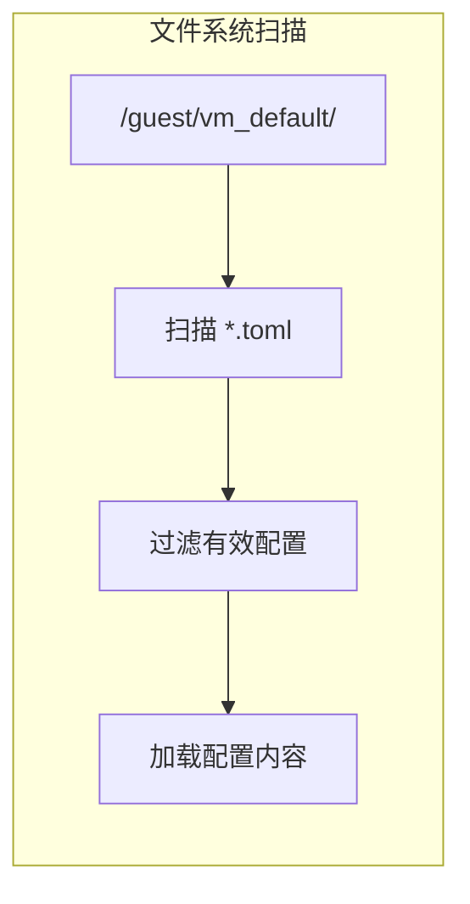
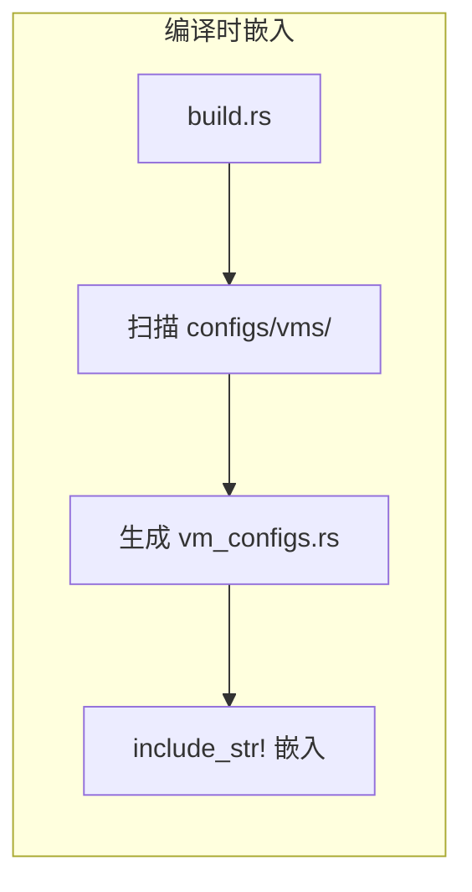
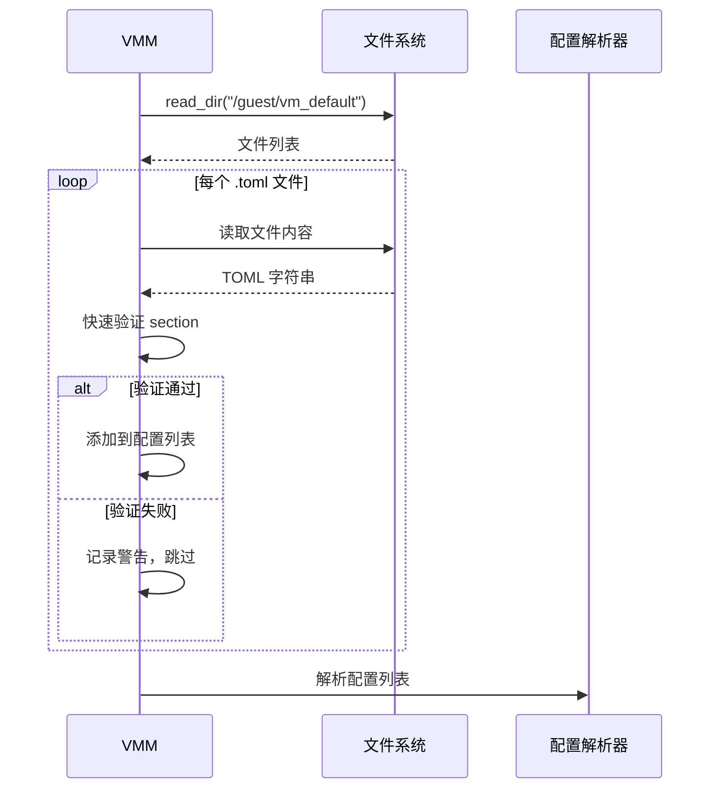
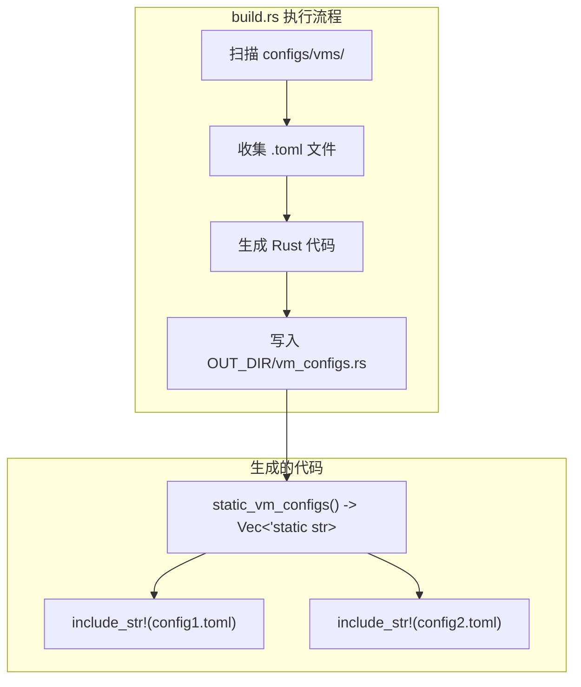
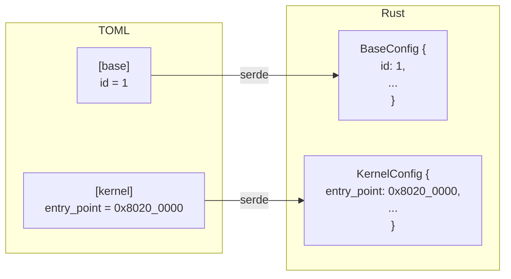
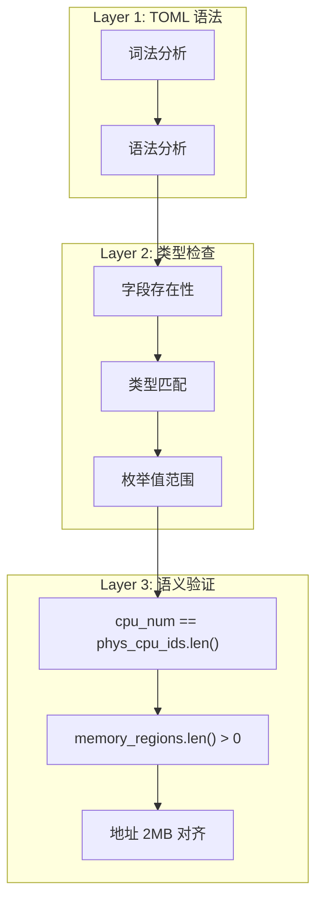
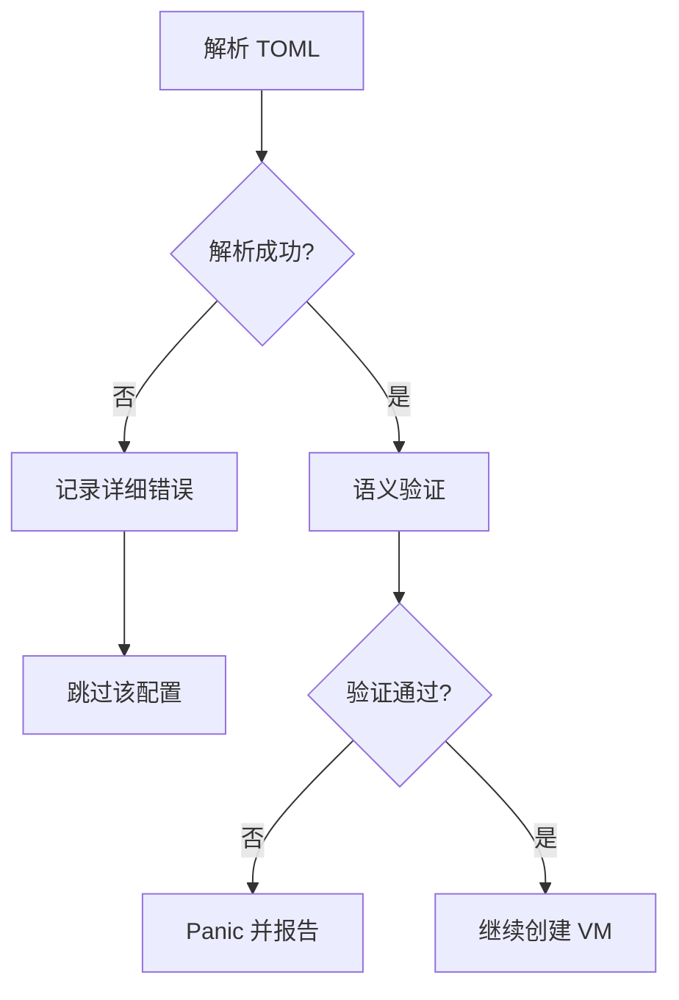
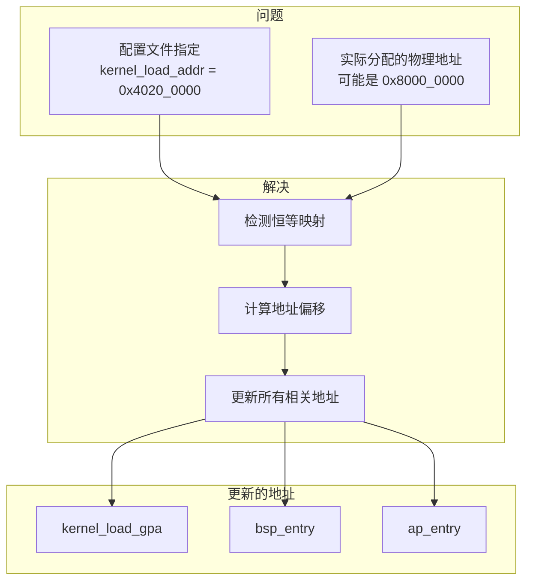
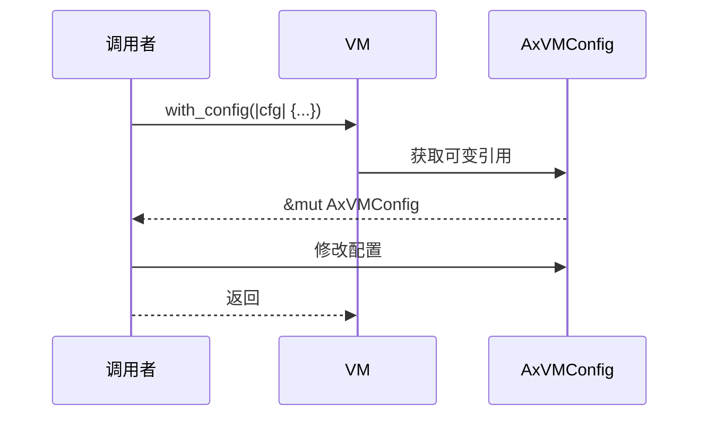

# 配置加载流程

本节介绍 AxVisor 如何发现、加载和处理虚拟机配置。

AxVisor 的配置加载是一个多阶段的过程。当 VMM（虚拟机监控器）启动时，它需要决定从哪里获取虚拟机的配置信息。

系统首先尝试从文件系统读取配置文件，这允许用户在运行时修改配置而无需重新编译。如果文件系统不可用（例如在早期启动阶段）或没有找到有效的配置文件，系统会使用编译时嵌入的静态配置作为后备方案。

整个加载过程包括以下关键步骤：

1. 初始化环境：建立 DTB（设备树）缓存，为后续设备配置做准备
2. 选择配置源：根据文件系统可用性决定加载策略
3. 解析配置：将 TOML 文本转换为 Rust 结构体
4. 验证配置：确保所有必需字段存在且值合法
5. 转换配置：从用户友好的格式转换为运行时高效的格式
6. 创建虚拟机：使用最终配置初始化 VM 实例

## 加载流程概述

AxVisor 的配置加载流程采用后备策略（fallback strategy），确保系统在各种环境下都能正常启动。下图展示了完整的加载决策链：



**图解说明**：

这个决策流程图展示了 AxVisor 如何智能地选择配置来源，整个过程分为以下关键阶段：

**1. 初始化 DTB 缓存**
- DTB（Device Tree Blob）包含硬件信息，是配置设备的基础
- 这一步在配置加载之前完成，确保设备配置可以引用 DTB 数据
- DTB 缓存避免了重复解析设备树，提升性能

**2. 文件系统可用性检查（决策点 1）**
- 检查是否启用了 `fs` feature（编译时决策）
- 如果启用，检查文件系统是否已挂载（运行时决策）
- **是**：尝试从 `/guest/vm_default/` 目录加载配置
- **否**：直接使用编译时嵌入的静态配置

**3. 配置文件发现（决策点 2）**
- 扫描配置目录，查找 `.toml` 文件
- 执行快速验证（检查必需的 section）
- **找到有效配置**：使用文件系统配置
- **未找到配置**：回退到静态配置

**4. 配置处理统一路径**
无论配置来自文件系统还是静态嵌入，后续处理流程完全一致：
- **解析 TOML**：将文本转换为 Rust 结构体
- **验证配置**：检查字段完整性和取值合理性
- **转换为运行时配置**：从 `AxVMCrateConfig` 转换为 `AxVMConfig`
- **创建虚拟机**：使用最终配置初始化 VM 实例

**后备策略的优势**：
- **灵活性**：支持运行时修改配置（文件系统）和固定配置（静态）
- **鲁棒性**：即使文件系统不可用，系统仍能使用静态配置启动
- **统一性**：两种配置源使用相同的处理流程，减少代码重复

## 配置加载优先级

AxVisor 支持两种配置来源，按优先级排序：

### 1. 文件系统配置（运行时）

当启用 `fs` feature 时，VMM 首先尝试从文件系统加载配置。这种方式允许用户在不重新编译的情况下修改虚拟机配置。下图展示了文件系统配置的发现流程：



**图解说明**：

**1. 固定目录扫描**
- VMM 从固定路径 `/guest/vm_default/` 开始扫描
- 这个路径是约定的配置目录，用户应将虚拟机配置文件放在此处
- 目录名 `vm_default` 表示这是默认加载的虚拟机配置集合

**2. 文件名匹配**
- 使用 `read_dir()` 遍历目录中的所有条目
- 通过扩展名过滤：只处理 `.toml` 文件
- 忽略子目录和其他文件类型（如 `.txt`, `.md`）

**3. 快速验证过滤**
- 读取每个 `.toml` 文件的内容到字符串
- 执行轻量级的格式检查：
  - 必须包含 `[base]` section（基本信息）
  - 必须包含 `[kernel]` section（内核配置）
  - 必须包含 `[devices]` section（设备配置）
- 不符合要求的文件被跳过并记录警告日志

**4. 加载配置内容**
- 将通过验证的 TOML 文件内容存储到内存
- 返回配置字符串的集合：`Vec<String>`
- 这些字符串随后会进入完整的解析和验证流程

**为什么需要快速验证**：
- **早期失败**：在完整解析之前过滤掉明显无效的文件，节省资源
- **用户友好**：提供清晰的错误提示，而不是神秘的解析错误
- **性能优化**：避免对非配置文件执行昂贵的 TOML 解析

扫描规则：
- 目录路径：`/guest/vm_default/`
- 文件扩展名：`.toml`
- 快速验证：检查是否包含 `[base]`、`[kernel]`、`[devices]` 三个必需 section

### 2. 静态配置（编译时）

如果文件系统不可用或没有配置文件，使用编译时嵌入的静态配置。这种机制保证系统在任何情况下都能启动。下图展示了编译时配置嵌入的流程：



**图解说明**：

这个流程图展示了 Rust 的构建系统如何在编译期自动处理配置文件：

**1. build.rs 执行**
- `build.rs` 是 Rust 的构建脚本，在正式编译前执行
- 它在编译机器上运行，可以访问文件系统
- 负责生成额外的 Rust 源代码

**2. 扫描配置目录**
- 查找 `configs/vms/` 目录（源码树中的目录）
- 收集所有 `.toml` 配置文件
- 这个目录由开发者维护，包含预定义的虚拟机配置

**3. 生成 Rust 代码**
- 创建 `vm_configs.rs` 文件（位于 `OUT_DIR` 临时目录）
- 生成一个函数 `static_vm_configs() -> Vec<&'static str>`
- 函数体包含多个 `include_str!` 宏调用

**4. include_str! 宏嵌入**
- `include_str!("path/to/file.toml")` 在编译期读取文件内容
- 将文件内容作为字符串字面量嵌入到二进制文件中
- 结果是 `&'static str` 类型，无运行时开销

**生成代码示例**：
```rust
pub fn static_vm_configs() -> Vec<&'static str> {
    vec![
        include_str!("../../configs/vms/linux-qemu.toml"),
        include_str!("../../configs/vms/arceos.toml"),
    ]
}
```

**静态配置的优势**：
- **零依赖启动**：无需文件系统即可运行
- **早期启动支持**：在内核初始化早期就能创建虚拟机
- **确定性**：配置在编译时固定，避免运行时配置错误
- **无 I/O 开销**：配置已在内存中，无需读取文件

静态配置通过 `include_str!` 宏将 TOML 文件内容嵌入二进制文件。

## 配置加载实现

### 文件系统加载

文件系统配置加载是一个迭代过程，逐个处理发现的配置文件。下图展示了 VMM 与文件系统交互的详细时序：



**图解说明**：

这个时序图详细展示了文件系统配置加载的交互过程：

**阶段 1：目录扫描**
- VMM 调用文件系统的 `read_dir()` 接口
- 文件系统返回 `/guest/vm_default/` 目录下的所有文件和子目录
- 返回的是文件列表（文件名和元数据）

**阶段 2：迭代处理（循环）**
对每个 `.toml` 扩展名的文件执行以下操作：

**2.1 读取文件内容**
- VMM 请求读取完整的文件内容
- 文件系统将文件作为字符串返回
- 此时还未进行 TOML 解析，仅仅是文本读取

**2.2 快速验证**
- VMM 在本地执行快速检查（不涉及 Parser）
- 使用简单的字符串匹配查找必需的 section 标记：
  - `[base]`
  - `[kernel]`
  - `[devices]`
- 这是轻量级操作，比完整的 TOML 解析快得多

**2.3 决策分支**
- **验证通过**：将 TOML 字符串添加到待解析列表
- **验证失败**：
  - 记录警告日志（如 "Skipping invalid config file: missing [base] section"）
  - 继续处理下一个文件
  - 不中断整个加载流程

**阶段 3：批量解析**
- 完成所有文件扫描后，将收集到的 TOML 字符串交给 Parser
- Parser 负责完整的语法分析和类型检查
- 这个阶段在下一节（"TOML 解析流程"）中详细说明

**设计要点**：
- **早期过滤**：快速验证阶段过滤掉明显无效的文件，避免浪费解析资源
- **容错处理**：单个文件验证失败不影响其他配置的加载
- **批量处理**：收集所有有效配置后统一解析，提高效率

文件系统配置加载的关键步骤：

1. **目录读取**：遍历配置目录中的所有文件
2. **扩展名过滤**：仅处理 `.toml` 文件
3. **内容读取**：读取文件到字符串
4. **快速验证**：检查必需 section 是否存在
5. **返回配置列表**：有效的配置字符串集合

### 静态配置生成

build.rs 在编译时自动生成配置加载代码。这个过程完全自动化，开发者只需将配置文件放在约定的目录中。下图展示了代码生成的完整流程：



**图解说明**：

这个流程图展示了构建脚本如何自动化配置嵌入过程，分为两个主要部分：

**构建时流程（上半部分）**：

1. **扫描配置目录**：`build.rs` 脚本遍历 `configs/vms/` 目录，这是源码中存放默认配置的位置

2. **收集 TOML 文件**：过滤出所有 `.toml` 扩展名的文件，记录它们的路径

3. **生成 Rust 代码**：创建一个返回配置字符串列表的函数，函数体包含多个 `include_str!` 宏调用

4. **写入输出目录**：将生成的代码保存到 `OUT_DIR/vm_configs.rs`，这个目录是 Cargo 提供的临时构建目录

**生成的代码结构（下半部分）**：

- **函数定义**：`static_vm_configs() -> Vec<&'static str>` 返回静态字符串切片的向量

- **配置嵌入**：每个 `include_str!(...)` 调用会在编译期将 TOML 文件内容作为字符串字面量嵌入到二进制文件中

- **多配置支持**：可以嵌入任意数量的配置文件，每个文件一个 `include_str!` 调用

**自动化的优势**：
- 开发者只需添加配置文件到目录，无需手动编辑代码
- 编译期完成所有工作，运行时零开销
- 配置文件的变更会触发重新编译（通过 Cargo 的依赖追踪）

## TOML 解析流程

### serde 自动反序列化

配置解析使用 serde 库自动将 TOML 映射到 Rust 结构体。这种方式的优势在于：

+ 声明式：只需定义数据结构，无需手写解析代码
+ 类型安全：编译器确保类型匹配
+ 错误处理：自动生成详细的错误信息

下图展示了 TOML 各个 section 如何映射到对应的 Rust 结构体：



**图解说明**：

这个流程图展示了 serde 如何自动完成 TOML 到 Rust 的类型映射：

**TOML Section 到 Rust Struct**：
- **`[base]` section** → `BaseConfig` 结构体
  - TOML 中的 `id = 1` 自动赋值给 `BaseConfig::id` 字段
  - serde 根据字段名进行匹配，无需手动指定映射关系

- **`[kernel]` section** → `KernelConfig` 结构体
  - 十六进制数 `0x8020_0000` 自动转换为 `usize` 类型
  - 字段名 `entry_point` 必须在两边保持一致

**serde 的工作机制**：
1. **反序列化 trait**：`AxVMCrateConfig` 实现 `Deserialize` trait
2. **字段匹配**：serde 根据字段名将 TOML 键值对映射到结构体字段
3. **类型转换**：自动进行基础类型转换（字符串→数字、字符串→枚举等）
4. **嵌套支持**：TOML 的 section 对应 Rust 的嵌套结构

**声明式的优势**：
开发者只需编写：
```rust
#[derive(Deserialize)]
struct BaseConfig {
    id: usize,
    // ...
}
```
serde 自动生成所有解析代码，无需手写 `if let Some(id) = toml["id"]` 这样的样板代码。

### 类型转换示例

不同类型在解析过程中的转换：

| TOML 值 | 中间类型 | 最终类型 |
|-------|-------|-------|
| `1` | `usize` | `usize` |
| `"linux-qemu"` | `String` | `String` |
| `0x8020_0000` | `usize` | `GuestPhysAddr` |
| `"passthrough"` | `String` | `VMInterruptMode` |
| `[0x0, 0x100]` | `Vec<usize>` | `Option<Vec<usize>>` |

## 配置验证

配置验证是一个多层次的过程，每一层负责不同级别的检查。这种分层设计使得错误能够尽早被发现，提供更清晰的错误信息。

### 验证层次

下图展示了配置验证的三个层次，从基础的语法检查到高级的语义验证：



**图解说明**：

这个层次图展示了验证过程的递进关系，每层依赖于前一层的成功：

**Layer 1：TOML 语法验证**（由 `toml` crate 自动完成）
- **词法分析**：
  - 识别 token：标识符、等号、方括号、数字、字符串等
  - 检测非法字符和不完整的 token
  - 示例错误："Unexpected character '@' at line 5"

- **语法分析**：
  - 验证 TOML 结构：section、键值对、数组、表
  - 检查语法规则：如 section 名必须在方括号内
  - 示例错误："Missing closing bracket for section at line 3"

**Layer 2：类型检查**（由 serde 自动完成）
- **字段存在性**：
  - 检查所有必需字段是否存在
  - 可选字段（`Option<T>`）允许缺失
  - 示例错误："missing field `id`"

- **类型匹配**：
  - 验证值的类型与字段类型一致
  - 如整数字段不能接受字符串值
  - 示例错误:"invalid type: string \"abc\", expected usize"

- **枚举值范围**：
  - 对于枚举类型，检查值是否在允许的范围内
  - 示例错误："unknown variant `invalid_mode`, expected `passthrough` or `emulated`"

**Layer 3：语义验证**（在 `From` trait 转换中手动实现）
- **CPU 数量一致性**：
  - `cpu_num` 必须等于 `phys_cpu_ids` 列表的长度
  - 确保每个 Vcpu 都有对应的物理 CPU 绑定

- **内存区域非空**：
  - 至少要有一个内存区域
  - 没有内存的虚拟机无法运行

- **地址对齐**：
  - 内存区域的基地址必须 2MB 对齐（巨页要求）
  - 确保硬件的性能优化可以生效

**分层验证的优势**：
1. **早期失败**：在最简单的层次就能发现错误，避免浪费后续验证资源
2. **清晰错误**：每层提供特定类型的错误信息，便于定位问题
3. **责任分离**：语法层由库处理，语义层由应用处理，职责清晰

### 验证错误处理

配置验证失败时的处理流程取决于错误的严重程度。下图展示了不同阶段错误的处理策略：



**图解说明**：

这个决策流程图展示了两阶段错误处理策略：

**阶段 1：解析错误（容错处理）**
- **解析失败**：TOML 语法错误或类型不匹配
  - **记录详细错误**：包含文件名、行号、具体错误原因
  - **跳过该配置**：继续处理其他配置文件
  - **不中断系统**：单个配置文件的错误不影响其他虚拟机的创建

- **设计理念**：在配置加载阶段尽可能宽容，让系统能够部分启动

**阶段 2：语义验证错误（严格处理）**
- **验证失败**：配置值不合理（如 CPU 数量不一致）
  - **Panic 并报告**：立即终止虚拟机创建
  - **详细错误信息**：说明哪个字段不满足哪个约束条件
  - **不创建 VM**：防止使用无效配置创建虚拟机

- **设计理念**：一旦进入创建流程，必须确保配置完全正确

**为什么采用不同策略**：
- **解析阶段**：错误可能是文件损坏或用户误操作，应允许系统继续运行
- **语义阶段**：错误意味着配置逻辑错误，继续执行可能导致系统崩溃或不可预测行为

错误信息示例：
- 缺少字段：`"missing field 'id' at line 1"`
- 类型不匹配：`"invalid type: string \"abc\", expected usize at line 5"`
- 语义错误：`"CPU count mismatch: cpu_num=4, phys_cpu_ids.len()=2"`

## 配置后处理

配置加载完成后，可能还需要进行一些调整以适应运行时环境。这些调整通常涉及地址重定位和字段填充。

### 内存地址调整

对于使用恒等映射的虚拟机，需要在运行时调整配置中的地址。这是因为配置文件中的地址是理想值，而实际分配的物理内存地址可能不同。下图展示了地址调整的完整流程：



**图解说明**：

这个流程图展示了恒等映射虚拟机的地址调整机制，解决了配置地址与实际分配地址不一致的问题：

**问题背景**：
- **配置文件地址**：用户在配置文件中指定期望的内核加载地址（如 `0x4020_0000`）
- **实际分配地址**：操作系统分配的物理内存可能在不同位置（如 `0x8000_0000`）
- **恒等映射要求**：GPA（客户机物理地址） = HPA（主机物理地址），无法像普通映射那样灵活调整

**解决步骤**：

**1. 检测恒等映射**
- 检查虚拟机是否使用恒等映射模式
- 恒等映射虚拟机通常用于裸机 OS（如 ArceOS）
- 判断依据：配置中是否指定了恒等映射标志

**2. 计算地址偏移**
- 偏移量 = 实际分配地址 - 配置文件地址
- 示例：`0x8000_0000 - 0x4020_0000 = 0x3FE0_0000`
- 这个偏移量会应用到所有相关地址

**3. 更新所有相关地址**
批量调整配置中的地址字段：

- **kernel_load_gpa**：内核镜像加载地址
  - 原值：`0x4020_0000`
  - 新值：`0x4020_0000 + 0x3FE0_0000 = 0x8000_0000`

- **bsp_entry**：主 CPU 入口地址
  - 通常等于或接近 kernel_load_gpa
  - 同样需要加上偏移量

- **ap_entry**：辅助 CPU 入口地址
  - 多核虚拟机的辅助 CPU 启动地址
  - 也需要相应调整

**为什么需要这个机制**：
- **内存分配器的限制**：无法保证分配到配置文件中指定的精确地址
- **NUMA 和内存策略**：系统可能根据策略分配不同区域的内存
- **灵活性**：允许用户编写可移植的配置文件，无需关心具体的物理地址

### 运行时字段填充

某些配置字段的值在配置文件中无法确定，需要在运行时动态填充：

| 字段 | 来源 | 填充时机 |
|------|------|---------|
| `spi_list` | FDT 解析 | VM 初始化时 |
| `phys_cpu_sets` | CPU 亲和性计算 | 配置转换时 |
| `dtb_load_gpa` | 自动计算 | 镜像加载时 |

## 配置动态修改

运行时可以通过 `with_config` 方法修改配置。这提供了一种安全的方式来调整虚拟机配置，而不破坏封装性。下图展示了配置修改的交互流程：



**图解说明**：

这个时序图展示了通过回调函数安全修改配置的机制：

**调用接口**：
```rust
vm.with_config(|cfg: &mut AxVMConfig| {
    // 在这个闭包中修改配置
    cfg.image_config.kernel_load_gpa = new_addr;
});
```

**执行流程**：

**1. 调用者发起修改请求**
- 调用者传递一个闭包给 `with_config` 方法
- 闭包参数是 `&mut AxVMConfig`，表示可变配置引用
- 这是唯一的配置修改入口，确保访问控制

**2. VM 提供配置访问**
- VM 内部获取配置的可变引用
- 临时"借出"配置给闭包
- 配置仍然在 VM 的管理之下

**3. 闭包执行修改**
- 闭包内部可以读取和修改配置字段
- 修改是类型安全的（Rust 编译器保证）
- 可以执行复杂的逻辑，如条件修改

**4. 自动清理**
- 闭包执行完毕，可变引用自动失效
- 配置的借用关系结束
- VM 重新拥有配置的完全控制权

**设计优势**：

1. **封装性**：
   - 配置字段可以是私有的
   - 外部代码无法直接获取可变引用
   - 所有修改都通过受控的接口

2. **作用域限制**：
   - 闭包提供了明确的修改作用域
   - 可变引用的生命周期被限制在闭包内
   - 避免长时间持有可变引用导致的问题

3. **灵活性**：
   - 支持任意复杂的修改逻辑
   - 可以读取现有配置再决定如何修改
   - 一次调用可以修改多个字段

**典型使用场景**：

1. **恒等映射地址调整**：
```rust
vm.with_config(|cfg| {
    let offset = actual_addr - cfg.image_config.kernel_load_gpa;
    cfg.image_config.kernel_load_gpa += offset;
    cfg.cpu_config.bsp_entry += offset;
    cfg.cpu_config.ap_entry += offset;
});
```

2. **运行时添加设备中断**：
```rust
vm.with_config(|cfg| {
    cfg.spi_list.push(new_interrupt_id);
});
```

3. **动态更新 CPU 亲和性**：
```rust
vm.with_config(|cfg| {
    cfg.phys_cpu_ls.update(vcpu_id, new_phys_cpu);
});
```

典型使用场景：
- 恒等映射地址调整
- 运行时添加设备中断
- 动态更新 CPU 亲和性
