# VM 命令实现

本节深入介绍 AxVisor Shell 中虚拟机管理命令的内部实现机制，包括状态管理、数据流和资源清理等核心设计。

:::info 用户指南
如果你想了解如何使用这些命令，请参考[快速上手文档](../../user/guest/guest.md)。本文档专注于实现细节和架构设计。
:::

:::warning 开发状态
该部分内容目前处于**测试开发阶段**，实现细节可能会随着项目迭代而发生变化。请在使用或参考此处内容时注意其暂时性，并以实际代码仓库中的最新实现为准。如果你在使用过程中发现问题或有改进建议，欢迎通过 [GitHub Issues](https://github.com/arceos-hypervisor) 反馈。
:::

## VM 状态机设计

VM 命令的实现基于一个严格的状态机模型。虚拟机在其生命周期中会经历多个状态，每个命令通过状态转换来控制 VM 的行为。理解状态机是理解命令实现的基础。

状态说明：
- **Loading**：VM 正在创建和初始化，配置加载中
- **Loaded**：VM 已完成配置，但尚未启动，处于待命状态
- **Running**：VM 正在运行，所有 Vcpu 正常执行
- **Suspended**：VM 已暂停，Vcpu 被阻塞但状态保留
- **Stopping**：VM 正在关闭，等待所有 Vcpu 退出
- **Stopped**：VM 已停止，可以重启或删除

下图展示了 VM 状态之间的转换关系及触发命令：

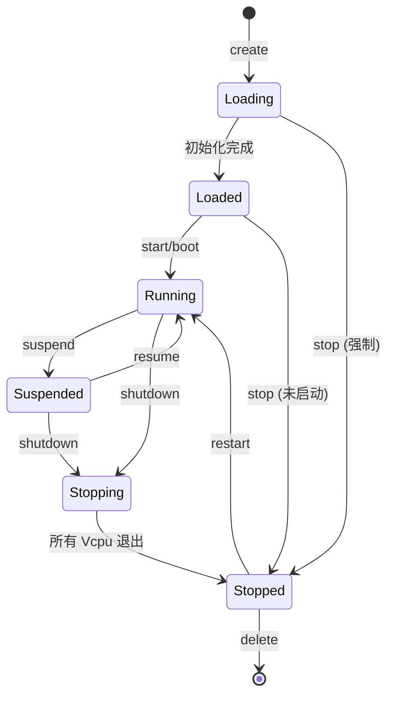

**状态转换规则**：
- **单向转换**：某些状态转换是单向的，如 Stopping → Stopped，无法逆转
- **条件转换**：某些转换需要满足条件，如 Running → Stopped 必须先经过 Stopping 状态
- **命令限制**：某些命令只能在特定状态下执行，如 suspend 只能作用于 Running 状态的 VM

**常见操作路径**：
1. **正常启动**：Loading → Loaded → Running
2. **正常关闭**：Running → Stopping → Stopped → 删除
3. **暂停恢复**：Running ⇄ Suspended（可反复切换）
4. **重启**：Running → Stopping → Stopped → Running

## 命令实现概览

下表列出了各个命令的实现特点和依赖：

| 命令 | 主要实现机制 | 关键依赖 |
|------|------------|---------|
| `vm list` | 全局列表快照 + 状态聚合 | VM 全局列表 |
| `vm show <id>` | 状态读取 + 格式化输出 | VM 引用 |
| `vm create <config>` | TOML 解析 + VM 初始化 | 文件系统 (fs feature) |
| `vm start [id...]` | 状态验证 + Vcpu 任务创建 | 调度器 (fs feature) |
| `vm stop <id...>` | 停止信号 + 异步等待 | Vcpu 任务协作 |
| `vm suspend <id>` | 状态标志 + 轮询验证 | Vcpu 主循环检测 |
| `vm resume <id>` | 状态切换 + Vcpu 通知 | 等待队列机制 |
| `vm restart <id>` | 同步停止 + 重新启动 | stop + start 组合 |
| `vm delete <id>` | 资源清理 + 引用计数验证 | Arc 引用管理 |

## vm list 实现

`vm list` 命令展示了查询类命令的典型实现模式：快照读取 + 状态聚合 + 格式化输出。

### 核心实现机制

**数据源**：
- 调用 `get_vm_list()` 从全局 `VM_LIST` 获取所有 VM 的 `Arc<VM>` 引用
- 这是一个快照操作，使用 RwLock 保护的 Vec 克隆
- 返回的列表不受后续 VM 创建/删除影响，避免了迭代期间的并发修改问题

**状态聚合算法**（table 格式）：
- 对每个 VM，遍历其 `vcpus: Vec<Arc<Vcpu>>` 列表
- 使用 `vcpu.state()` 读取每个 Vcpu 的当前状态
- 统计 Running、Blocked、Free 三种状态的数量
- 格式化为 "Run:N, Blk:M, Free:K" 形式

**输出格式化**：
- `--format table`：使用 `prettytable-rs` crate 生成对齐的表格
- `--format json`：使用 `serde_json` 序列化为 JSON 对象

### 处理流程

`vm list` 命令的处理流程展示了典型的查询操作模式，从数据获取到格式化输出。理解这个流程有助于理解其他查询类命令的实现。

**处理步骤解析**：

1. **获取数据源**：
   - 调用 `get_vm_list()` 从全局 VM 列表获取所有 VM 的 Arc 引用
   - 这是一个快照操作，返回的列表不会受到后续 VM 创建/删除的影响
   - 获取的是引用克隆，不会复制 VM 对象本身

2. **空列表处理**：
   - 如果系统中没有任何 VM，显示友好的提示信息而非空输出
   - 这符合用户体验最佳实践，避免用户困惑

3. **格式选择**：
   - 根据 `--format` 选项决定输出格式
   - **table 格式**：适合人类阅读，包含对齐、分隔线等视觉元素
   - **json 格式**：适合程序处理，可以被脚本解析和处理

4. **数据聚合**（仅 table 格式）：
   - 遍历每个 VM 的所有 Vcpu
   - 统计各个状态（Running、Blocked、Free）的 Vcpu 数量
   - 汇总显示在 "VCPU STATE" 列，如 "Run:2, Blk:1"

**为什么需要状态统计**：

Vcpu 状态统计提供了 VM 运行状态的快速概览：
- **Run: N**：有 N 个 Vcpu 正在执行 Guest 代码
- **Blk: N**：有 N 个 Vcpu 处于阻塞状态（等待中断、暂停等）
- **Free: N**：有 N 个 Vcpu 尚未启动

这些信息帮助用户快速判断：
- VM 是否真正在运行（Run > 0）
- VM 是否处于暂停状态（所有 Vcpu 都是 Blk）
- VM 是否刚创建未启动（所有 Vcpu 都是 Free）

下图展示了 `vm list` 命令的内部处理逻辑，包括如何获取数据、处理空列表情况以及根据格式选项生成不同的输出：

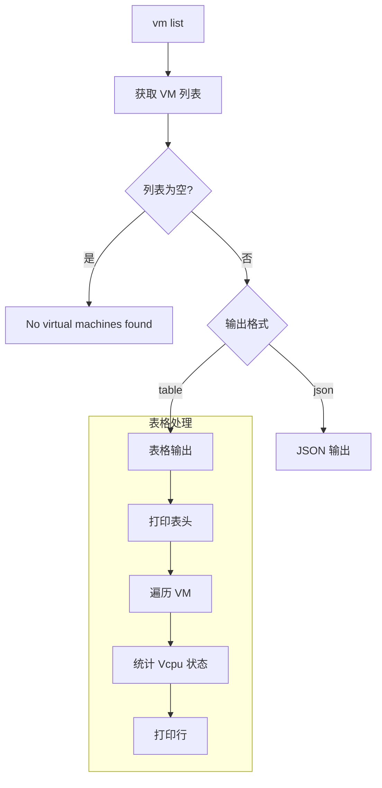

## vm show 实现

`vm show` 命令实现了渐进式信息披露机制，通过标志位控制输出详细度。

### 核心实现机制

**VM 查找**：
- 调用 `get_vm_by_id(id)` 从全局列表获取 VM 的 `Arc<VM>` 引用
- 如果 VM 不存在，返回 `VmNotFound` 错误
- 使用 Arc 引用避免复制整个 VM 对象

**详细度控制**：
- 使用布尔标志 `show_full`、`show_config`、`show_stats` 控制输出内容
- 不同标志组合触发不同的数据读取路径
- 基本模式只访问 VM 的基本字段，避免不必要的计算

**输出层次**：
```rust
pub fn show_vm(vm_id: usize, show_full: bool, show_config: bool, show_stats: bool) {
    let vm = get_vm_by_id(vm_id)?;

    // 基本信息（总是显示）
    print_basic_info(&vm);

    // 配置信息（--config）
    if show_config || show_full {
        print_config(&vm);
    }

    // 设备统计（--stats）
    if show_stats || show_full {
        print_device_stats(&vm);
    }

    // 完整详情（--full）
    if show_full {
        print_vcpu_details(&vm);
        print_memory_details(&vm);
        print_device_details(&vm);
    }
}
```

**状态感知提示实现**：

通过模式匹配 VM 状态提供上下文相关的操作建议：

```rust
match vm.status() {
    VmStatus::Suspended => println!("Use 'vm resume {}' to continue.", vm_id),
    VmStatus::Stopped => println!("Use 'vm delete {}' to clean up.", vm_id),
    VmStatus::Loaded => println!("Use 'vm start {}' to boot.", vm_id),
    _ => {}
}
```

## vm create 实现

`vm create` 命令实现了从配置文件到 VM 实例的完整转换流程，涉及文件 I/O、TOML 解析、配置验证和对象初始化。

### 核心实现机制

**文件读取**：
- 依赖 `fs` feature，使用 `fs::read_to_string()` 或类似接口
- 读取整个配置文件内容到字符串
- 处理文件不存在、权限不足等 I/O 错误

**TOML 解析**：
- 使用 `toml` crate 将原始字符串解析为结构化配置
- 调用 `init_guest_vm(raw_cfg: &str)` 进行解析和初始化
- 解析失败会返回详细的错误位置和原因

**VM 初始化**：
- 根据配置创建 `VM` 对象（包括内存区域、设备、Vcpu 等）
- 分配唯一的 VM ID（使用全局计数器或 ID 池）
- 初始状态设置为 `Loading`，初始化完成后转为 `Loaded`

**全局注册**：
- 将新创建的 `Arc<VM>` 加入全局 `VM_LIST`
- 使用 `RwLock::write()` 保护并发访问
- 注册成功后返回 VM ID

### 创建流程

下图展示了从用户输入命令到 VM 创建完成的完整时序。流程包括文件读取、TOML 解析、配置验证、VM 实例化和注册等步骤：

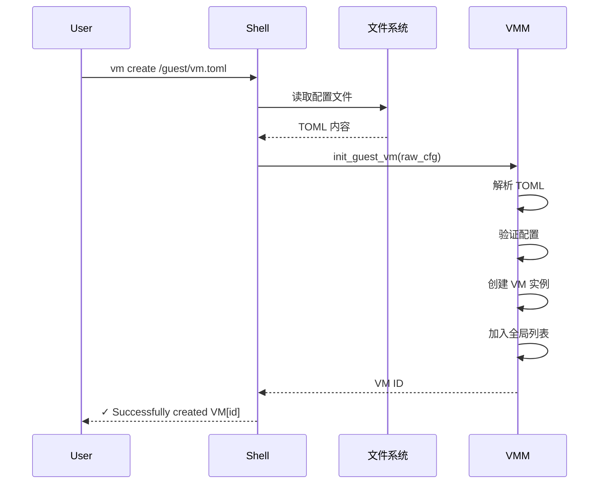

**批量创建的错误隔离**：

批量创建使用 `for` 循环顺序处理每个配置文件：

```rust
for config_path in config_paths {
    match create_single_vm(config_path) {
        Ok(vm_id) => println!("✓ Successfully created VM[{}]", vm_id),
        Err(e) => eprintln!("✗ Failed to create VM from {}: {}", config_path, e),
    }
}
```

单个失败不会 panic 或中断循环，确保其他配置文件仍能被处理。

## vm start 实现

`vm start` 命令是最复杂的命令之一，涉及状态验证、Vcpu 任务创建、调度和同步等多个环节。

### 核心实现机制

**状态验证** (`can_start_vm`):
```rust
fn can_start_vm(vm: &VM) -> Result<()> {
    match vm.status() {
        VmStatus::Loaded | VmStatus::Stopped => Ok(()),
        VmStatus::Running => Err("VM is already running"),
        VmStatus::Suspended => Err("VM is suspended, use 'vm resume' instead"),
        VmStatus::Stopping => Err("VM is stopping, please wait"),
        VmStatus::Loading => Err("VM is still loading"),
    }
}
```

**Vcpu 任务创建**：
- 调用 `setup_vm_primary_vcpu(vm)` 为 BSP (Bootstrap Processor) 创建任务
- 对于多核 VM，可能需要为每个 AP (Application Processor) 创建任务
- 每个 Vcpu 任务绑定到特定的物理 CPU 核心（通过 CPU affinity）

**VM 启动序列**：
1. `vm.boot()` - 设置 VM 状态为 `Running`
2. `notify_primary_vcpu()` - 唤醒 BSP Vcpu 任务开始执行
3. 增加全局运行计数器（用于跟踪活跃 VM 数量）

**--detach 实现**：
- 不使用 `--detach`：主线程等待 VM 退出（阻塞）
- 使用 `--detach`：创建任务后立即返回（非阻塞）

### 启动流程

下图展示了 VM 启动的决策树和执行流程。系统会检查每个 VM 的状态，跳过已经在运行的 VM，对可启动的 VM 执行完整的启动序列：

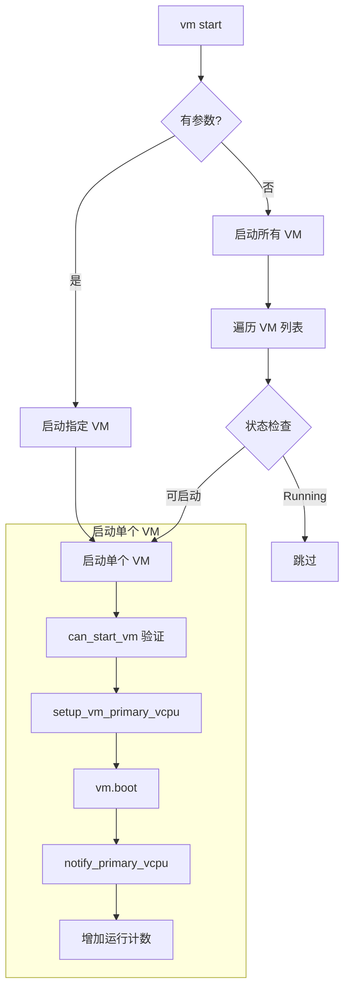

### 状态验证

启动命令只能在特定状态下执行。下图清楚地列出了允许启动和拒绝启动的状态，以及拒绝的原因：

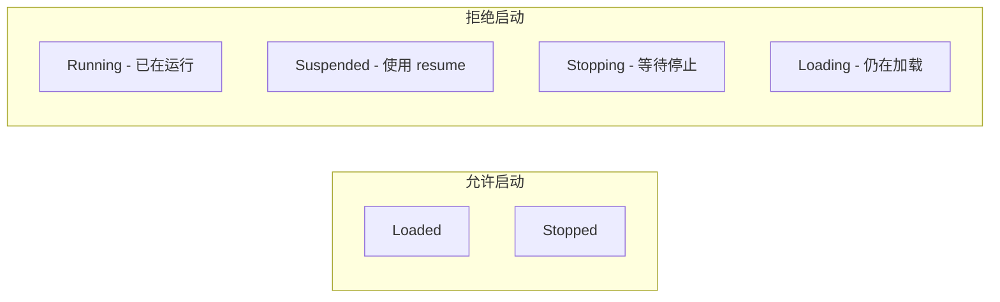

## vm stop 实现

`vm stop` 命令展示了异步停止机制，通过状态标志和 Vcpu 主循环协作实现优雅关闭。

**注意：该功能仍在完善中。**

### 核心实现机制

**停止信号**：
```rust
pub fn shutdown(vm: &VM) {
    vm.set_status(VmStatus::Stopping);
    // 不直接杀死 Vcpu 任务，而是设置标志让它们自行退出
}
```

**Vcpu 主循环检测**：
```rust
// 在 Vcpu 主循环中
loop {
    if vm.stopping() {
        break;  // 退出循环
    }
    // 执行 Guest 代码
    run_guest_code();
}
// 最后一个退出的 Vcpu 设置 VM 状态为 Stopped
```

**--force 实现**：
- 优雅停止：设置标志 + 等待 Vcpu 任务自行退出
- 强制停止：直接调用 `task.cancel()` 或 `task.kill()` 终止任务

**批量停止处理**：
```rust
pub fn stop_multiple(vm_ids: &[usize], force: bool) {
    for &id in vm_ids {
        if let Some(vm) = get_vm_by_id(id) {
            vm.shutdown();
        }
    }
    // 并行等待所有 VM 停止（如果不是 force 模式）
    if !force {
        wait_for_vms_stopped(vm_ids, Duration::from_secs(5));
    }
}
```

### 停止模式对比

优雅停止和强制停止有本质的区别。优雅停止给予 VM 时间完成清理工作（如同步磁盘、关闭网络连接等），而强制停止会立即终止执行，可能导致数据丢失：

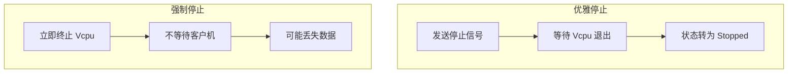

### 停止信号传播

下图展示了停止信号如何从 Shell 命令传播到各个 Vcpu。所有 Vcpu 会并行检测停止信号并退出，最后一个退出的 Vcpu 负责将 VM 状态设置为 Stopped：

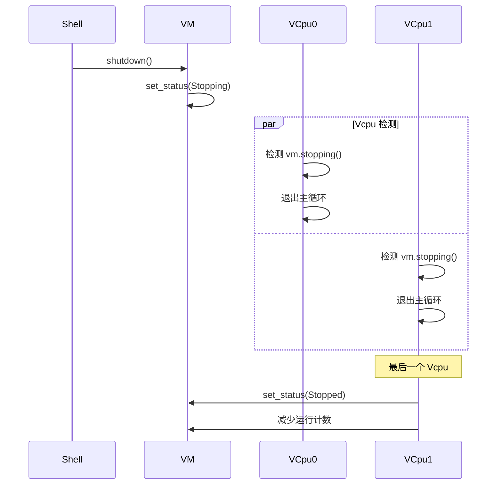

## vm suspend / resume 实现

暂停和恢复命令展示了状态标志 + 等待队列的协作机制。

**注意：该功能目前并未真正实现，仍在完善中。**

### 核心实现机制

**暂停实现**：
```rust
pub fn suspend(vm: &VM) -> Result<()> {
    vm.set_status(VmStatus::Suspended);

    // 轮询等待所有 Vcpu 进入 Blocked 状态
    for _ in 0..10 {  // 最多等待 1 秒
        if vm.all_vcpus_blocked() {
            return Ok(());
        }
        sleep(Duration::from_millis(100));
    }
    Err("Suspend timeout")
}
```

**恢复实现**：
```rust
pub fn resume(vm: &VM) -> Result<()> {
    vm.set_status(VmStatus::Running);
    vm.notify_all_vcpus();  // 唤醒所有等待的 Vcpu
    Ok(())
}
```

**Vcpu 响应机制**：
```rust
// Vcpu 主循环中
loop {
    if vm.suspending() {
        vm.vcpu_wait_queue.wait_for(|| !vm.suspending());
    }
    // 执行 Guest 代码
}
```

### 暂停/恢复流程

暂停和恢复是一对互补的操作。暂停通过状态标志让 Vcpu 主动进入等待，恢复则通过通知机制唤醒它们：

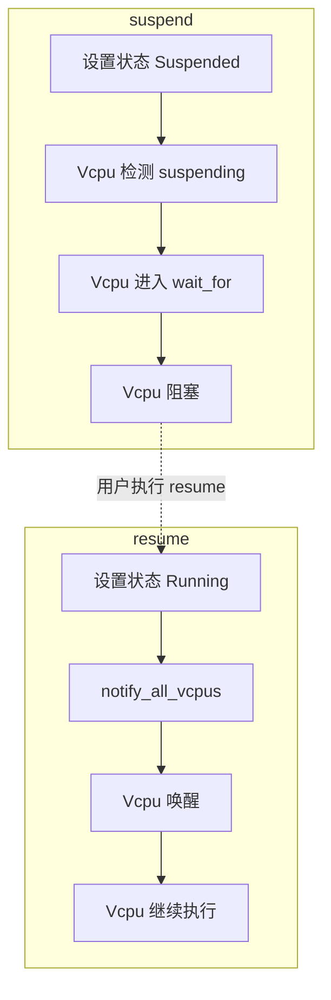

### 暂停等待机制

暂停操作是异步的——`vm suspend` 命令只是设置了 VM 的暂停状态标志，但 Vcpu 任务需要一些时间才能检测到这个标志并进入阻塞状态。为了确保暂停真正完成，命令需要等待并验证所有 Vcpu 都已停止执行。

**为什么需要等待机制**：

如果不等待验证，可能出现以下问题：
- 用户以为 VM 已暂停，但实际上 Vcpu 还在运行
- 在 VM 未完全暂停时执行其他操作（如快照），导致状态不一致
- 无法给用户明确的反馈（操作成功还是失败？）

**轮询等待的实现细节**：

采用轮询方式而非阻塞等待的原因：
1. **超时保护**：避免无限等待，如果 10 秒内未完成则报告超时
2. **状态检查**：每次循环都检查所有 Vcpu 状态，提供进度反馈
3. **非阻塞**：允许在等待期间响应其他事件（虽然当前实现是同步的）

**轮询参数的选择**：

- **最多 10 次**：每次 100ms，总计 1 秒超时
  - 1 秒对于暂停操作来说是合理的等待时间
  - 正常情况下，Vcpu 应该在几十毫秒内响应
  - 如果超过 1 秒未完成，很可能出现了异常

- **间隔 100ms**：
  - 足够短，用户不会感觉到明显的延迟
  - 足够长，避免过于频繁的轮询消耗 CPU
  - 给 Vcpu 任务足够的时间完成状态转换

**状态检查的逻辑**：

每次轮询检查所有 Vcpu 的状态：
- 如果**全部**都是 Blocked：暂停成功完成
- 如果**仍有** Running 或其他状态：继续等待
- 如果达到最大次数：报告超时错误

这种"全部完成才算成功"的语义确保了 VM 处于完全一致的暂停状态。

下图展示了暂停命令如何通过轮询机制等待所有 Vcpu 进入阻塞状态：

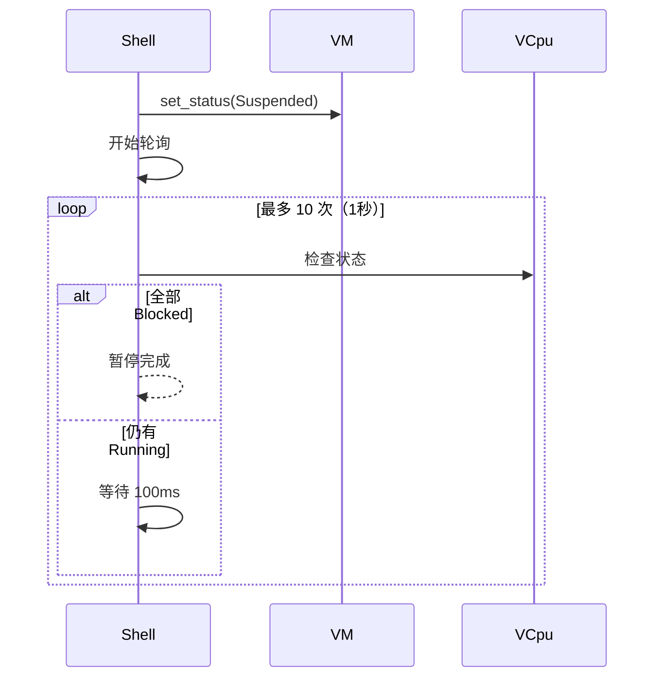

## vm restart 实现

`vm restart` 命令是 `vm stop` 和 `vm start` 的同步组合，展示了命令之间的复用。

**注意：该功能目前并未真正实现，仍在完善中。**

### 核心实现机制

**同步停止 + 启动**：
```rust
pub fn restart(vm_id: usize, force: bool) -> Result<()> {
    let vm = get_vm_by_id(vm_id)?;

    // 1. 停止 VM
    match vm.status() {
        VmStatus::Running | VmStatus::Suspended => {
            stop(vm_id, force)?;

            // 2. 轮询等待停止完成
            for _ in 0..50 {  // 最多等待 5 秒
                if vm.status() == VmStatus::Stopped {
                    break;
                }
                sleep(Duration::from_millis(100));
            }

            if vm.status() != VmStatus::Stopped {
                return Err("Stop timeout");
            }
        }
        VmStatus::Stopped | VmStatus::Loaded => {
            // 已经停止，直接启动
        }
        _ => return Err("Cannot restart VM in current state"),
    }

    // 3. 重新启动
    start(vm_id)?;
    Ok(())
}
```

**命令复用设计**：
- `vm restart` 不是独立实现，而是 `stop + start` 的组合
- 复用现有命令逻辑，减少代码重复
- 通过同步等待确保停止完成后再启动

**状态优化**：
- 如果 VM 已经是 Stopped 或 Loaded 状态，直接调用 `start()`
- 避免不必要的停止操作，提高效率
- 对于 Running 或 Suspended 状态，必须先完整停止

### 重启流程

下图展示了重启命令的决策树。根据 VM 当前状态，命令会选择不同的执行路径：

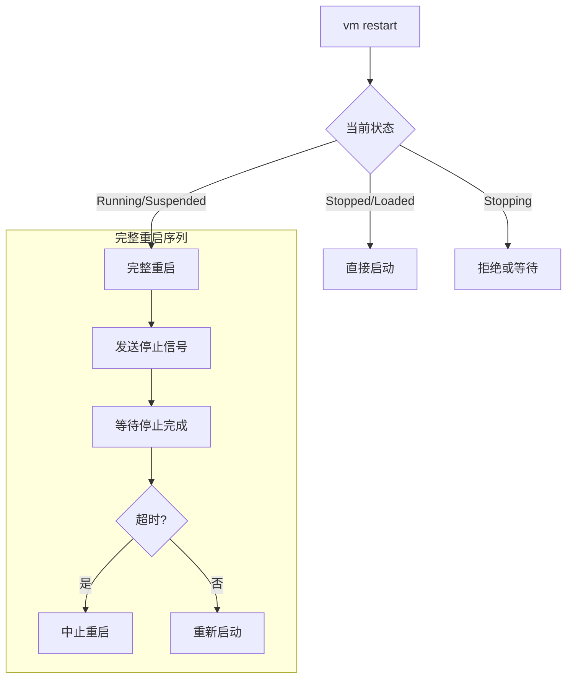

### 同步等待机制

重启是**同步操作**，必须等待完全停止后才能继续。这与 `stop` 命令的异步模式不同。

**为什么需要同步等待**：
- 确保 VM 完全停止后才重新启动，避免状态冲突
- 如果在 VM 未完全停止时启动，可能导致资源竞争
- 提供明确的成功/失败反馈给用户

**轮询参数设计**：

| 阶段 | 最大等待 | 检查间隔 | 说明 |
|------|---------|---------|------|
| 停止完成 | 5秒 | 100ms | 正常 VM 应在 1-2 秒内停止 |

**超时处理**：
- 如果 5 秒内 VM 未停止，返回超时错误
- 用户可以使用 `--force` 标志强制重启
- 超时通常表明 VM 内部存在问题（如死锁）

## vm delete 实现

`vm delete` 命令展示了资源清理的完整流程，涉及并发控制、引用计数管理和内存安全。

### 核心实现机制

**删除操作的特殊性**：
- 删除是不可逆操作，必须确保资源完全清理
- 涉及多个组件的协调：全局列表、Vcpu 任务、内存映射、设备状态
- 必须处理并发访问和引用计数，确保内存安全

**状态验证策略**：
- Running 状态：必须先停止或使用 `--force` 强制删除
- Stopping 状态：建议等待停止完成，或使用 `--force` 强制删除
- Stopped/Loaded 状态：直接允许删除
- 这种设计避免了在 VM 活跃时删除导致的资源泄漏

**删除流程代码**：
```rust
pub fn delete(vm_id: usize, force: bool, keep_data: bool) -> Result<()> {
    let vm = get_vm_by_id(vm_id)?;

    // 1. 状态验证
    match vm.status() {
        VmStatus::Running if !force => {
            return Err("VM is running, stop it first or use --force");
        }
        VmStatus::Stopping if !force => {
            return Err("VM is stopping, please wait or use --force");
        }
        _ => {}
    }

    // 2. 发送关闭信号（如果运行中）
    if vm.status() == VmStatus::Running || vm.status() == VmStatus::Suspended {
        vm.shutdown();
    }

    // 3. 从全局列表移除（关键步骤）
    let vm_ref = remove_vm(vm_id)?;  // 返回 Arc<VM>

    // 4. 等待所有 Vcpu 任务退出
    cleanup_vm_vcpus(vm_id)?;

    // 5. 验证引用计数
    let ref_count = Arc::strong_count(&vm_ref);
    if ref_count > 1 {
        warn!("VM {} has {} outstanding references, possible leak",
              vm_id, ref_count - 1);
    }

    // 6. 删除数据文件（可选）
    if !keep_data {
        delete_vm_data(vm_id)?;
    }

    // 7. vm_ref 在这里 drop，如果 ref_count == 1，VM 对象被释放
    Ok(())
}
```

**关键步骤解析**：

1. **状态验证**：防止误删除正在运行的 VM
2. **发送关闭信号**：优雅地通知 VM 准备清理
3. **从列表移除**：这是关键步骤，一旦移除，其他线程无法再获取此 VM
4. **等待任务退出**：确保所有 Vcpu 任务完全退出，避免 use-after-free
5. **引用计数验证**：检测潜在的内存泄漏
6. **数据文件清理**：可选的持久化数据删除
7. **自动析构**：利用 Rust 的 RAII 机制自动释放资源

### 删除流程图

下图展示了删除命令的完整执行路径，包括状态验证和多步骤清理过程：

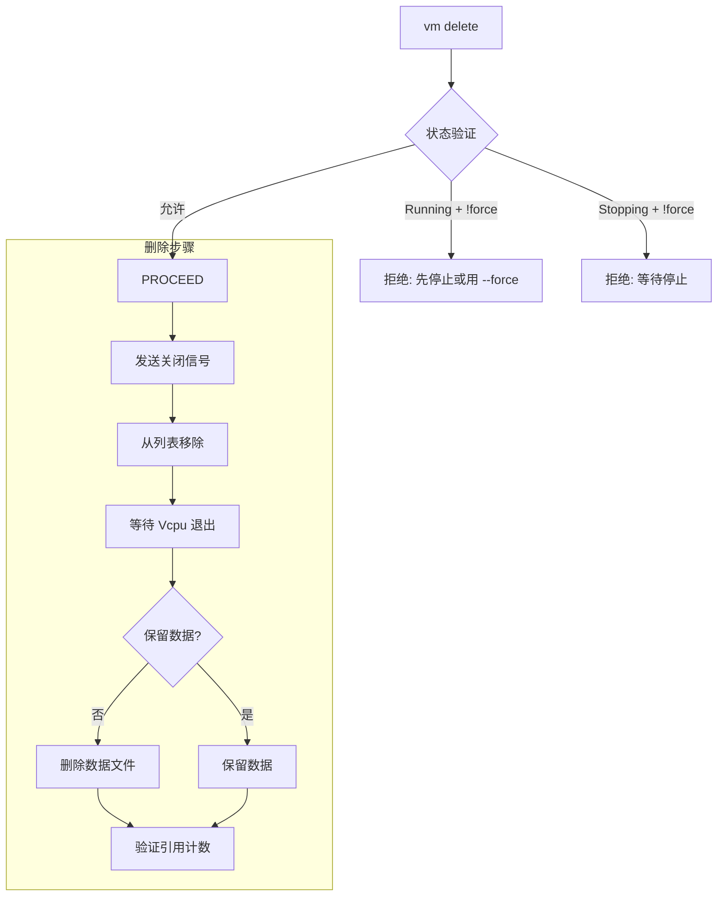

**流程图说明**：
- 左侧分支：状态验证失败时的拒绝路径
- 右侧分支：删除步骤的顺序执行路径
- 关键决策点：是否保留数据文件

### 选项实现

**--force 标志**：
- 允许删除正在运行或停止中的 VM
- 跳过状态验证的限制
- 风险：可能导致 VM 内部状态不一致，但确保删除操作能够完成
- 使用场景：VM 卡死、无响应、调试测试等

**--keep-data 标志**：
- 保留 VM 的配置文件和持久化数据
- 只删除内存中的 VM 对象和运行时状态
- 使用场景：临时清理、保留配置以便后续重新创建

**选项组合效果**：

| 命令 | 效果 |
|------|------|
| `vm delete 0` | 标准删除，要求 VM 已停止，删除所有数据 |
| `vm delete 0 --force` | 强制删除，即使 VM 运行中，删除所有数据 |
| `vm delete 0 --keep-data` | 标准删除，但保留配置文件 |
| `vm delete 0 --force --keep-data` | 强制删除，但保留配置文件 |

### 资源清理

VM 删除的最后阶段是资源清理，这是确保系统不发生内存泄漏和资源耗尽的关键步骤。这个过程涉及多个组件的协调，必须按正确的顺序执行。

**资源清理的复杂性**：

VM 是一个复杂的对象，包含多种资源：
- **任务资源**：Vcpu 任务及其栈空间
- **内存资源**：Guest 物理内存映射
- **设备资源**：模拟设备和直通设备的状态
- **数据结构**：全局列表、等待队列中的条目

这些资源之间存在依赖关系，必须按正确顺序清理以避免 use-after-free 或双重释放。

**清理步骤的顺序**：

1. **从列表移除**：
   - `remove_vm(id)` 从全局列表移除 VM
   - 返回 VM 的 `Arc<VM>` 引用
   - 此时其他线程无法再通过 `get_vm_by_id` 获取这个 VM

2. **等待任务退出**：
   - `cleanup_vm_vcpus(id)` 等待所有 Vcpu 任务完全退出
   - 使用 `task.join()` 阻塞等待每个任务
   - 确保任务不再访问 VM 的内存

3. **验证引用计数**：
   - 检查 `Arc::strong_count(vm_ref)`
   - 正常情况下应该是 1（只有当前作用域持有）
   - 如果 > 1，说明存在引用泄漏，记录警告

4. **自动释放**：
   - `vm_ref` 在作用域结束时自动 drop
   - 如果 strong_count 降到 0，VM 对象被析构
   - 析构器会释放所有内部资源

**为什么这个顺序很重要**：

如果颠倒顺序（先 cleanup 再 remove），可能导致：
- **并发访问**：cleanup 期间，其他线程可能通过 `get_vm_by_id` 获取 VM，增加引用计数
- **竞态条件**：Vcpu 任务退出前可能检测到 VM 仍在列表中，尝试再次访问
- **不确定性**：无法可靠地验证引用计数，因为存在其他合法的引用路径

**引用计数验证的意义**：

strong_count 检查是一个重要的健康检查：
- **count == 1**：完美，VM 将被正确释放
- **count > 1**：警告，可能的引用泄漏来源：
  - 某个线程仍持有 VM 引用未释放
  - 闭包捕获了 VM 引用
  - 循环引用（虽然我们用 Weak 避免了）

这个检查帮助开发者及早发现内存泄漏问题。

**cleanup_vm_vcpus 实现细节**：

```rust
fn cleanup_vm_vcpus(vm_id: usize) -> Result<()> {
    // 获取所有 Vcpu 任务句柄
    let vcpu_tasks = get_vcpu_tasks(vm_id)?;

    // 依次等待每个任务退出
    for (vcpu_id, task_handle) in vcpu_tasks {
        match task_handle.join() {
            Ok(_) => debug!("Vcpu {} exited cleanly", vcpu_id),
            Err(e) => warn!("Vcpu {} exit with error: {}", vcpu_id, e),
        }
    }

    Ok(())
}
```

这个函数使用阻塞等待（`join()`）而不是轮询，因为：
- Vcpu 任务已经收到停止信号，应该很快退出
- 阻塞等待更高效，不浪费 CPU 时间
- 如果任务无法退出，说明存在严重问题，需要开发者介入

下图展示了资源清理的完整流程，包括各个组件之间的交互和引用计数的变化：

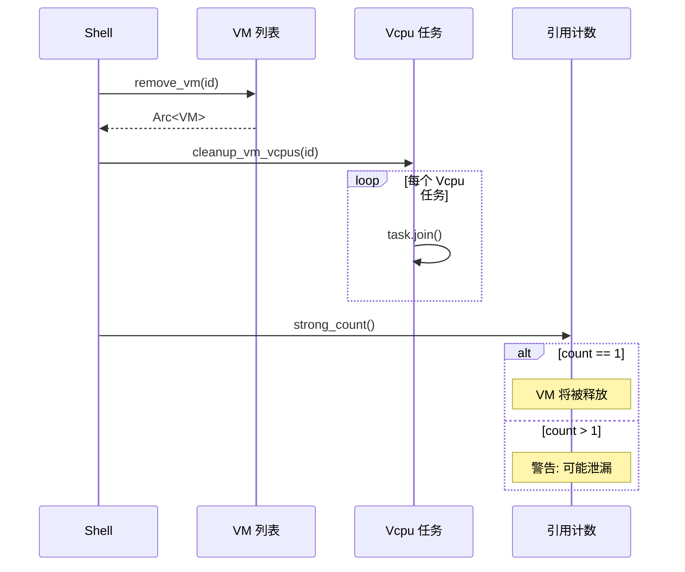
