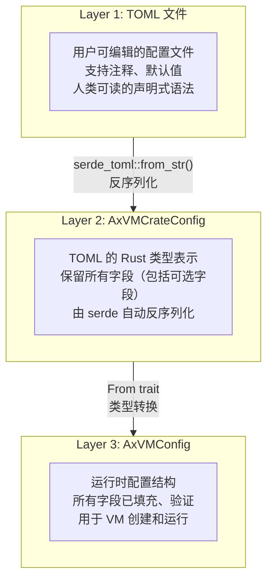
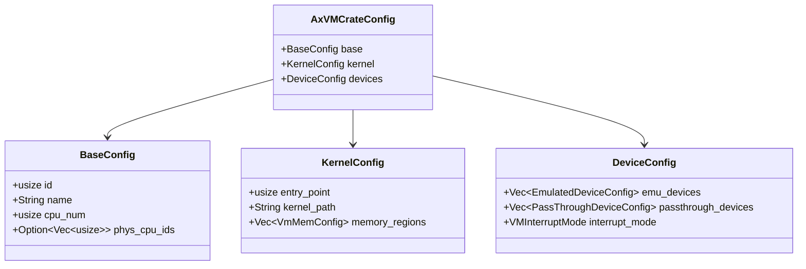
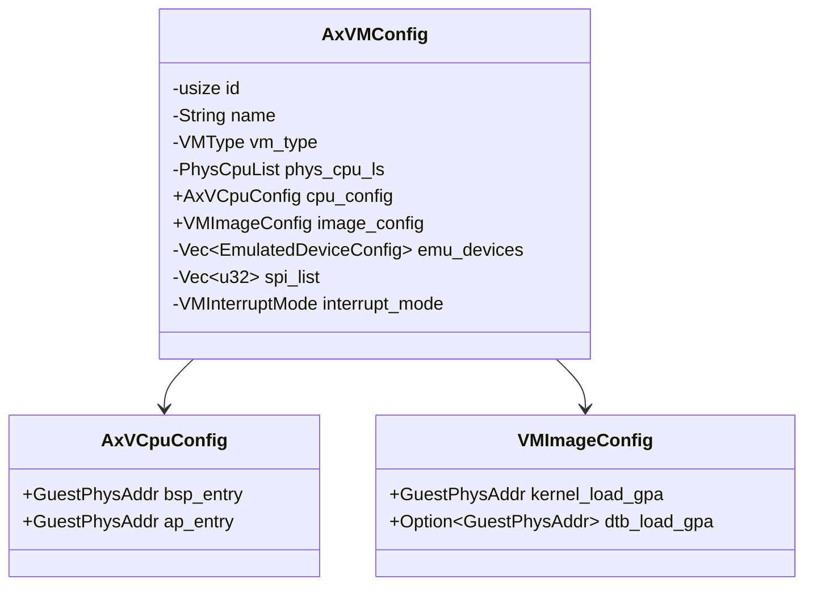
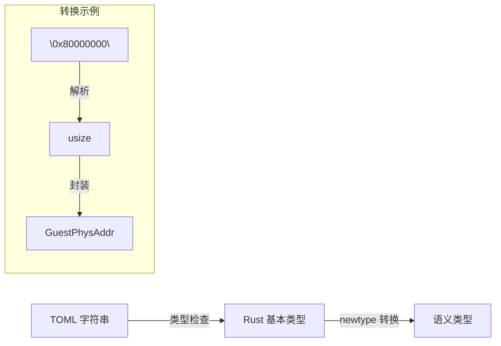
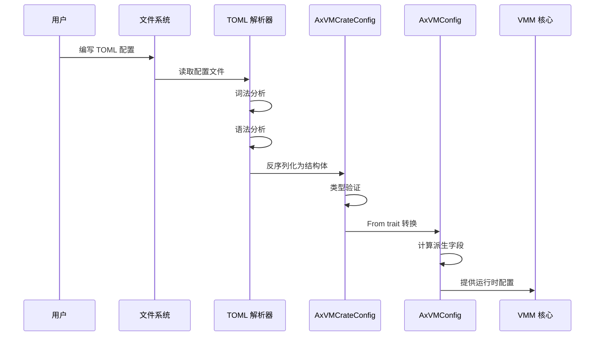

# 配置体系概述

AxVisor 采用**分层配置架构**，将用户友好的声明式配置（TOML）转换为高效的运行时配置。本节介绍配置体系的整体设计。

## 三层配置模型

AxVisor 的配置系统分为三个层次，每层负责不同的关注点。下图展示了这三层之间的转换关系：



**图解说明**：

这个流程图展示了配置数据如何从用户编写的 TOML 文件逐步转换为 VMM 运行时使用的配置结构。整个过程分为两个关键转换步骤：

1. **Layer 1 → Layer 2（反序列化）**：
   - 使用 `serde_toml::from_str()` 将 TOML 文本解析为 Rust 结构体
   - 这一步由 serde 库自动完成，利用 Rust 的类型系统进行语法和类型检查
   - 如果 TOML 文件格式错误或类型不匹配，这一步会报错
   - 此时配置中仍然包含 `Option<T>` 类型的可选字段

2. **Layer 2 → Layer 3（类型转换）**：
   - 通过实现 `From` trait 完成从 `AxVMCrateConfig` 到 `AxVMConfig` 的转换
   - 这一步填充默认值、验证配置合理性、计算派生字段
   - 将基础类型（如 `usize`）转换为语义类型（如 `GuestPhysAddr`）
   - 转换完成后，所有字段都已确定，配置可以直接用于创建虚拟机

整个转换过程是单向的、不可逆的，确保配置数据从宽松的用户格式逐步收紧为严格的运行时格式。

## 层次职责

### Layer 1: TOML 配置文件

用户直接编辑的配置文件，采用 TOML 格式：

```toml
[base]
id = 1
name = "linux-qemu"
cpu_num = 4
phys_cpu_ids = [0x0, 0x100, 0x200, 0x300]

[kernel]
entry_point = 0x8020_0000
kernel_path = "Image"

[devices]
interrupt_mode = "passthrough"
```

**特点**：
- 人类可读、易于编辑
- 支持注释和可选字段
- 声明式语法，描述"要什么"而非"怎么做"

### Layer 2: AxVMCrateConfig

TOML 在 Rust 中的直接映射，位于 `axvmconfig` crate：



**图解说明**：

这个类图展示了 Layer 2 的结构组织。`AxVMCrateConfig` 是顶层结构，通过组合模式将配置分为三个独立的部分：

- **BaseConfig**：虚拟机的基础信息
  - `id`：虚拟机的唯一标识符
  - `name`：虚拟机的名称，用于标识和日志输出
  - `cpu_num`：虚拟 CPU 的数量
  - `phys_cpu_ids`：可选字段，指定 vCPU 绑定到哪些物理 CPU，使用 `Option<Vec<usize>>` 类型

- **KernelConfig**：内核镜像相关配置
  - `entry_point`：内核入口地址，虚拟机启动时 PC 寄存器的初始值
  - `kernel_path`：内核镜像文件路径
  - `memory_regions`：内存区域配置列表

- **DeviceConfig**：设备配置
  - `emu_devices`：模拟设备列表（如虚拟串口、虚拟磁盘）
  - `passthrough_devices`：直通设备列表（直接映射物理设备）
  - `interrupt_mode`：中断处理模式（直通或模拟）

这种分层设计的优势：
1. **关注点分离**：每个配置子结构负责特定领域，便于维护和扩展
2. **模块化**：可以独立测试和验证每个配置部分
3. **复用性**：不同配置模块可以在不同场景下复用

**特点**：
- 与 TOML 结构一一对应
- 使用 `Option<T>` 表示可选字段
- 实现 `Deserialize` trait，支持自动解析

### Layer 3: AxVMConfig

运行时使用的配置结构，位于 `axvm` crate：



**图解说明**：

这个类图展示了 Layer 3 的运行时配置结构。与 Layer 2 相比，`AxVMConfig` 经过了重要的重组和优化：

**AxVMConfig 主结构**：
- **私有字段**（用 `-` 表示）：
  - `id`, `name`, `vm_type`：基本标识信息，不允许外部直接修改
  - `phys_cpu_ls`：物理 CPU 列表，已经从可选的 `Option<Vec<usize>>` 转换为确定的 `PhysCpuList` 类型
  - `emu_devices`, `spi_list`：设备相关数据，`spi_list` 是从设备配置中派生出来的中断列表
  - `interrupt_mode`：中断模式枚举

- **公有字段**（用 `+` 表示）：
  - `cpu_config`：vCPU 配置，包含 BSP 和 AP 的入口地址
  - `image_config`：镜像配置，包含内核和 DTB 的加载地址

**AxVCpuConfig 子结构**：
- `bsp_entry`：Bootstrap Processor（主 CPU）的入口地址，使用 `GuestPhysAddr` 类型而非原始的 `usize`
- `ap_entry`：Application Processor（辅助 CPU）的入口地址

**VMImageConfig 子结构**：
- `kernel_load_gpa`：内核加载的客户机物理地址
- `dtb_load_gpa`：Device Tree Blob 加载地址（可选），用于传递设备树信息给客户机

**与 Layer 2 的关键差异**：
1. **类型强化**：`usize` → `GuestPhysAddr`，增强类型安全性，防止地址类型混淆
2. **字段重组**：按运行时使用模式重新组织字段，而非按配置来源
3. **派生字段**：`spi_list` 等字段是在转换过程中计算得出的
4. **访问控制**：通过私有字段和公有方法控制配置的修改权限

**特点**：
- 所有字段都已验证和填充
- 使用类型安全的地址类型（`GuestPhysAddr`）
- 包含运行时派生的字段（如 `spi_list`）

## 设计优势

### 关注点分离

每一层专注于特定的职责：

| 层次 | 关注点 | 用户 |
|------|--------|------|
| Layer 1 | 易读、易写 | 系统管理员 |
| Layer 2 | 类型安全、验证 | 配置解析器 |
| Layer 3 | 性能、运行时语义 | VMM 核心 |

### 类型安全保证

配置系统在多个层面提供类型安全，通过 Rust 的类型系统在编译期就能捕获大量潜在错误。下图展示了类型如何从字符串逐步转换为语义类型：



**图解说明**：

这个流程图展示了类型安全是如何逐层加强的。以地址类型为例：

**第一步：TOML 字符串 → Rust 基本类型**
- TOML 文件中的 `"0x80000000"` 是一个字符串表示的十六进制数
- `serde` 在反序列化时自动将其解析为 `usize` 类型
- 这一步捕获了语法错误（如非法字符、溢出等）

**第二步：Rust 基本类型 → 语义类型**
- 将 `usize` 封装为 `GuestPhysAddr` 类型（newtype 模式）
- `GuestPhysAddr` 是一个包装类型，虽然底层仍是 `usize`，但在类型系统中是独立的类型
- 这一步捕获了语义错误（如将主机地址误用为客户机地址）

**newtype 模式的优势**：
```rust
struct GuestPhysAddr(usize);  // 客户机物理地址
struct HostVirtAddr(usize);   // 主机虚拟地址

// 编译器会阻止以下操作：
let gpa = GuestPhysAddr(0x80000000);
let hva: HostVirtAddr = gpa;  // 编译错误！类型不匹配
```

虽然两者底层都是 `usize`，但类型系统确保它们不会被混用。这在虚拟化场景中尤为重要，因为地址空间混淆是常见的 bug 来源。

类型转换示例：
- `usize` → `GuestPhysAddr`（防止地址误用）
- `u8` → `VMType`（限制取值范围）
- `String` → `VMInterruptMode`（枚举验证）

### 灵活性

三层架构提供了良好的灵活性：

- **可选字段处理**：Layer 2 使用 `Option<T>`，Layer 3 转换为具体值或使用默认值
- **运行时修改**：Layer 3 提供 `with_config` 方法支持动态调整
- **后向兼容**：新增可选字段不影响旧配置文件

## 配置处理流程

从用户编写配置文件到 VMM 使用配置创建虚拟机，整个过程涉及多个组件的协作。下图展示了完整的配置处理时序：



**图解说明**：

这个时序图详细展示了配置数据从创建到使用的完整生命周期：

**阶段 1：用户编写配置（User → FS）**
- 用户使用文本编辑器编写 TOML 配置文件
- 配置文件保存到文件系统中，通常位于 `/guest/` 目录

**阶段 2：读取配置文件（FS → Parser）**
- VMM 启动时或执行 `vm create` 命令时读取配置文件
- 文件内容作为字符串加载到内存

**阶段 3：词法和语法分析（Parser 内部）**
- **词法分析**：将文本分解为 token（如 `id`, `=`, `1`）
- **语法分析**：验证 TOML 语法是否正确（如括号匹配、缩进等）
- 这两步由 `toml` crate 自动完成，错误会立即报告给用户

**阶段 4：反序列化（Parser → Crate）**
- 将 TOML 的键值对映射到 `AxVMCrateConfig` 的字段
- `serde` 自动处理类型转换（如字符串转整数）
- 如果类型不匹配或缺少必需字段，此步骤会失败

**阶段 5：类型验证（Crate 内部）**
- 验证字段取值的合理性（如 CPU 数量必须 > 0）
- 检查依赖关系（如指定了设备则必须指定中断模式）
- 这一步在 `Deserialize` trait 的自定义实现中完成

**阶段 6：转换为运行时配置（Crate → VM）**
- 调用 `From<AxVMCrateConfig> for AxVMConfig` trait
- 填充默认值（如未指定 `phys_cpu_ids` 则自动分配）
- 转换类型（如 `usize` → `GuestPhysAddr`）

**阶段 7：计算派生字段（VM 内部）**
- 根据设备配置生成中断列表（`spi_list`）
- 计算内存布局和地址映射
- 验证配置的一致性（如内存区域不重叠）

**阶段 8：提供给 VMM 核心（VM → VMM）**
- 将最终的 `AxVMConfig` 传递给虚拟机创建函数
- VMM 使用此配置初始化 vCPU、内存、设备等资源
- 配置在虚拟机生命周期内保持不变（除非通过特定 API 修改）

**错误处理**：
- 每个阶段都可能失败，错误会立即返回给用户
- 错误信息包含具体的失败原因和位置（如"第 5 行：无效的 CPU 数量"）
- 遵循"快速失败"原则，避免使用无效配置创建虚拟机
