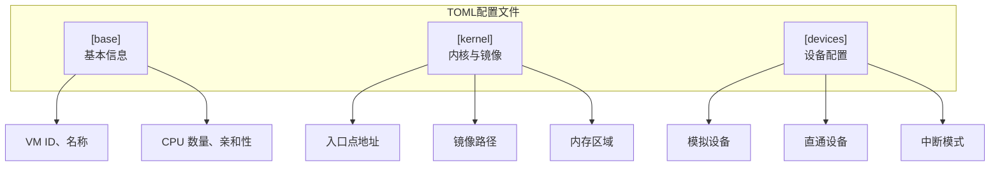
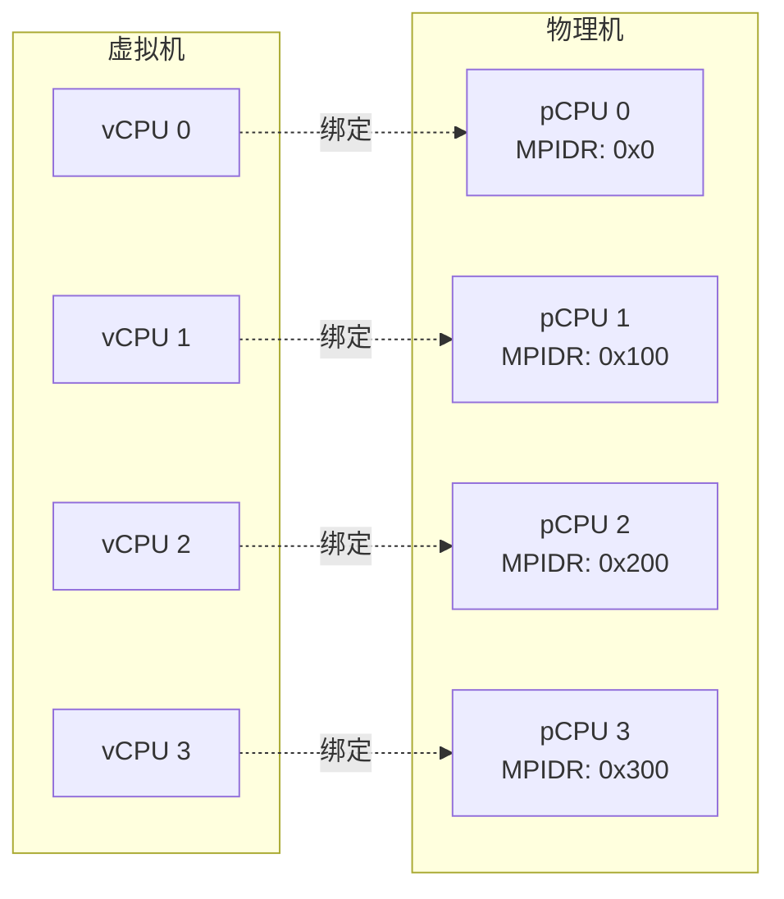
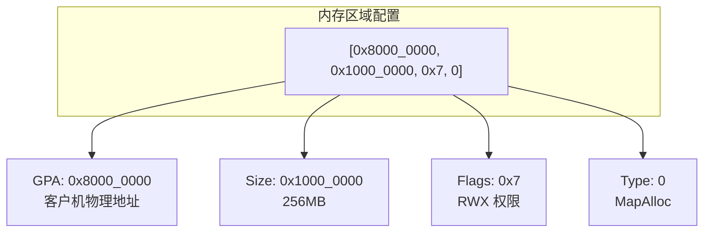
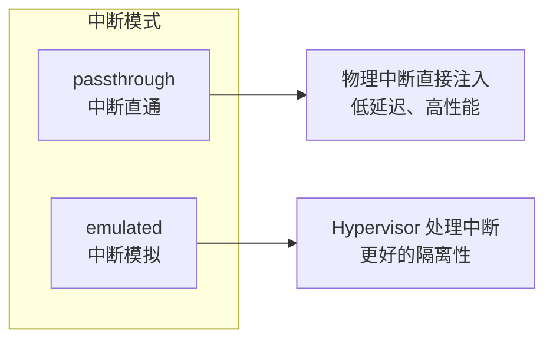
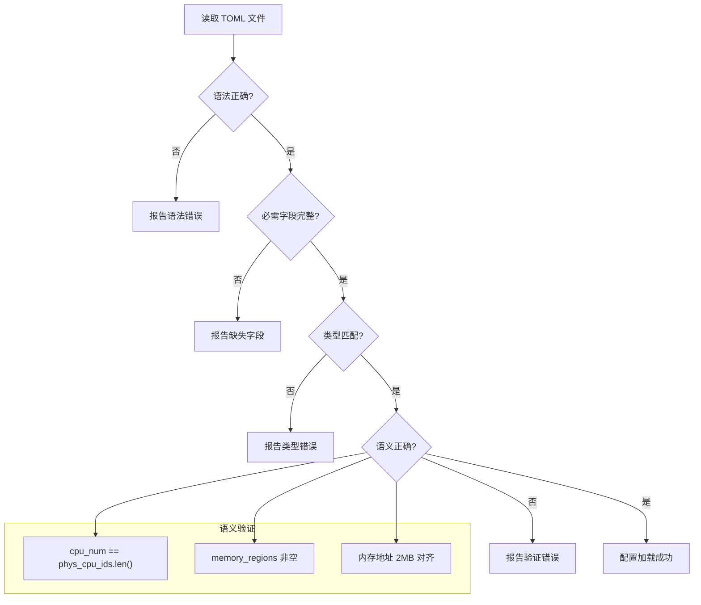

# TOML 配置格式

本节介绍 AxVisor 虚拟机配置文件的 TOML 格式规范。

## 配置文件结构

每个虚拟机配置文件由三个主要部分组成：



## [base] 基本配置

定义虚拟机的基本属性。

### 必需字段

| 字段 | 类型 | 说明 | 示例 |
|------|------|------|------|
| `id` | usize | VM 唯一标识符（0-255） | `1` |
| `name` | String | VM 名称，用于日志显示 | `"linux-qemu"` |
| `vm_type` | u8 | 虚拟化类型，1 = 完全虚拟化 | `1` |
| `cpu_num` | usize | vCPU 数量 | `4` |

### 可选字段

| 字段 | 类型 | 说明 | 示例 |
|------|------|------|------|
| `phys_cpu_ids` | Vec\<usize\> | 物理 CPU MPIDR 值（ARM） | `[0x0, 0x100]` |

### 配置示例

```toml
[base]
id = 1
name = "linux-rk3588"
vm_type = 1
cpu_num = 4
phys_cpu_ids = [0x0, 0x100, 0x200, 0x300]
```

### CPU 亲和性说明

`phys_cpu_ids` 字段指定每个 vCPU 绑定的物理 CPU：



> 注意：
> `phys_cpu_ids` 数组长度必须等于 `cpu_num`，否则配置验证将失败。

## [kernel] 内核配置

定义内核和镜像相关的配置。

### 必需字段

| 字段 | 类型 | 说明 |
|------|------|------|
| `entry_point` | usize | 内核入口地址（GPA） |
| `kernel_path` | String | 内核镜像路径 |
| `kernel_load_addr` | usize | 内核加载地址（GPA） |
| `memory_regions` | Array | 内存区域配置 |

### 可选字段

| 字段 | 类型 | 说明 |
|------|------|------|
| `image_location` | String | 镜像位置："memory" 或 "fs" |
| `dtb_path` | String | DTB 文件路径 |
| `dtb_load_addr` | usize | DTB 加载地址 |
| `bios_path` | String | BIOS/UEFI 文件路径 |
| `bios_load_addr` | usize | BIOS 加载地址 |
| `ramdisk_path` | String | Ramdisk 文件路径 |
| `ramdisk_load_addr` | usize | Ramdisk 加载地址 |

### 配置示例

```toml
[kernel]
entry_point = 0x8020_0000
image_location = "memory"
kernel_path = "Image"
kernel_load_addr = 0x8020_0000
dtb_path = "linux.dtb"
dtb_load_addr = 0x8000_0000
memory_regions = [
    [0x8000_0000, 0x1000_0000, 0x7, 0],  # 256MB RAM
]
```

### 内存区域格式

内存区域使用数组格式：`[GPA, 大小, 标志, 映射类型]`



#### 映射类型说明

| 值 | 类型 | 说明 | 使用场景 |
|---|------|------|---------|
| 0 | MapAlloc | 分配新物理内存 | 普通 RAM |
| 1 | MapIdentical | 恒等映射（GPA = HPA） | 裸机 OS、设备 MMIO |
| 2 | MapReserved | 映射保留物理地址 | 共享内存、DMA 缓冲区 |

#### 标志位说明

标志位使用 ARM 页表属性格式：

| Bit | 含义 |
|-----|------|
| 0 | 可读（R） |
| 1 | 可写（W） |
| 2 | 可执行（X） |

常用组合：
- `0x7` = RWX（完全权限）
- `0x3` = RW（数据区）
- `0x5` = RX（代码区）

## [devices] 设备配置

定义模拟设备和直通设备。

### 字段说明

| 字段 | 类型 | 说明 |
|------|------|------|
| `emu_devices` | Array | 模拟设备列表 |
| `passthrough_devices` | Array | 直通设备列表 |
| `excluded_devices` | Array | 排除设备列表 |
| `passthrough_addresses` | Array | 直通地址列表 |
| `interrupt_mode` | String | 中断模式 |

### 中断模式



### 直通设备配置

支持两种格式：

**格式 1：FDT 路径（推荐）**

```toml
passthrough_devices = [
    ["/soc/serial@fe660000"],
]
```

系统会自动从 FDT 解析设备信息（地址、大小、中断号）。

**格式 2：手动配置**

```toml
passthrough_devices = [
    ["uart", 0xfe660000, 0xfe660000, 0x10000, 23],
]
# 格式：[名称, GPA, HPA, 大小, 中断号]
```

### 完整设备配置示例

```toml
[devices]
# 模拟设备
emu_devices = []

# 直通设备（FDT 路径方式）
passthrough_devices = [
    ["/soc/serial@fe660000"],
    ["/soc/gpio@fd8a0000"],
]

# 排除的设备（不直通）
excluded_devices = [
    ["/soc/timer@fdd1c000"],
]

# 直通地址（无需 FDT）
passthrough_addresses = []

# 中断处理模式
interrupt_mode = "passthrough"
```

## 完整配置示例

以下是一个完整的虚拟机配置文件示例：

```toml
# Linux on RK3588 配置示例

[base]
id = 1
name = "linux-rk3588"
vm_type = 1
cpu_num = 4
phys_cpu_ids = [0x0, 0x100, 0x200, 0x300]

[kernel]
entry_point = 0x8020_0000
image_location = "fs"
kernel_path = "/guest/Image"
kernel_load_addr = 0x8020_0000
dtb_path = "/guest/linux.dtb"
dtb_load_addr = 0x8000_0000

# 内存配置：3GB RAM
memory_regions = [
    [0x8000_0000, 0xc000_0000, 0x7, 0],
]

[devices]
emu_devices = []

passthrough_devices = [
    ["/soc/serial@fe660000"],
]

excluded_devices = []
passthrough_addresses = []
interrupt_mode = "passthrough"
```

## 配置验证

AxVisor 在加载配置时执行严格的多层验证，确保配置的正确性和系统的安全性。验证过程分为四个递进的层次，每一层都基于前一层的成功完成。



**图解说明**：

这个验证流程图展示了配置从原始 TOML 文本到可用的运行时配置所经历的四道关卡。每道关卡负责不同层次的检查，形成了一个完整的质量保证体系。

### 验证层次详解

#### 第一层：语法验证

**职责**：检查 TOML 文件的语法结构是否符合规范

**验证内容**：
- 键值对格式：`key = value` 的基本格式
- Section 定义：`[section]` 的方括号配对
- 字符串引号：引号正确闭合
- 数组格式：`[]` 正确，元素分隔符正确
- 注释格式：`#` 开头的注释行

**执行者**：`toml` crate（serde_toml 库）

**错误示例**：
```toml
[base]
id 1  # ❌ 缺少等号，应该是 id = 1
name = "linux-qemu  # ❌ 缺少结束引号
phys_cpu_ids = [0, 1, 2  # ❌ 缺少右方括号
```

**处理方式**：立即终止配置加载，报告详细的语法错误位置

#### 第二层：字段完整性验证

**职责**：检查所有必需的配置字段是否都已提供

**验证内容**：
- **[base] Section**：必需 `id`, `name`, `vm_type`, `cpu_num`
- **[kernel] Section**：必需 `entry_point`, `kernel_path`, `kernel_load_addr`, `memory_regions`
- **[devices] Section**：必需存在（可以为空）

**执行者**：serde 反序列化器

**错误示例**：
```toml
[base]
# ❌ 缺少 id 字段
name = "test-vm"
vm_type = 1
cpu_num = 4
```

**错误信息**：`missing field 'id' at line 1`

#### 第三层：类型匹配验证

**职责**：检查每个字段的值类型是否与预期类型匹配

**验证内容**：
- 基本类型：整数、字符串、数组
- 数值范围：VM ID (0-255)、CPU 数量 (> 0)
- 枚举值：中断模式必须是 "passthrough" 或 "emulated"

**执行者**：serde 类型系统 + Rust 编译器

**错误示例**：
```toml
[base]
id = "1"  # ❌ 应该是数字，不是字符串
cpu_num = -1  # ❌ 不能是负数

[devices]
interrupt_mode = "invalid"  # ❌ 无效的枚举值
```

#### 第四层：语义验证

**职责**：检查配置值之间的逻辑关系和业务规则

这是最高层次的检查，确保配置在逻辑上是合理的。验证在 `From<AxVMCrateConfig> for AxVMConfig` trait 实现中进行。

**验证规则**：

**规则 1：CPU 数量一致性**
```rust
if let Some(ref phys_cpu_ids) = config.base.phys_cpu_ids {
    assert_eq!(config.base.cpu_num, phys_cpu_ids.len());
}
```

**为什么需要**：每个 vCPU 需要绑定到一个物理 CPU

**错误示例**：
```toml
cpu_num = 4  # 声明 4 个 vCPU
phys_cpu_ids = [0x0, 0x100]  # ❌ 只提供了 2 个物理 CPU
```

**正确写法**：
```toml
cpu_num = 4
phys_cpu_ids = [0x0, 0x100, 0x200, 0x300]  # ✅ 4 个物理 CPU
```

**规则 2：内存区域非空**
```rust
assert!(!config.kernel.memory_regions.is_empty());
```

**为什么需要**：VM 必须有内存才能运行

**规则 3：内存地址 2MB 对齐**
```rust
const ALIGN: usize = 2 * 1024 * 1024;  // 2MB
assert_eq!(gpa % ALIGN, 0);
assert_eq!(size % ALIGN, 0);
```

**为什么需要**：
- ARM 虚拟化使用 2MB 大页（Huge Pages）
- 提高 TLB 性能
- 硬件要求第二阶段地址转换的对齐

**错误示例**：
```toml
memory_regions = [
    [0x80000001, 0x10000000, 0x7, 0],  # ❌ 地址未对齐
]
```

**正确写法**：
```toml
memory_regions = [
    [0x80000000, 0x10000000, 0x7, 0],  # ✅ 2MB 对齐
]
```

### 验证执行时机


**启动时加载**：
- 位置：`vmm::init()` → `config::init_guest_vms()`
- 时机：VMM 初始化阶段
- 行为：扫描配置目录，验证所有配置文件

**手动创建**：
- 命令：`vm create /path/to/config.toml`
- 时机：用户运行时动态创建
- 行为：读取指定文件，执行完整验证流程

### 常见错误及解决方案

| 错误类型 | 错误示例 | 根本原因 | 解决方案 |
|---------|---------|---------|---------|
| **CPU 数量不匹配** | `cpu_num=4, phys_cpu_ids=[0,1]` | 声明的 CPU 数量与列表长度不一致 | 确保 `phys_cpu_ids.len() == cpu_num` |
| **内存未对齐** | `GPA=0x80000001` | 地址不是 2MB 的倍数 | 使用 `0x80000000`（2MB 对齐） |
| **内存为空** | `memory_regions = []` | VM 没有分配任何内存 | 至少添加一个内存区域 |
| **缺少必需字段** | 没有 `entry_point` | TOML 文件缺少必需配置项 | 参考完整配置示例添加 |
| **类型不匹配** | `id = "1"` | 字符串类型写成整数类型 | 移除引号：`id = 1` |
| **枚举值无效** | `interrupt_mode = "invalid"` | 使用了不存在的枚举值 | 使用 "passthrough" 或 "emulated" |
