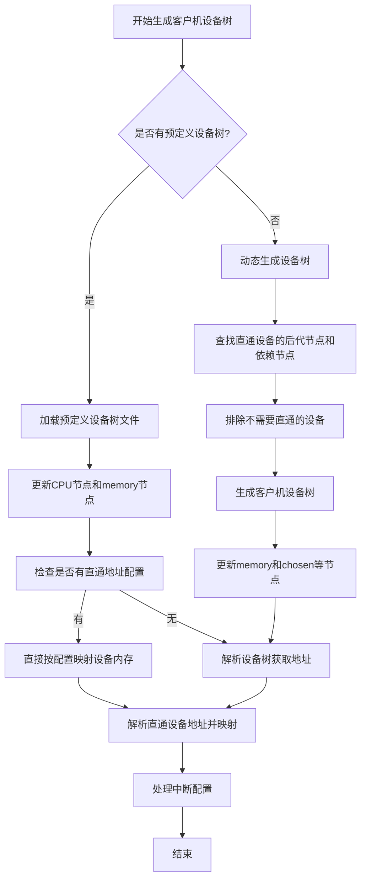

# 设备树（FDT）处理技术指南

## 第一部分：使用说明

### 1. 快速开始

AxVisor 的设备树（FDT）处理模块为 AArch64 架构的虚拟机提供定制化的设备树生成服务。根据需求，可以选择以下两种使用方式：

**方式一：使用预定义设备树文件**
```toml
[kernel]
dtb_path = "/path/to/your-custom.dtb"
```
适用场景：已经有完整的、经过验证的设备树文件，后续将只会更新memory节点和CPU节点信息。

**方式二：动态生成设备树**
```toml
[kernel]
# dtb_path = ""  # 不使用此字段，触发动态生成
```
适用场景：无客户机设备树文件。

### 2. 配置文件完整模板

以下是一个完整的 VM 配置模板，包含了所有 FDT 相关的配置选项：

```toml
[base]
id = 1                      # VM 唯一标识
name = "my-vm"              # VM 名称，用于日志和调试
vm_type = 1                 # 虚拟化类型（固定为1）
cpu_num = 2                 # 虚拟CPU数量
phys_cpu_ids = [0x200, 0x201]  # 物理CPU ID列表

[kernel]
# 镜像配置
entry_point = 0x80200000    # 内核入口地址
image_location = "memory"   # 镜像位置："memory" 或 "fs"
kernel_path = "Image"       # 内核文件路径
kernel_load_addr = 0x80200000  # 内核加载地址

# 设备树配置
#dtb_path = "/path/to/your-custom.dtb"   # 可选：预定义DTB
#dtb_load_addr = 0x80000000               # 可选：DTB加载地址

# 内存区域配置
memory_regions = [
    [0x80000000, 0x20000000, 0x7, 1],  # 基地址, 大小, 权限, 映射类型
    [0xa0000000, 0x10000000, 0x7, 0]
]

[devices]
# 直通设备配置（仅在动态生成时生效）
passthrough_devices = [
    ["/soc/uart@2800c000"],           # 完整路径格式（推荐）
    # 或者传统格式，两种格式不可以混用
    # ["uart0", 0x2800c000, 0x2800c000, 0x1000, 0x1] #[name, base_gpa, base_hpa, length, irq_id]
]

# 排除设备配置
excluded_devices = [
    ["/gic-v3"],                      # 排除中断控制器
]

# 直通地址配置
passthrough_addresses = [
    [0x28041000, 0x1000000],         # 基地址, 长度
]
```

### 3. 字段说明

**3.1 `dtb_path`（设备树文件位置）**

客户机设备树可以有两种来源，一种是基于axvisor的设备树和客户机配置文件生成的客户机设备树，另一种是基于开发者提供的客户机设备树。当客户机配置文件中使用`dtb_path`字段时，客户机设备树基于`dtb_path`字段指定的设备树文件生成，不使用该字段时基于axvisor设备树生成。

```toml
[kernel]
dtb_path = "/path/to/custom.dtb"  # 使用预定义设备树
# dtb_path = ""                    # 动态生成设备树
```

**3.2 `dtb_load_addr`(客户机设备树加载地址)**

`dtb_load_addr`字段指定生成的客户机设备树放置的客户机物理地址（GPA），当使用该字段且当客户机内存使用直通方式（GPA=HVA）时，客户机设备树将会加载到该地址，当配置文件中未使用该字段或客户机内存使用非直通方式（GPA≠HVA）时，客户机设备树将放置到客户机内存的前512MB内存的最后一段的位置，该地址由axvisor计算获得。

**3.3 `phys_cpu_ids`(客户机CPU ID)**

phys_cpu_ids字段用来选择客户机使用的CPU物理ID，例如飞腾派e2000平台的设备树cpus字段如下，其中reg属性中定义了CPU物理ID (0x200/0x201/0x00/0x100)。
```
cpus {
    #address-cells = <0x02>;
    #size-cells = <0x00>;

    cpu@0 {
        compatible = "phytium,ftc310\0arm,armv8";
        reg = <0x00 0x200>;
        ...
    };

    cpu@1 {
        compatible = "phytium,ftc310\0arm,armv8";
        reg = <0x00 0x201>;
        ...
    };

    cpu@100 {
        compatible = "phytium,ftc664\0arm,armv8";
        reg = <0x00 0x00>;
        ...
    };

    cpu@101 {
        compatible = "phytium,ftc664\0arm,armv8";
        reg = <0x00 0x100>;
        ...
    };
};
```
**3.4 `memory_regions`(客户机内存地址)**

无论哪种客户机内存分配方式，客户机设备树都会根据申请到的客户机内存更新memory字段
```
memory {
    device_type = "memory";
    reg = <0x00 0x80000000 0x00 0x20000000>;
};
```
**3.5 `passthrough_devices`（直通设备）**

现支持两种格式的设备直通方式

格式一：传统完整配置
```
passthrough_devices = [
    ["intc@8000000", 0x800_0000, 0x800_0000, 0x50_000, 0x1], #[name, base_gpa, base_hpa, length, irq_id]
    ["pl011@9000000", 0x900_0000, 0x900_0000, 0x1000, 0x1],
    ["pl031@9010000", 0x901_0000, 0x901_0000, 0x1000, 0x1],
]
```

格式二：全路径配置（推荐）
```
passthrough_devices = [
    ["/syscon@fdc20000"],
    ["/pinctrl/gpio3@fe760000"], #从根节点开始的完整路径
    ["/"],        #根节点，表示所有设备都直通
]
```

当直通设备使用全路径方式时，这里只需要填写需要直通的设备名称即可，设备名称是从跟节点开始的完整路径，此时axvisor会根据提供的设备树或主设备树自动查找相关节点并直通，该节点及相关节点的地址均等信息会根据设备树识别并补充完整，其中"/"表示根节点，当直通根节点时主机所有节点均会直通给客户机。

**3.6 `excluded_devices` （不直通设备）**

设备直通时axvisor会识别相关设备并一并直通给客户机，当某个设备不希望直通给客户机时可以加入该字段中，这样该设备及其地址将不会直通给客户机使用，生成的客户机设备树也不会包含该设备。

**3.7 `passthrough_addresses`（直通地址）**

该字段用于将指定地址直通给客户机使用，在启动如定制linux客户机需要使用某段地址或设备树非标准需要直接指定直通地址时将会使用到。

---

## 第二部分：原理说明

### 1. 设备树在虚拟化中的作用机制

#### 1.1 硬件抽象层的核心地位

设备树（FDT，Flattened Device Tree）在现代 ARM 系统中扮演着硬件抽象层的核心角色。它是一种描述硬件配置的数据结构，由 Bootloader 加载并传递给操作系统。

在 AxVisor 虚拟化环境中，设备树承担着三个关键角色：

1. **硬件发现者**：宿主机启动时，AxVisor 首先解析主机的设备树，了解可用的物理硬件资源，包括：
   - CPU 的数量和类型
   - 内存布局和容量
   - 中断控制器类型和配置
   - 各种 I/O 设备的地址空间和属性

2. **资源分配器**：基于对物理资源的了解，AxVisor 可以智能地为多个虚拟机分配资源：
   - 为每个 VM 分配特定的 CPU 核心
   - 划分内存区域，确保 VM 间的隔离
   - 配置中断路由，避免冲突

3. **虚拟化构建者**：AxVisor 不是简单地传递原始设备树，而是为每个 VM 构建定制的虚拟设备树，包含：
   - 分配给该 VM 的 CPU 节点
   - VM 的内存映射信息
   - 配置为直通的物理设备
   - 虚拟化的系统设备

#### 1.2 设备树的数据结构原理

设备树采用树形层次结构，每个节点代表一个硬件设备或组件，节点属性以键值对形式描述设备特性。

```
/ (根节点)
├── cpus (CPU节点)
│   ├── cpu@0 (CPU核心0)
│   └── cpu@1 (CPU核心1)
├── soc (系统级芯片)
│   ├── uart@2800c000 (串口设备)
│   └── gpio@fe760000 (GPIO设备)
└── memory (内存区域)
```

每个节点的关键属性：
- `compatible`: 设备兼容性字符串，用于驱动匹配
- `reg`: 地址和大小信息，定义设备的物理地址空间
- `interrupts`: 中断信息，指定中断号和触发方式
- `phandle`: 节点标识符，用于其他节点的引用

### 2. 两种生成模式的深层原理

#### 2.1 预定义模式的适用场景和原理

**适用场景**：
- 设备树经过严格验证，确保稳定性
- 需要特定的设备配置，不希望自动处理
- 来自硬件供应商的标准设备树

**工作原理**：
当配置了 `dtb_path` 时，AxVisor 采用最小干预策略：

1. **加载验证**：读取指定的设备树文件，验证格式正确性
2. **CPU 节点更新**：从主机设备树提取 CPU 信息，根据 `phys_cpu_ids` 过滤和更新
3. **内存节点更新**：根据 `memory_regions` 配置，重新生成内存节点
4. **直通地址处理**：如果有完整的设备配置，直接应用地址映射

**优势**：保持原有设备树的完整性，降低引入错误的风险

#### 2.2 动态生成模式的智能处理机制

**适用场景**：
- 需要根据不同 VM 配置灵活调整设备
- 希望系统自动处理设备依赖关系
- 需要精确控制设备直通范围

**工作原理**：
动态生成采用分析驱动的构建方式：

1. **设备发现阶段**：
   - 解析配置中的 `passthrough_devices`
   - 查找每个直通设备的所有后代节点
   - 构建设备路径的完整树形结构

2. **依赖分析阶段**：
   - 分析每个设备的 phandle 引用
   - 识别时钟、电源、中断等依赖设备
   - 递归解析依赖关系，确保完整性

3. **过滤处理阶段**：
   - 应用 `excluded_devices` 配置
   - 移除指定设备及其后代节点
   - 确保最终设备列表的一致性

4. **生成构建阶段**：
   - 根据 NodeAction 分类处理每个节点
   - 重新构建设备树的层次结构
   - 生成二进制的 DTB 文件

**优势**：高灵活性，智能依赖处理，精确控制

### 3. 设备直通的依赖关系原理

#### 3.1 Phandle 机制的核心作用

Phandle（property handle）是设备树中的节点引用机制，类似于编程语言中的指针。每个节点可以有一个或多个 phandle 属性，其他节点通过引用这些 phandle 来建立依赖关系。

**Phandle 声明方式**：

```dts
// 方式1：显式声明
clock_controller: clock@fdd20000 {
    compatible = "vendor,clock";
    reg = <0xfdd20000 0x1000>;
    phandle = <0x100>;        // 显式设置phandle值
};

// 方式2：标签声明（编译器自动生成）
clock: clock@fdd20000 {       // 定义标签
    compatible = "vendor,clock";
    reg = <0xfdd20000 0x1000>;
    // 编译器会自动分配phandle
};
```

**Phandle 引用方式**：

```dts
uart0: serial@2800c000 {
    compatible = "vendor,uart";
    clocks = <&clock 0x14a>;    // 引用时钟节点
    interrupt-parent = <&gic>;   // 引用中断控制器
};
```

编译后，`&clock` 会被替换为具体的 phandle 值，如 `clocks = <0x100 0x14a>`。

#### 3.2 依赖类型解析

AxVisor 支持 15+ 种依赖类型的自动识别和解析：

**时钟依赖（Clock Dependencies）**：
```
clocks = <&clk_uart>, <&clk_apb>;
clock-names = "baudclk", "apb_pclk";
```
解析时会自动找到对应的时钟控制器节点，确保 UART 设备有可用的时钟源。

**电源域依赖（Power Domain Dependencies）**：
```
power-domains = <&pmu 0x3>;
```
确保设备在使用前，对应的电源域已正确初始化。

**中断依赖（Interrupt Dependencies）**：
```
interrupt-parent = <&gic>;
interrupts = <0x0 0x73 0x4>;  // GIC_SPI, IRQ 115, 上升沿
```
建立设备与中断控制器的连接关系。

**GPIO 依赖（GPIO Dependencies）**：
```
gpios = <&gpio0 0x5 0x0>;  // GPIO控制器, GPIO号, 配置标志
```
处理设备对 GPIO 引脚的控制需求。

#### 3.3 依赖解析算法

AxVisor 采用工作队列算法进行递归依赖分析：

```
工作队列算法：
1. 初始队列：配置的直通设备
2. 循环处理：
   a. 取出队首设备
   b. 分析其所有 phandle 属性
   c. 将依赖设备加入队列（如果未处理过）
   d. 标记当前设备为已处理
3. 结束条件：队列为空
```

这种算法确保：
- **完整性**：所有传递依赖都被发现
- **无重复**：每个设备只处理一次
- **无循环**：通过已处理集合避免死循环

### 4. 设备树相关节点查找流程

设备相关节点的查找主要用于识别直通设备及其相关的祖先节点和后代节点:

1. **解析配置**：从配置文件读取直通设备列表
2. **查找后代**：遍历设备树，找出所有直通设备的子节点、孙节点等后代节点
3. **查找依赖**：分析设备属性中的 phandle 引用，找出依赖的其他设备
4. **查找祖先**：确定需要包含的祖先节点，确保设备路径完整
5. **排除节点**：移除配置中指定的排除设备及其后代
6. **生成结果**：构建最终的设备节点列表用于生成 Guest FDT

假设有以下设备树结构：

```plain
/
├── soc
│   ├── bus@10000000
│   │   ├── device@10001000
│   │   └── device@10002000
│   └── bus@20000000
│       ├── device@20001000
│       └── device@20002000
└── pci@30000000
    ├── pci-bridge@0
    │   └── eth@0
    └── usb@1
```

如果配置指定了直通设备 `/soc/bus@10000000/device@10001000`，那么：

- **后代节点**：无（该设备没有子节点）
- **祖先节点**：`/soc/bus@10000000` 和 `/soc`
- **最终结果**：包含这三个节点以确保设备路径完整

如果配置指定了直通设备 `/pci@30000000`，那么：

- **后代节点**：`/pci@30000000/pci-bridge@0`、`/pci@30000000/pci-bridge@0/eth@0`、`/pci@30000000/usb@1`
- **祖先节点**：[/](file:///home/szy/work/hypervisor/buddy/axvisor/Cargo.lock)（根节点）
- **最终结果**：包含所有这些节点

这种机制确保了直通设备在 客户机系统中能获得完整的设备树支持，包括必要的父节点和子节点。


---

## 第三部分：客户机设备树生成流程

### 1 GitHub流程图



### 2 详细步骤说明

**步骤 1：开始生成客户机设备树文件**

- 系统启动时，AxVisor会根据配置决定是使用预定义设备树还是动态生成设备树

 **步骤 2：检查预定义客户机设备树**

- **指定了dtb_path** → 进入步骤3（预定义处理流程）
- **未指定dtb_path** → 进入步骤4（动态生成流程）

 **步骤 3：预定义设备树处理**

1. **加载预定义设备树**：解析用户提供的DTB文件
2. **节点更新**：根据`phys_cpu_ids`配置更新CPU信息，更新memory节点
3. **保留原有结构**：尽可能保持预定义设备树的完整性
4. **地址映射处理**：如配置了完整直通设备地址，直接按配置映射

 **步骤 4：动态生成设备树**

 1. 查找直通设备后代节点
 2. 查找设备依赖节点
 3. 排除不需要直通的设备
 4. 生成客户机设备树
 5. 更新memory和chosen等节点

 **步骤 5：解析直通设备地址并映射给客户机**

1. **PCIe设备特殊处理**：
   - 解析`ranges`属性
   - 支持Configuration/I/O/Memory32/Memory64四种空间
   - 处理ECAM（Extended Configuration Access Mechanism）空间

2. **普通设备处理**：
   - 解析`reg`属性获取地址和大小
   - 支持多地址段设备
   - 自动处理地址对齐和大小计算

 **步骤 6：处理中断配置**

1. **遍历所有设备节点**：查找`interrupts`属性
2. **验证中断父节点**：确保是GIC（Generic Interrupt Controller）
3. **过滤中断类型**：只处理GIC_SPI类型的中断
4. **提取中断信息**：获取中断号和触发方式
5. **配置中断路由**：将中断信息添加到VM配置

 **步骤 7：完成设备树生成**

-  客户机设备树生成完成
-  设备树已加载到客户机内存
-  所有直通设备地址已映射

---

## 第四部分：代码说明

### 1. 核心函数职责说明

#### 1.1 handle_fdt_operations - 主入口函数

```rust
pub fn handle_fdt_operations(vm_config: &mut AxVMConfig, vm_create_config: &AxVMCrateConfig)
```

**职责**：
- 作为整个 FDT 处理流程的总入口和控制器
- 决定采用哪种生成模式（预定义 vs 动态生成）

**关键决策逻辑**：
```rust
if let Some(provided_dtb) = get_developer_provided_dtb(vm_config, vm_create_config) {
    // 预定义模式：使用现有设备树文件
    update_provided_fdt(&provided_dtb, host_fdt_bytes, vm_create_config);
} else {
    // 动态生成模式：根据配置构建设备树
    setup_guest_fdt_from_vmm(host_fdt_bytes, vm_config, vm_create_config);
}
```

#### 1.2 find_all_passthrough_devices - 设备发现核心

```rust
pub fn find_all_passthrough_devices(vm_cfg: &mut AxVMConfig, fdt: &Fdt) -> Vec<String>
```

**职责**：
- 实现四阶段设备发现算法
- 处理复杂的依赖关系分析
- 生成最终的设备路径列表

**核心算法逻辑**：
```rust
// Phase 1: 后代节点发现
for device_name in &initial_device_names {
    let descendant_paths = get_descendant_nodes_by_path(&node_cache, device_name);
    // 处理后代节点...
}

// Phase 2: 依赖关系分析
while let Some(device_node_path) = devices_to_process.pop() {
    let dependencies = find_device_dependencies(&device_node_path, &phandle_map, &node_cache);
    // 处理依赖设备...
}

// Phase 3: 排除设备处理
// Phase 4: 结果整理
```

#### 1.3 determine_node_action - 节点分类决策

```rust
fn determine_node_action(node: &Node, node_path: &str, passthrough_device_names: &[String]) -> NodeAction
```

**职责**：
- 实现节点处理分类的决策逻辑
- 确保设备树结构的完整性
- 维护节点间的层次关系

**决策顺序**：
```rust
match node.name() {
    "/" => NodeAction::RootNode,                                    // 最高优先级
    name if name.starts_with("memory") => NodeAction::Skip,          // 跳过内存
    _ if node_path.starts_with("/cpus") => NodeAction::CpuNode,      // CPU节点
    _ if passthrough_device_names.contains(&node_path.to_string()) => NodeAction::IncludeAsPassthroughDevice,
    _ if is_descendant_of_passthrough_device(node_path, node.level, passthrough_device_names) => NodeAction::IncludeAsChildNode,
    _ if is_ancestor_of_passthrough_device(node_path, passthrough_device_names) => NodeAction::IncludeAsAncestorNode,
    _ => NodeAction::Skip,                                          // 默认跳过
}
```

### 2. 关键数据结构说明

#### 2.1 NodeAction 枚举

```rust
enum NodeAction {
    Skip,                     // 跳过节点，不在客户机FDT中包含
    RootNode,                 // 根节点，必须包含
    CpuNode,                  // CPU节点，需要根据配置过滤
    IncludeAsPassthroughDevice,  // 作为直通设备节点包含
    IncludeAsChildNode,       // 作为直通设备的子节点包含
    IncludeAsAncestorNode,    // 作为直通设备的祖先节点包含
}
```

**设计理念**：
- 明确每个节点的处理策略
- 保证设备树结构的完整性

#### 2.2 Phandle 映射表

```rust
BTreeMap<u32, (String, BTreeMap<String, u32>)>
```

**结构说明**：
- 键：32位 phandle 值
- 值元组第一个元素：节点的完整路径
- 值元组第二个元素：节点的 cells 属性映射表

**用途**：
- 快速查找 phandle 对应的节点
- 支持 phandle 属性的智能解析
- 提高依赖分析的性能

#### 2.3 设备缓存结构

```rust
BTreeMap<String, Vec<Node<'a>>>
```

**设计优势**：
- O(log n) 的查找性能
- 支持同路径多节点的情况
- 便于路径前缀匹配操作

### 3. 性能优化代码技术

#### 3.1 节点缓存构建优化

```rust
pub fn build_optimized_node_cache<'a>(fdt: &'a Fdt) -> BTreeMap<String, Vec<Node<'a>>> {
    let mut node_cache: BTreeMap<String, Vec<Node<'a>>> = BTreeMap::new();
    let all_nodes: Vec<Node> = fdt.all_nodes().collect();

    for (index, node) in all_nodes.iter().enumerate() {
        let node_path = build_node_path(&all_nodes, index);
        // 路径到节点的映射，支持快速查找
        node_cache.entry(node_path).or_default().push(node.clone());
    }
    
    node_cache
}
```

**优化要点**：
- 一次性遍历构建完整索引
- 使用 BTreeMap 提供对数级查找性能
- 预分配容器容量减少动态扩容

---

## 总结

AxVisor 的 FDT 模块是虚拟机硬件配置的核心组件，负责生成定制化设备树。支持预定义文件和动态生成两种模式，智能解析主机 CPU 拓扑并根据配置映射虚拟 CPU，动态处理内存节点和设备直通。通过这一模块，AxVisor 为虚拟机提供精确的设备树，实现高效的资源管理和客户机启动。