# Shell 命令

本节介绍 AxVisor Shell 提供的虚拟机管理命令。

## VM 状态机

在了解命令之前，先理解 VM 的状态转换。虚拟机在其生命周期中会经历多个状态，不同的命令会触发状态之间的转换。理解状态机对于正确使用 VM 管理命令至关重要。

状态说明：
- **Loading**：VM 正在创建和初始化，配置加载中
- **Loaded**：VM 已完成配置，但尚未启动，处于待命状态
- **Running**：VM 正在运行，所有 vCPU 正常执行
- **Suspended**：VM 已暂停，vCPU 被阻塞但状态保留
- **Stopping**：VM 正在关闭，等待所有 vCPU 退出
- **Stopped**：VM 已停止，可以重启或删除

下图展示了 VM 状态之间的转换关系及触发命令：

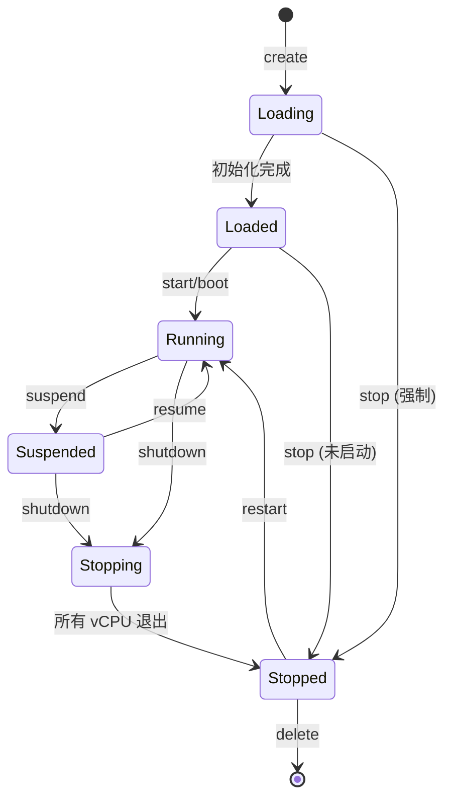

**状态转换规则**：
- **单向转换**：某些状态转换是单向的，如 Stopping → Stopped，无法逆转
- **条件转换**：某些转换需要满足条件，如 Running → Stopped 必须先经过 Stopping 状态
- **命令限制**：某些命令只能在特定状态下执行，如 suspend 只能作用于 Running 状态的 VM

**常见操作路径**：
1. **正常启动**：Loading → Loaded → Running
2. **正常关闭**：Running → Stopping → Stopped → 删除
3. **暂停恢复**：Running ⇄ Suspended（可反复切换）
4. **重启**：Running → Stopping → Stopped → Running

## 命令概览

| 命令 | 功能 | 需要 fs feature |
|------|------|----------------|
| `vm list` | 列出所有 VM | 否 |
| `vm show <id>` | 显示 VM 详情 | 否 |
| `vm create <config>` | 创建 VM | 是 |
| `vm start [id...]` | 启动 VM | 是 |
| `vm stop <id...>` | 停止 VM | 否 |
| `vm suspend <id>` | 暂停 VM | 否 |
| `vm resume <id>` | 恢复 VM | 否 |
| `vm restart <id>` | 重启 VM | 否 |
| `vm delete <id>` | 删除 VM | 否 |

## vm list

列出所有虚拟机的状态。这是最常用的命令之一，用于快速查看系统中所有 VM 的概况，包括它们的运行状态、资源配置和 vCPU 状态统计。

### 用法

```bash
vm list [--format <FORMAT>]
```

### 选项

| 选项 | 说明 | 默认值 |
|------|------|--------|
| `--format, -f` | 输出格式：table 或 json | table |

### 输出示例

命令支持两种输出格式：表格格式适合人类阅读，JSON 格式适合程序解析。

**表格格式**（默认）：

```
VM ID  NAME            STATUS       VCPU            MEMORY     VCPU STATE
------ --------------- ------------ --------------- ---------- --------------------
0      linux-qemu      Running      0               256MB      Run:1
1      linux-rk3588    Suspended    0,1,2,3,4,5,6,7 3GB        Blk:8
2      arceos          Stopped      0,1             8MB        Free:2
```

**JSON 格式**：

```bash
vm list --format json
```

```json
{
  "vms": [
    { "id": 0, "name": "linux-qemu", "state": "Running", "vcpu": 1, "memory": "256MB" }
  ]
}
```

### 处理流程

`vm list` 命令的处理流程展示了典型的查询操作模式，从数据获取到格式化输出。理解这个流程有助于理解其他查询类命令的实现。

**处理步骤解析**：

1. **获取数据源**：
   - 调用 `get_vm_list()` 从全局 VM 列表获取所有 VM 的 Arc 引用
   - 这是一个快照操作，返回的列表不会受到后续 VM 创建/删除的影响
   - 获取的是引用克隆，不会复制 VM 对象本身

2. **空列表处理**：
   - 如果系统中没有任何 VM，显示友好的提示信息而非空输出
   - 这符合用户体验最佳实践，避免用户困惑

3. **格式选择**：
   - 根据 `--format` 选项决定输出格式
   - **table 格式**：适合人类阅读，包含对齐、分隔线等视觉元素
   - **json 格式**：适合程序处理，可以被脚本解析和处理

4. **数据聚合**（仅 table 格式）：
   - 遍历每个 VM 的所有 vCPU
   - 统计各个状态（Running、Blocked、Free）的 vCPU 数量
   - 汇总显示在 "VCPU STATE" 列，如 "Run:2, Blk:1"

**为什么需要状态统计**：

vCPU 状态统计提供了 VM 运行状态的快速概览：
- **Run: N**：有 N 个 vCPU 正在执行 Guest 代码
- **Blk: N**：有 N 个 vCPU 处于阻塞状态（等待中断、暂停等）
- **Free: N**：有 N 个 vCPU 尚未启动

这些信息帮助用户快速判断：
- VM 是否真正在运行（Run > 0）
- VM 是否处于暂停状态（所有 vCPU 都是 Blk）
- VM 是否刚创建未启动（所有 vCPU 都是 Free）

下图展示了 `vm list` 命令的内部处理逻辑，包括如何获取数据、处理空列表情况以及根据格式选项生成不同的输出：

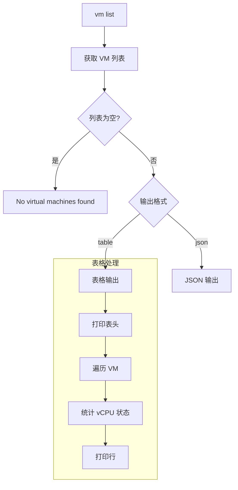

## vm show

显示单个虚拟机的详细信息。该命令提供了多个层次的信息输出，用户可以根据需要选择查看基本信息、配置详情、设备统计或完整的详细信息。

### 用法

```bash
vm show <VM_ID> [OPTIONS]
```

### 选项

| 选项 | 说明 |
|------|------|
| `--full, -f` | 显示完整详情 |
| `--config, -c` | 显示配置信息 |
| `--stats, -s` | 显示设备统计 |

### 详细度层次

`vm show` 命令支持渐进式的信息披露。用户可以从最基本的摘要信息开始，逐步深入到配置参数、设备统计，直到完整的详细信息。这种设计避免了信息过载，同时满足不同场景的需求。

下图展示了各个详细度级别包含的信息类型：

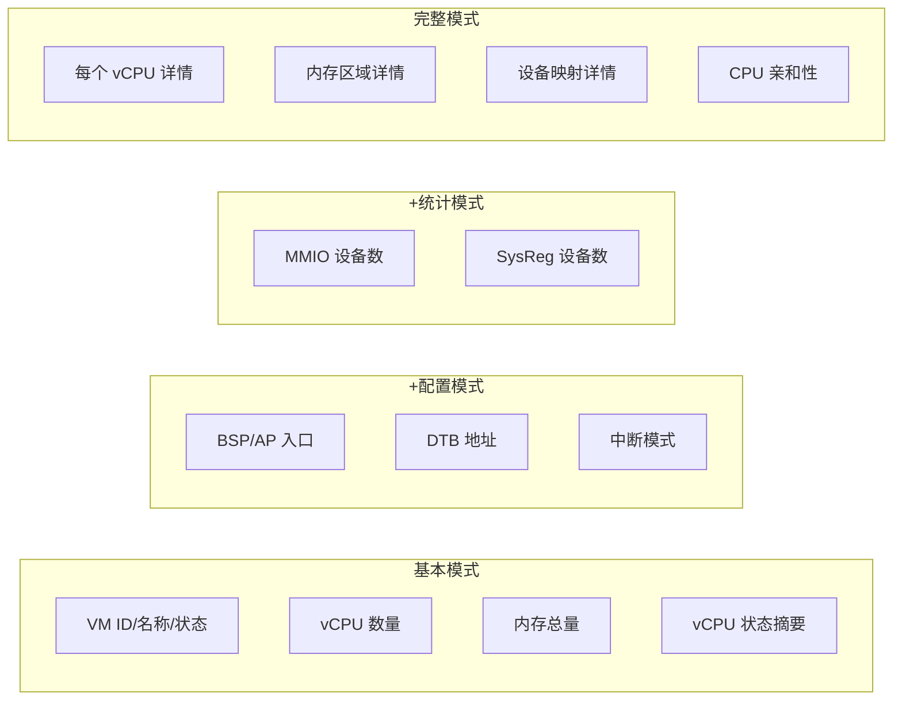

### 输出示例

**基本模式**：

```
VM Details: 0

  VM ID:     0
  Name:      linux-qemu
  Status:    ● Running
  VCPUs:     1
  Memory:    256MB

VCPU Summary:
  Running: 1

Memory Summary:
  Total Regions: 1
  Total Size:    256MB

Use 'vm show 0 --full' for detailed information
```

**状态感知提示**：

根据 VM 状态提供操作建议：

| 状态 | 提示 |
|------|------|
| Suspended | `Use 'vm resume X' to continue.` |
| Stopped | `Use 'vm delete X' to clean up.` |
| Loaded | `Use 'vm start X' to boot.` |

## vm create

从配置文件创建虚拟机。该命令读取 TOML 格式的配置文件，解析并验证配置，然后在系统中创建相应的 VM 实例。支持批量创建多个 VM，每个配置文件对应一个独立的虚拟机。

### 用法

```bash
vm create <CONFIG_FILE> [CONFIG_FILE...]
```

### 创建流程

下图展示了从用户输入命令到 VM 创建完成的完整时序。流程包括文件读取、TOML 解析、配置验证、VM 实例化和注册等步骤：

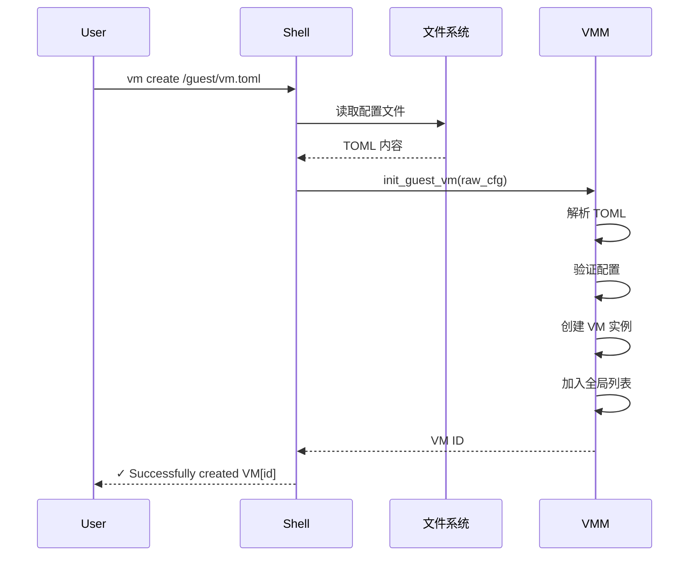

### 批量创建

支持一次创建多个 VM。每个配置文件都会被独立处理，单个配置文件的解析或创建失败不会影响其他 VM 的创建。这对于需要同时部署多个虚拟机的场景非常有用：

```bash
vm create /guest/vm1.toml /guest/vm2.toml /guest/vm3.toml
```

每个配置独立处理，单个失败不影响其他。

## vm start

启动虚拟机。该命令将 VM 从 Loaded 或 Stopped 状态转换到 Running 状态。如果不指定 VM ID，则会尝试启动所有处于可启动状态的虚拟机。支持后台启动模式，避免命令行阻塞。

### 用法

```bash
vm start [VM_ID...] [--detach]
```

### 选项

| 选项 | 说明 |
|------|------|
| `--detach, -d` | 后台运行（不阻塞） |

### 启动流程

下图展示了 VM 启动的决策树和执行流程。系统会检查每个 VM 的状态，跳过已经在运行的 VM，对可启动的 VM 执行完整的启动序列：

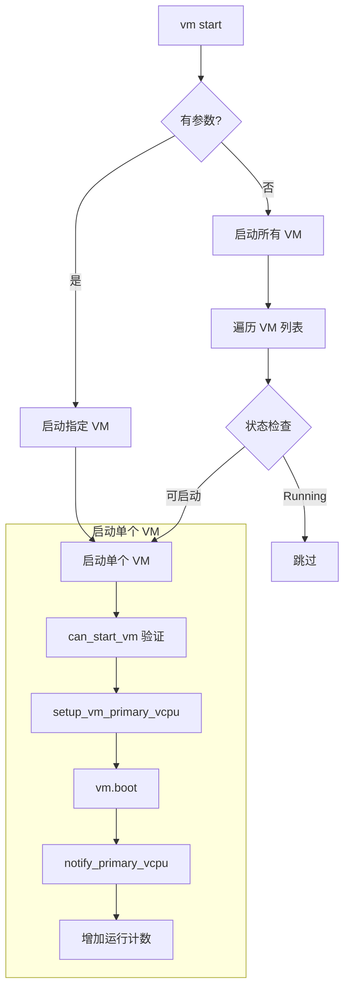

### 状态验证

启动命令只能在特定状态下执行。下图清楚地列出了允许启动和拒绝启动的状态，以及拒绝的原因：

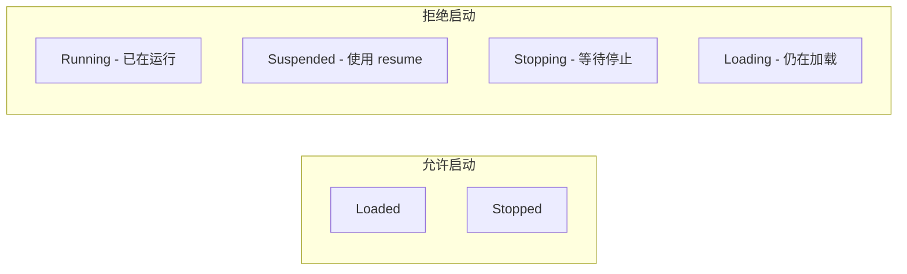

## vm stop

停止虚拟机。该命令会向 VM 发送停止信号，让 vCPU 退出执行循环。支持两种模式：优雅停止（等待 VM 完成清理）和强制停止（立即终止）。可以同时停止多个 VM。

### 用法

```bash
vm stop <VM_ID...> [--force]
```

### 选项

| 选项 | 说明 |
|------|------|
| `--force, -f` | 强制停止（不等待） |

### 停止模式对比

优雅停止和强制停止有本质的区别。优雅停止给予 VM 时间完成清理工作（如同步磁盘、关闭网络连接等），而强制停止会立即终止执行，可能导致数据丢失：

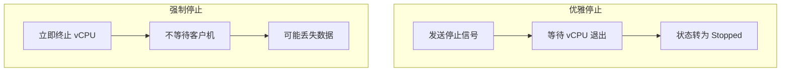

### 停止信号传播

下图展示了停止信号如何从 Shell 命令传播到各个 vCPU。所有 vCPU 会并行检测停止信号并退出，最后一个退出的 vCPU 负责将 VM 状态设置为 Stopped：

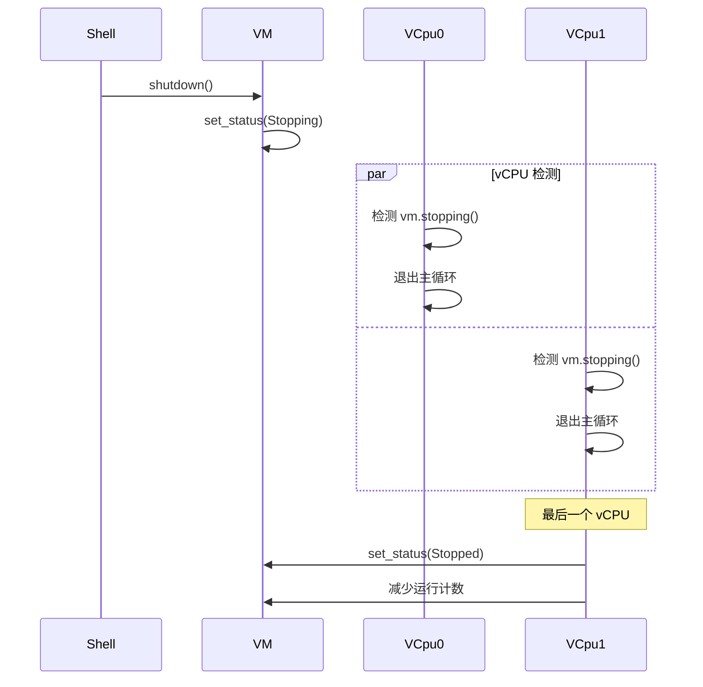

## vm suspend / resume (暂时不完善)

暂停和恢复虚拟机。暂停会让所有 vCPU 进入阻塞状态但保留执行状态，恢复则会唤醒所有 vCPU 继续执行。这对于临时释放 CPU 资源或进行系统维护非常有用。

**注意**：该功能目前并未真正实现，仍在完善中。

### 用法

```bash
vm suspend <VM_ID>
vm resume <VM_ID>
```

### 暂停/恢复流程

暂停和恢复是一对互补的操作。暂停通过状态标志让 vCPU 主动进入等待，恢复则通过通知机制唤醒它们：

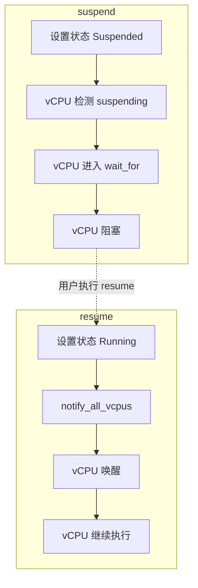

### 暂停等待机制

暂停操作是异步的——`vm suspend` 命令只是设置了 VM 的暂停状态标志，但 vCPU 任务需要一些时间才能检测到这个标志并进入阻塞状态。为了确保暂停真正完成，命令需要等待并验证所有 vCPU 都已停止执行。

**为什么需要等待机制**：

如果不等待验证，可能出现以下问题：
- 用户以为 VM 已暂停，但实际上 vCPU 还在运行
- 在 VM 未完全暂停时执行其他操作（如快照），导致状态不一致
- 无法给用户明确的反馈（操作成功还是失败？）

**轮询等待的实现细节**：

采用轮询方式而非阻塞等待的原因：
1. **超时保护**：避免无限等待，如果 10 秒内未完成则报告超时
2. **状态检查**：每次循环都检查所有 vCPU 状态，提供进度反馈
3. **非阻塞**：允许在等待期间响应其他事件（虽然当前实现是同步的）

**轮询参数的选择**：

- **最多 10 次**：每次 100ms，总计 1 秒超时
  - 1 秒对于暂停操作来说是合理的等待时间
  - 正常情况下，vCPU 应该在几十毫秒内响应
  - 如果超过 1 秒未完成，很可能出现了异常

- **间隔 100ms**：
  - 足够短，用户不会感觉到明显的延迟
  - 足够长，避免过于频繁的轮询消耗 CPU
  - 给 vCPU 任务足够的时间完成状态转换

**状态检查的逻辑**：

每次轮询检查所有 vCPU 的状态：
- 如果**全部**都是 Blocked：暂停成功完成
- 如果**仍有** Running 或其他状态：继续等待
- 如果达到最大次数：报告超时错误

这种"全部完成才算成功"的语义确保了 VM 处于完全一致的暂停状态。

下图展示了暂停命令如何通过轮询机制等待所有 vCPU 进入阻塞状态：

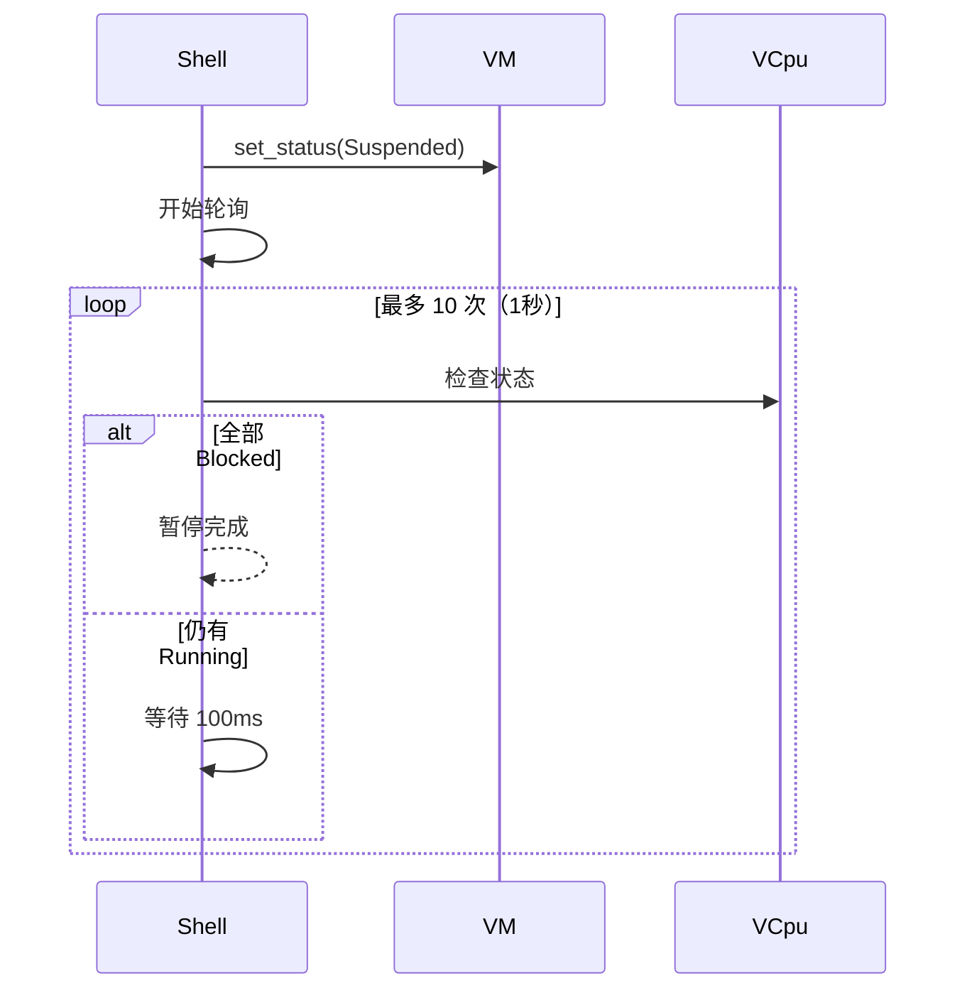

## vm restart

重启虚拟机。

### 用法

```bash
vm restart <VM_ID> [--force]
```

### 重启流程

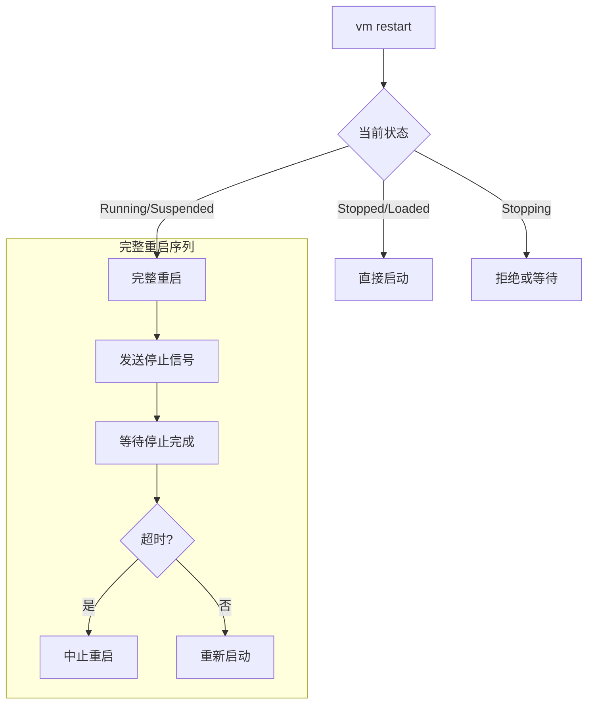

### 同步等待

重启是**同步操作**，必须等待完全停止：

| 阶段 | 最大等待 | 检查间隔 |
|------|---------|---------|
| 停止完成 | 5秒 | 100ms |

## vm delete

删除虚拟机。

### 用法

```bash
vm delete <VM_ID> [--force] [--keep-data]
```

### 选项

| 选项 | 说明 |
|------|------|
| `--force` | 强制删除（即使运行中） |
| `--keep-data` | 保留配置和数据文件 |

### 删除流程

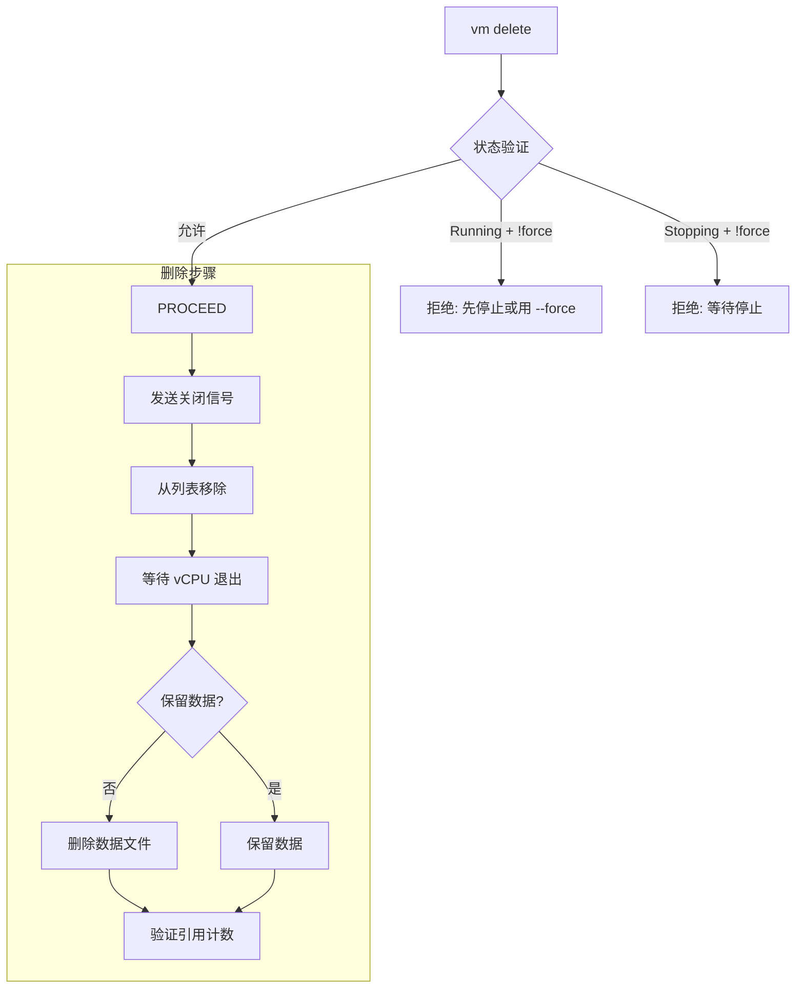

### 资源清理

VM 删除的最后阶段是资源清理，这是确保系统不发生内存泄漏和资源耗尽的关键步骤。这个过程涉及多个组件的协调，必须按正确的顺序执行。

**资源清理的复杂性**：

VM 是一个复杂的对象，包含多种资源：
- **任务资源**：vCPU 任务及其栈空间
- **内存资源**：Guest 物理内存映射
- **设备资源**：模拟设备和直通设备的状态
- **数据结构**：全局列表、等待队列中的条目

这些资源之间存在依赖关系，必须按正确顺序清理以避免 use-after-free 或双重释放。

**清理步骤的顺序**：

1. **从列表移除**：
   - `remove_vm(id)` 从全局列表移除 VM
   - 返回 VM 的 `Arc<VM>` 引用
   - 此时其他线程无法再通过 `get_vm_by_id` 获取这个 VM

2. **等待任务退出**：
   - `cleanup_vm_vcpus(id)` 等待所有 vCPU 任务完全退出
   - 使用 `task.join()` 阻塞等待每个任务
   - 确保任务不再访问 VM 的内存

3. **验证引用计数**：
   - 检查 `Arc::strong_count(vm_ref)`
   - 正常情况下应该是 1（只有当前作用域持有）
   - 如果 > 1，说明存在引用泄漏，记录警告

4. **自动释放**：
   - `vm_ref` 在作用域结束时自动 drop
   - 如果 strong_count 降到 0，VM 对象被析构
   - 析构器会释放所有内部资源

**为什么这个顺序很重要**：

如果颠倒顺序（先 cleanup 再 remove），可能导致：
- **并发访问**：cleanup 期间，其他线程可能通过 `get_vm_by_id` 获取 VM，增加引用计数
- **竞态条件**：vCPU 任务退出前可能检测到 VM 仍在列表中，尝试再次访问
- **不确定性**：无法可靠地验证引用计数，因为存在其他合法的引用路径

**引用计数验证的意义**：

strong_count 检查是一个重要的健康检查：
- **count == 1**：完美，VM 将被正确释放
- **count > 1**：警告，可能的引用泄漏来源：
  - 某个线程仍持有 VM 引用未释放
  - 闭包捕获了 VM 引用
  - 循环引用（虽然我们用 Weak 避免了）

这个检查帮助开发者及早发现内存泄漏问题。

下图展示了资源清理的完整流程，包括各个组件之间的交互和引用计数的变化：

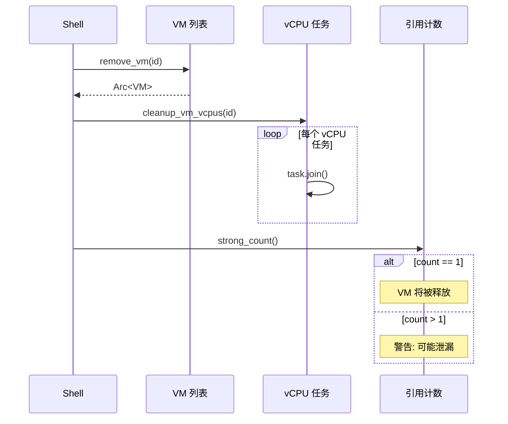

## 命令速查表

```bash
# 查看所有 VM
vm list
vm list --format json

# 查看单个 VM
vm show 0
vm show 0 --full
vm show 0 --config --stats

# 创建 VM
vm create /guest/linux.toml
vm create /guest/vm1.toml /guest/vm2.toml

# 启动 VM
vm start           # 启动所有
vm start 0 1 2     # 启动指定
vm start --detach  # 后台启动

# 停止 VM
vm stop 0
vm stop 0 1 2 --force

# 暂停/恢复 VM
vm suspend 0
vm resume 0

# 重启 VM
vm restart 0
vm restart 0 --force

# 删除 VM
vm delete 0
vm delete 0 --force
vm delete 0 --keep-data
```
