# Shell 框架

AxVisor 提供交互式 Shell 命令系统，用于虚拟机的全生命周期管理。本节介绍 Shell 框架的设计实现。

## 架构概述

Shell 框架采用分层架构设计，从用户输入到底层 VMM 操作共分为五个层次。每一层都有明确的职责，层与层之间通过清晰的接口进行交互，确保系统的可维护性和可扩展性。

下图展示了命令从用户输入到实际执行的完整数据流向。这种分层设计使得系统各部分职责清晰、易于测试和维护：

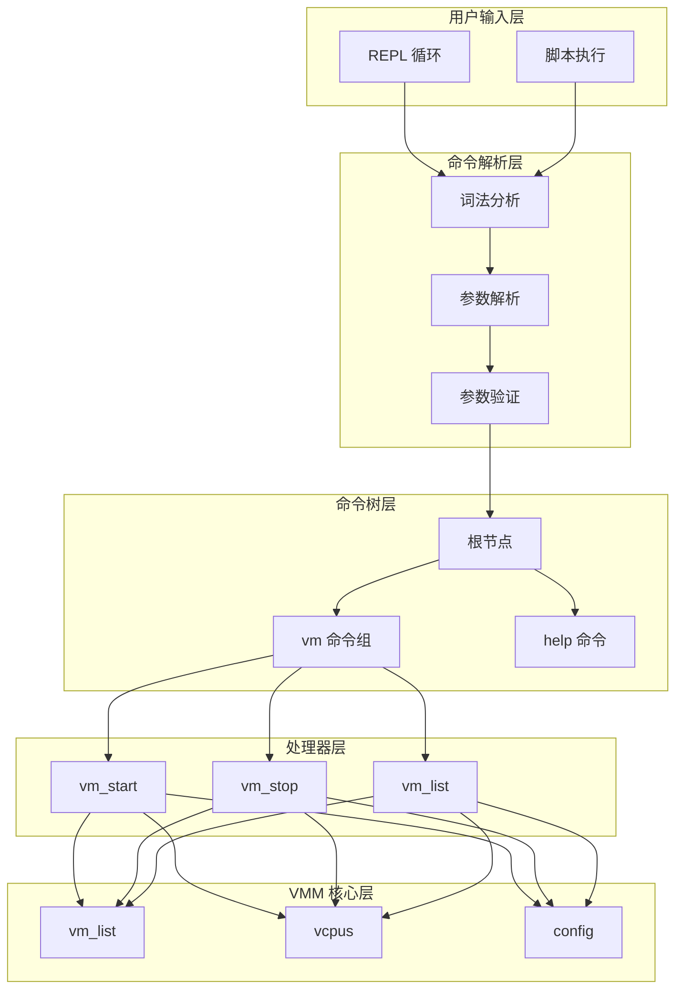

**数据流说明**：
1. **用户输入层** → 命令解析层：用户通过交互式 Shell 或脚本输入命令字符串
2. **命令解析层** → 命令树层：将字符串解析为结构化的命令和参数
3. **命令树层** → 处理器层：根据命令路径找到对应的处理函数
4. **处理器层** → VMM 核心层：调用底层 VMM 模块执行实际操作
5. 结果沿相反方向返回，最终显示给用户

各层说明：

1. **用户输入层**：接收用户的交互式输入（REPL）或批量脚本执行请求
2. **命令解析层**：负责词法分析、参数解析和验证，将原始字符串转换为结构化命令
3. **命令树层**：组织命令的层次结构，实现命令的路由和分发
4. **处理器层**：各个命令的具体实现逻辑，处理业务请求
5. **VMM 核心层**：底层虚拟机管理功能，提供 VM 列表管理、vCPU 控制和配置管理等核心能力

## 设计原则

### 命令树架构

采用树状结构组织命令，支持子命令嵌套。这种设计具有以下优点：

- **层次清晰**：命令按功能域分组（如 `vm`、`vcpu`），便于用户理解和记忆
- **易于扩展**：添加新命令只需在相应节点挂载子节点，不影响其他部分
- **命名空间隔离**：不同命令组可以有同名的子命令（如 `vm list` 和 `vcpu list`）
- **自动帮助生成**：基于树结构自动生成帮助信息

下图展示了当前实现的命令树结构。树的根节点包含顶级命令和命令组，每个命令组下又可以有多个子命令，形成清晰的层次结构：

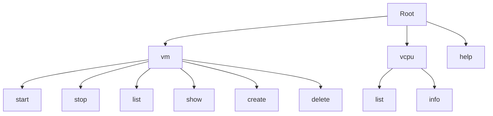

**命令树遍历示例**：
- 用户输入 `vm start 0`：从 Root → vm → start，剩余参数 `[0]`
- 用户输入 `help`：直接从 Root → help，无剩余参数
- 用户输入 `vcpu list`：从 Root → vcpu → list，无剩余参数

### 构建器模式

命令注册采用构建器模式，提供流畅的链式 API。这种设计模式让命令定义代码简洁易读，同时保证了配置的完整性和正确性。

构建器模式的优势：
- **可读性强**：代码自文档化，命令的配置一目了然
- **类型安全**：编译期检查，避免运行时错误
- **灵活性高**：可选配置项按需添加，不影响默认行为
- **易于维护**：修改命令配置只需调整链式调用

下图展示了使用构建器模式注册命令的完整流程。每个方法调用都返回 `self`，允许方法链式调用，最终构建出完整的命令节点：

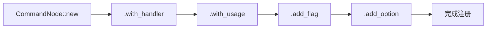

**构建流程说明**：
1. **new(description)**：创建命令节点，设置描述信息
2. **with_handler(fn)**：设置命令处理函数（可选，命令组可以没有处理函数）
3. **with_usage(str)**：设置使用说明字符串
4. **add_flag(def)**：添加布尔标志参数（如 `--force`）
5. **add_option(def)**：添加键值对选项（如 `--format json`）
6. 每个方法返回 `self`，实现链式调用

## 命令解析流程

Shell 框架将用户输入的字符串转换为可执行命令需要经过多个阶段的处理。每个阶段都有特定的职责，确保命令的正确性和安全性。

### 完整流程

下图展示了从用户输入到命令执行的完整时序流程，以命令 `"vm start 0 1 --detach"` 为例。整个流程分为词法分析、命令树查找、参数解析、参数验证和命令执行五个阶段：

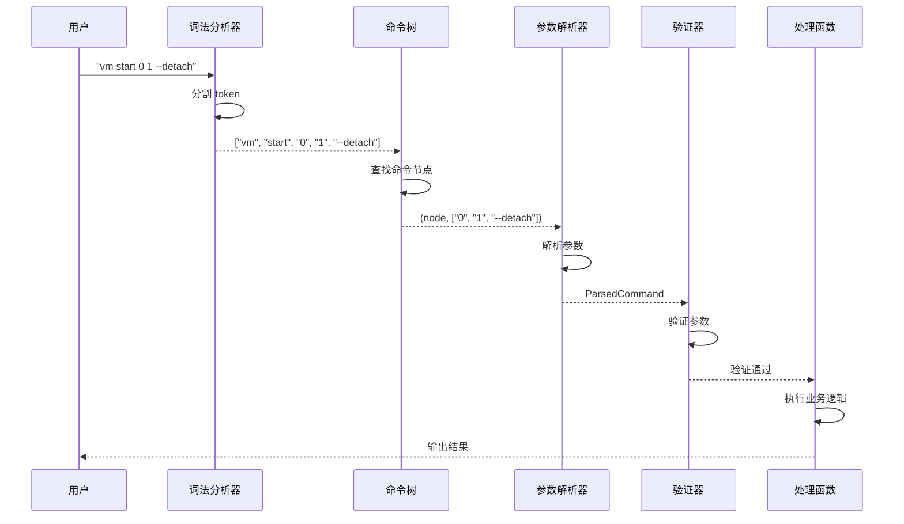

**各阶段职责**：
1. **词法分析**：将输入字符串按空格和引号规则分割成 token 数组
2. **命令树查找**：根据 token 在命令树中逐层查找，找到匹配的命令节点
3. **参数解析**：将剩余的 token 解析为位置参数、选项和标志
4. **参数验证**：检查必需参数是否提供，参数类型是否正确
5. **命令执行**：调用命令的处理函数，执行实际业务逻辑

**错误处理**：任何阶段出现错误都会中断流程，向用户显示错误信息，不会执行后续步骤。

### 词法分析

词法分析器（Tokenizer）负责将输入字符串按照 Shell 语法规则分割为 token 列表。这是命令解析的第一步，为后续处理提供结构化的输入。

分析器需要处理多种语法情况：
- **空白符分隔**：普通参数通过空格、制表符等分隔
- **引号处理**：支持单引号和双引号包围的字符串，允许参数中包含空格
- **转义字符**：支持反斜杠转义，可以在字符串中包含特殊字符

下图展示了一个包含引号的复杂命令的分割过程。词法分析器识别出引号包围的部分作为一个完整的 token，即使其中包含空格：

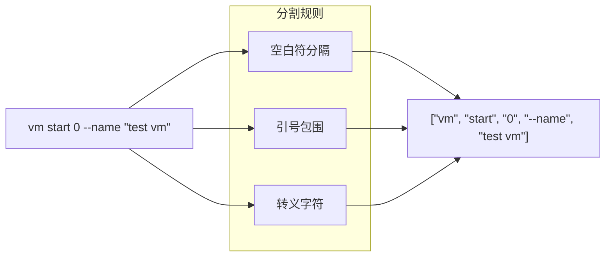

**分割规则应用示例**：
- **空白符分隔**：`vm start 0` → `["vm", "start", "0"]`
- **引号包围**：`--name "my vm"` → `["--name", "my vm"]`（注意 "my vm" 是一个 token）
- **转义字符**：`echo \"test\"` → `["echo", "\"test\""]`

**特殊情况处理**：
- 连续的空白符被视为单个分隔符
- 引号必须成对出现，否则报错
- 引号内的空白符被保留
- 反斜杠转义下一个字符

### 命令查找

命令树遍历器根据 token 列表在命令树中逐层查找匹配的节点。这个过程类似于在文件系统中根据路径查找文件。

查找过程：
1. 从根节点开始
2. 使用第一个 token 在当前节点的子命令中查找
3. 如果找到匹配的子节点，移动到该节点并继续用下一个 token 查找
4. 如果找不到匹配或节点是叶子命令，停止查找
5. 将剩余的 token 作为命令参数

下图展示了命令 `vm start 0 1` 的查找过程。系统从根节点开始，依次匹配 "vm" 和 "start"，最终到达 start 命令节点，剩余的 "0" 和 "1" 作为参数：

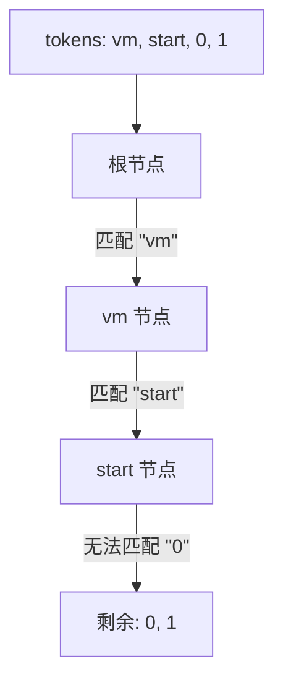

**查找逻辑详解**：
- **匹配成功**：当前 token 在子命令映射表中找到对应键，移动到该子节点
- **匹配失败**：当前节点没有该子命令，或者节点有处理函数（叶子命令），停止查找
- **剩余参数**：未消耗的 token 传递给命令处理函数作为参数

**错误情况处理**：
- 如果中途匹配失败且当前节点没有处理函数，返回"命令不存在"错误
- 如果匹配到叶子命令但还有剩余 token，这些 token 会被解析为参数

### 参数解析

参数解析器将剩余的 token 列表解析为结构化的参数数据。它需要识别三种类型的参数：位置参数、选项（带值）和标志（布尔型）。

解析规则：
- 以 `--` 或 `-` 开头的是选项或标志
- 选项后面跟随的 token 是其值（除非使用 `--key=value` 格式）
- 标志不需要值，解析为布尔 `true`
- 不以 `-` 开头的是位置参数，按顺序排列

下图展示了一个混合参数的解析结果。解析器将输入的 token 列表分类为三种不同类型的参数：

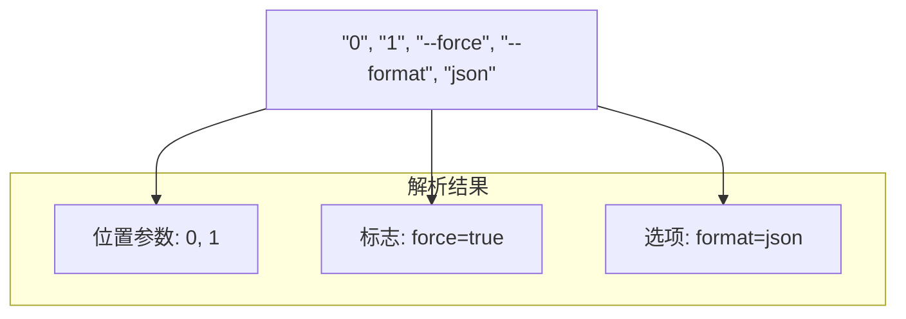

**解析示例详解**：
- **位置参数**："0" 和 "1" 不以 `-` 开头，按出现顺序存储
- **标志**："--force" 是以 `--` 开头但后面不跟值的参数，解析为 `force: true`
- **选项**："--format" 后跟 "json"，解析为键值对 `format: "json"`

**参数类型表**：

| 类型 | 语法 | 示例 | 解析结果 |
|------|------|------|---------|
| 位置参数 | 无前缀 | `0 1` | `positional_args: ["0", "1"]` |
| 长选项 | `--key value` | `--format json` | `options: {format: "json"}` |
| 长选项(等号) | `--key=value` | `--format=json` | `options: {format: "json"}` |
| 短选项 | `-k value` | `-f json` | `options: {f: "json"}` |
| 长标志 | `--flag` | `--force` | `flags: {force: true}` |
| 短标志 | `-f` | `-f` | `flags: {f: true}` |

## 核心数据结构

Shell 框架的实现依赖于几个核心数据结构，它们共同构成了命令系统的骨架。

### CommandNode

CommandNode 是命令树的基本单元，每个节点代表一个命令或命令组。它是整个 Shell 框架的核心数据结构，设计上需要同时支持命令分组、参数定义和执行逻辑。

为了用一个统一的结构支持所有这些情况，CommandNode 使用了灵活的设计：通过 `Option<handler>` 和 `BTreeMap<subcommands>` 的组合，可以表示任意命令树节点。

下图展示了 CommandNode 的完整结构和提供的构建器方法：

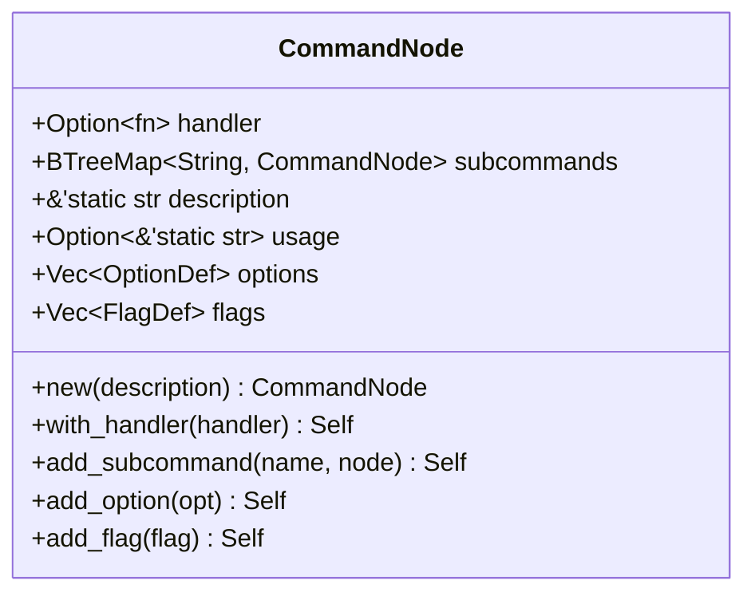

节点类型说明：

- **命令组**：`handler = None`，有子命令。如 `vm` 节点，本身不执行操作，仅作为子命令的容器
- **叶子命令**：`handler = Some`，可执行。如 `vm start` 节点，包含实际的业务逻辑处理函数
- **混合节点**：既有处理函数又有子命令。可以直接执行，也可以访问子命令，提供默认行为

关键字段：
- `handler`：命令处理函数，接收 ParsedCommand 并返回执行结果
- `subcommands`：子命令映射表，使用 BTreeMap 保证命令按字母序排列
- `description`：命令的简短描述，用于生成帮助信息
- `usage`：使用示例，显示命令的完整语法
- `options`：命令支持的选项定义列表
- `flags`：命令支持的标志定义列表

### ParsedCommand

ParsedCommand 表示解析完成的命令，包含了命令路径和所有参数信息。它是连接命令解析和命令执行的桥梁，作为命令处理函数的输入参数。

**为什么需要 ParsedCommand**：

ParsedCommand 通过将不同类型的参数分别存储，提供了类型安全和便捷的访问接口。

**三种参数类型**：

1. **位置参数（positional_args）**：
   - 不以 `-` 或 `--` 开头的参数
   - 按出现顺序存储在 Vec 中
   - 通过索引访问，如 `get_arg(0)` 获取第一个位置参数
   - 示例：`vm start 0 1` 中的 `0` 和 `1`

2. **选项（options）**：
   - 形如 `--key value` 或 `-k value` 的参数对
   - 存储在 BTreeMap 中，键是选项名，值是选项值
   - 通过名称访问，如 `get_option("format")` 获取 format 选项的值
   - 示例：`vm list --format json` 中的 `format: "json"`

3. **标志（flags）**：
   - 形如 `--flag` 或 `-f` 的布尔开关
   - 存储在 BTreeMap 中，键是标志名，值是 true/false
   - 通过名称检查，如 `has_flag("force")` 检查是否设置了 force 标志
   - 示例：`vm stop --force` 中的 `force: true`

**命令路径的作用**：

`command_path` 字段记录了从根节点到当前命令的完整路径，如 `["vm", "start"]`。这个信息有多个用途：
- **错误报告**：在错误信息中显示完整的命令路径
- **命令识别**：处理函数可以知道自己是通过哪个路径被调用的
- **日志记录**：记录用户执行的具体命令
- **调试支持**：便于追踪命令的执行流程

**便捷方法的设计**：

ParsedCommand 提供了一组便捷方法来简化参数访问：
- `get_arg(index)` 返回 `Option<String>`，安全地处理索引越界
- `get_option(name)` 返回 `Option<String>`，安全地处理选项不存在
- `has_flag(name)` 返回 `bool`，检查标志是否设置
- `arg_count()` 返回位置参数数量，便于参数数量验证

这些方法使用 Rust 的 Option 类型，强制调用者处理参数可能不存在的情况，避免了运行时错误。

下图展示了 ParsedCommand 的结构和提供的访问方法：

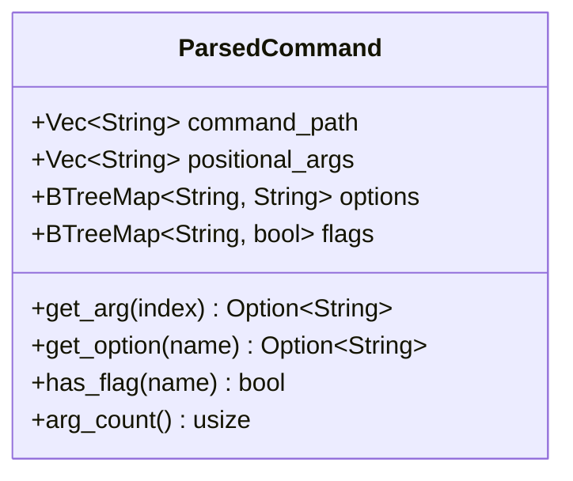

字段说明：
- `command_path`：从根到当前命令的完整路径，如 `["vm", "start"]`
- `positional_args`：位置参数列表，按出现顺序保存
- `options`：选项键值对，使用字符串映射表存储
- `flags`：标志状态，使用布尔映射表存储

提供的便捷方法：
- `get_arg(index)`：按索引获取位置参数
- `get_option(name)`：获取指定选项的值
- `has_flag(name)`：检查标志是否设置
- `arg_count()`：获取位置参数数量

### OptionDef 和 FlagDef

选项和标志的元数据定义，用于参数验证和帮助信息生成。这两个结构体定义了命令接受的参数规范，是命令接口的重要组成部分。

OptionDef 和 FlagDef 通过显式声明参数规范，解决了这些问题。

**OptionDef 的设计**：

OptionDef 定义了一个键值对类型的选项，如 `--format json`。关键字段：

- **name**：选项的规范名称，用于内部访问和错误信息
- **short**：可选的短形式，通常是单个字符，如 `-f`
- **long**：可选的长形式，如 `--format`
- **description**：选项的作用说明，显示在帮助信息中
- **required**：是否为必需选项，如果设为 true，命令必须提供此选项

**FlagDef 的设计**：

FlagDef 定义了一个布尔型标志，如 `--force`。它与 OptionDef 的主要区别是：
- 标志不需要值，出现即为 true，不出现为 false
- 标志有 required 字段，因为"必需的布尔标志"在语义上是矛盾的
- 通常用于开关功能，如 `--verbose`、`--quiet`、`--force` 等

**使用示例对比**：

```rust
// 定义一个必需的选项
OptionDef {
    name: "format",
    short: Some('f'),
    long: Some("format"),
    description: "Output format (table or json)",
    required: true,  // 用户必须指定格式
}

// 定义一个可选的标志
FlagDef {
    name: "force",
    short: Some('f'),
    long: Some("force"),
    description: "Force operation without confirmation",
    // 标志没有 required 字段，默认为可选
}
```

**参数验证流程**：

定义参数后，解析器会自动执行验证：
1. 检查所有 `required: true` 的选项是否都已提供
2. 验证选项名称是否在定义列表中（拒绝未知选项）
3. 检查短形式和长形式的冲突
4. 生成友好的错误信息（如 "Missing required option: --format"）

**自动帮助生成**：

基于这些定义，系统可以自动生成帮助信息：
```
Options:
  -f, --format <VALUE>    Output format (table or json) [required]

Flags:
  -f, --force             Force operation without confirmation
```

下图展示了这两个定义结构的完整字段：

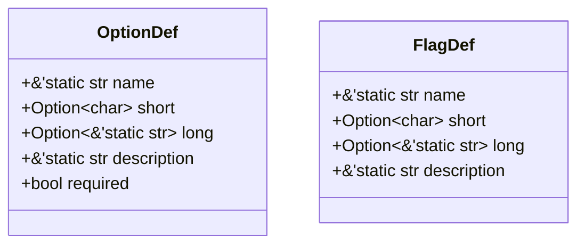

## 命令注册示例

通过具体示例来展示命令是如何在系统中注册和组织的。我们以 `vm` 命令组为例，它是 AxVisor Shell 中最重要和最复杂的命令组，包含了虚拟机管理的所有子命令。

### VM 命令组

VM 命令组是一个典型的分层命令结构，展示了如何组织相关功能到一个命令命名空间下。这个命令组包含了 VM 生命周期管理的所有操作，从创建到删除的完整流程。

下图展示了 VM 命令组的完整树状结构和每个子命令的参数配置：

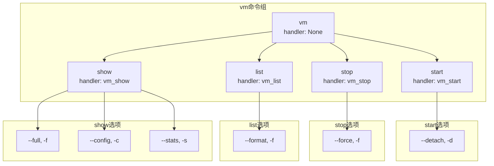

### 注册流程

命令注册是在系统初始化时完成的，采用构建器模式逐步构建命令树。这个流程展示了如何从零开始创建一个完整的命令结构，包括命令组和叶子命令。

**注册时机**：

命令注册发生在 VMM 启动的早期阶段，具体在 Shell 初始化时：
1. 创建根命令节点
2. 为每个功能域创建命令组（如 vm、vcpu）
3. 为每个命令组添加子命令
4. 设置每个命令的参数定义
5. 注册到全局命令树

**注册流程的关键步骤**：

1. **创建命令组节点**：
   ```rust
   let vm_node = CommandNode::new("VM management")
       .with_usage("vm <COMMAND>");
   ```
   注意命令组没有 handler，因此不调用 `with_handler()`

2. **创建叶子命令节点**：
   ```rust
   let start_cmd = CommandNode::new("Start VMs")
       .with_handler(vm_start)  // 设置处理函数
       .add_flag(FlagDef::new("detach", ...));
   ```
   叶子命令必须有 handler，并可以添加参数定义

3. **组装命令树**：
   ```rust
   vm_node.add_subcommand("start", start_cmd);
   vm_node.add_subcommand("stop", stop_cmd);
   // ... 添加其他子命令
   ```
   将子命令挂载到命令组下

4. **注册到根节点**：
   ```rust
   root.add_subcommand("vm", vm_node);
   ```
   将整个命令组挂载到根节点

**参数定义的注册**：

每个命令的参数定义也是通过构建器添加的：
```rust
start_cmd
    .add_flag(FlagDef {
        name: "detach",
        short: Some('d'),
        long: Some("detach"),
        description: "Run in background",
    })
    .add_option(OptionDef {
        name: "timeout",
        short: Some('t'),
        long: Some("timeout"),
        description: "Startup timeout in seconds",
        required: false,
    });
```

**错误处理**：

注册过程中可能的错误情况：
- 重复的命令名：同一层级不能有两个同名命令
- 参数冲突：短选项或长选项与现有参数冲突
- 缺少必需字段：CommandNode 必须至少有 description

这些错误通常在编译期或初始化期检测，避免运行时问题。

下图展示了一个完整的命令注册流程，从创建节点到最终挂载到命令树：

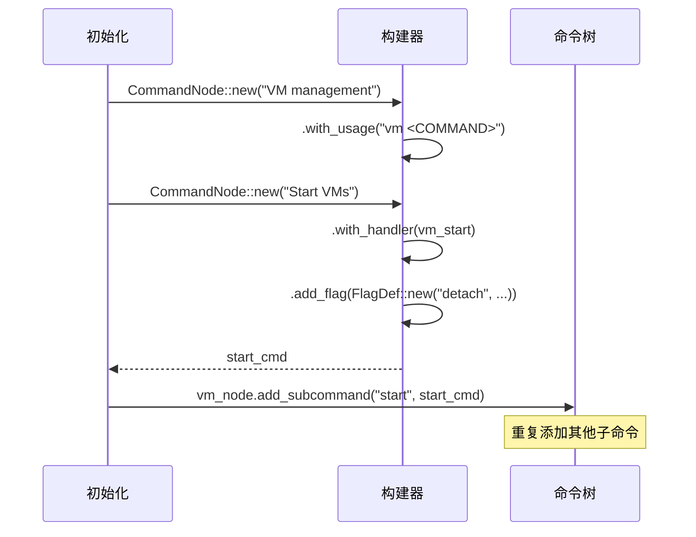

## Shell 主循环

### REPL 流程

REPL（Read-Eval-Print Loop）是交互式 Shell 的核心，它提供了用户友好的交互体验。

**为什么称为 REPL？**

- **Read**（读取）：从用户读取一行输入
- **Eval**（评估）：解析并执行命令
- **Print**（打印）：显示执行结果
- **Loop**（循环）：重复上述过程

下图展示了 REPL 的核心循环逻辑。系统不断循环读取用户输入、执行命令，直到用户输入 exit 命令退出：

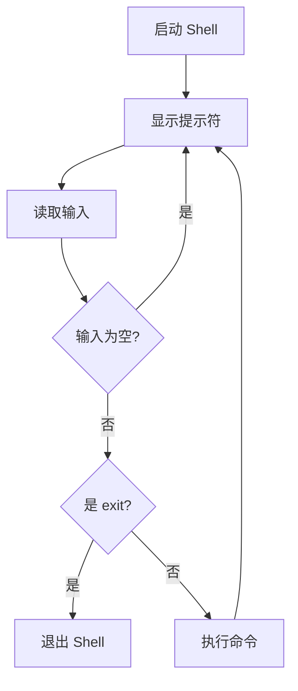

**REPL 循环详解**：
1. **显示提示符**：向用户显示命令提示符（如 `axvisor> `），表示等待输入
2. **读取输入**：阻塞等待用户输入一行命令
3. **空行处理**：如果用户直接按回车，返回显示提示符，不执行任何操作
4. **exit 检测**：检查是否是退出命令，如果是则退出 Shell
5. **命令执行**：调用命令解析和执行流程，完成后返回显示提示符
6. **循环继续**：回到步骤 1，等待下一条命令

### 错误处理

Shell 框架实现了完善的错误处理机制，确保各类错误都能被妥善处理并向用户提供清晰的反馈。

**错误类型和处理策略**：

| 错误类型 | 处理方式 | 用户体验 | 系统状态 |
|---------|---------|---------|---------|
| 命令不存在 | 显示建议 | "Did you mean...?" | 不变 |
| 参数错误 | 显示用法 | "Usage: vm start [ID...]" | 不变 |
| 执行失败 | 显示错误 | "Error: VM not found" | 可能改变 |
| 系统错误 | 记录日志 | "Internal error (see log)" | 不确定 |

下图展示了命令执行过程中的错误处理决策树。每种错误都有相应的处理路径，最终都会返回到 REPL 循环继续等待用户输入：

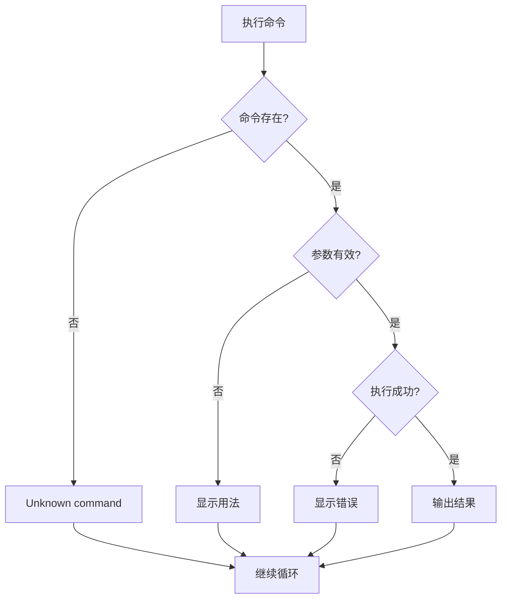

**错误处理原则**：
1. **不崩溃**：任何错误都不应导致 Shell 退出，除非是致命的系统错误
2. **清晰反馈**：向用户提供明确的错误信息和解决建议
3. **保持状态**：命令错误不影响已存在的 VM 和系统状态
4. **易于调试**：重要错误记录到日志，便于问题排查

**各阶段错误处理**：
- **命令解析阶段**：语法错误、未知命令，显示帮助信息
- **参数验证阶段**：参数缺失、类型错误，显示命令用法
- **执行阶段**：业务逻辑错误，显示具体错误原因
- **系统错误**：内部错误，记录详细日志供开发者分析
