# VCpu 任务管理

本节介绍 AxVisor 如何管理 vCPU 任务，包括任务创建、调度、生命周期管理，以及与其他模块的协作关系。

## 模块交互关系

vCPU 任务管理涉及多个模块的协作。下图展示了 vCPU 任务管理的分层架构，从上层的 Shell 命令到底层的架构特定实现，每一层都有明确的职责分工：

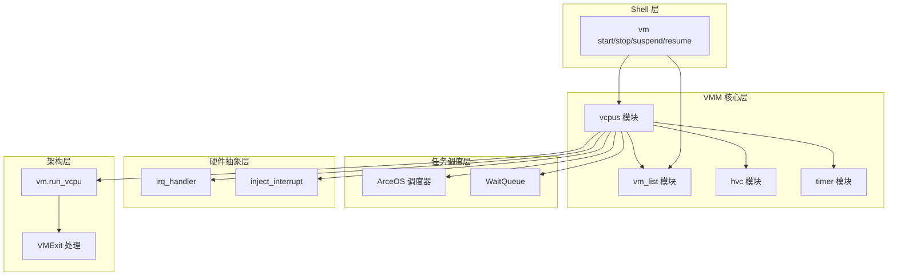

从图中可以看出，vcpus 模块处于核心位置，负责协调各层之间的交互。Shell 层的命令通过 vcpus 模块转化为具体的任务操作，vcpus 模块再调用调度器、等待队列、硬件抽象层等下层模块来实现 vCPU 的生命周期管理。

### 模块职责

| 模块 | 职责 | 与 vcpus 的交互 |
|------|------|----------------|
| vm_list | VM 实例管理 | 提供 VM 引用，vcpus 持有 Weak 引用避免循环 |
| hvc | Hypercall 处理 | vcpus 分发 Hypercall，hvc 执行并返回结果 |
| timer | 定时器事件 | 外部中断后检查定时器事件 |
| ArceOS 调度器 | 任务调度 | vcpus 创建任务，调度器管理执行 |
| WaitQueue | 等待/唤醒 | vcpus 使用等待队列实现 vCPU 阻塞 |

## 数据结构

### VMVCpus 结构

每个 VM 有一个 VMVCpus 管理其所有 vCPU：

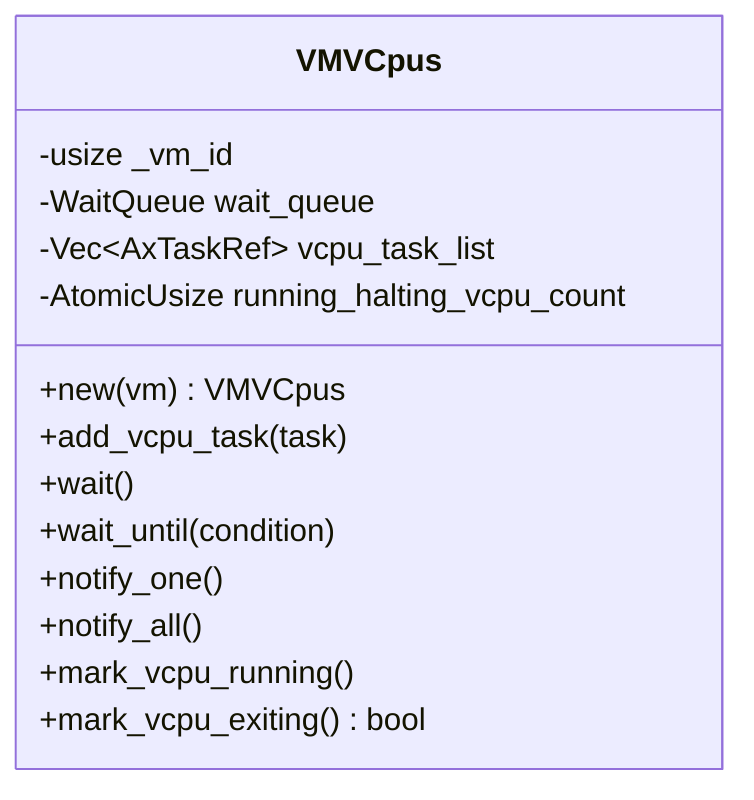

字段说明：
- `wait_queue`: 用于 vCPU 等待（Halt、暂停、等待启动）
- `vcpu_task_list`: 该 VM 的所有 vCPU 任务引用
- `running_halting_vcpu_count`: 跟踪活跃 vCPU 数，用于判断 VM 是否完全停止

### 全局等待队列

全局等待队列使用 `UnsafeCell` 包装的 `BTreeMap` 实现，为每个 VM 维护一个独立的等待队列。这种设计允许细粒度的 vCPU 唤醒控制，不同 VM 的 vCPU 可以独立地等待和唤醒，互不干扰。

下图展示了全局等待队列的数据结构和操作接口。`UnsafeCell` 提供了内部可变性，但需要调用者自己保证线程安全（通常通过禁用中断或使用锁来实现）：

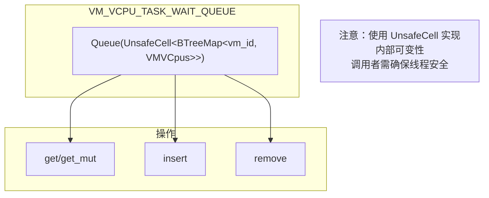

### TaskExt 扩展

每个 vCPU 任务携带扩展数据，这是 AxVisor 在通用任务系统之上添加虚拟化特定信息的机制。TaskExt 作为任务的附加数据，存储了 vCPU 任务运行时必需的上下文信息。

**TaskExt 的设计目的**：

ArceOS 的任务系统是通用的，它不知道什么是虚拟机或 vCPU。但 vCPU 任务在执行过程中需要频繁访问它所属的 VM 和 vCPU 对象。如果没有 TaskExt，每次需要这些信息时都要通过全局查找，既低效又容易出错。

TaskExt 解决了以下问题：
- **快速访问**：任务可以通过 `current_task().task_ext()` 直接获取所属的 VM 和 vCPU 引用
- **类型安全**：编译期保证只有 vCPU 任务才有这些扩展数据
- **生命周期管理**：通过 `Weak<VM>` 和 `Arc<VCpu>` 正确管理对象生命周期

**为什么 VM 使用 Weak 而 vCPU 使用 Arc**：

这是一个精心设计的决策，背后有深刻的内存管理考量：

1. **VM 使用 Weak<VM> 的原因**：
   - 避免循环引用：VM 拥有 vCPU 任务 → 任务持有 TaskExt → TaskExt 引用 VM
   - 如果使用 `Arc<VM>`，形成循环，VM 永远无法释放
   - 使用 `Weak<VM>` 不增加强引用计数，允许 VM 在不再需要时被删除
   - 每次访问前需要 `upgrade()` 检查，这反而提供了额外的安全性：如果 VM 已删除，任务会自动退出

2. **vCPU 使用 Arc<VCpu> 的原因**：
   - vCPU 对象比较小（主要是寄存器状态），不会造成显著的内存占用
   - vCPU 任务需要频繁访问 vCPU 对象，每次都 `upgrade()` 会有性能开销
   - vCPU 的生命周期与任务绑定：任务存在 → vCPU 存在，任务退出 → vCPU 可释放
   - 不会形成循环引用，因为 vCPU 不持有任务的引用

**访问模式示例**：

```rust
// 在 vCPU 任务内部
let task_ext = current_task().task_ext();

// 访问 VM（需要 upgrade）
if let Some(vm) = task_ext.vm() {  // vm() 内部调用 weak.upgrade()
    // VM 仍存在，可以安全使用
    vm.handle_exit();
} else {
    // VM 已被删除，退出任务
    return;
}

// 访问 vCPU（直接获取）
let vcpu = &task_ext.vcpu;  // 直接访问，无需检查
vcpu.get_regs();
```

下图展示了 TaskExt 的数据结构及其与 VM 和 vCPU 的引用关系：

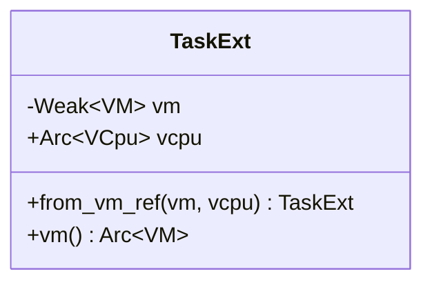

使用 `Weak<VM>` 的原因：避免 VM → vCPU 任务 → VM 的循环引用导致内存泄漏。

## vCPU 任务生命周期

### 完整生命周期

vCPU 任务从创建到退出经历多个状态转换。下图展示了一个 vCPU 任务的完整生命周期，包括所有可能的状态和触发状态转换的条件。理解这个状态机对于调试 vCPU 相关问题至关重要：

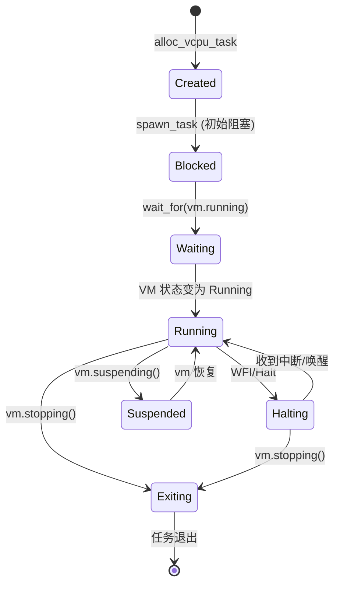

关键状态说明：
- **Created**：vCPU 任务已分配但未加入调度器
- **Blocked**：任务已加入调度器但处于阻塞状态，等待 VM 启动
- **Waiting**：等待 VM 进入 Running 状态
- **Running**：vCPU 正常运行，执行 Guest 代码
- **Halting**：vCPU 执行了 WFI（Wait For Interrupt）指令，暂时休眠等待中断
- **Suspended**：VM 被暂停，vCPU 阻塞但保持状态
- **Exiting**：VM 正在关闭，vCPU 准备退出

### 主 vCPU 初始化流程

主 vCPU（Primary vCPU，通常是 vCPU 0）是VM启动时第一个创建和运行的虚拟处理器，负责引导 Guest 操作系统。下图展示了主 vCPU 从创建到启动的完整时序，包括任务分配、调度器注册、等待队列设置等关键步骤：

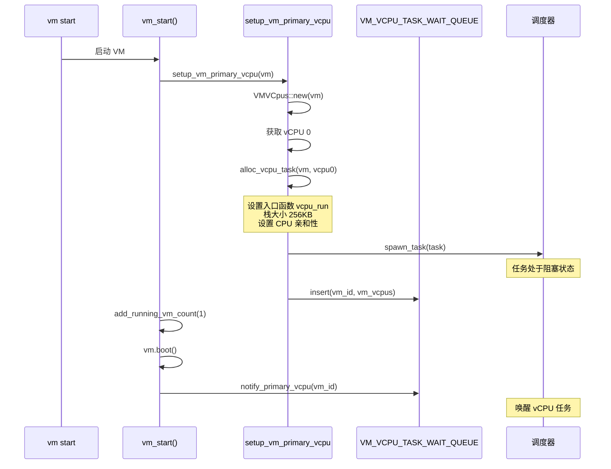

流程关键点：
1. **任务创建**：`alloc_vcpu_task` 创建 vCPU 任务，设置入口函数为 `vcpu_run`，分配 256KB 栈空间
2. **初始阻塞**：任务加入调度器时处于阻塞状态，不会立即运行
3. **注册等待队列**：将 VMVCpus 注册到全局等待队列，使其可以被唤醒
4. **启动 VM**：调用 `vm.boot()` 设置 VM 状态为 Running
5. **唤醒 vCPU**：通过 `notify_primary_vcpu` 唤醒主 vCPU，开始执行 Guest 代码

### 辅助 vCPU 启动流程

辅助 vCPU（Secondary vCPU）不在 VM 启动时创建，而是由 Guest 操作系统通过 PSCI（Power State Coordination Interface）标准接口动态启动。这种按需启动的方式可以节省资源，也更符合真实硬件的行为。

下图展示了 Guest 内核启动额外 CPU 核心时的完整交互流程，包括 PSCI 调用、MPIDR 映射查找、vCPU 状态检查和任务创建：

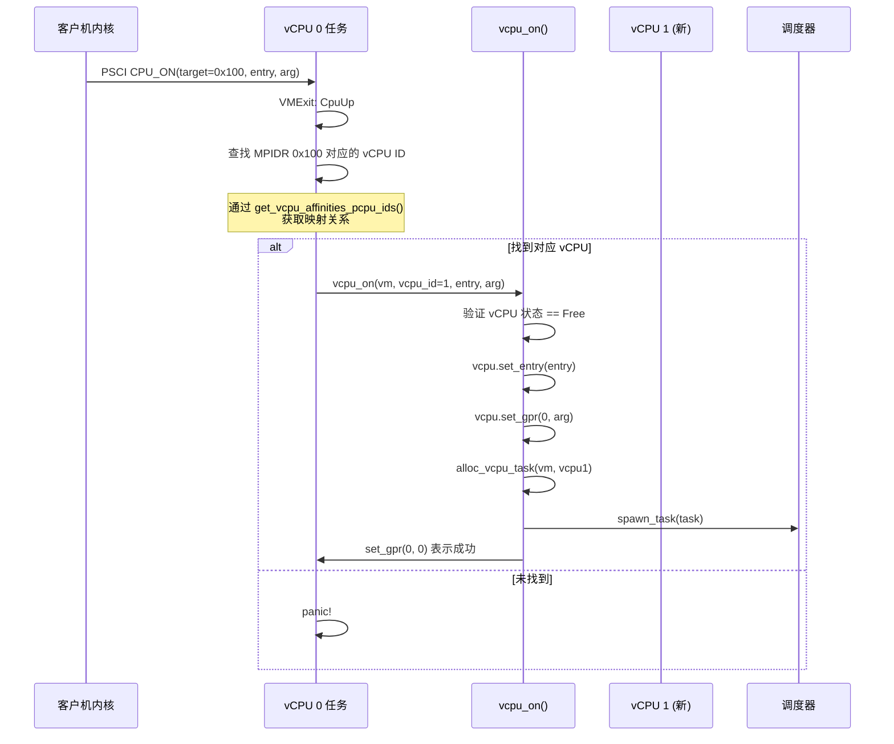

流程详解：
1. **PSCI 调用**：Guest 内核执行 PSCI CPU_ON hypercall，传入目标 CPU 的 MPIDR（Multiprocessor Affinity Register）、入口地址和参数
2. **MPIDR 映射**：系统需要将 Guest 的 MPIDR 值映射到实际的 vCPU ID，这个映射在配置文件中定义
3. **状态验证**：检查目标 vCPU 当前状态是否为 Free（未使用），避免重复启动
4. **vCPU 配置**：设置 vCPU 的入口点和初始寄存器值，这些值由 Guest 内核提供
5. **任务创建**：分配并启动新的 vCPU 任务，该任务立即开始执行 Guest 代码
6. **返回结果**：设置返回值 0 表示成功，Guest 内核据此判断 CPU 是否成功启动

### CPU 亲和性设置

vCPU 可以绑定到特定物理 CPU，这种绑定称为 CPU 亲和性（CPU Affinity）。下图展示了 CPU 亲和性的配置来源、设置流程和最终效果。通过在配置文件中指定 `phys_cpu_ids`，可以实现 vCPU 与物理 CPU 的精确绑定，这对于性能调优和资源隔离非常有用：

```mermaid
flowchart TB
    subgraph 配置来源
        TOML["TOML: phys_cpu_ids = [0x0, 0x100]"]
    end

    subgraph alloc_vcpu_task
        CHECK{vcpu.phys_cpu_set()?}
        CHECK -->|Some| SET["set_cpumask(AxCpuMask::from_raw_bits)"]
        CHECK -->|None| SKIP[不设置亲和性]
    end

    subgraph 效果
        BIND["vCPU 只在指定物理 CPU 上运行"]
        FREE["vCPU 可在任意物理 CPU 上运行"]
    end

    TOML --> CHECK
    SET --> BIND
    SKIP --> FREE
```

CPU 亲和性的应用场景：
- **性能优化**：将对延迟敏感的 vCPU 绑定到特定核心，避免缓存失效和上下文切换开销
- **资源隔离**：将不同 VM 的 vCPU 绑定到不同物理 CPU，避免资源竞争
- **调试分析**：固定 vCPU 位置便于性能分析和问题复现
- **NUMA 优化**：在 NUMA 架构中，将 vCPU 绑定到与其内存最近的 CPU，减少内存访问延迟

## vCPU 主循环

### vcpu_run 完整流程

`vcpu_run` 是每个 vCPU 任务的入口函数，包含了 vCPU 整个运行期间的核心逻辑。下图展示了从任务启动到退出的完整流程，包括初始化、主循环、VMExit 处理、状态检查和退出清理等关键环节：

```mermaid
flowchart TB
    START[vcpu_run 入口] --> GET_CTX[获取 vm, vcpu 引用]
    GET_CTX --> DELAY["启动延迟: (vm_id-1)*5 秒"]
    DELAY --> WAIT_RUNNING["wait_for(vm.running())"]
    WAIT_RUNNING --> MARK_RUN[mark_vcpu_running]
    MARK_RUN --> LOOP_START[主循环开始]

    LOOP_START --> RUN["vm.run_vcpu(vcpu_id)"]
    RUN --> RUN_RESULT{运行结果?}

    RUN_RESULT -->|Ok| HANDLE_EXIT[处理 VMExit]
    RUN_RESULT -->|Err| ERROR[错误处理]

    HANDLE_EXIT --> CHECK_SUSPEND{vm.suspending()?}
    ERROR --> SHUTDOWN[vm.shutdown]
    SHUTDOWN --> CHECK_SUSPEND

    CHECK_SUSPEND -->|是| WAIT_RESUME["wait_for(!vm.suspending())"]
    CHECK_SUSPEND -->|否| CHECK_STOP

    WAIT_RESUME --> LOOP_START

    CHECK_STOP{vm.stopping()?}
    CHECK_STOP -->|否| LOOP_START
    CHECK_STOP -->|是| MARK_EXIT[mark_vcpu_exiting]

    MARK_EXIT --> LAST{是最后一个 vCPU?}
    LAST -->|是| FINAL[设置 Stopped 状态<br/>减少 VM 计数<br/>唤醒等待者]
    LAST -->|否| EXIT
    FINAL --> EXIT[退出循环]
```

流程说明：
1. **初始化阶段**：获取 VM 和 vCPU 的引用，设置启动延迟避免所有 VM 同时启动
2. **等待启动**：通过 `wait_for` 阻塞等待 VM 状态变为 Running
3. **标记运行**：增加运行计数器，表示 vCPU 开始运行
4. **主循环**：反复执行 `vm.run_vcpu` 进入 Guest 模式，直到发生 VMExit
5. **处理退出**：根据 VMExit 原因执行相应处理逻辑
6. **状态检查**：检查 VM 是否被暂停或停止，决定是继续运行还是退出
7. **清理退出**：最后一个退出的 vCPU 负责更新 VM 状态和通知等待者

### 错误处理

vCPU 运行中的错误处理策略需要在系统稳定性和问题诊断之间取得平衡。不同类型的错误有不同的严重程度，因此采用不同的处理策略。

**错误处理的设计原则**：

1. **分级响应**：根据错误严重程度采取不同措施
   - 致命错误（如硬件入口失败）：关闭整个 VM
   - 可恢复错误（如未知 VMExit）：记录警告但继续运行
   - 预期错误（如 Hypercall 失败）：返回错误码给 Guest

2. **最小影响范围**：尽可能限制错误的影响范围
   - 单个 vCPU 的问题不应导致整个 VM 崩溃
   - 单个 VM 的问题不应导致整个 Hypervisor 崩溃
   - 但如果错误威胁到系统安全或数据完整性，必须及时终止

3. **完善的日志记录**：所有错误都会被记录
   - 使用不同的日志级别（error、warn、info）
   - 记录足够的上下文信息（VM ID、vCPU ID、错误码）
   - 便于问题复现和调试

下图展示了三种主要错误类型的处理流程和影响范围：

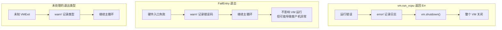

| 错误类型 | 处理方式 | 影响范围 |
|---------|---------|---------|
| `run_vcpu` 返回 Err | 关闭整个 VM | VM 级别 |
| FailEntry | 记录警告，继续运行 | 仅当前 vCPU |
| 未知 VMExit 类型 | 记录警告，继续运行 | 仅当前 vCPU |
| Hypercall 执行失败 | 返回 -1 给客户机 | 仅本次调用 |

## VMExit 处理

VMExit 是虚拟化技术的核心概念，表示 Guest 代码的执行因某种原因陷入到 Hypervisor。理解 VMExit 的类型和处理流程对于理解整个虚拟化系统至关重要。

**什么是 VMExit**：

在 ARM 虚拟化中，Guest 代码运行在非特权模式（Non-secure EL1）。当 Guest 执行某些特权操作或发生特定事件时，硬件会自动切换到 Hypervisor 模式（EL2），这个过程就是 VMExit。类似于操作系统中的系统调用，但发生在虚拟化层面。

**触发 VMExit 的常见原因**：

1. **主动请求**：
   - HVC 指令：Guest 主动请求 Hypervisor 服务（Hypercall）
   - WFI/WFE 指令：Guest CPU 进入等待状态

2. **硬件事件**：
   - 外部中断：物理中断需要 Hypervisor 处理或注入到 Guest
   - 异常访问：访问需要模拟的设备寄存器（MMIO、SysReg）

3. **状态变化**：
   - 系统电源管理：PSCI 调用（CPU 开关、系统关机等）

**VMExit 处理的基本流程**：

每个 VMExit 都携带退出原因和相关参数。vCPU 任务的职责是：
1. 识别退出类型
2. 调用相应的处理函数
3. 更新 Guest 状态（如设置返回值）
4. 返回 Guest 继续执行

下图展示了 VMExit 的分类和分发逻辑，每种类型都有相应的处理路径：

### 处理流程

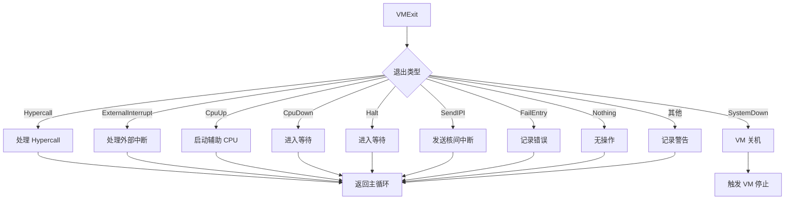

### 退出类型详解

| 退出类型 | 触发原因 | 处理方式 | 与其他模块交互 |
|---------|---------|---------|---------------|
| Hypercall | HVC 指令 | 创建 HyperCall 对象并执行 | hvc 模块处理 |
| ExternalInterrupt | 物理中断 | 调用 irq_handler + check_events | hal/irq + timer 模块 |
| CpuUp | PSCI CPU_ON | 查找目标 vCPU 并启动 | 创建新 vCPU 任务 |
| CpuDown | PSCI CPU_OFF | 进入等待状态 | 使用 WaitQueue |
| Halt | WFI 指令 | 进入等待状态 | 使用 WaitQueue |
| SendIPI | 软件中断 | 注入中断到目标 vCPU | hal/inject_interrupt |
| SystemDown | PSCI SYSTEM_OFF | 触发 VM 关机 | vm.shutdown() |
| FailEntry | 硬件入口失败 | 仅记录日志 | 无 |
| Nothing | 无需处理 | 直接继续 | 无 |

### Hypercall 处理流程

Hypercall 是 Guest 请求 Hypervisor 服务的机制，类似于系统调用。下图展示了从 Guest 发起 Hypercall 到返回结果的完整交互流程：

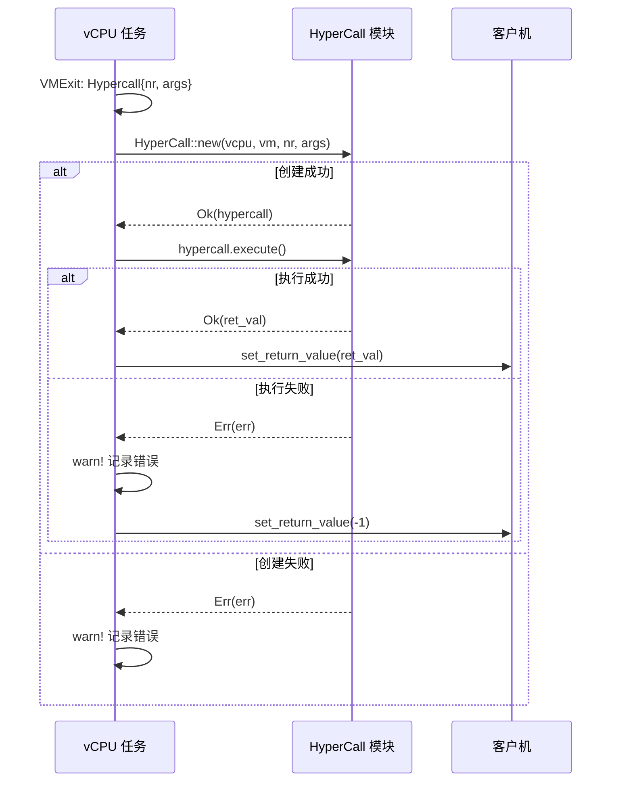

处理流程解析：
1. **接收 Hypercall**：vCPU 从 Guest 模式退出，携带 Hypercall 号和参数
2. **创建对象**：根据 Hypercall 号创建相应的处理对象
3. **执行操作**：调用 `execute()` 方法执行具体的 Hypercall 逻辑
4. **返回结果**：将返回值写入 Guest 寄存器，失败时返回 -1
5. **错误处理**：所有错误都记录日志但不会导致 VM 崩溃

### 中断注入流程

SendIPI（发送处理器间中断）是多核系统中一个核心向另一个核心发送中断的机制。下图展示了不同类型的 IPI 处理流程：

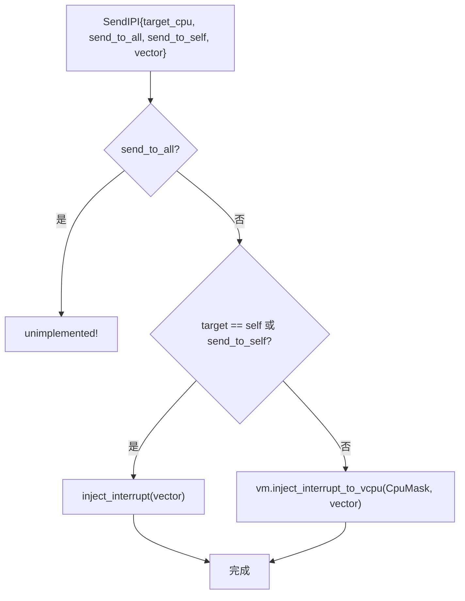

IPI 处理场景：
1. **广播中断**（send_to_all）：向所有 vCPU 发送中断，当前未实现
2. **本地中断**（send_to_self）：向当前 vCPU 自己注入中断，常用于软件触发的中断处理
3. **远程中断**：向其他指定 vCPU 注入中断，用于核间通信和唤醒操作

中断注入的实现会根据目标 vCPU 的状态选择不同策略：如果目标 vCPU 正在运行，需要发送物理 IPI 打断它；如果处于阻塞状态，需要先唤醒它。

## 等待队列机制

等待队列是 vCPU 任务管理中的关键组件，实现了 vCPU 的阻塞和唤醒机制。这个机制对于实现 Guest 的 WFI（Wait For Interrupt）指令、VM 的暂停/恢复功能以及 vCPU 的启动同步都至关重要。

**为什么需要等待队列**：

在虚拟化环境中，vCPU 经常需要等待某些条件满足才能继续执行：
- **Guest 执行 WFI**：Guest CPU 主动进入休眠，等待中断唤醒
- **VM 启动同步**：vCPU 任务创建后要等待 VM 状态变为 Running 才开始执行
- **VM 暂停**：执行 `vm suspend` 时，所有 vCPU 需要阻塞等待 `vm resume`
- **CPU 电源管理**：Guest 通过 PSCI 关闭 CPU 时，vCPU 需要进入等待状态

如果不使用等待队列，vCPU 任务只能通过忙等待（busy-waiting）来等待条件满足，这会浪费大量 CPU 资源。等待队列允许 vCPU 任务让出 CPU，由调度器在条件满足时唤醒它。

**等待队列的工作原理**：

1. **等待（wait）**：
   - vCPU 任务调用 `wait()` 或 `wait_for(condition)`
   - 任务状态设置为 Blocked，从运行队列移除
   - CPU 调度其他就绪任务运行

2. **唤醒（notify）**：
   - 外部事件（如中断、状态变化）发生时调用 `notify_one()` 或 `notify_all()`
   - 等待队列中的任务被唤醒，状态变为 Ready
   - 任务重新加入运行队列，等待调度

**条件等待（wait_for）vs 无条件等待（wait）**：

- **wait_for(condition)**：等待直到条件函数返回 true，每次唤醒时都会检查条件
  - 用于等待 VM 状态变化（如等待 `vm.running()` 或 `!vm.suspending()`）
  - 唤醒后自动检查条件，如果条件不满足会继续等待
  - 避免虚假唤醒（spurious wakeup）问题

- **wait()**：无条件等待，被唤醒后立即返回
  - 用于等待明确的事件（如中断到来）
  - 调用者需要自己判断是否应该继续执行

下图展示了 vCPU 任务与等待队列、调度器之间的交互流程：

### 等待与唤醒

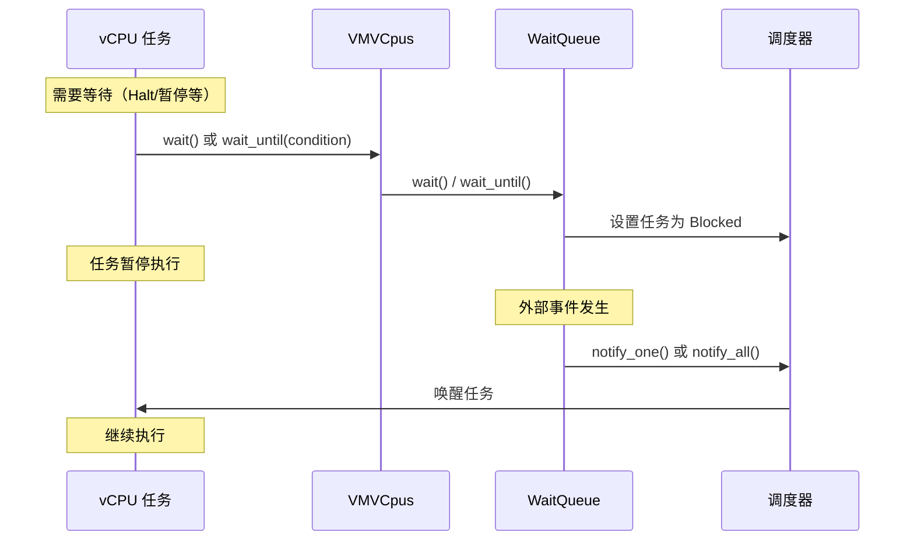

### 使用场景

| 场景 | 等待函数 | 唤醒条件 | 唤醒方 |
|------|---------|---------|--------|
| 等待 VM 启动 | `wait_for(vm.running())` | VM 状态变为 Running | vm start 命令 |
| Halt/WFI | `wait(vm_id)` | 收到中断 | 中断处理或 notify |
| VM 暂停 | `wait_for(!vm.suspending())` | VM 恢复 | vm resume 命令 |
| CPU Down | `wait(vm_id)` | 永不唤醒（除非 VM 停止） | - |

## 运行计数管理

### 计数器作用

`running_halting_vcpu_count` 是一个原子计数器，用于跟踪 VM 中正在运行或暂停（但未完全退出）的 vCPU 数量。这个计数器对于判断 VM 是否可以安全关闭至关重要：

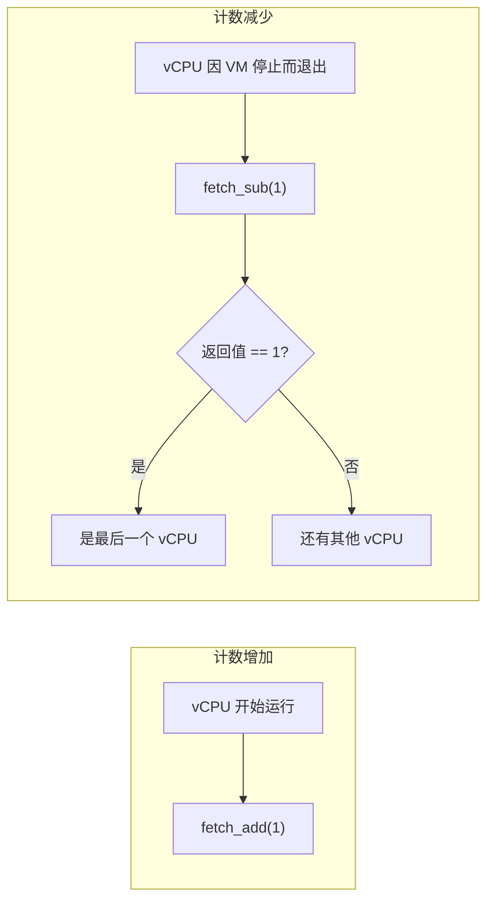

计数器的关键作用：
- **VM 停止协调**：确保所有 vCPU 都完成清理后才真正停止 VM
- **最后一个 vCPU 检测**：通过原子操作的返回值判断当前 vCPU 是否是最后一个退出的
- **状态同步**：最后一个 vCPU 负责执行最终的清理工作，如设置 VM 状态、减少全局 VM 计数等

注意：这里使用原子操作（fetch_add/fetch_sub）保证在多核环境下的线程安全，返回值是操作前的值。

### 最后一个 vCPU 的责任

当 VM 停止时，所有 vCPU 都会退出主循环。最后一个退出的 vCPU 需要承担额外的清理责任。下图展示了最后一个 vCPU 需要执行的特殊操作：

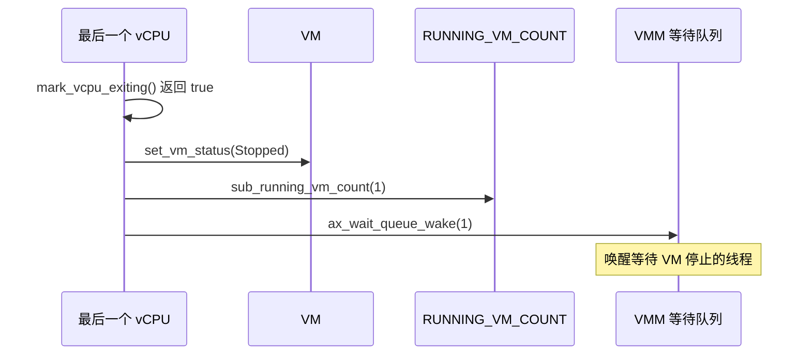

最后一个 vCPU 的特殊职责：
1. **设置 VM 状态**：将 VM 状态从 Stopping 改为 Stopped，表示所有 vCPU 已退出
2. **减少全局计数**：将系统中运行的 VM 计数减 1
3. **唤醒等待者**：通知可能正在等待 VM 停止的线程（如 `vm stop` 命令）

这种设计避免了需要额外的协调者线程，充分利用了"最后一个退出者负责清理"的模式。

## vCPU 资源清理

vCPU 资源清理是 VM 删除流程的关键环节，确保所有 vCPU 任务正确退出并释放资源。如果处理不当，可能导致任务泄漏、内存泄漏或系统资源耗尽。

**为什么需要显式清理**：

vCPU 任务是独立的执行单元，即使 VM 被从列表移除，任务仍可能在运行。显式清理确保：
1. **任务完全退出**：等待所有 vCPU 任务执行完毕，避免访问已释放的 VM 内存
2. **资源回收**：释放任务栈、任务控制块等系统资源
3. **状态一致性**：确保全局等待队列和任务列表的状态正确更新
4. **引用计数归零**：验证 VM 的所有引用已释放，避免内存泄漏

**cleanup_vm_vcpus 的职责**：

这个函数在 `vm delete` 命令中被调用，负责：
- 从全局等待队列中移除 VM 的 VMVCpus 对象
- 等待所有 vCPU 任务退出（通过 `task.join()`）
- 验证所有任务正常退出（检查退出码）
- 释放 VMVCpus 对象（自动释放 WaitQueue 和任务列表）

**清理顺序的重要性**：

vCPU 资源清理必须在 `remove_vm` 之后执行，顺序如下：
1. 先调用 `vm.shutdown()` 通知所有 vCPU 任务退出
2. 调用 `cleanup_vm_vcpus()` 等待任务退出
3. 调用 `remove_vm()` 从列表移除 VM
4. 验证 `Arc::strong_count()` 确保没有引用泄漏

### cleanup_vm_vcpus 流程

`cleanup_vm_vcpus` 是 VM 删除过程中的关键函数，负责清理所有与 vCPU 任务相关的资源。这个函数确保在 VM 对象被释放之前，所有相关的任务都已经完全退出。

**函数执行的详细步骤**：

1. **查找 VMVCpus 对象**：
   - 从全局等待队列 `VM_VCPU_TASK_WAIT_QUEUE` 中移除指定 VM 的 VMVCpus
   - 使用 `remove()` 而非 `get()`，确保对象被从队列中取出
   - 如果找不到，说明该 VM 从未启动过或资源已被清理

2. **记录任务信息**：
   - 获取 vCPU 任务列表的长度
   - 记录日志便于调试和监控

3. **等待所有任务退出**：
   - 遍历 `vcpu_task_list` 中的每个任务引用
   - 对每个任务调用 `task.join()`，这是一个阻塞操作
   - join() 会等待目标任务完成所有清理工作并退出
   - 记录每个任务的退出码，用于诊断异常退出

4. **自动释放资源**：
   - 当 VMVCpus 对象离开作用域时，其析构器自动运行
   - WaitQueue 被释放，移除所有等待者
   - vcpu_task_list 被释放，解除对任务的引用

下图展示了 cleanup_vm_vcpus 的完整执行流程，从查找 VMVCpus 到等待所有任务退出：

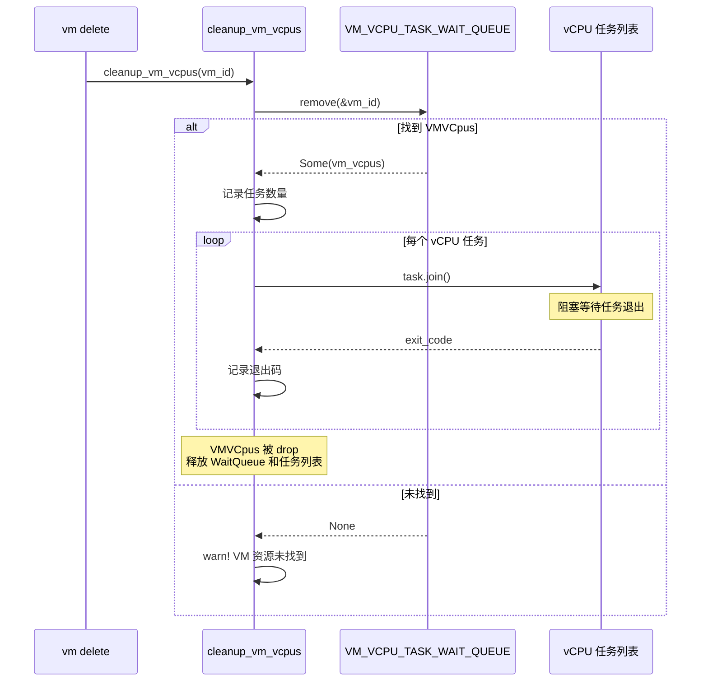

### 清理时机

VM 删除操作必须在正确的时机执行清理，否则可能导致数据丢失或系统不稳定。清理时机的选择取决于 VM 当前的状态。

**清理流程的各个阶段**：

1. **停止 VM**（如果需要）：
   - 调用 `vm.shutdown()` 设置停止标志
   - 等待所有 vCPU 任务检测到标志并退出
   - 超时时间通常为 5-10 秒

2. **等待 vCPU 退出**：
   - 轮询检查所有 vCPU 状态
   - 确保没有 vCPU 仍在 Running 状态
   - 这是进入下一步的前置条件

3. **清理 vCPU 资源**：
   - 调用 `cleanup_vm_vcpus()` 等待任务完全退出
   - 释放等待队列和任务列表
   - 验证所有任务的退出码

4. **从列表移除**：
   - 调用 `remove_vm()` 从全局列表移除
   - 获得 VM 的最后一个强引用
   - 此时其他线程无法再访问该 VM

5. **验证和释放**：
   - 检查引用计数是否为 1
   - VM 引用离开作用域，自动析构
   - 释放所有内部资源（内存、设备等）

下图展示了不同 VM 状态下的删除路径和清理时机选择：

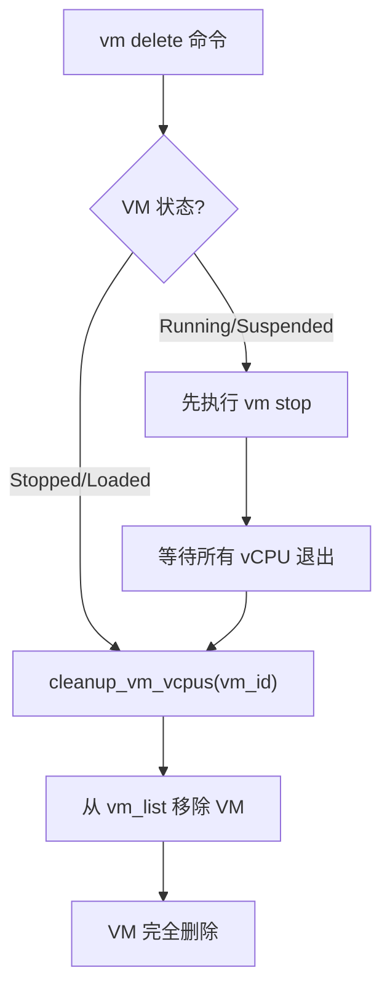
