# VM 列表管理

本节介绍 AxVisor 如何管理虚拟机列表，包括虚拟机的注册、查询、移除，以及与其他模块的协作关系。

## 模块交互关系

vm_list 模块是 VMM 的核心数据管理模块，负责维护系统中所有虚拟机实例的全局注册表。它采用集中式管理的设计模式，为其他模块提供统一的 VM 访问接口。

vm_list 与多个模块交互，形成了一个清晰的分层架构。下图展示了 vm_list 在整个系统中的中心地位，以及它如何与上层的 Shell 命令和下层的 VMM 模块进行交互：

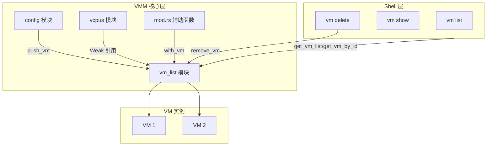

**交互关系解析**：
- **config → vm_list**：VM 创建完成后，config 模块将其注册到 vm_list，建立全局可见性
- **shell → vm_list**：Shell 命令通过查询接口访问 VM 信息，实现用户交互
- **vcpus ⇄ vm_list**：vCPU 模块通过弱引用访问 VM，避免循环引用导致内存泄漏
- **辅助函数 → vm_list**：mod.rs 提供的封装函数简化了 VM 访问模式
- **vm_list → VM 实例**：vm_list 持有所有 VM 的强引用，管理它们的生命周期

从架构图可以看出，vm_list 处于整个系统的中心位置，上层的 Shell 命令通过它来查询和管理 VM，而底层的 config 模块在创建 VM 后也需要将其注册到这里。

### 模块职责

下表详细说明了各个模块与 vm_list 的交互方式和设计考量：

| 模块 | 与 vm_list 的交互 | 说明 |
|------|------------------|------|
| config | `push_vm` | 创建 VM 后注册到列表 |
| vcpus | 通过 `Weak<VM>` 引用 | 避免循环引用，需要时升级为 Arc |
| shell 命令 | `get_vm_list`, `get_vm_by_id` | 查询 VM 信息和状态 |
| mod.rs | `with_vm`, `with_vm_and_vcpu` | 提供安全访问 VM 的辅助函数 |
| vm delete | `remove_vm` | 删除 VM 时从列表移除 |

**config 模块**的职责是根据配置文件初始化虚拟机实例。当一个 VM 对象创建完成后，config 模块会调用 `push_vm` 将其注册到全局列表中。这个设计遵循了"创建者负责注册"的原则，确保每个成功创建的 VM 都能被系统追踪。

**vcpus 模块**与 VM 之间存在特殊的引用关系。每个 vCPU 任务需要访问其所属的 VM，但如果直接持有 `Arc<VM>` 强引用，会形成循环引用（VM 拥有 vCPU，vCPU 又引用 VM），导致内存永远无法释放。因此 vcpus 模块使用 `Weak<VM>` 弱引用，在需要访问 VM 时通过 `upgrade()` 方法临时提升为 `Arc<VM>`，使用完毕后自动释放。这是 Rust 中处理循环引用的标准模式。

**shell 命令**层通过查询接口与 vm_list 交互。`vm list` 命令调用 `get_vm_list()` 获取所有 VM 的列表，`vm show` 和 `vm delete` 命令则通过 `get_vm_by_id()` 获取特定 VM。这些接口返回的都是 `Arc<VM>` 的克隆，增加引用计数但不复制 VM 对象本身，既保证了数据安全，又避免了不必要的开销。

**mod.rs 辅助函数**提供了更高级的封装，如 `with_vm` 和 `with_vm_and_vcpu`，这些函数采用闭包模式，自动处理 VM 的获取、使用和释放，减少了样板代码，提高了代码的可读性和安全性。

## 数据结构

vm_list 模块的数据结构设计体现了 Rust 的类型安全和内存安全特性，通过类型别名、智能指针和互斥锁的组合，构建了一个线程安全且高效的 VM 管理系统。

### VMList 结构

VMList 是一个简单但功能完整的容器，它封装了 `BTreeMap` 来存储虚拟机实例：

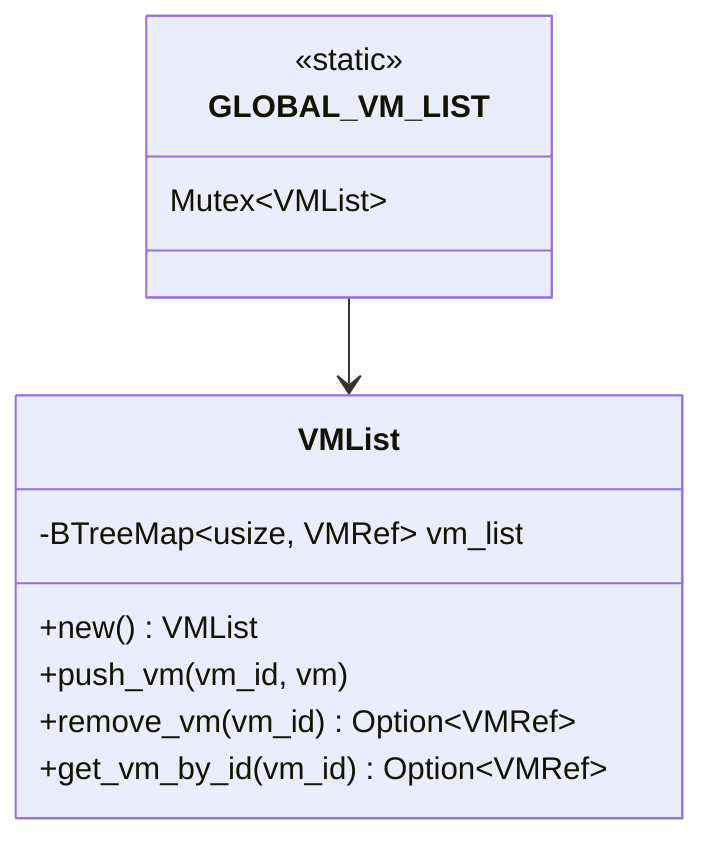

核心设计要点：

1. **全局静态变量 GLOBAL_VM_LIST**：使用 `lazy_static` 或 `once_cell` 初始化的全局变量，确保在整个程序运行期间只有一个 VMList 实例。这是单例模式在 Rust 中的实现方式。

2. **Mutex 保护并发访问**：所有对 VMList 的操作都必须先获取 Mutex 锁。使用 `spin::Mutex` 而非标准库的 `std::sync::Mutex`，因为 AxVisor 运行在 no_std 环境中，需要自旋锁而非依赖操作系统的线程调度。

3. **返回 Option 类型**：查询和移除操作返回 `Option<VMRef>`，明确表达了"VM 可能不存在"的语义，强制调用者处理这种情况，避免了空指针异常。

### 类型定义

VM 相关类型在 `vmm/mod.rs` 中定义，这些类型别名简化了代码并提供了更好的语义：

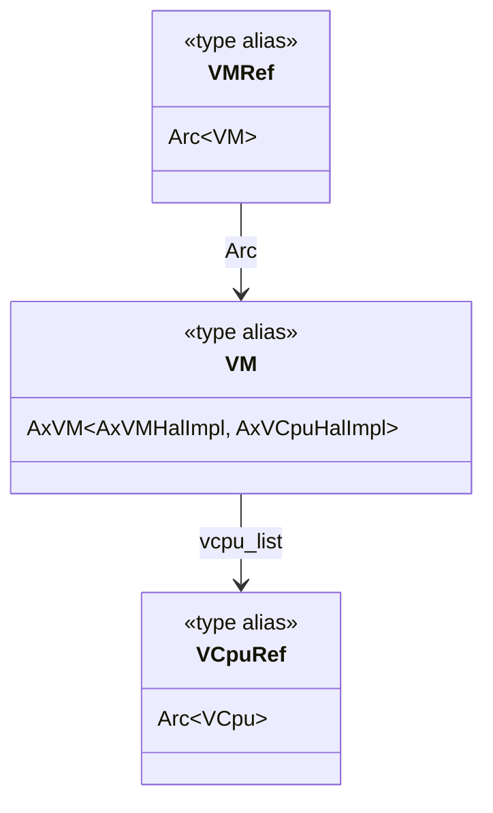

**类型别名的设计意图**：

- **VM**：是 `AxVM<AxVMHalImpl, AxVCpuHalImpl>` 的别名，隐藏了泛型参数的复杂性。AxVM 是虚拟机的核心实现，两个泛型参数分别是 VM 层和 vCPU 层的硬件抽象层（HAL）实现。

- **VMRef**：等价于 `Arc<VM>`，表示一个虚拟机的共享引用。使用 Arc（原子引用计数）允许多个所有者同时持有同一个 VM 的引用，当最后一个引用被释放时，VM 会自动清理。

- **VCpuRef**：等价于 `Arc<VCpu>`，表示一个虚拟 CPU 的共享引用。每个 VM 包含一个 `Vec<VCpuRef>`，存储其所有的虚拟 CPU。

**所有权关系**：
- VMList 持有 `VMRef`（强引用），是 VM 的主要所有者
- vCPU 任务持有 `Weak<VM>`（弱引用），避免循环引用
- Shell 命令和辅助函数获取 `VMRef` 的临时克隆，使用完毕后自动释放
- VM 持有 `Vec<VCpuRef>`（强引用），拥有其所有 vCPU

## 全局 API

vm_list 模块提供了三个核心 API 用于管理虚拟机的生命周期。这些 API 都是线程安全的，可以从多个线程或 CPU 核心同时调用。

### 添加虚拟机

`push_vm(vm)` 函数用于将新创建的虚拟机注册到全局列表中，这是每个 VM 生命周期的起点。

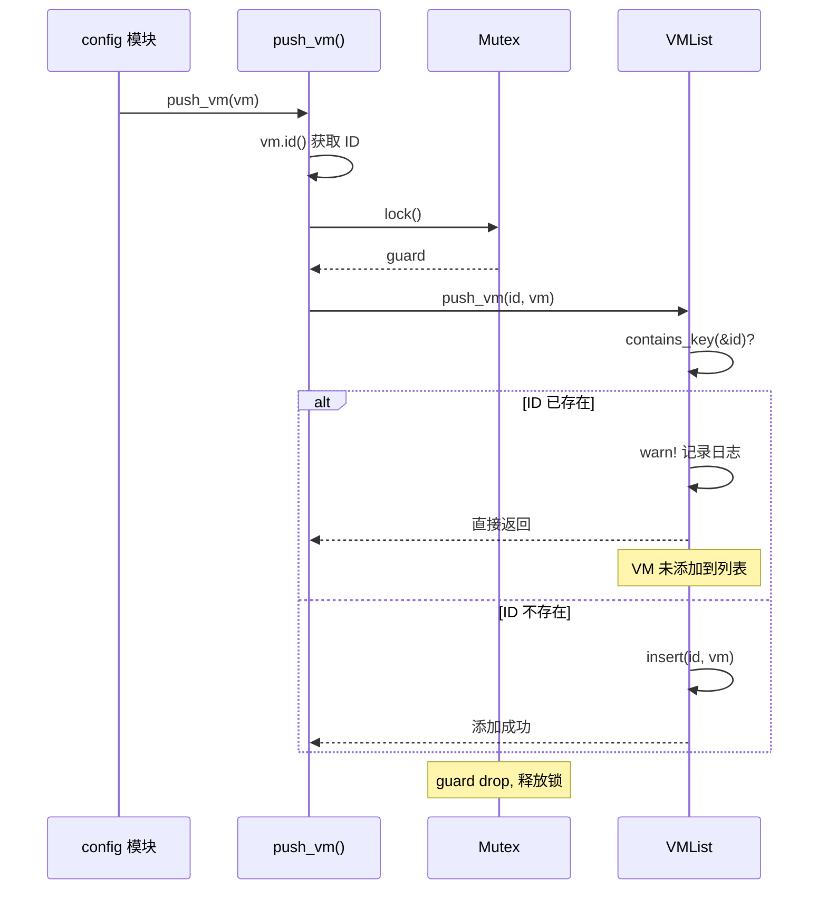

**使用示例**：
```rust
// 在 config 模块中
let vm = AxVM::new(config)?;
push_vm(vm);  // 所有权转移到全局列表
```

### 查询虚拟机

vm_list 提供了两种查询方式：按 ID 查询单个 VM，或获取所有 VM 的列表。

#### 按 ID 查询

`get_vm_by_id(vm_id)` 返回指定 ID 的虚拟机引用：

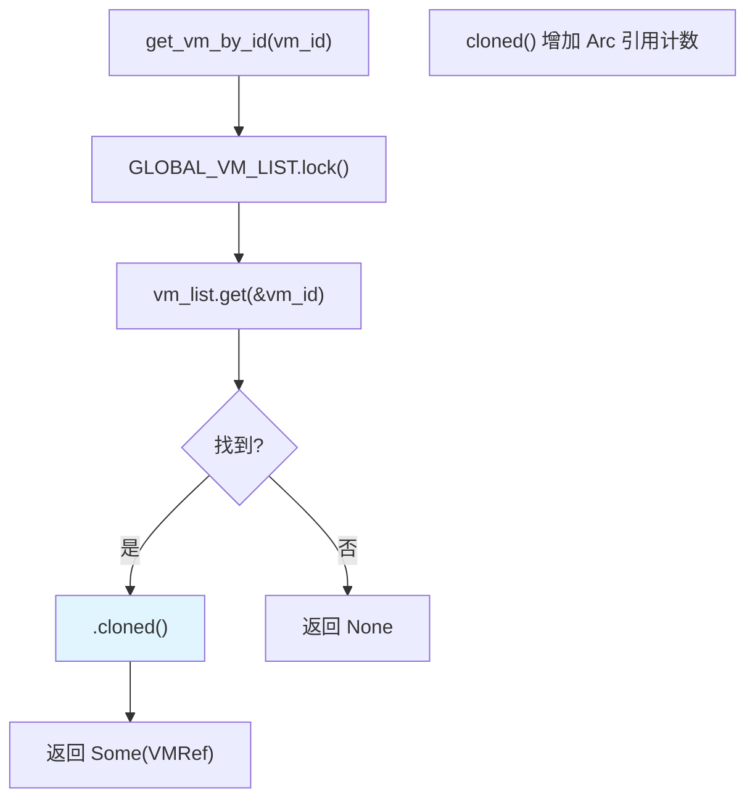

#### 获取所有 VM

`get_vm_list()` 是一个批量查询接口，用于获取系统中所有已注册虚拟机的列表。与 `get_vm_by_id()` 的点查询不同，这个函数返回完整的 VM 集合，主要用于以下场景：

**主要用途**：
- **vm list 命令**：向用户展示所有虚拟机的状态概览
- **批量操作**：需要遍历所有 VM 执行操作（如启动所有 VM、状态检查等）
- **系统监控**：收集全局的虚拟机统计信息
- **启动流程**：VMM 初始化时需要获取所有 VM 进行 vCPU 设置

下图展示了 `get_vm_list()` 的内部执行流程，从获取全局锁到返回 VM 列表的完整过程：

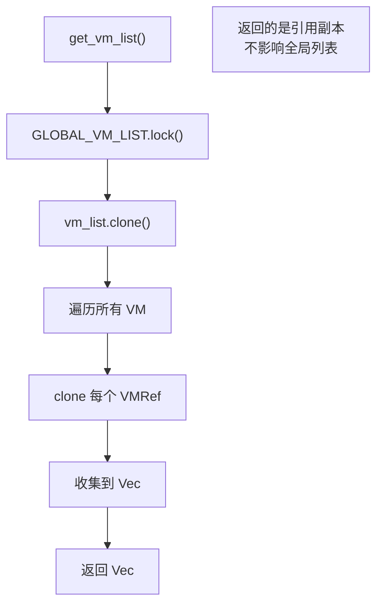

**使用示例**：
```rust
// 在 vm list 命令中
for vm_ref in get_vm_list() {
    println!("VM {}: {:?}", vm_ref.id(), vm_ref.state());
}
// 循环结束后，所有 VMRef 自动释放
```

### 移除虚拟机

`remove_vm(vm_id)` 从全局列表中移除指定的虚拟机：

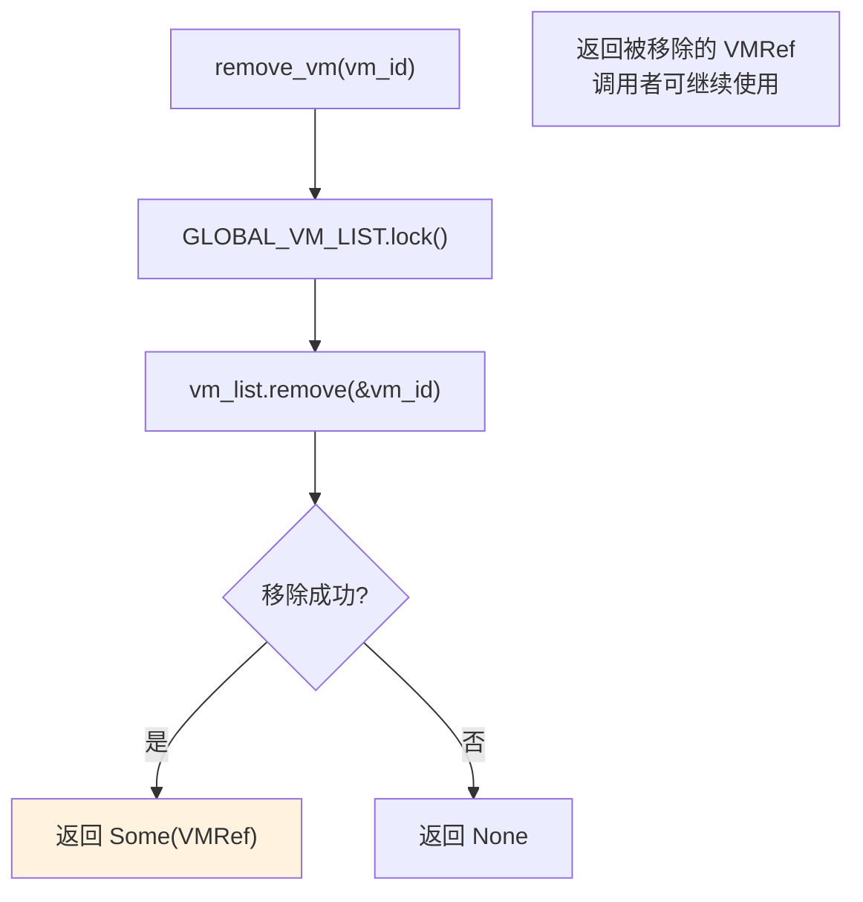

**使用示例**：
```rust
// 在 vm delete 命令中
if let Some(vm_ref) = remove_vm(vm_id) {
    info!("Removed VM {} from list", vm_id);
    // vm_ref 在这里 drop，如果没有其他引用，VM 会被释放
} else {
    error!("VM {} not found", vm_id);
}
```

## 辅助访问函数

`vmm/mod.rs` 提供了一组辅助函数，封装了 VM 访问的常见模式。这些函数采用闭包（closure）作为参数，自动处理 VM 的获取、使用和释放，极大地简化了代码。

### with_vm

`with_vm` 是最基础的辅助函数，用于安全地访问单个虚拟机。这个函数采用了 Rust 中常见的"闭包回调"模式（Callback Pattern），让调用者专注于业务逻辑，而不用关心资源管理的细节。

**设计理念**：

传统的 VM 访问模式需要手动处理多个步骤：
```rust
// 传统模式：冗长且容易出错
if let Some(vm_ref) = get_vm_by_id(vm_id) {
    // 使用 vm_ref
    let result = vm_ref.some_operation();
    // 别忘了及时释放引用...
} else {
    // 处理 VM 不存在的情况
}
```

`with_vm` 将这个模式封装成一个简洁的接口：
```rust
// with_vm 模式：简洁且安全
with_vm(vm_id, |vm| {
    vm.some_operation()  // 直接使用，自动管理生命周期
});
```

**核心优势**：
- **自动资源管理**：VM 引用的获取和释放完全自动化
- **强制作用域**：闭包提供了明确的使用边界，防止引用泄漏
- **统一错误处理**：VM 不存在的情况通过 Option 类型统一处理
- **零运行时开销**：闭包在编译期内联，没有额外的函数调用开销

下图展示了 `with_vm` 函数的完整执行流程，包括 VM 查找、闭包执行和结果返回：

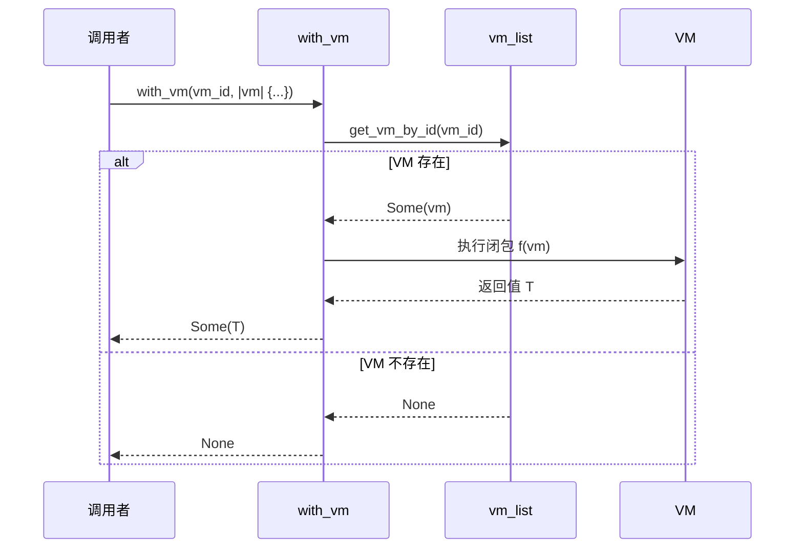

**函数签名**：
```rust
pub fn with_vm<T, F>(vm_id: usize, f: F) -> Option<T>
where
    F: FnOnce(&VMRef) -> T
```

**代码对比**：

```rust
// 不使用 with_vm（手动管理）
if let Some(vm_ref) = get_vm_by_id(vm_id) {
    let state = vm_ref.state();
    println!("VM state: {:?}", state);
    // 需要确保 vm_ref 及时释放
}

// 使用 with_vm（自动管理）
with_vm(vm_id, |vm| {
    println!("VM state: {:?}", vm.state());
});
```

### with_vm_and_vcpu

`with_vm_and_vcpu` 扩展了 `with_vm`，同时提供 VM 和指定的 vCPU 访问。这个函数解决了需要同时操作虚拟机和其特定虚拟 CPU 的场景，是许多管理命令的基础支撑。

如果使用 `with_vm`，调用者需要自己从 VM 中获取 vCPU：
```rust
// 使用 with_vm 的方式（繁琐）
with_vm(vm_id, |vm| {
    if let Some(vcpu) = vm.vcpu(vcpu_id) {
        // 使用 vcpu
    } else {
        // 处理 vCPU 不存在
    }
});
```

`with_vm_and_vcpu` 将这个模式封装起来，统一处理两层查找和错误情况：
```rust
// 使用 with_vm_and_vcpu 的方式（简洁）
with_vm_and_vcpu(vm_id, vcpu_id, |vm, vcpu| {
    // 直接使用 vm 和 vcpu，自动处理不存在的情况
});
```

下图展示了 `with_vm_and_vcpu` 的双重查找流程，包括 VM 查找和 vCPU 查找两个阶段：

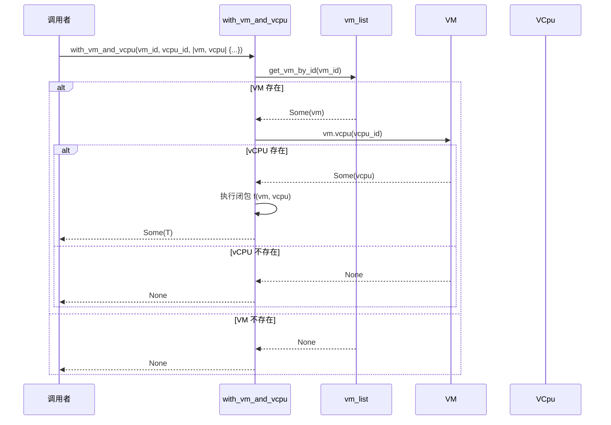

**函数签名**（简化版）：
```rust
pub fn with_vm_and_vcpu<T, F>(vm_id: usize, vcpu_id: usize, f: F) -> Option<T>
where
    F: FnOnce(&VMRef, &VCpuRef) -> T
```

**使用示例**：
```rust
// 在 vm show 命令中
with_vm_and_vcpu(vm_id, vcpu_id, |vm, vcpu| {
    println!("VM {}: {}", vm.id(), vm.name());
    println!("  vCPU {}: state={:?}, pcpu={}",
             vcpu.id(), vcpu.state(), vcpu.pcpu_id());
});
```

### with_vm_and_vcpu_on_pcpu

`with_vm_and_vcpu_on_pcpu` 是最高级的辅助函数，确保闭包在目标 vCPU 所在的物理 CPU 上执行：

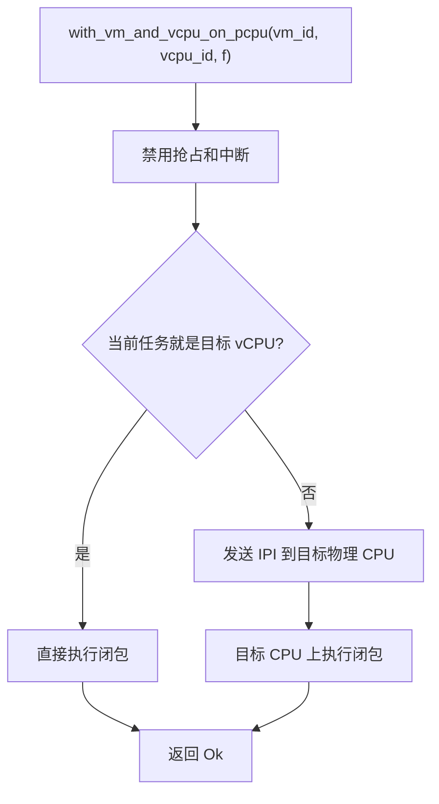

**使用示例**：
```rust
// 向 vCPU 注入中断
with_vm_and_vcpu_on_pcpu(vm_id, vcpu_id, |vm, vcpu| {
    vcpu.inject_interrupt(IRQ_TIMER);
});
```

## 与 VMM 启动流程的关系

vm_list 在 VMM 的初始化和启动流程中扮演关键角色，作为连接配置加载、vCPU 设置和 VM 启动的桥梁。

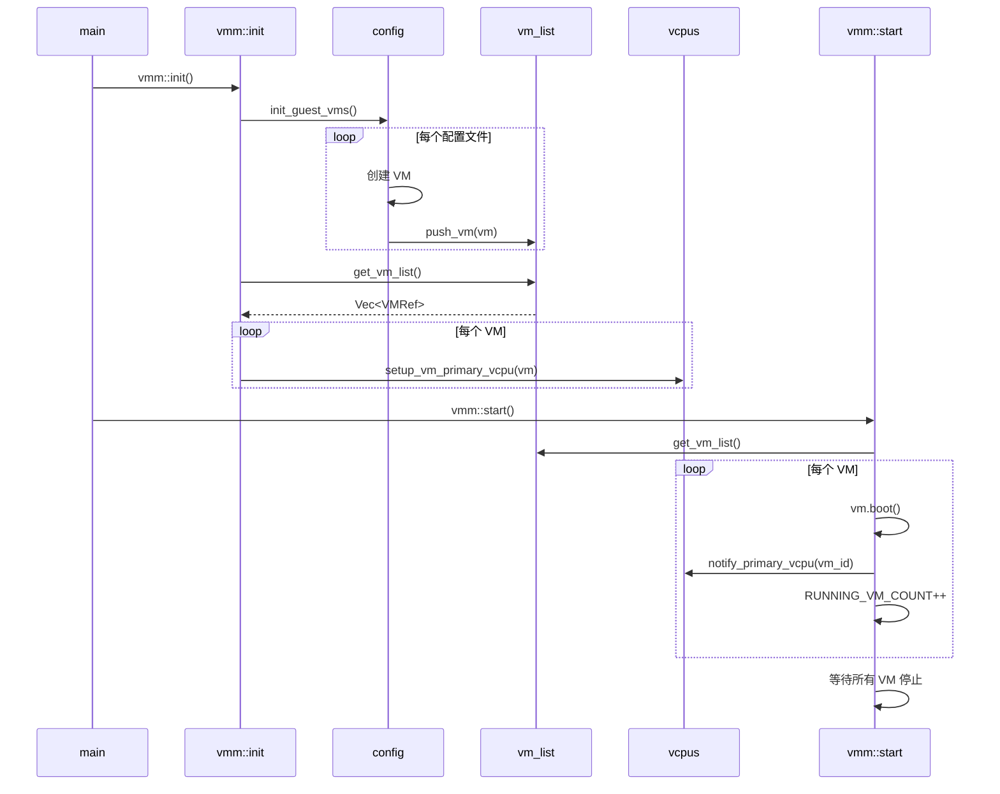

**流程详解**：

### 阶段 1：初始化（vmm::init）

1. **加载配置**：`config::init_guest_vms()` 读取所有 VM 配置文件（通常在 `/etc/axvisor/vms/` 目录下）。

2. **创建 VM**：对于每个配置文件，创建对应的 `AxVM` 实例，包括：
   - 分配 Guest 物理内存
   - 加载内核镜像和 initrd
   - 初始化虚拟设备（串口、块设备、网络等）
   - 设置 VM 的初始寄存器状态

3. **注册到列表**：通过 `push_vm(vm)` 将创建的 VM 注册到全局列表。此时 VM 处于 `Loaded` 状态，尚未启动。

4. **设置 vCPU**：调用 `get_vm_list()` 获取所有 VM，然后为每个 VM 设置主 vCPU（Primary vCPU）：
   - 创建 vCPU 任务
   - 分配物理 CPU
   - 初始化 vCPU 寄存器
   - 将 vCPU 任务加入调度器（但不立即运行）

### 阶段 2：启动（vmm::start）

1. **遍历所有 VM**：再次调用 `get_vm_list()` 获取要启动的 VM 列表。

2. **引导 VM**：对于每个 VM：
   - 调用 `vm.boot()` 设置 VM 状态为 `Running`
   - 调用 `notify_primary_vcpu(vm_id)` 唤醒主 vCPU 任务
   - 增加 `RUNNING_VM_COUNT` 计数器

3. **等待完成**：主线程进入等待状态，直到所有 VM 停止或被删除。

**为什么需要两次 get_vm_list()**：

- 第一次在 `init` 阶段，用于设置 vCPU，此时 VM 还不应该运行
- 第二次在 `start` 阶段，用于实际启动 VM，确保所有准备工作已完成
- 分离初始化和启动逻辑，提高系统的可维护性和可测试性

## 错误处理

vm_list 模块的错误处理设计遵循"防御性编程"原则，尽可能避免 panic，同时提供清晰的错误信息。

### VM 不存在

当查询不存在的 VM 时，返回 `Option::None` 而非 panic：

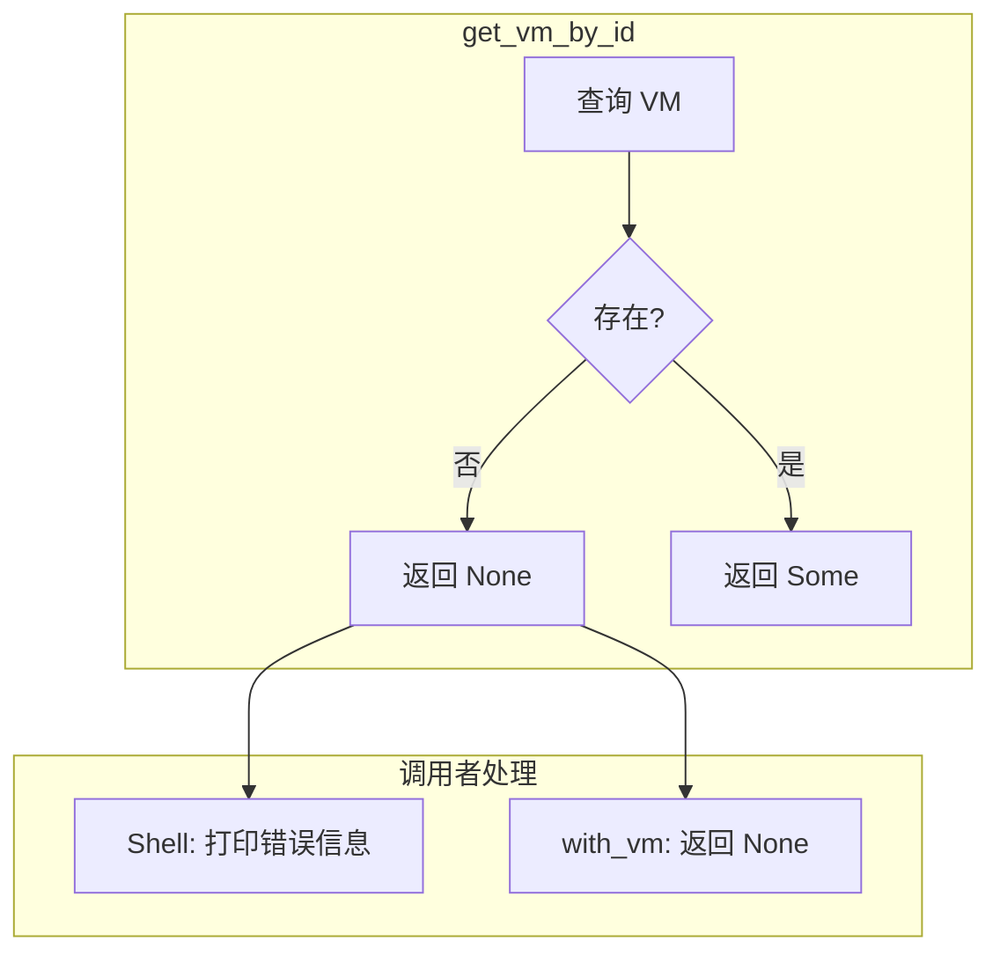

**设计理念**：

- **Option 类型**：使用 Rust 的 `Option` 类型明确表达"可能不存在"的语义，编译器强制调用者处理这种情况。

- **分层处理**：不同层次对 `None` 的处理不同：
  - Shell 命令层：打印用户友好的错误信息（如 "VM 1 not found"）
  - 辅助函数层：透传 `None` 给调用者，由调用者决定如何处理
  - 内部逻辑：检查返回值，跳过不存在的 VM

**示例**：

```rust
// Shell 命令中的处理
match get_vm_by_id(vm_id) {
    Some(vm) => println!("VM {}: {:?}", vm.id(), vm.state()),
    None => eprintln!("Error: VM {} not found", vm_id),
}

// 辅助函数中的处理
pub fn with_vm<T, F>(vm_id: usize, f: F) -> Option<T> {
    let vm = get_vm_by_id(vm_id)?;  // ? 操作符传播 None
    Some(f(&vm))
}
```

### 重复 VM ID

当尝试添加重复 ID 的 VM 时，记录警告但不 panic：

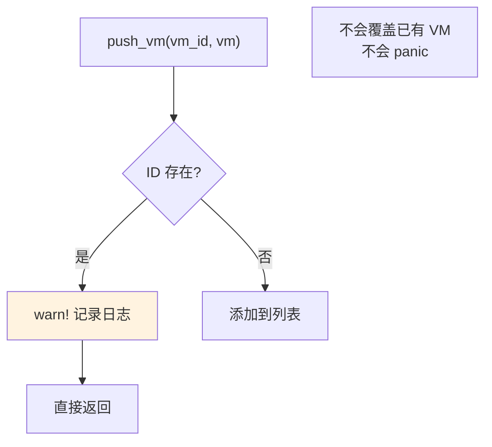

**处理策略**：

1. **保护已有数据**：不覆盖已存在的 VM，避免丢失运行中的虚拟机状态。

2. **记录警告**：使用 `warn!` 宏记录到日志，便于系统管理员发现配置问题。

3. **静默失败**：不返回错误码，调用者无法感知失败。这是权衡之后的设计选择：
   - 优点：避免因配置错误导致系统崩溃
   - 缺点：可能隐藏问题，需要通过日志排查

**改进建议**：

如果需要更严格的错误处理，可以考虑：
```rust
pub fn push_vm(vm: VMRef) -> Result<(), VMError> {
    let vm_id = vm.id();
    let mut guard = GLOBAL_VM_LIST.lock();

    if guard.vm_list.contains_key(&vm_id) {
        return Err(VMError::DuplicateId(vm_id));
    }

    guard.vm_list.insert(vm_id, vm);
    Ok(())
}
```

### 删除运行中的 VM

删除 VM 是一个具有潜在危险性的操作，如果处理不当可能导致数据丢失、系统崩溃或资源泄漏。因此，在实际删除之前必须进行严格的状态检查和条件验证。

**为什么删除需要状态检查**：

直接删除一个正在运行的 VM 会引发一系列严重问题：

1. **数据完整性风险**：
   - Guest OS 可能正在进行磁盘写入操作
   - 文件系统缓存中的数据尚未刷新到磁盘
   - 数据库事务可能处于中间状态
   - 强制删除会导致数据损坏或丢失

2. **资源泄漏风险**：
   - vCPU 任务仍在运行，持有 VM 的引用
   - 等待队列中可能有阻塞的任务
   - 设备资源（如直通设备）尚未释放
   - 内存映射和 DMA 缓冲区仍在使用中

3. **系统稳定性风险**：
   - vCPU 任务可能访问已释放的 VM 内存（use-after-free）
   - 中断注入机制可能尝试访问不存在的 vCPU
   - 其他模块可能仍持有对 VM 的引用

**删除流程的完整步骤**：

成功的删除操作需要经过以下步骤，每一步都有明确的验证：

1. **状态验证**：检查 VM 当前状态，决定是否允许删除
2. **停止 VM**（如需要）：调用 shutdown，等待 vCPU 任务响应
3. **等待停止完成**：轮询检查所有 vCPU 状态，确保全部退出
4. **清理 vCPU 资源**：调用 cleanup_vm_vcpus，等待任务 join
5. **从列表移除**：调用 remove_vm，获取最后的强引用
6. **验证引用计数**：检查 strong_count，确保没有泄漏
7. **自动释放**：VM 引用离开作用域，触发析构器

下图展示了不同状态下的删除决策流程和相应的处理路径：

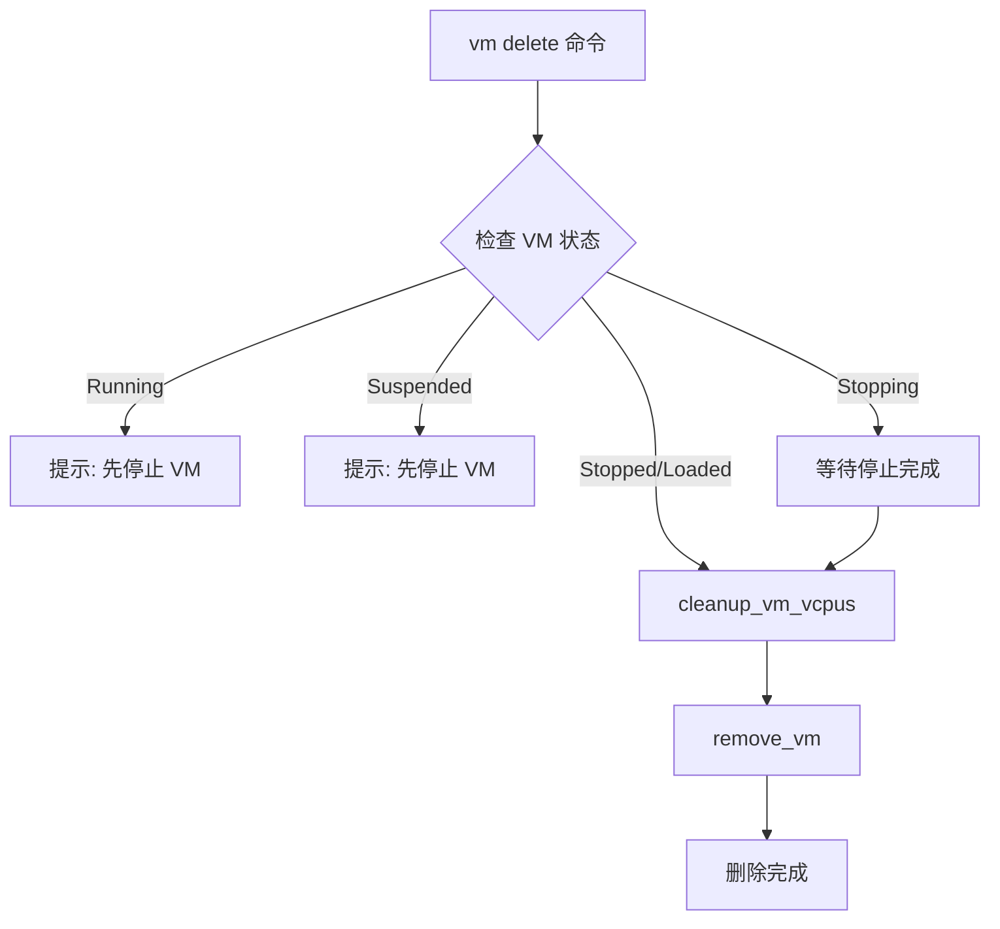
