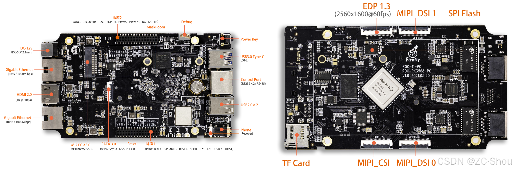

# 简介

由于 AxVisor 本身是一个运行于各种硬件平台的 Hypervisor，直接使用 Gihub 提供的 Action 脚本命令执行服务器（官方称为 Runner）无法满足我们的测试需求，因此，需要将测试本地化，在本地服务器上执行所有测试过程。整体集成测试环境如下图所示：


## 本地测试环境

本地通过一台专用的服务器来执行测试任务，服务器通过相应接口与各个开发板直接相连，执行测试脚本。同时，本地服务器上还需要部署各种软件服务端，以便为开发板提供资源。


当测试运行时，服务器上的测试工具会将 AxVisor 固件通过 Debug 接口加载到开发板中运行，同时，通过串口将运行日志输出到本地服务器。当测试结束，测试工具会将测试结果汇总，并生成测试报告。

### 测试设备

测试设备是要运行 AxVisor 的设备，目前包括一块 x86 开发板，一块飞腾派开发板，一块瑞芯微开发板。后续随着 AxVisor 的平台扩展逐步添加新的测试设备。不同的测试设备需要不同的 AxVisor 固件，此外，他们的 Debug 接口和固件加载方式也不相同。

#### ROC-RK3568-PC

[ROC-RK3568-PC](https://www.t-firefly.com/product/industry/rocrk3568pc.html) 是天启智能科技的 Filefly 团队推出的一款采用 RK3568 四核 64 位 Cortex-A55 处理器的嵌入式开发板。主频最高 2.0GHz、集成双核心架构 GPU 以及高效能 NPU；最大支持 8G 大内存；支持 WiFi6, 双千兆以太网。



##### 调试接口

使用 USB 转 TTL 工具将 ROC-RK3568-PC 上的 Debug 接口与本地测试服务器相连，默认串口参数 1500000 N 8 1。当系统运行时，运行日志将通过 Debug 接口直接输出到本地测试服务器。


##### 固件加载

ROC-RK3568-PC 的启动固件默认使用 U-Boot 作为引导程序，我们通过 U-Boot 的 `loady` 功能将固件加载到 DDR 中运行。但是默认并不支持 `loady` 功能。因此，我们需要修改 SDK 源码中的 U-Boot 源码，添加 `loady` 功能，进而就可以借助 `loady` 功能通过 Debug 接口将测试固件直接加载到 DDR 中运行。

#### 飞腾派


##### 调试接口

使用 USB 转 TTL 工具将飞腾派上的 Debug 引脚与本地测试服务器相连，默认串口参数 115200 N 8 1。当系统运行时，运行日志就会通过 Debug 引脚直接输出到本地测试服务器。


##### 固件加载

飞腾派的启动固件目前不开源，但是其默认也是采用 U-Boot 作为引导程序且支持 `loady` 功能，因此，我们可以直接借助 U-Boot 的 `loady` 功能将固件加载到 DDR 中运行。

由于，飞腾派的调试串口默认的波特率太低，加载镜像时间太长，不过其 U-Boot 默认支持网络，因此，我们可以直接借助于网口来实现固件加载。

#### x86 开发板

TODO

##### 固件加载

x86 平台的引导程序（BIOS）各厂家通常差别较大，但是，他们一般都支持 PXE 功能，因此，我们通过 PXE 来实现测试固件的加载。


##### 搭建 PXE 服务器

对于 x86 架构，我们需要通过 PXE 来实现内核固件的加载。PXE 规范描述了一个标准化的 **客户端 ↔ 服务器** 环境，通信过程使用的是 UDP/IP、DHCP、TFTP 等多个标准互联网协议。


x86 架构的引导程序（BIOS）中一般都集成了 PXE 客户端，我们需要提供一个服务端。目前，在 Linux 下没有类似于 Windows 下的 All in One 的工具，只能是分别搭建！

### 供电控制

在目前的测试过程中，我们需要给测试设备重新上电，因此，我们需要实现在本地测试服务器中通过命令手动控制测试设备上电的功能。因此，我们需要一个电源控制模块，通过 USB 接口与本地测试服务器相连，通过串口与测试设备相连，实现上电和断电功能。


#### 继电器

我们选择了中盛科技的数字量输入输出 IO 模块作为控制单元。该模块支持最多 8 路继电器，支持 RS232 和 RS485 通信接口，支持 12V/24V 电源输入，支持 5A 电流输出。

#### 控制程序

要控制带有 RS232 或 RS485 通信口的继电器，我们需要按照厂家提供的协议来实现一个基本工具。


## 注册 Runner 服务器

为了实现自动化测试，我们可以将本地服务器注册为 Github Actions 的 Runner 服务器。Github Actions 本身支持使用自定义服务器（Runners）来运行所有的 Action 命令。我们可以选择为仓库单独注册自定义服务器，也可以为组织注册全局的自定义服务器，然后分配给该组织下的所有或者部分仓库使用。官方也有详细的教程 https://docs.github.com/zh/actions/how-tos/manage-runners/self-hosted-runners/configure-the-application


1. 在仓库或者组织的设置界面中找到 Action 配置界面。在仓库的 `Runners` 界面中选择 `New self-hosted runner` 或者在组织的 `Runners` 界面 `New runner`，然后选择 `New self-hosted runner` 来进行创建。

    

	组织的 Runner 配置界面的另一个选项 `New Github-hosted runner` 是对于付费的组织额外增加 Github 官方的 Runner 服务器的。

2. 选择 `New self-hosted runner` 之后，Github 会给出针对 macOS、Linux、Windows（默认） 三个平台的详细的操作步骤。仓库独立 Runner 和 组织的全局 Runner 部署方式是一模一样的，参照步骤部署配置即可。

    

    下面以 Linux 系统为例，来进行部署过程的验证

    

	1. 在执行 `./config.sh --url https://github.com/arceos-hypervisor/axvisor --token 上一步页面中给出的Token` 完成配置前不要刷新界面，否则其中的 token 会被改变

	2. 下载的 Runner 压缩包只能配置一为一个 Runner 服务器（需要注销旧的才能重新注册成新的）。如果同时为不同的仓库或者组织配置 Runner 服务器，则需要下载多份，然后分别配置

	3. 在删除时还需要输入 Token 进行确认，也可以直接在仓库或者组织的 Runner 界面中强制删除！
 
    

3. 直接执行 `./run.sh` 启动 Runner，并自动连接到 Github，不过，此时将阻塞当前 Shell，如果关闭 Shell 则将停止运行。更直接的方法是使用 `sudo ./svc.sh install` 直接安装为系统服务。

    

	- 注意，如果以普通用户启动，在实际使用中会提示输入用户密码
	
5. 当最后配置完成后，重新点击 Runner 菜单（新增界面没有返回按钮）返回到 Runner 配置界面，就会显示我们的自定义服务器。可以点击每个自定义服务器进行一些设置！

    

	- **Idle**：Runner 已连接到 GitHub，并已准备好执行作业。

	- **Active**：Runner 当前正在执行作业。

	- **Offline**：Runner 未连接到 GitHub。 这可能是因为机器处于离线状态，自托管 Runner 应用程序未在机器上运行，或者自托管 Runner 应用程序无法与 GitHub 通信。

	对于组织来说，需要在 `Runner groups` 界面中进一步将配置的 `Runners` 服务器分配给不同的仓库。默认情况下自定义 Runner 被放在了 Default 分组中，Default 分组对 public 的仓库是禁用的，需要手动启用

    

### 基于 Docker 的 Runner 服务器

官方提供的 self-hosted Runner 可执行程序是一个 Go 应用程序，默认直接运行与本地服务器，这会导致一些安全问题。此外，一个 Runner 可执行程序只能注册一个 Runner，不利于并行处理作业。基于 Docker 部署则可以避免一些安全问题，并且每个容器对应一个 Runner，方便并行处理作用！

为此，我们提供了一套完整的部署脚本，可以方便地部署 Runner 服务器。脚本可以从 https://github.com/arceos-hypervisor/github-runners 下载。

### Actions 配置文件

Actions 配置文件是源码仓库中记录 Github Actions 执行过程的命令脚本文件。

#### 基本语法

Actions 配置文件中包含了执行触发方式、要使用的 Runner 服务器、执行的步骤等等所有内容。此外，还可以通过特定接口与 Github 仓库特定功能交互，例如直接发布构建后的程序！

```yaml
# name 字段用于指定 Workflow 的名字
name: Build Check

# 在 on 字段下列举触发条件（事件），可以有多种
on:
  # 手动使用 Github WebUI 触发
  workflow_dispatch:
  # 仓库收到 Push 时触发
  push:
    branches:
      - master
  # 仓库收到 pull_request 时触发
  pull_request:
    branches:
      - master

# 一个 workflow 执行一个或多个 job，这些 job 被组织在 jobs 字段下
# 每一个Job都是并发执行的并不是按照申明的先后顺序执行的
# 如果多个job 之间存在依赖关系，需要使用 needs
# job1:
#   xxx
# job2:
#   needs: job1
#   xxx
jobs:
  job1_name:
    # 该 job 运行的系统环境，支持 ubuntu 、windows、macOS
    runs-on: ubuntu-latest
    
    # 该 job 的一系列步骤。每个以“-”开头
    steps:
      # 检出我们的源代码
      - uses: actions/checkout@v4

      # 启动构建
      - name: Build with Gradle
        run: ./gradlew build
  job2_name:
    内容同上
```
一个 workflow 执行一个或多个 job，这些 job 被组织在 `jobs` 字段下。每一个 Job 都是并发执行的并不是按照申明的先后顺序执行的。如果多个 job 之间存在依赖关系，需要使用 `needs` 来指定依赖。

#### 使用自定义 Runner

要使用自定义 Runner 服务器，我们只需要将 Actions 配置文件中的 `runs-on` 字段设置为 `self-hosted`（`runs-on: self-hosted`）即可，不需要其他任何更改。

实际上，GitHub 是根据 `runs-on` 中的内容来匹配 Runner 的标签，因此可以指定更多标签来进行精确匹配（`runs-on: [self-hosted, linux, ARM64]`）！

-   如果 GitHub 找到一个在线的空闲 Runner 与作业的 `runs-on` 标签和组匹配，则作业将分配并发送到该 Runner。

    -   如果 Runner 在 60 秒内未收到分配的任务，任务将被重新排队，以便新的 Runner 能够接纳它。

-   如果 GitHub 找不到与作业的 `runs-on` 标签和组匹配的在线和空闲 Runner，则作业将继续排队，直到某个 Runner 上线为止。

-   如果作业排队的时间超过 24 小时，则作业将失败。

> 注意，要正常运行 Actions 过程，需要在自定义服务器上安装一些依赖包
