# 简介

由于 AxVisor 本身是一个运行于各种硬件平台的 Hypervisor，直接使用 Gihub 提供的 Action 脚本命令执行服务器（官方称为 Runner）无法满足我们的测试需求，因此，需要将测试本地化，在本地服务器上执行所有测试过程。

## 本地测试环境

本地通过一台运行 Ubuntu 24.04 LTS 系统的专用的服务器来执行测试任务。整体集成测试环境框图如下所示：

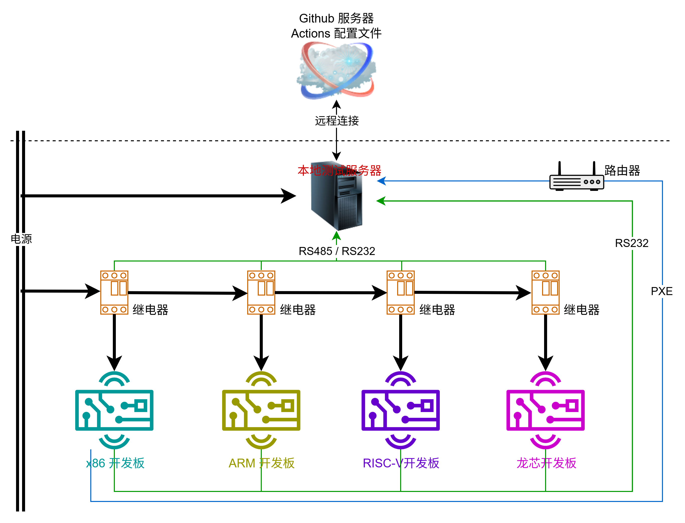

### 测试原理

当测试运行时，测试工具或脚本会将 AxVisor 固件通过相应接口加载到对应开发板中运行，同时，通过开发板 Debug 端口获取运行日志并分析运行结果。

- 对于采用 `U-Boot` 作为引导程序的开发板，我们借助于 U-Boot 中的串口（`loady`）命令或者网络（`TFTP`）就可以实现将测试固件加载到开发板内存中运行。

- 对于 x86 架构开发板，虽然其引导程序（BIOS）各厂家通常差别较大，但是，他们一般都支持 PXE 功能，我们借助于 PXE 服务器实现内核固件的加载及运行。

### 测试设备

整个测试环境中，测试设备实际上分为测试服务器，各种不同架构的开发板、路由器以及电源控制模块四个核心部分。

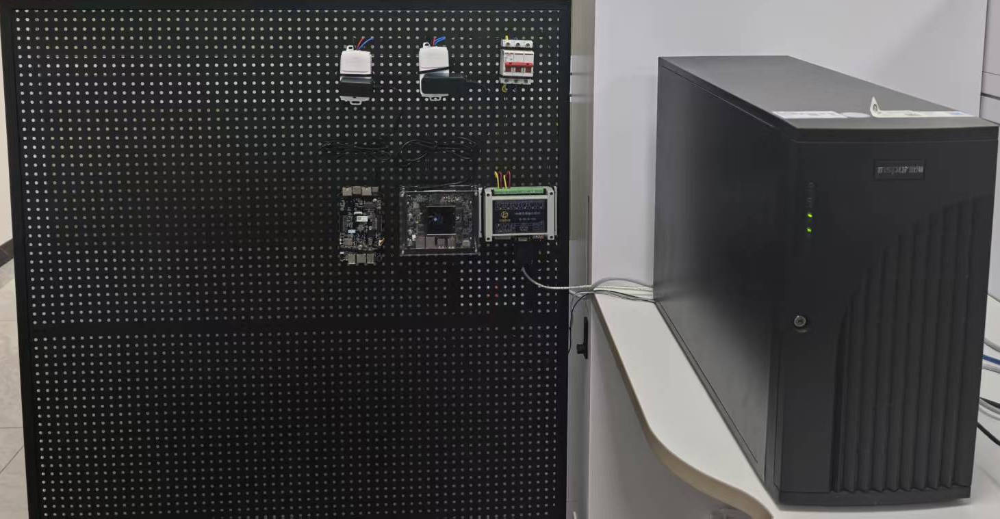

#### 测试服务器

测试服务器是整个测试环境的处理核心，它需要运行各种测试工具和脚本，同时，它还需要与各种测试设备进行通信。因此，测试服务器需要具备以下功能：

1. 运行测试工具和脚本，包括固件加载工具、固件编译工具、固件分析工具等。

2. 与各种测试设备进行通信，包括开发板、路由器以及电源控制模块等。

3. 提供固件编译、固件加载、固件分析等功能。

测试服务器上需要通过 USB 串口连接大量设备，因此，可能需要使用 USB Hub 将多个 USB 串口设备链接到测试服务器上。并且在测试服务器中清楚的区分各个串口设备，以便后续通过串口与各个设备进行通信。

#### 开发板

开发板是整个测试环境中的执行核心，它需要运行 AxVisor 固件，并且通过 Debug 接口将运行日志输出到本地测试服务器。因此，开发板需要具备以下功能：

1. 开发板需要支持串口通信，以便将运行日志输出到本地测试服务器。

2. 开发板通过本身的 Debug 接口经过 USB 转 TTL 工具与本地测试服务器相连。

#### 电源控制模块

电源控制模块用于控制测试设备的上电和断电。电源控制模块需要具备以下功能：

1. 支持通过串口与本地测试服务器通信，以便本地测试服务器通过串口控制电源控制模块。

#### 路由器

测试环境中的路由器主要用于实现开发板与本地测试服务器的网络连接。

1. 提供开发板固定的网络地址

2. 为 x86 设备提供 PXE 服务端地址

### 软件服务端

为了满足针对不同开发板的测试需求，本地服务器上需要部署各种软件服务端，以便为各种开发板提供资源。其中，最主要的一个就是针对 x86 架构开发板的固件加载服务端。

#### PXE 服务端

对于 x86 架构，我们需要通过 PXE 来实现内核固件的加载。PXE 规范描述了一个标准化的 **客户端 ↔ 服务器** 环境，通信过程使用的是 UDP/IP、DHCP、TFTP 等多个标准互联网协议。


x86 架构的引导程序（BIOS）中一般都集成了 PXE 客户端，我们需要提供一个服务端。目前，在 Linux 下没有类似于 Windows 下的 All in One 的工具，只能是分别搭建！

### 供电控制

在测试过程中，我们需要给测试设备执行重新上电等操作，因此，我们需要实现在本地测试服务器中通过命令手动控制测试设备上电的功能。我们需要一个电源控制模块，通过 USB 接口与本地测试服务器相连，通过串口与测试设备相连，实现上电和断电功能。

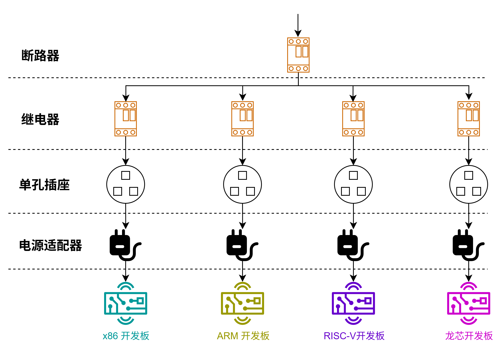

#### 断路器

最上级的断路器是整个测试环境的电源开关，用于控制整个测试环境的供电，同时也防止在出现短路情况时会影响外部环境。因此，该断路器的额定功率需要精心选择（负载电流不能小于所有设备的电流总和，也不能大于所有设备的电流总和太多），否则无法满足测试的保护要求。

#### 继电器

我们选择了中盛科技的数字量输入输出 IO 模块作为电源控制单元。该控制模块采用可选的 6 ~ 36V/24V/12V 直流供电，继电器输出测额定电流 5A/10A/16A/30A 可选。针对我们的测试环境，我们选择的是 6 ~ 36V 直流供电，继电器测输出 10A 电流的配置。

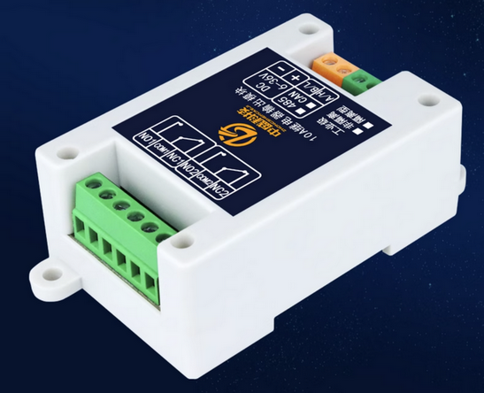

该数字量输入输出 IO 模块根据对外继电器接口不同提供了 RS485 和 RS232 两种通信方式，为了确保每个测试设备都能独立控制，我们为每个测试设备都配置了一个 1 路输出的电源控制模块，对于 1 路接口的模块，只有 RS485 通信接口可选。

#### 控制程序

中盛科技的数字量输入输出 IO 模块支持通过标准的 Modbus RTU 协议经 RS485 通信，通过串口与电源控制模块相连。在 Linux 中，有一个名为 `mbpoll` 的工具可以方便地通过 Modbus RTU 协议与设备进行通信。


因此，我们只需要在当前测试服务器中安装 `mbpoll` 工具即可通过串口与电源控制模块相连，实现上电和断电功能，而无需手动编写控制程序。

### 开发板

测试设备是要运行 AxVisor 的设备，目前包括一块 x86 开发板，一块飞腾派开发板，一块瑞芯微开发板。后续随着 AxVisor 的平台扩展逐步添加新的测试设备。不同的测试设备需要不同的 AxVisor 固件，此外，他们的 Debug 接口和固件加载方式也不相同。

#### ROC-RK3568-PC

[ROC-RK3568-PC](https://www.t-firefly.com/product/industry/rocrk3568pc.html) 是天启智能科技的 Filefly 团队推出的一款采用 RK3568 四核 64 位 Cortex-A55 处理器的嵌入式开发板。主频最高 2.0GHz、集成双核心架构 GPU 以及高效能 NPU；最大支持 8G 大内存；支持 WiFi6, 双千兆以太网。


##### 调试接口

使用 USB 转 TTL 工具将 ROC-RK3568-PC 上的 Debug 接口与本地测试服务器相连，默认串口参数 1500000 N 8 1。当系统运行时，运行日志将通过 Debug 接口直接输出到本地测试服务器。

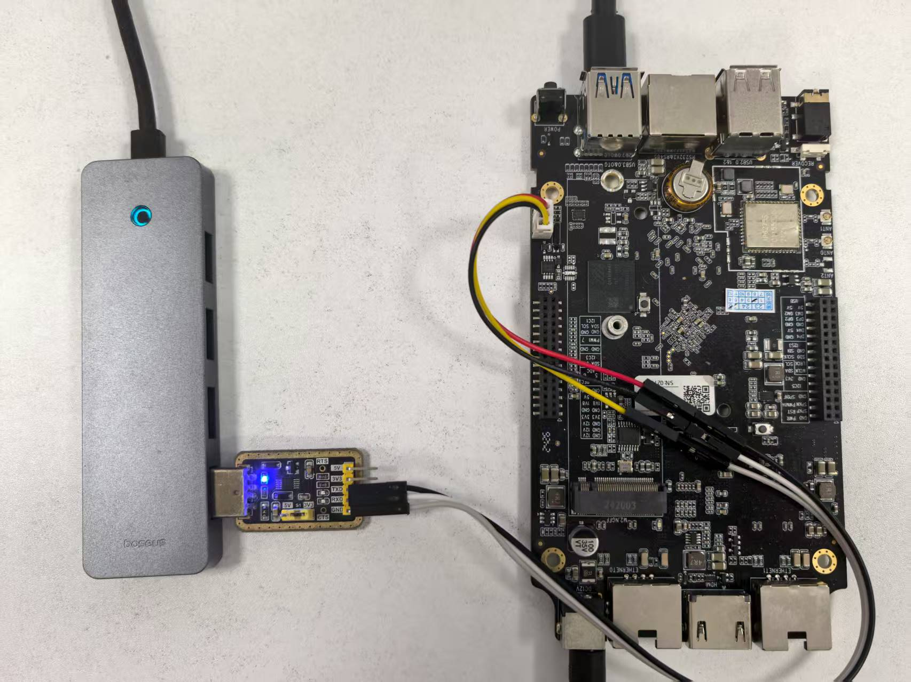

##### 固件加载

ROC-RK3568-PC 的启动固件默认使用 U-Boot 作为引导程序，我们通过 U-Boot 的 `loady` 功能将固件加载到 DDR 中运行。但是默认并不支持 `loady` 功能。因此，我们需要修改 SDK 源码中的 U-Boot 源码，添加 `loady` 功能，进而就可以借助 `loady` 功能通过 Debug 接口将测试固件直接加载到 DDR 中运行。

#### 飞腾派


##### 调试接口

使用 USB 转 TTL 工具将飞腾派上的 Debug 引脚与本地测试服务器相连，默认串口参数 115200 N 8 1。当系统运行时，运行日志就会通过 Debug 引脚直接输出到本地测试服务器。

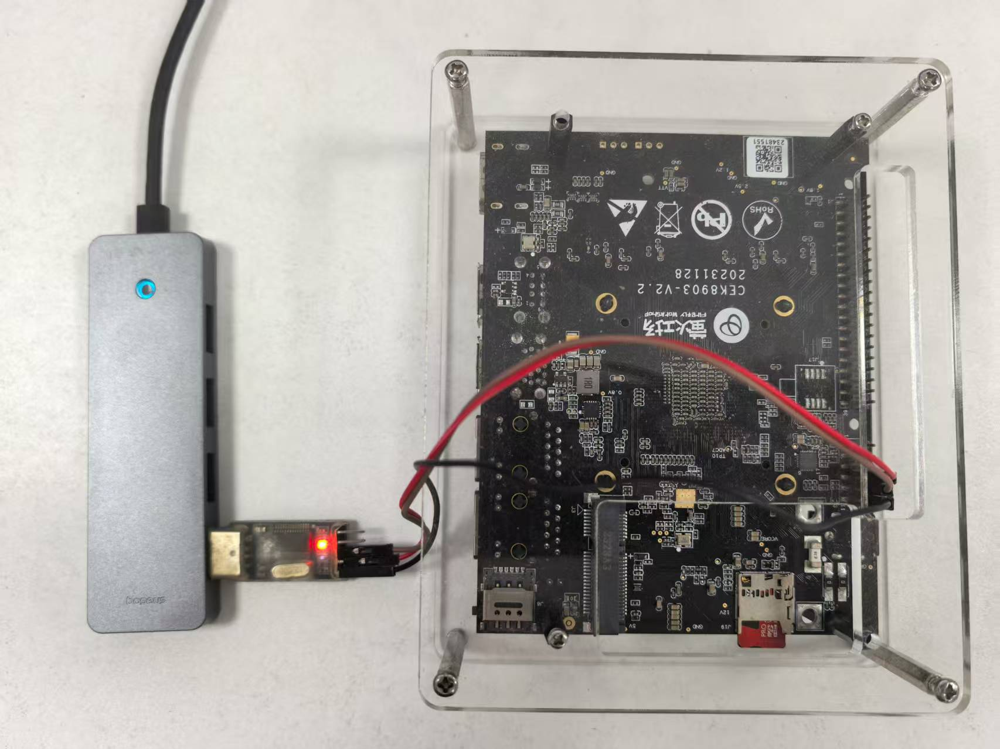

##### 固件加载

飞腾派的启动固件目前不开源，但是其默认也是采用 U-Boot 作为引导程序且支持 `loady` 功能，因此，我们可以直接借助 U-Boot 的 `loady` 功能将固件加载到 DDR 中运行。

由于，飞腾派的调试串口默认的波特率太低，加载镜像时间太长，不过其 U-Boot 默认支持网络，因此，我们可以直接借助于网口来实现固件加载。

#### x86 开发板

TODO

##### 固件加载

x86 平台的引导程序（BIOS）各厂家通常差别较大，但是，他们一般都支持 PXE 功能，因此，我们通过 PXE 来实现测试固件的加载。

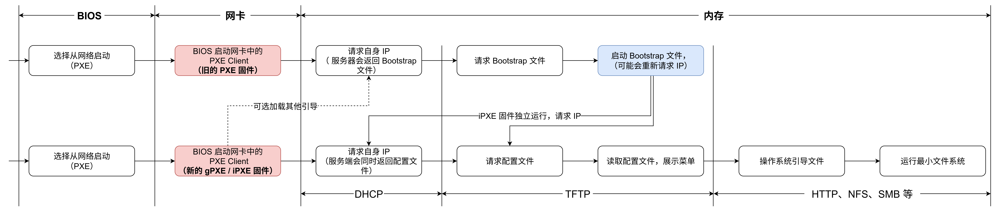

## 注册 Runner 服务器

Github Actions 本身支持使用自定义服务器（Runners）来运行所有的 Action 命令。因此，我们可以将本地服务器注册为 Github Actions 的 Runner 服务器，从而直接在源码仓库中执行 CI 测试，最终实现自动化测试。


我们可以选择为仓库单独注册自定义服务器，也可以为组织注册全局的自定义服务器，然后分配给该组织下的所有或者部分仓库使用。官方也有详细的教程 https://docs.github.com/zh/actions/how-tos/manage-runners/self-hosted-runners/configure-the-application ，下面是注册的详细步骤。

1. 在仓库或者组织的设置界面中找到 Action 配置界面。在仓库的 `Runners` 界面中选择 `New self-hosted runner` 或者在组织的 `Runners` 界面 `New runner`，然后选择 `New self-hosted runner` 来进行创建。

    

	组织的 Runner 配置界面的另一个选项 `New Github-hosted runner` 是对于付费的组织额外增加 Github 官方的 Runner 服务器的。

2. 选择 `New self-hosted runner` 之后，Github 会给出针对 macOS、Linux、Windows（默认） 三个平台的详细的操作步骤。仓库独立 Runner 和 组织的全局 Runner 部署方式是一模一样的，参照步骤部署配置即可。

    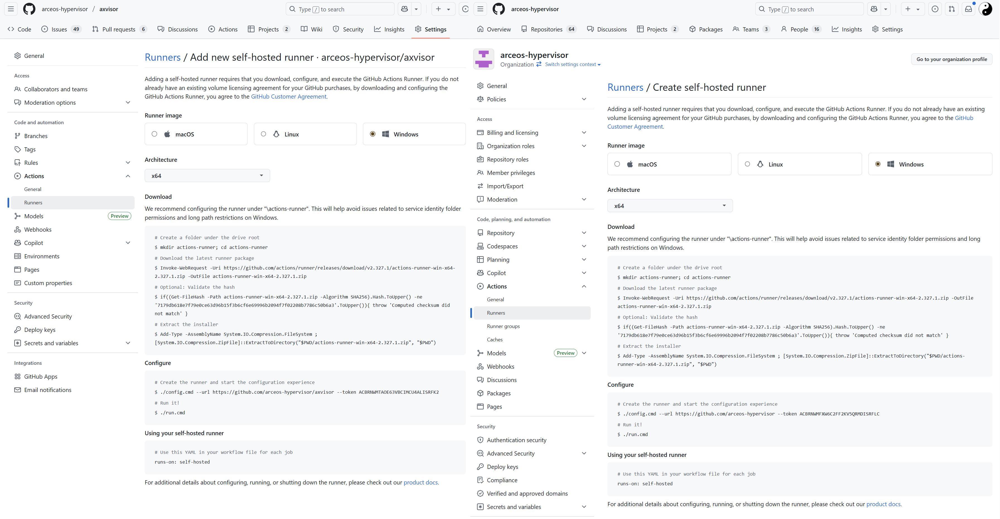

    下面以 Linux 系统为例，来进行部署过程的验证

    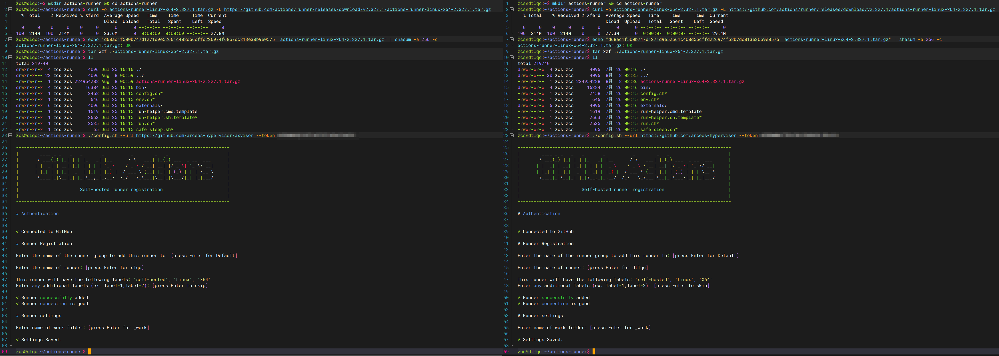

	1. 在执行 `./config.sh --url https://github.com/arceos-hypervisor/axvisor --token 上一步页面中给出的Token` 完成配置前不要刷新界面，否则其中的 token 会被改变

	2. 下载的 Runner 压缩包只能配置一为一个 Runner 服务器（需要注销旧的才能重新注册成新的）。如果同时为不同的仓库或者组织配置 Runner 服务器，则需要下载多份，然后分别配置

	3. 在删除时还需要输入 Token 进行确认，也可以直接在仓库或者组织的 Runner 界面中强制删除！
 
    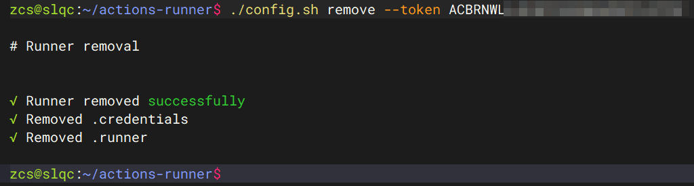

3. 直接执行 `./run.sh` 启动 Runner，并自动连接到 Github，不过，此时将阻塞当前 Shell，如果关闭 Shell 则将停止运行。更直接的方法是使用 `sudo ./svc.sh install` 直接安装为系统服务。

    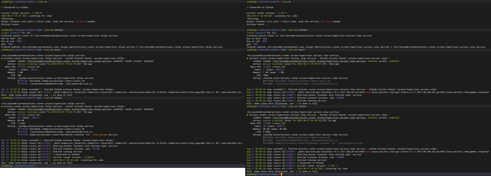

	- 注意，如果以普通用户启动，在实际使用中会提示输入用户密码
	
4. 当最后配置完成后，重新点击 Runner 菜单（新增界面没有返回按钮）返回到 Runner 配置界面，就会显示我们的自定义服务器。可以点击每个自定义服务器进行一些设置！

    

	- **Idle**：Runner 已连接到 GitHub，并已准备好执行作业。

	- **Active**：Runner 当前正在执行作业。

	- **Offline**：Runner 未连接到 GitHub。 这可能是因为机器处于离线状态，自托管 Runner 应用程序未在机器上运行，或者自托管 Runner 应用程序无法与 GitHub 通信。

	对于组织来说，需要在 `Runner groups` 界面中进一步将配置的 `Runners` 服务器分配给不同的仓库。默认情况下自定义 Runner 被放在了 Default 分组中，Default 分组对 public 的仓库是禁用的，需要手动启用

    

### 基于 Docker 的 Runner 服务器

官方提供的 self-hosted Runner 可执行程序是一个 Go 应用程序，默认直接运行与本地服务器，这会导致一些安全问题。此外，一个 Runner 可执行程序只能注册一个 Runner，不利于并行处理作业。

基于 Docker 部署则可以避免一些安全问题，并且每个容器对应一个 Runner，方便并行处理作用！为此，我们提供了一套完整的基于 Docker 的 Runner 服务器部署脚本，可以方便地一键部署多个 Runner 服务器。脚本可以从 https://github.com/arceos-hypervisor/github-runners 下载。

```bash
runner@s1lqc:~/github-runners$ ./runner.sh 
Usage: ./runner.sh COMMAND [options]    Where [options] depend on COMMAND. Available COMMANDs:

1. Creation commands:
  ./runner.sh init -n N                            Generate docker-compose.yml then create runners and start
  ./runner.sh compose                              Regenerate docker-compose.yml with existing generic and board-specific runners

2. Instance operation commands:
  ./runner.sh register [s1lqc-runner-<id> ...]     Register specified instances; no args will iterate over all existing instances
  ./runner.sh start [s1lqc-runner-<id> ...]        Start specified instances (will register if needed); no args will iterate all existing instances
  ./runner.sh stop [s1lqc-runner-<id> ...]         Stop Runner containers; no args will iterate all existing instances
  ./runner.sh restart [s1lqc-runner-<id> ...]      Restart specified instances; no args will iterate all existing instances
  ./runner.sh log s1lqc-runner-<id>                Follow logs of a specified instance

3. Query commands:
  ./runner.sh ps|ls|list|status                    Show container status and registered Runner status

4. Deletion commands:
  ./runner.sh rm|remove|delete [s1lqc-runner-<id> ...] Delete specified instances; no args will delete all (confirmation required, -y to skip)
  ./runner.sh purge [-y]                           On top of remove, also delete the dynamically generated docker-compose.yml

5. Image management commands:
  ./runner.sh image                                Rebuild Docker image based on Dockerfile

6. Help
  ./runner.sh help                                 Show this help

Environment variables (from .env or interactive input):
  GH_PAT                   Classic PAT (requires admin:org), used for org API and registration token
  ORG                      Organization name or user name (required)
  REPO                     Optional repository name (when set, operate on repo-scoped runners under ORG/REPO instead of organization-wide runners)
  RUNNER_NAME_PREFIX       Runner name prefix
  RUNNER_IMAGE             Image used for compose generation (default ghcr.io/actions/actions-runner:latest)
  RUNNER_CUSTOM_IMAGE      Image tag used for auto-build (can override)

Example workflow runs-on: runs-on: [self-hosted, linux, docker]

Tips:
- docker-compose.yml must exist. The script will not generate or modify it.
- Re-start/up will reuse existing volumes; Runner configuration and tool caches will not be lost.
runner@s1lqc:~/github-runners$ 
```

### 使用自定义 Runner 服务器

要使用自定义 Runner 服务器，我们只需要将源码仓库中的 Actions 配置文件中的 `runs-on` 字段设置为 `self-hosted`（`runs-on: self-hosted`）即可，不需要其他任何更改。

实际上，GitHub 是根据 `runs-on` 中的内容来匹配 Runner 的标签，因此可以指定更多标签来进行精确匹配（`runs-on: [self-hosted, linux, ARM64]`）！

- 如果 GitHub 找到一个在线的空闲 Runner 与作业的 `runs-on` 标签和组匹配，则作业将分配并发送到该 Runner。

    - 如果 Runner 在 60 秒内未收到分配的任务，任务将被重新排队，以便新的 Runner 能够接纳它。

- 如果 GitHub 找不到与作业的 `runs-on` 标签和组匹配的在线和空闲 Runner，则作业将继续排队，直到某个 Runner 上线为止。

- 如果作业排队的时间超过 24 小时，则作业将失败。

> 注意，要正常运行 Actions 过程，需要在自定义服务器上安装一些依赖包

## 遗留问题

1. 由于测试过程需要共用硬件资源，因此需要实现多个测试任务之间的资源隔离，防止相互干扰。

2. 部分开发板可以优化为使用网络传输固件