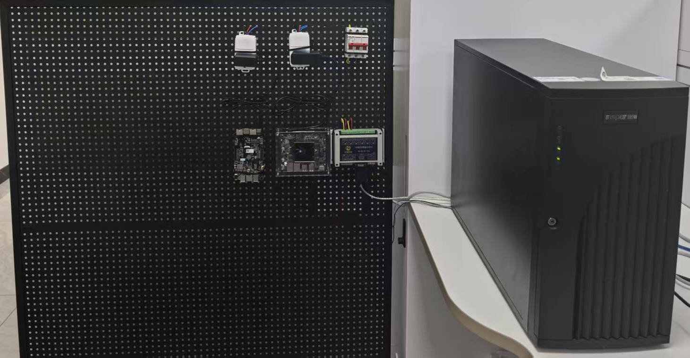
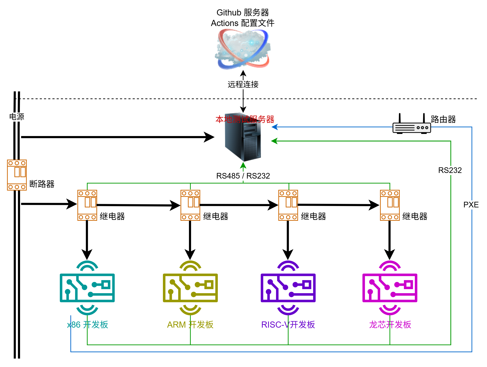

# 整体环境

由于 AxVisor 本身是一个运行于各种硬件平台的 Hypervisor，直接使用 Gihub 提供的 Action 脚本命令执行服务器（官方称为 Runner）无法满足我们的测试需求，因此，需要将测试本地化，在本地服务器上执行所有测试过程。

## 总体框架

本地通过一台运行 Ubuntu 24.04 LTS 系统的专用的服务器来执行测试任务。该服务器通过 USB 及网口与其他各种控制设备和测试设备相连，进而控制测试过程。整体集成测试环境框图如下所示：

## 测试设备

测试设备是整个测试环境中的执行核心，它需要运行 AxVisor 固件，并且通过 Debug 接口将运行日志输出到本地测试服务器。因此，测试设备需要具备以下功能：

1. 测试设备需要支持串口通信，以便将运行日志输出到本地测试服务器。

2. 测试设备通过本身的 Debug 接口经过 USB 转 TTL 工具与本地测试服务器相连。

### 测试服务器

测试服务器是整个测试环境的处理核心，它需要运行各种测试工具和脚本，同时，它还需要与各种测试设备进行通信。因此，测试服务器需要具备以下功能：

1. 运行测试工具和脚本，包括固件加载工具、固件编译工具、固件分析工具等。

2. 与各种测试设备进行通信，包括开发板、路由器以及电源控制模块等。

3. 提供固件编译、固件加载、固件分析等功能。

测试服务器上需要通过 USB 串口连接大量设备，因此，可能需要使用 USB Hub 将多个 USB 串口设备链接到测试服务器上。并且在测试服务器中清楚的区分各个串口设备，以便后续通过串口与各个设备进行通信。

### 开发板

开发板是整个测试环境中的执行核心，它需要运行 AxVisor 固件，并且通过 Debug 接口将运行日志输出到本地测试服务器。因此，开发板需要具备以下功能：

1. 开发板需要支持串口通信，以便将运行日志输出到本地测试服务器。

2. 开发板通过本身的 Debug 接口经过 USB 转 TTL 工具与本地测试服务器相连。

## 控制设备

控制设备是整个测试环境中的辅助设备，它需要控制开发板的上电和断电，以便在开发板启动和关闭时，测试服务器能够正确地捕获到开发板的启动和关闭日志。因此，控制设备需要具备以下功能：

1. 控制开发板上电和断电，以便测试服务器能够正确地捕获到开发板的启动和关闭日志。

2. 通过 USB 串口与本地测试服务器通信，以便本地测试服务器通过串口控制控制设备。

### 电源控制模块

电源控制模块用于控制测试设备的上电和断电。电源控制模块需要具备以下功能：

1. 支持通过串口与本地测试服务器通信，以便本地测试服务器通过串口控制电源控制模块。

### 路由器

测试环境中的路由器主要用于实现开发板与本地测试服务器的网络连接。

1. 提供开发板固定的网络地址

2. 为 x86 设备提供 PXE 服务端地址

## 软件服务端

为了满足针对不同开发板的测试需求，本地服务器上需要部署各种软件服务端，以便为各种开发板提供资源。其中，最主要的一个就是针对 x86 架构开发板的固件加载服务端。

### PXE 服务端

对于 x86 架构，我们需要通过 PXE 来实现内核固件的加载。PXE 规范描述了一个标准化的 **客户端 ↔ 服务器** 环境，通信过程使用的是 UDP/IP、DHCP、TFTP 等多个标准互联网协议。

x86 架构的引导程序（BIOS）中一般都集成了 PXE 客户端，我们需要提供一个服务端。目前，在 Linux 下没有类似于 Windows 下的 All in One 的工具，只能是分别搭建！

## 设备列表

| 名称 | 链接 |
| --- | --- |
| USB转TTL串口模块 | [京东](https://item.jd.com/100018523151.html?spmTag=YTAyNDAuYjAwMjQ5My5jMDAwMDQwMjcuMSUyM3NrdV9jYXJk) |
| 继电器 | [京东](https://item.jd.com/10097683135285.html) |
| 单孔插座 | [京东](https://item.jd.com/100311081672.html?pcdk=vMR-sqxpE2tCoXSZM1ofFJc_r-QGAeKfIL6pac7YtZI%3D.M8AW.sbc1) |
| 电源插头 | [京东](https://item.jd.com/18230802111.html) |
| 多芯铜线 | [京东](https://item.jd.com/100149590048.html?spmTag=YTAyNDAuYjAwMjQ5My5jMDAwMDQwMjcuMTAlMjNza3VfY2FyZA&pcdk=F-20vN74l_cE_s0fEhM0_OTtKo7rwatdEdLeHNwrNLhw5cxftcnGZ1FNP-SBKMZe.rQ4a.tlbT) |
| 单芯铜线1.5平方毫米 x 5m （黄、绿、红、蓝、黑 各1个） | [京东](https://item.jd.com/10205689004518.html?spmTag=YTAyNDAuYjAwMjQ5My5jMDAwMDQwMjcuNCUyM3NrdV9jYXJk&pcdk=bRpQyzTuqdlU7s5o6dUNAhFLlaRC6jfQGZI1WkXz8STMZ6W4fmiONAQn7f5W91ve.rQ4a.tlbT) |
| 插座 | [京东](https://item.jd.com/4144407.html?spmTag=YTAyNDAuYjAwMjQ5My5jMDAwMDQwMjcuMSUyM3NrdV9jYXJk) |
| 杜邦线公对母 10P 1米 | [京东](https://item.jd.com/10096789079817.html?spmTag=YTAyNDAuYjAwMjQ5My5jMDAwMDQwMjcuMyUyM3NrdV9jYXJk&pcdk=jcnIIu3m7b1X6gLVXdlC-2DToZI3w8vgE6q4sMaArIW41ct2Szzj8PRJXwVZSFlJ.rQ4a.tlbT) |
| 串口转换器（USB TO RS485） | [京东](https://item.jd.com/100032798844.html?spmTag=YTAyNDAuYjAwMjQ5My5jMDAwMDQwMjcuMTAlMjNza3VfY2FyZA) |
| 普联（TP-LINK） 云交换TL-SG2016K 16口全千兆Web网管 云管理交换机 企业级交换器 监控网络网线分线器 分流器 | [京东](https://item.jd.com/100020659606.html?pcdk=Dk_1U__WOd6oIsvxhb60LgrageaMxKTeWHFKXmiagcDmiRqmhUE0ag0gJt-aWAPL.rQ4a.tlbT&spmTag=YTAyMTkuYjAwMjM1Ni5jMDAwMDcyMTAua2V5d29yZF9lbnRlciUyQ2EwMjQwLmIwMDI0OTMuYzAwMDA0MDI3LjUlMjNza3VfY2FyZA#switch-sku) |
| 西普莱（SIPOLAR）A-223工业级20口USB3.0集线器扩展坞手机平板刷机充电单口2A电流内置200W电源大功率hub分线器 1M数据线 A-223 | [京东](https://item.jd.com/16097624301.html?pcdk=sn-3W_1P4mUm3DBFokCEXMUdAoI5E2KlmKIYrSjrnDCG15rQkc_UpQrtEodqnOeH.3z6a.aI3x&spmTag=YTAyNDAuYjAwMjQ5My5jMDAwMDQwMjcuMyUyM3NrdV9jYXJk) |
