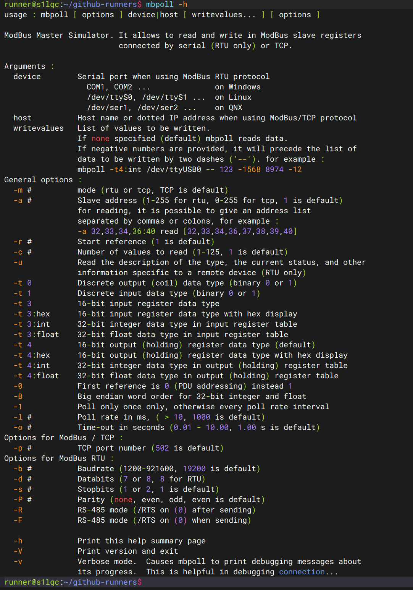

# 供电控制

在测试过程中，我们需要给测试设备执行重新上电等操作，因此，我们需要实现在本地测试服务器中通过命令手动控制测试设备上电的功能。我们需要一个电源控制模块，通过 USB 接口与本地测试服务器相连，通过串口与测试设备相连，实现上电和断电功能。

## 断路器

最上级的断路器是整个测试环境的电源开关，用于控制整个测试环境的供电，同时也防止在出现短路情况时会影响外部环境。因此，该断路器的额定功率需要精心选择（负载电流不能小于所有设备的电流总和，也不能大于所有设备的电流总和太多），否则无法满足测试的保护要求。

## 继电器

我们选择了中盛科技的数字量输入输出 IO 模块作为电源控制单元。该控制模块采用可选的 6 ~ 36V/24V/12V 直流供电，继电器输出测额定电流 5A/10A/16A/30A 可选。针对我们的测试环境，我们选择的是 6 ~ 36V 直流供电，继电器测输出 10A 电流的配置。

该数字量输入输出 IO 模块根据对外继电器接口不同提供了 RS485 和 RS232 两种通信方式，为了确保每个测试设备都能独立控制，我们为每个测试设备都配置了一个 1 路输出的电源控制模块，对于 1 路接口的模块，只有 RS485 通信接口可选。

## 控制程序

中盛科技的数字量输入输出 IO 模块支持通过标准的 Modbus RTU 协议经 RS485 通信，通过串口与电源控制模块相连。在 Linux 中，有一个名为 `mbpoll` 的工具可以方便地通过 Modbus RTU 协议与设备进行通信。

因此，我们只需要在当前测试服务器中安装 `mbpoll` 工具即可通过串口与电源控制模块相连，实现上电和断电功能，而无需手动编写控制程序。

