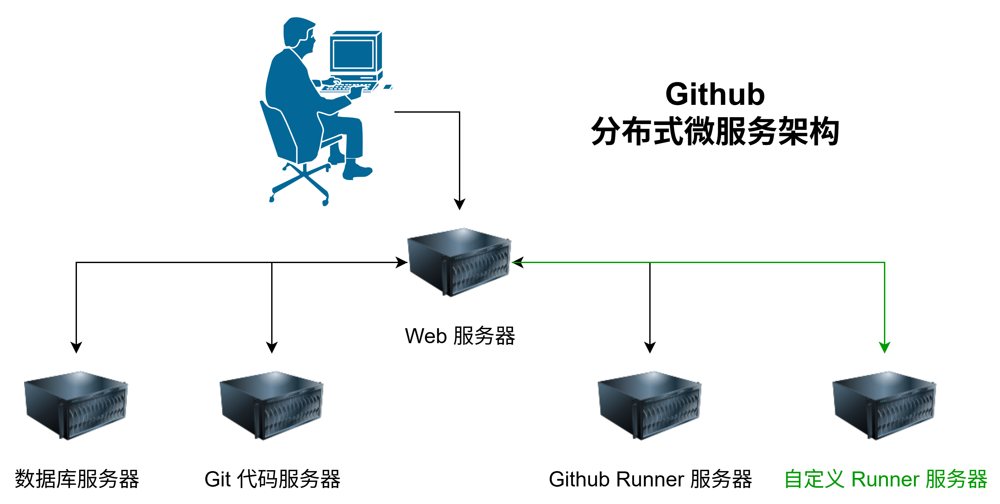
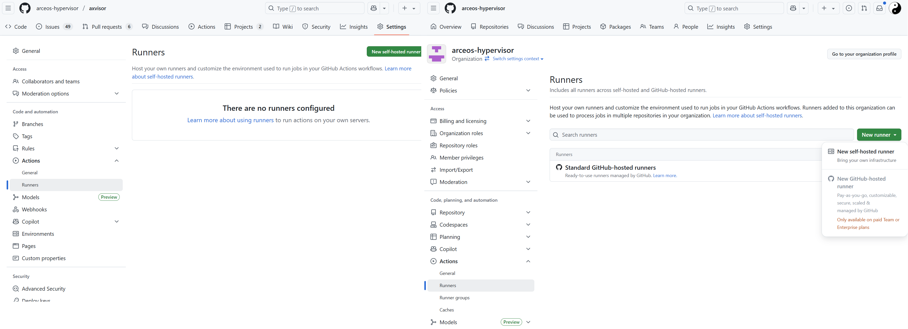
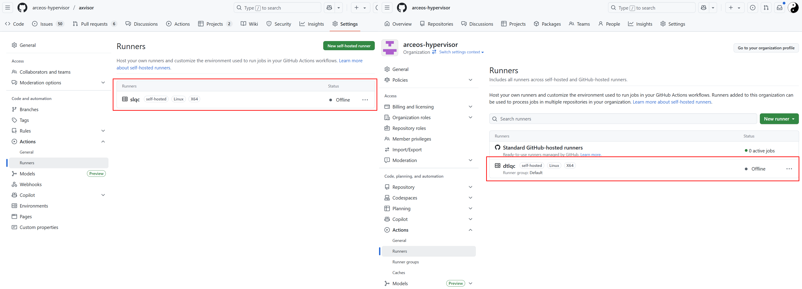
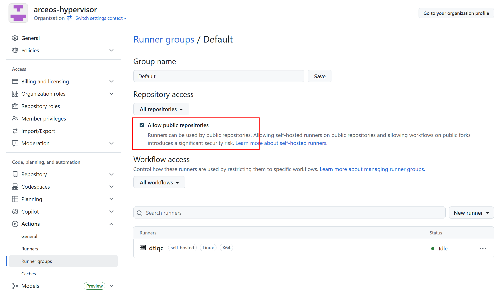

# 注册 Runner 服务器

Github Actions 本身支持使用自定义服务器（Runners）来运行所有的 Action 命令。因此，我们可以将本地服务器注册为 Github Actions 的 Runner 服务器，从而直接在源码仓库中执行 CI 测试，最终实现自动化测试。



我们可以选择为仓库单独注册自定义服务器，也可以为组织注册全局的自定义服务器，然后分配给该组织下的所有或者部分仓库使用。官方也有详细的教程 https://docs.github.com/zh/actions/how-tos/manage-runners/self-hosted-runners/configure-the-application ，下面是注册的详细步骤。

## 直接部署

直接部署是指直接在硬件服务器上部署 Github Actions 的 Runner 服务器，Runner 服务器直接访问服务器硬件资源。

### 获取 Runner 程序

1. 在仓库或者组织的设置界面中找到 Action 配置界面。在仓库的 `Runners` 界面中选择 `New self-hosted runner` 或者在组织的 `Runners` 界面 `New runner`，然后选择 `New self-hosted runner` 来进行创建。

    

	组织的 Runner 配置界面的另一个选项 `New Github-hosted runner` 是对于付费的组织额外增加 Github 官方的 Runner 服务器的。

2. 选择 `New self-hosted runner` 之后，Github 会给出针对 macOS、Linux、Windows（默认） 三个平台的详细的操作步骤。仓库独立 Runner 和 组织的全局 Runner 部署方式是一模一样的，参照步骤部署配置即可。

    

### 本地配置

1. 下载的 Runner 压缩包中包含一个 `config.sh` 脚本，执行该脚本可以完成 Runner 服务器的配置。`--url` 参数为 Github 仓库或者组织的 URL，`--token` 参数为 Github 提供的 Token，`--name` 参数为 Runner 的名称，`--labels` 参数为 Runner 的标签，`--ephemeral` 参数为是否为临时 Runner，`--work` 参数为 Runner 的工作目录。

    下面以 Linux 系统为例，来进行部署过程的验证

    

    1. 在执行 `./config.sh --url https://github.com/arceos-hypervisor/axvisor --token 上一步页面中给出的Token` 完成配置前不要刷新界面，否则其中的 token 会被改变

    2. 下载的 Runner 压缩包只能配置一为一个 Runner 服务器（需要注销旧的才能重新注册成新的）。如果同时为不同的仓库或者组织配置 Runner 服务器，则需要下载多份，然后分别配置

    3. 在删除时还需要输入 Token 进行确认，也可以直接在仓库或者组织的 Runner 界面中强制删除！

        


3. 直接执行 `./run.sh` 启动 Runner，并自动连接到 Github，不过，此时将阻塞当前 Shell，如果关闭 Shell 则将停止运行。更直接的方法是使用 `sudo ./svc.sh install` 直接安装为系统服务。

    

	- 注意，如果以普通用户启动，在实际使用中会提示输入用户密码
	
4. 当最后配置完成后，重新点击 Runner 菜单（新增界面没有返回按钮）返回到 Runner 配置界面，就会显示我们的自定义服务器。可以点击每个自定义服务器进行一些设置！

    

	- **Idle**：Runner 已连接到 GitHub，并已准备好执行作业。

	- **Active**：Runner 当前正在执行作业。

	- **Offline**：Runner 未连接到 GitHub。 这可能是因为机器处于离线状态，自托管 Runner 应用程序未在机器上运行，或者自托管 Runner 应用程序无法与 GitHub 通信。

	对于组织来说，需要在 `Runner groups` 界面中进一步将配置的 `Runners` 服务器分配给不同的仓库。默认情况下自定义 Runner 被放在了 Default 分组中，Default 分组对 public 的仓库是禁用的，需要手动启用

    

## 基于 Docker 部署

官方提供的 self-hosted Runner 可执行程序是一个 Go 应用程序，默认直接运行与本地服务器，这会导致一些安全问题。此外，一个 Runner 可执行程序只能注册一个 Runner，不利于并行处理作业。

### docker 镜像

Github 官方发布了基于 Docker 的 Runner 镜像 https://github.com/actions/runner/pkgs/container/actions-runner ，可以直接使用 `docker pull` 命令下载使用。

但是，针对我们当前的测试环境，原始的镜像中软件包比较少，需要手动安装一些软件包，因此我们基于原始镜像制作了一个新的镜像，其中包含了一些常用的软件包，方便后续使用。

```Dockefile
# Custom Actions Runner with QEMU and build tools
# Base image: official GitHub Actions runner
FROM ghcr.io/actions/actions-runner:latest

# Switch to root to install packages
USER root

ENV DEBIAN_FRONTEND=noninteractive

# Install common build tools and dependencies
# - build-essential: gcc, g++, make, libc dev headers
# - binfmt-support: helpers for binfmt_misc (host typically manages handlers)
# - Additional dependencies for building QEMU from source
RUN apt-get update \
    && apt-get install -y --no-install-recommends \
       build-essential \
       pkg-config \
       git \
       ca-certificates \
       binfmt-support \
       dosfstools \
       python3-venv \
       udev \
       libudev-dev \
       openssl \
       libssl-dev \
       xxd \
       wget \
       mbpoll \
       flex \
       bison \
       libelf-dev \
       gcc-aarch64-linux-gnu \
       g++-aarch64-linux-gnu \
       gcc-riscv64-linux-gnu \
       g++-riscv64-linux-gnu \
       bc \
       fakeroot \
       coreutils \
       cpio \
       gzip \
       debootstrap \
       debian-archive-keyring \
       eatmydata \
       file \
       rsync \
       # Additional dependencies for QEMU compilation
       libglib2.0-dev \
       libfdt-dev \
       libpixman-1-dev \
       zlib1g-dev \
       libnfs-dev \
       libiscsi-dev \
       python3-dev \
       python3-pip \
       python3-tomli \
       python3-sphinx \
       ninja-build \
    && rm -rf /var/lib/apt/lists/*

# Build and install QEMU 10.1.2 from source 
RUN mkdir -p /tmp/qemu-build \
    && cd /tmp/qemu-build \
    && wget https://download.qemu.org/qemu-10.1.2.tar.xz \
    && tar -xf qemu-10.1.2.tar.xz \
    && cd qemu-10.1.2 \
    && ./configure \
        --enable-kvm \
        --disable-docs \
        --enable-virtfs \
    && make -j$(nproc) \
    && make install \
    && cd / \
    && rm -rf /tmp/qemu-build

# 串口访问只能是 root 和 dialout 组，这里直把 runner 用户加入 dialout 组
RUN usermod -aG dialout runner
RUN usermod -aG kvm runner

# Return to the default user expected by the runner image
USER runner

#  Rust development for runner user
ENV PATH=/home/runner/.cargo/bin:$PATH \
    RUST_VERSION=nightly

RUN set -eux; \
    dpkgArch="$(dpkg --print-architecture)"; \
    case "${dpkgArch##*-}" in \
        amd64) rustArch='x86_64-unknown-linux-gnu'; rustupSha256='20a06e644b0d9bd2fbdbfd52d42540bdde820ea7df86e92e533c073da0cdd43c' ;; \
        armhf) rustArch='armv7-unknown-linux-gnueabihf'; rustupSha256='3b8daab6cc3135f2cd4b12919559e6adaee73a2fbefb830fadf0405c20231d61' ;; \
        arm64) rustArch='aarch64-unknown-linux-gnu'; rustupSha256='e3853c5a252fca15252d07cb23a1bdd9377a8c6f3efa01531109281ae47f841c' ;; \
        i386) rustArch='i686-unknown-linux-gnu'; rustupSha256='a5db2c4b29d23e9b318b955dd0337d6b52e93933608469085c924e0d05b1df1f' ;; \
        *) echo >&2 "unsupported architecture: ${dpkgArch}"; exit 1 ;; \
    esac; \
    url="https://static.rust-lang.org/rustup/archive/1.28.2/${rustArch}/rustup-init"; \
    wget "$url"; \
    echo "${rustupSha256} *rustup-init" | sha256sum -c -; \
    chmod +x rustup-init; \
    ./rustup-init -y --no-modify-path --profile minimal --default-toolchain $RUST_VERSION --default-host ${rustArch}; \
    rm rustup-init; \
    rustup --version; \
    cargo --version; \
    rustc --version;

# Install additional Rust toolchains
RUN rustup toolchain install nightly-2025-05-20

# Install additional targets and components 
RUN rustup target add aarch64-unknown-none-softfloat \
    riscv64gc-unknown-none-elf \
    x86_64-unknown-none \
    loongarch64-unknown-none-softfloat --toolchain nightly-2025-05-20
RUN rustup target add aarch64-unknown-none-softfloat \
    riscv64gc-unknown-none-elf \
    x86_64-unknown-none \
    loongarch64-unknown-none-softfloat --toolchain nightly

RUN rustup component add clippy llvm-tools rust-src rustfmt --toolchain nightly-2025-05-20
RUN rustup component add clippy llvm-tools rust-src rustfmt --toolchain nightly

# Add Rust mirror configuration to ~/.cargo/config.toml
RUN echo '[source.crates-io]\nreplace-with = "rsproxy-sparse"\n[source.rsproxy]\nregistry = "https://rsproxy.cn/crates.io-index"\n[source.rsproxy-sparse]\nregistry = "sparse+https://rsproxy.cn/index/"\n[registries.rsproxy]\nindex = "https://rsproxy.cn/crates.io-index"\n[net]\ngit-fetch-with-cli = true' > /home/runner/.cargo/config.toml

RUN cargo install cargo-binutils
```

### 获取注册令牌

注册令牌可以通过以下几种方式获取：

1. **手动获取**：
   - 访问 GitHub 仓库或组织的设置页面
   - 导航到 Actions > Runners
   - 点击 "New self-hosted runner"
   - 复制显示的令牌。注意，令牌有效期！

2. **通过 GitHub API 获取**（方便用于自动化）：
 
   ```bash
   # 对于组织级别的 runner
   curl -X POST -H "Authorization: token YOUR_PAT" \
     https://api.github.com/orgs/your-org/actions/runners/registration-token
   
   # 对于仓库级别的 runner
   curl -X POST -H "Authorization: token YOUR_PAT" \
     https://api.github.com/repos/your-username/your-repo/actions/runners/registration-token
   ```

   其中，`YOUR_PAT` 是在自己的 Github 账户中配置的个人访问令牌（Personal Access Token）。

### 配置启动

最简单的启动方式是直接使用 docker run 命令：

```bash
docker run -d \
  --name my-runner \
  -e REPO_URL=https://github.com/your-username/your-repo \
  -e RUNNER_NAME=my-runner \
  -e RUNNER_TOKEN=your-token \
  -e RUNNER_WORKDIR=/tmp/github-runner-workdir \
  ghcr.io/actions/actions-runner:latest
```

更推荐的方式是使用 Docker Compose，这样可以更好地管理配置和持久化数据：

```yaml
version: '3.8'

services:
  github-runner:
    image: ghcr.io/actions/actions-runner:latest
    container_name: my-runner
    restart: unless-stopped
    environment:
      - REPO_URL=https://github.com/your-username/your-repo
      - RUNNER_NAME=my-runner
      - RUNNER_TOKEN=your-token
      - RUNNER_WORKDIR=/tmp/github-runner-workdir
      - RUNNER_GROUP=default
      - LABELS=self-hosted,linux,docker
    volumes:
      - /var/run/docker.sock:/var/run/docker.sock
      - runner-work:/tmp/github-runner-workdir
    privileged: true  # 如果需要在容器内运行 Docker

volumes:
  runner-work:
```

#### 环境变量

GitHub Actions runner Docker 镜像支持以下主要环境变量：

| 环境变量 | 必需 | 描述 | 示例 |
|---------|------|------|------|
| `REPO_URL` | 是 | GitHub 仓库或组织的 URL | `https://github.com/myorg/myrepo` |
| `RUNNER_NAME` | 否 | Runner 的名称 | `my-runner` |
| `RUNNER_TOKEN` | 是 | 注册 Runner 所需的令牌 | `AABBCCDD...` |
| `RUNNER_WORKDIR` | 否 | Runner 的工作目录 | `/tmp/github-runner-workdir` |
| `RUNNER_GROUP` | 否 | Runner 所属的组 | `default` |
| `LABELS` | 否 | Runner 的标签 | `self-hosted,linux,docker` |
| `EPHEMERAL` | 否 | 是否为临时 Runner | `true`/`false` |
| `DISABLE_AUTO_UPDATE` | 否 | 是否禁用自动更新 | `true`/`false` |


#### 注意事项

1. **权限问题**：如果需要在容器内运行 Docker，需要使用 `--privileged` 标志或适当配置 Docker socket 挂载。

2. **安全性**：避免在代码或配置文件中硬编码令牌，使用环境变量或密钥管理系统。

3. **持久化**：确保工作目录和重要数据通过卷进行持久化，以避免数据丢失。

4. **网络**：确保容器可以访问 GitHub API 和必要的资源。

### github-runners 脚本

为了简化配置过程，我们提供了一套完整的基于 Docker 的 Runner 服务器部署脚本，可以方便地一键部署多个 Runner 服务器。脚本可以从 https://github.com/arceos-hypervisor/github-runners 下载。

```bash
runner@s1lqc:~/github-runners$ ./runner.sh 
Usage: ./runner.sh COMMAND [options]    Where [options] depend on COMMAND. Available COMMANDs:

1. Creation commands:
  ./runner.sh init -n N                            Generate docker-compose.yml then create runners and start
  ./runner.sh compose                              Regenerate docker-compose.yml with existing generic and board-specific runners

2. Instance operation commands:
  ./runner.sh register [s1lqc-runner-<id> ...]     Register specified instances; no args will iterate over all existing instances
  ./runner.sh start [s1lqc-runner-<id> ...]        Start specified instances (will register if needed); no args will iterate all existing instances
  ./runner.sh stop [s1lqc-runner-<id> ...]         Stop Runner containers; no args will iterate all existing instances
  ./runner.sh restart [s1lqc-runner-<id> ...]      Restart specified instances; no args will iterate all existing instances
  ./runner.sh log s1lqc-runner-<id>                Follow logs of a specified instance

3. Query commands:
  ./runner.sh ps|ls|list|status                    Show container status and registered Runner status

4. Deletion commands:
  ./runner.sh rm|remove|delete [s1lqc-runner-<id> ...] Delete specified instances; no args will delete all (confirmation required, -y to skip)
  ./runner.sh purge [-y]                           On top of remove, also delete the dynamically generated docker-compose.yml

5. Image management commands:
  ./runner.sh image                                Rebuild Docker image based on Dockerfile

6. Help
  ./runner.sh help                                 Show this help

Environment variables (from .env or interactive input):
  GH_PAT                   Classic PAT (requires admin:org), used for org API and registration token
  ORG                      Organization name or user name (required)
  REPO                     Optional repository name (when set, operate on repo-scoped runners under ORG/REPO instead of organization-wide runners)
  RUNNER_NAME_PREFIX       Runner name prefix
  RUNNER_IMAGE             Image used for compose generation (default ghcr.io/actions/actions-runner:latest)
  RUNNER_CUSTOM_IMAGE      Image tag used for auto-build (can override)

Example workflow runs-on: runs-on: [self-hosted, linux, docker]

Tips:
- docker-compose.yml must exist. The script will not generate or modify it.
- Re-start/up will reuse existing volumes; Runner configuration and tool caches will not be lost.
runner@s1lqc:~/github-runners$ 
```

## 使用自定义 Runner 服务器

要使用自定义 Runner 服务器，我们只需要将源码仓库中的 Actions 配置文件中的 `runs-on` 字段设置为 `self-hosted`（`runs-on: self-hosted`）即可，不需要其他任何更改。

### 工作方式

实际上，GitHub 是根据 `runs-on` 中的内容来匹配 Runner 的标签，因此可以指定更多标签来进行精确匹配（`runs-on: [self-hosted, linux, ARM64]`）！

- 如果 GitHub 找到一个在线的空闲 Runner 与作业的 `runs-on` 标签和组匹配，则作业将分配并发送到该 Runner。

    - 如果 Runner 在 60 秒内未收到分配的任务，任务将被重新排队，以便新的 Runner 能够接纳它。

- 如果 GitHub 找不到与作业的 `runs-on` 标签和组匹配的在线和空闲 Runner，则作业将继续排队，直到某个 Runner 上线为止。

- 如果作业排队的时间超过 24 小时，则作业将失败。

> 注意，要正常运行 Actions 过程，需要在自定义服务器上安装一些依赖包

### CI 示例

目前，AxVisor 仓库中已经包含了完整的 CI 配置文件，请直接参考仓库中的 `.github/workflows` 目录下对应的文件即可。