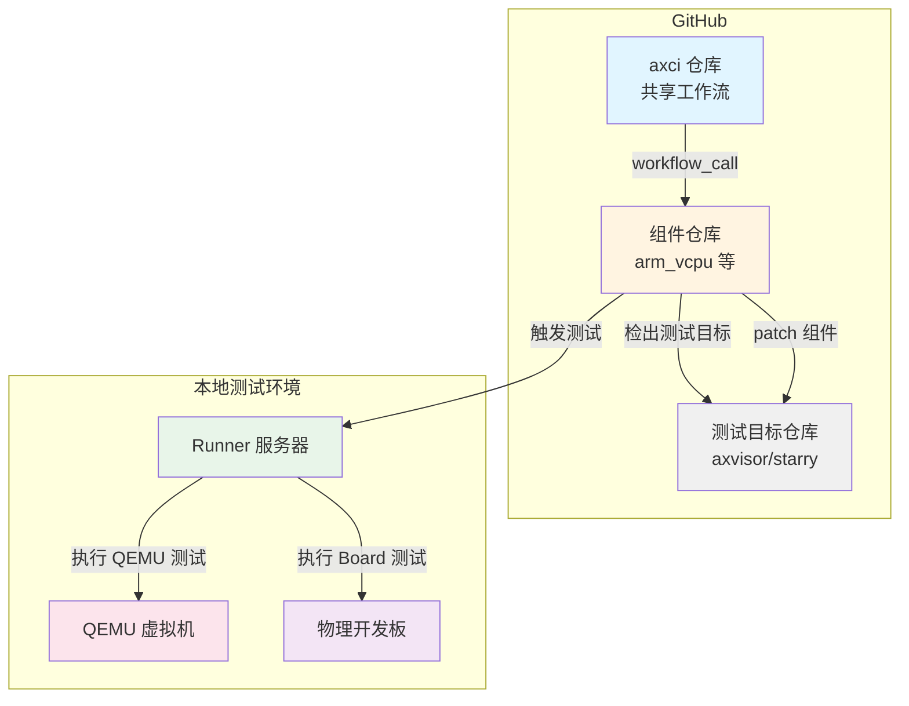
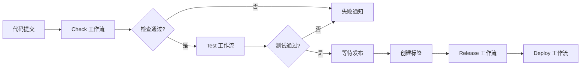
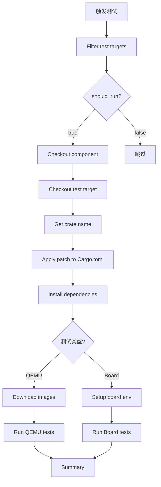

# 测试流程

AxVisor 的测试流程分为两个主要部分：**自动测试（CI）** 和 **本地测试**。自动测试通过 GitHub Actions 在代码提交时自动执行，而本地测试则允许开发者在提交代码前验证功能。

## 自动测试（CI）

自动测试通过 GitHub Actions 实现，在代码提交、创建 Pull Request 或推送标签时自动触发。整个自动测试流程基于 **axci** 仓库提供的共享工作流。

**重要说明**：CI 测试可以使用完整自建的本地集成测试环境，包括所有测试设备（QEMU 虚拟机和物理开发板），能够执行完整的测试矩阵。

### 整体架构

为了简化各个组件仓库的 CI 配置维护工作，我们设计了基于共享工作流的 CI 架构。整个测试流程的核心是 **axci** 仓库，它提供了一组可复用的 GitHub Actions 工作流，其他组件仓库通过 `workflow_call` 机制引用这些工作流。



**核心组件：**

1. **axci 仓库**：提供共享的 CI 工作流集合
2. **组件仓库**（如 arm_vcpu）：引用 axci 的工作流
3. **测试目标仓库**（如 axvisor、starry）：被测项目的完整代码库
4. **本地 Runner 服务器**：执行实际的测试任务
5. **测试设备**：物理开发板或 QEMU 虚拟机

### CI 工作流配置

#### axci 共享工作流

axci 仓库提供了 5 个核心工作流：

| 工作流 | 功能 | 触发方式 |
|--------|------|----------|
| [check.yml](https://github.com/arceos-hypervisor/axci/blob/main/.github/workflows/check.yml) | 代码质量检查（fmt、clippy、build、doc） | push、pull_request |
| [test.yml](https://github.com/arceos-hypervisor/axci/blob/main/.github/workflows/test.yml) | 集成测试（QEMU + Board） | push、pull_request、workflow_dispatch |
| [verify-tag.yml](https://github.com/arceos-hypervisor/axci/blob/main/.github/workflows/verify-tag.yml) | 验证版本标签（分支、版本一致性） | 被其他工作流调用 |
| [deploy.yml](https://github.com/arceos-hypervisor/axci/blob/main/.github/workflows/deploy.yml) | 部署文档到 GitHub Pages | push tag v*.*.* |
| [release.yml](https://github.com/arceos-hypervisor/axci/blob/main/.github/workflows/release.yml) | 创建 Release 并发布到 crates.io | push tag v*.*.* |

**工作流执行流程：**



#### 组件仓库 CI 配置

以 `arm_vcpu` 为例，展示如何使用 axci 的共享工作流。

**1. Check 工作流配置** ([arm_vcpu/.github/workflows/check.yml](https://github.com/arceos-hypervisor/arm_vcpu/blob/main/.github/workflows/check.yml))

```yaml
# Quality Check Workflow
# References shared workflow from axci

name: Check

on:
  push:
    branches: ['**']
    tags-ignore: ['**']
  pull_request:
  workflow_dispatch:

jobs:
  check:
    uses: arceos-hypervisor/axci/.github/workflows/check.yml@main
```

这个配置会在以下情况触发：
- 推送到任何分支（排除标签）
- 创建 Pull Request
- 手动触发

**2. Test 工作流配置** ([arm_vcpu/.github/workflows/test.yml](https://github.com/arceos-hypervisor/arm_vcpu/blob/main/.github/workflows/test.yml))

```yaml
# Integration Test Workflow
# References shared workflow from axci

name: Test

on:
  push:
    branches:
      - '**'
    tags-ignore:
      - '**'
  pull_request:
  workflow_dispatch:

jobs:
  test:
    uses: arceos-hypervisor/axci/.github/workflows/test.yml@main
```

这个配置会在代码提交时自动运行集成测试，测试会在 self-hosted runner 上执行。

**3. Release 和 Deploy 工作流配置**

```yaml
# Release Workflow
name: Release

on:
  push:
    tags:
      - 'v[0-9]+.[0-9]+.[0-9]+'
      - 'v[0-9]+.[0-9]+.[0-9]+-pre.[0-9]+'

jobs:
  release:
    uses: arceos-hypervisor/axci/.github/workflows/release.yml@main
    with:
      verify_branch: true
      verify_version: true
    secrets:
      CARGO_REGISTRY_TOKEN: ${{ secrets.CARGO_REGISTRY_TOKEN }}
```

```yaml
# Deploy Workflow
name: Deploy

on:
  push:
    tags:
      - 'v[0-9]+.[0-9]+.[0-9]+'

jobs:
  deploy:
    uses: arceos-hypervisor/axci/.github/workflows/deploy.yml@main
    with:
      verify_branch: true
      verify_version: true
```

### 自定义工作流参数

axci 的工作流支持自定义参数。例如，可以指定编译目标、Rust 组件、测试目标等。详细参数配置请参考 [axci 仓库文档](https://github.com/arceos-hypervisor/axci)。

### 集成测试执行流程

集成测试的核心是 `test.yml` 工作流，它采用矩阵策略并行执行多个测试任务。



**详细步骤说明：**

**1. Filter test targets（过滤测试目标）**

根据 `test_targets` 输入参数决定是否执行测试：
- `all`：运行所有测试
- `axvisor`：仅运行 axvisor 测试
- `starry`：仅运行 starry 测试
- 也可以指定具体的测试目标，如 `axvisor-qemu-aarch64-arceos`

**2. Checkout component（检出组件）**

将被测组件代码检出到 `component/` 目录。

**3. Checkout test target（检出测试目标）**

检出测试目标仓库到相应目录：
- Axvisor：`https://github.com/arceos-hypervisor/axvisor`
- Starry：`https://github.com/Starry-OS/StarryOS`

**4. Get component crate name（获取 crate 名称）**

从组件的 `Cargo.toml` 中自动检测 crate 名称，或使用输入参数。

**5. Apply patch to Cargo.toml（应用补丁）**

通过 `[patch.crates-io]` 覆盖测试目标对组件的依赖：

```toml
[patch.crates-io]
arm_vcpu = { path = "../component" }
```

这样，测试目标在构建时会使用本地检出的组件代码，而不是 crates.io 上的版本。

**6. Install dependencies（安装依赖）**

安装测试所需的工具，如 `ostool`。

**7. Run tests（运行测试）**

根据测试类型执行不同的测试命令：

- **QEMU 测试**：
  ```bash
  cargo xtask qemu \
    --build-config configs/board/qemu-aarch64.toml \
    --qemu-config .github/workflows/qemu-aarch64.toml \
    --vmconfigs configs/vms/arceos-aarch64-qemu-smp1.toml
  ```

- **Board 测试**：
  ```bash
  cargo xtask uboot \
    --build-config configs/board/phytiumpi.toml \
    --uboot-config .github/workflows/uboot.toml \
    --vmconfigs configs/vms/arceos-aarch64-e2000-smp1.toml \
    --bin-dir /home/runner/tftp
  ```

### 测试矩阵配置

Axvisor 测试包含以下测试组合：

**QEMU 测试：**

| 架构 | VM 配置 | VM 名称 | 测试内容 |
|------|---------|---------|----------|
| aarch64 | arceos-aarch64-qemu-smp1.toml | ArceOS | ArceOS guest |
| aarch64 | linux-aarch64-qemu-smp1.toml | Linux | Linux guest |
| x86_64 | nimbos-x86_64-qemu-smp1.toml | NimbOS | NimbOS guest |

**Board 测试：**

| 开发板 | VM 配置 | VM 名称 | 测试内容 |
|--------|---------|---------|----------|
| phytiumpi | arceos-aarch64-e2000-smp1.toml | ArceOS | ArceOS guest |
| phytiumpi | linux-aarch64-e2000-smp1.toml | Linux | Linux guest |
| roc-rk3568-pc | arceos-aarch64-rk3568-smp1.toml | ArceOS | ArceOS guest |
| roc-rk3568-pc | linux-aarch64-rk3568-smp1.toml | Linux | Linux guest |

### QEMU 测试配置

QEMU 测试使用 TOML 配置文件定义 QEMU 启动参数和测试成功/失败条件：

```toml
# qemu-aarch64.toml
args = [
  "-nographic",
  "-cpu", "cortex-a72",
  "-machine", "virt,virtualization=on,gic-version=3",
  "-smp", "4",
  "-device", "virtio-blk-device,drive=disk0",
  "-drive", "id=disk0,if=none,format=raw,file=${workspaceFolder}/tmp/rootfs.img",
  "-append", "root=/dev/vda rw init=/init",
  "-m", "8g",
]
fail_regex = []
success_regex = [
    "Hello, world!",
    "test pass!",
]
to_bin = true
uefi = false
```

**关键配置项：**
- `args`：QEMU 命令行参数
- `success_regex`：匹配成功的正则表达式列表
- `fail_regex`：匹配失败的正则表达式列表
- `to_bin`：是否将 ELF 转换为二进制
- `uefi`：是否使用 UEFI 启动

### Board 测试配置

Board 测试使用 U-Boot 通过 TFTP 加载固件：

```toml
# uboot.toml
baud_rate = "${env:BOARD_COMM_UART_BAUD}"
board_power_off_cmd = "${env:BOARD_POWER_OFF}"
board_reset_cmd = "${env:BOARD_POWER_RESET}"
dtb_file = "${env:BOARD_DTB}"
fail_regex = [
  "panicked at",
]
serial = "${env:BOARD_COMM_UART_DEV}"
success_regex = [
    "Welcome to AxVisor Shell!",
    "All tests passed!",
    "Hello World!",
    "root@firefly:~#",
    "root@phytium-Ubuntu:~#",
    "Set hostname to <phytiumpi>",
    "Last login: *",
]

[net]
interface = "${env:BOARD_COMM_NET_IFACE}"
tftp_dir = "${env:TFTP_DIR}"
```

**关键配置项：**
- `serial`：串口设备路径（从环境变量读取）
- `baud_rate`：串口波特率
- `board_reset_cmd`：重启开发板的命令
- `board_power_off_cmd`：关闭开发板电源的命令
- `success_regex`：匹配成功的正则表达式列表
- `fail_regex`：匹配失败的正则表达式列表
- `tftp_dir`：TFTP 服务器目录

**环境变量配置：**

Board 测试需要在 self-hosted runner 上配置以下环境变量：

```bash
# ~/.bashrc 或 /home/runner/.env
export BOARD_COMM_UART_DEV="/dev/ttyUSB0"
export BOARD_COMM_UART_BAUD="1500000"
export BOARD_POWER_RESET="/home/runner/scripts/reset-board.sh"
export BOARD_POWER_OFF="/home/runner/scripts/power-off.sh"
export BOARD_DTB="/path/to/board.dtb"
export BOARD_COMM_NET_IFACE="eth0"
export TFTP_DIR="/home/runner/tftp"
```

### 测试结果分析

测试结果通过正则表达式匹配串口输出来判定：

**成功条件：**
- 串口输出匹配 `success_regex` 中的任意一个模式
- 未匹配到 `fail_regex` 中的任何模式
- 测试超时前完成

**失败条件：**
- 串口输出匹配 `fail_regex` 中的任意一个模式
- 测试超时
- QEMU 或开发板启动失败

**常见问题排查：**

| 问题 | 可能原因 | 解决方法 |
|------|----------|----------|
| 构建失败 | 依赖版本不兼容 | 检查 Cargo.lock，更新依赖 |
| QEMU 启动失败 | QEMU 参数错误 | 检查 qemu-*.toml 配置 |
| 测试超时 | success_regex 未匹配 | 检查正则表达式，查看实际输出 |
| Board 无法连接 | 串口或网络问题 | 检查硬件连接，验证环境变量 |
| 镜像加载失败 | TFTP 服务异常 | 检查 TFTP 服务器状态 |

GitHub Actions 会为每个测试生成详细的报告，包括：
- ✅ 成功的测试：显示绿色勾号
- ❌ 失败的测试：显示红色叉号，可展开查看详细日志
- ⏭️ 跳过的测试：显示跳过图标

## 本地测试

除了 GitHub Actions 自动化测试，开发者还可以在本地运行测试，以便在提交代码前验证功能。本地测试包括**代码质量检查**和**集成测试**两部分。


### 测试环境准备

#### 基础依赖安装

```bash
# 安装 Rust
curl --proto '=https' --tlsv1.2 -sSf https://sh.rustup.rs | sh

# 安装 QEMU（用于 QEMU 测试）
sudo apt install qemu-system-arm qemu-system-x86

# 安装 ostool
cargo install ostool --version ^0.8
```

#### Board 测试环境配置

如果要运行物理开发板测试，需要配置以下环境变量：

```bash
# ~/.bashrc 或 ~/.zshrc
export BOARD_COMM_UART_DEV="/dev/ttyUSB0"
export BOARD_COMM_UART_BAUD="1500000"
export BOARD_POWER_RESET="/home/user/scripts/reset-board.sh"
export BOARD_POWER_OFF="/home/user/scripts/power-off.sh"
export BOARD_DTB="/path/to/board.dtb"
export BOARD_COMM_NET_IFACE="eth0"
export TFTP_DIR="/home/user/tftp"
```

#### 测试镜像准备

测试镜像会自动从 GitHub Releases 下载：
- 下载位置：`/tmp/.axvisor-images/`
- 下载源：`https://github.com/arceos-hypervisor/axvisor-guest/releases`

### 测试脚本

AxVisor 提供了两个统一的本地测试脚本，它们被封装在 **axci** 仓库中，这些脚本不直接使用，而是在组件仓库中被调用

1. **`check.sh`**：代码质量检查脚本
   - 检查代码格式（`cargo fmt`）
   - 构建检查（`cargo build`）
   - Clippy 检查（`cargo clippy`）
   - 文档检查（`cargo doc`）

2. **`tests.sh`**：集成测试脚本
   - QEMU 虚拟机测试
   - 物理开发板测试
   - 支持多种测试目标

每个组件仓库（如 `arm_vcpu`）都提供了自己的测试脚本，这些脚本会自动下载并调用 axci 中的测试工具。

#### 代码质量检查

在组件仓库根目录运行：

```bash
# 运行代码质量检查
./scripts/check.sh
```

这个命令会：
1. 自动下载或更新 axci 仓库到 `scripts/.axci/` 目录
2. 运行代码格式检查、构建检查、Clippy 检查和文档检查
3. 输出详细的检查结果

**示例输出：**

```
Downloading axci repository...
[axvcpu] 检查代码格式
✓ [axvcpu] 代码格式检查通过
[axvcpu] 构建检查 (target: aarch64-unknown-none-softfloat)
✓ [axvcpu] 构建检查通过
[axvcpu] Clippy 检查
✓ [axvcpu] Clippy 检查通过
[axvcpu] 文档检查
✓ [axvcpu] 文档检查通过
```

#### 集成测试

在组件仓库根目录运行：

```bash
# 运行所有测试
./scripts/test.sh

# 仅运行 axvisor QEMU 测试
./scripts/test.sh -t axvisor-qemu

# 仅运行特定测试
./scripts/test.sh -t axvisor-board-phytiumpi-arceos

# 详细输出
./scripts/test.sh -v

# 仅显示要执行的命令（不实际执行）
./scripts/test.sh --dry-run
```

这个命令会：
1. 自动下载或更新 axci 仓库到 `scripts/.axci/` 目录
2. 运行指定的集成测试
3. 输出详细的测试结果
