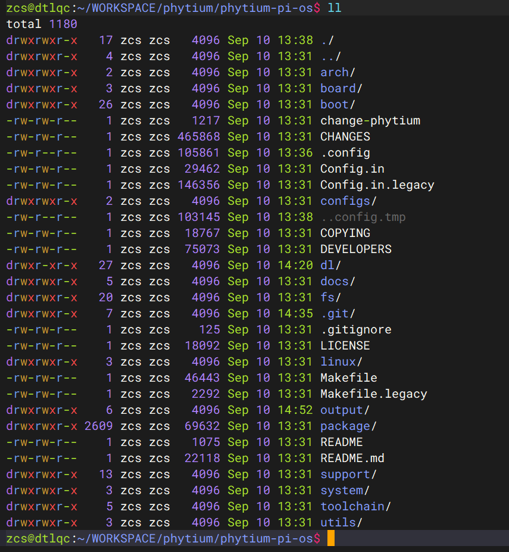
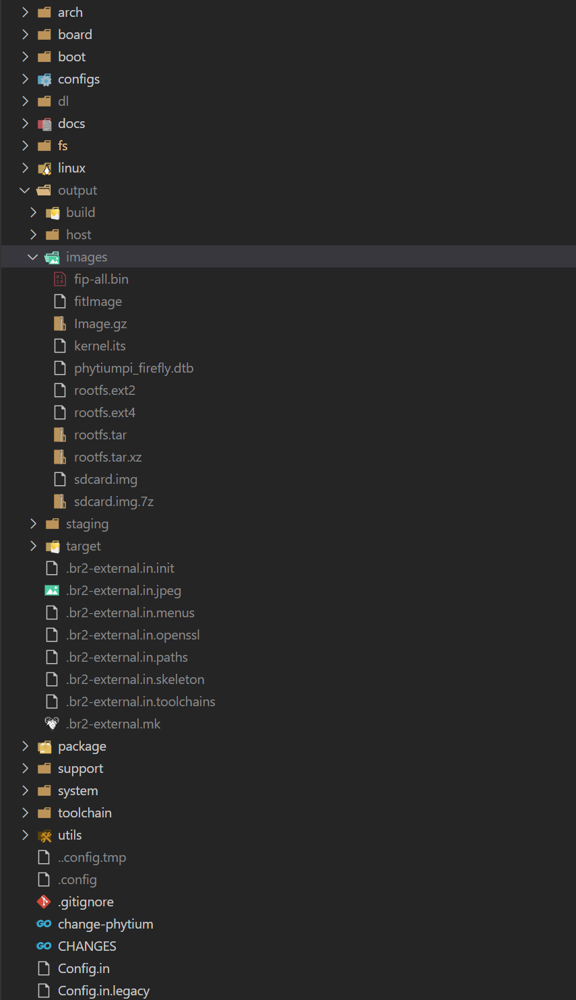
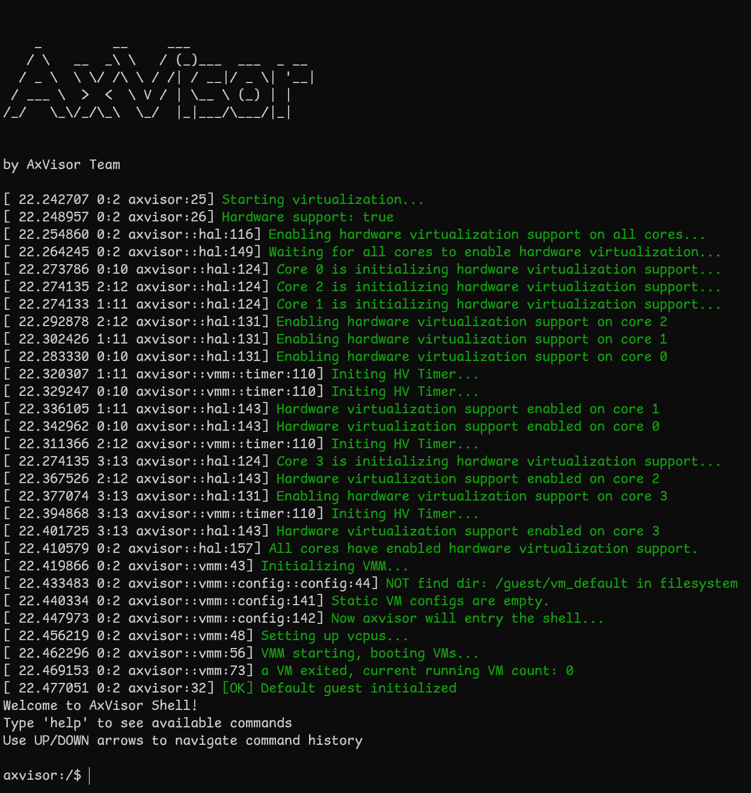

# 飞腾派

本文详细介绍如何在飞腾派开发板上部署和运行 AxVisor 虚拟化系统，包括 AxVisor + Linux 客户机、AxVisor + ArceOS 客户机以及 AxVisor + 多客户机等场景。

## 开发环境

AxVisor 及飞腾派的 SDK 仅支持在 Linux 系统中进行开发。本文中的构建及部署环境均采用 Ubuntu 24.04 系统作为开发环境。

## 构建准备

### 准备 AxVisor 源码

首先，使用 `git clone` 命令获取 AxVisor 的源代码并创建工作目录：
```bash
git clone https://github.com/arceos-hypervisor/axvisor.git
cd axvisor

# 创建工作目录
mkdir -p tmp/{configs,images}
```

### 准备设备树文件

设备树文件可以通过在开发板上运行 Linux 系统导出，也可以下载项目提供的设备树文件使用。

项目提供的 Linux 镜像文件夹中包含设备树文件，可直接下载到 `tmp/images` 目录：

```bash
# 下载包含设备树的 Linux 镜像
cargo xtask image download phytiumpi_linux --output-dir tmp/images
```

### 准备客户机镜像

为了便于验证 AxVisor 的功能，AxVisor 项目提供了预构建的客户机镜像。AxVisor 构建系统集成了客户机镜像管理功能，使用 `cargo xtask image` 相关命令即可查看及下载客户机镜像：
```bash
# 下载 ArceOS 客户机镜像
cargo xtask image download phytiumpi_arceos --output-dir tmp/images

# 下载 Linux 客户机镜像
cargo xtask image download phytiumpi_linux --output-dir tmp/images

# 列出所有可用镜像
cargo xtask image ls
```

AxVisor 所支持的客户机镜像的构建脚本和构建产物可以在 [axvisor-guest](https://github.com/arceos-hypervisor/axvisor-guest) 仓库中找到。

## 部署到开发板

### 部署方式概述

AxVisor 支持两种客户机加载方式：内存加载部署（编译时将客户机镜像打包进 AxVisor 二进制文件，启动时自动从内存加载）和文件系统加载部署（客户机镜像存放在开发板文件系统中，运行时动态从文件系统加载）。本文档采用文件系统加载部署方式进行介绍。

在此部署方式下，客户机配置文件需设置 `image_location = "fs"`，`.build.toml` 中的 `vm_configs` 字段设置为空数组 `[]`，并启用文件系统相关特性。

> **重要说明**：飞腾固件以及 U-Boot 并不开源，Phytium-Pi-OS 中默认以二进制文件的形式提供飞腾固件 + U-Boot 固件组合体 `fip-all.bin`，`fip-all.bin` 会被直接写入最终 IMAGE 镜像的开头位置。整个部署操作要求在飞腾派的 SDK 目录中执行相关命令，以便直接使用 SDK 生成的各种镜像和工具。

### 部署步骤

#### 一、前期准备

##### 1. 准备客户机配置文件

复制客户机配置文件模板到工作目录：
```bash
# 复制 ArceOS 客户机配置文件
cp configs/vms/arceos-aarch64-e2000_smp1.toml tmp/configs/

# 复制 Linux 客户机配置文件
cp configs/vms/linux-aarch64-e2000_smp1.toml tmp/configs/
```

修改客户机配置文件，设置为文件系统加载模式：
```bash
# 修改 ArceOS 客户机配置
sed -i 's|image_location = ".*"|image_location = "fs"|g' tmp/configs/arceos-aarch64-e2000_smp1.toml
sed -i "s|kernel_path = \".*\"|kernel_path = \"/guest/images/arceos.bin\"|g" tmp/configs/arceos-aarch64-e2000_smp1.toml

# 修改 Linux 客户机配置
sed -i 's|image_location = ".*"|image_location = "fs"|g' tmp/configs/linux-aarch64-e2000_smp1.toml
sed -i "s|kernel_path = \".*\"|kernel_path = \"/guest/images/linux.bin\"|g" tmp/configs/linux-aarch64-e2000_smp1.toml
```

如果客户机配置文件中有 `dtb_path` 字段，同样需要修改为本地构建环境中的设备树文件路径。

##### 2. 配置构建文件

使用 `cargo xtask defconfig phytiumpi` 命令设置飞腾派为默认构建配置：
```bash
cargo xtask defconfig phytiumpi
```

然后修改 `.build.toml` 文件，启用文件系统相关特性：
```bash
# 在 features 数组中添加文件系统相关特性
sed -i '/^features = \[/,/^\]/c\
features = [\
    "fs",\
    "axstd/ext4fs",\
    "driver/phytium-blk",\
    "dyn-plat",\
    "axstd/bus-mmio",\
]' .build.toml
```

或者手动编辑 `.build.toml` 文件，将 `features` 字段修改为：
```toml
features = [
    "fs",
    "axstd/ext4fs",
    "driver/phytium-blk",
    "dyn-plat",
    "axstd/bus-mmio",
]
```

**注意：** 文件系统加载模式下，`vm_configs` 保持为空数组 `[]`。

##### 3. 编译 AxVisor

编译 AxVisor：
```bash
cargo xtask build
```

编译完成后，AxVisor 镜像位于 `target/aarch64-unknown-none-softfloat/release/axvisor.bin`。

##### 4. 准备飞腾派 SDK

由于目前缺乏专用的 AxVisor 板级构建框架，这里复用飞腾派官方 Linux SDK 的构建流程来生成最终可启动镜像。整个部署操作需要在飞腾派 SDK 目录中执行相关命令，以便直接使用 SDK 提供的镜像和工具链。

从飞腾官方 Gitee 仓库下载飞腾派官方 OS 构建系统：
```bash
git clone https://gitee.com/phytium_embedded/phytium-pi-os.git
```

下载的 Phytium-Pi-OS 实际上是基于 Buildroot 移植适配的构建系统：



**分支说明：**
- **master 分支**：基于 Buildroot 2022.02 版本，默认适配 Linux 5.10 和 Linux 4.19 内核版本
- **2024.02 分支**：基于 Buildroot 2024.02 版本，默认适配 Linux 6.6 内核版本

#### 二、构建 SDK

##### 1. 配置 SDK 构建环境

```bash
cd phytium-pi-os
make phytiumpi_desktop_defconfig
```

> **注意**：官方 SDK 提供了多种不同的配置文件，可根据需要选择合适的配置。

##### 2. 修复构建问题（master 分支）

master 分支的 Buildroot 版本比较旧，在 Ubuntu 24.04 上构建可能会出错，需要进行相应的修复：


##### 3. 执行 SDK 构建

```bash
make
```

整个系统基于 Debian 构建，构建完成后 `output` 目录下会生成相关镜像：



##### 4. 生成 fitImage

**进入 SDK 镜像输出目录**
```bash
cd <SDK_PATH>/output/images
```

**创建 fitImage 配置文件**

创建或修改 `kernel.its` 文件：
```bash
cat > kernel.its << 'EOF'
/*
 * Compilation:
 * mkimage -f fit_kernel_dtb.its fit_kernel_dtb.itb
 *
 * Files in linux build dir:
 * - arch/arm/boot/Image (zImage-old-ok)
 * - arch/arm/boot/dts/ft.dtb
 *
 * fatload usb 0:1 0x90100000 fit_kernel_dtb.itb
 * bootm 0x90100000#e2000
 *
 */

/dts-v1/;
/ {
    description = "U-Boot fitImage for Phytium Phytiumpi";
    #address-cells = <1>;

    images {
        kernel {
            description = "AxVisor";
            data = /incbin/("axvisor.bin");
            type = "kernel";
            arch = "arm64";
            os = "linux";
            compression = "none";
            load =  <0x82000000>;
            entry = <0x82000000>;
            hash-1 {
                algo = "sha1";
            };
        };

        fdt-phytium {
            description = "FDT phytiumpi";
            data = /incbin/("phytiumpi_firefly.dtb");
            type = "flat_dt";
            arch = "arm64";
            compression = "none";
            hash-1 {
                algo = "sha1";
            };
        };
    };

    configurations {
        default = "phytium@cecport";

        phytium {
            description = "phytimpi";
            kernel = "kernel";
            fdt = "fdt-phytium";
            hash-1 {
                algo = "sha1";
            };
        };
    };
};
EOF
```

> **注意**：如果需要自定义 `load` 和 `entry` 地址，这些值必须 2MB 对齐（地址值的低 21 位必须为 0）。例如：`0x82000000`、`0x82200000`、`0x82400000` 等都是有效的 2MB 对齐地址。

**复制 AxVisor 镜像**
```bash
cp <AXVISOR_PATH>/target/aarch64-unknown-none-softfloat/release/axvisor.bin .
```

**生成 fitImage 镜像**
```bash
../host/bin/mkimage_phypi -f kernel.its fitImage
```

##### 5. 添加客户机配置到根文件系统

在文件系统加载模式下，需要将客户机镜像和配置文件添加到根文件系统中。AxVisor 默认从 `/guest` 目录加载客户机文件。

**创建挂载点并挂载文件系统**
```bash
mkdir -p rootfs
sudo mount rootfs.ext2 rootfs
```

**创建目录结构**
```bash
sudo mkdir -p rootfs/guest/configs
sudo mkdir -p rootfs/guest/images
```

**复制客户机配置文件**
```bash
sudo cp <AXVISOR_PATH>/tmp/configs/arceos-aarch64-e2000_smp1.toml rootfs/guest/configs/
sudo cp <AXVISOR_PATH>/tmp/configs/linux-aarch64-e2000_smp1.toml rootfs/guest/configs/
```

**复制客户机镜像**
```bash
sudo cp <AXVISOR_PATH>/tmp/images/phytiumpi_arceos/phytiumpi rootfs/guest/images/phytiumpi-arceos
sudo cp <AXVISOR_PATH>/tmp/images/phytiumpi_linux/phytiumpi rootfs/guest/images/phytiumpi-linux
```

**卸载文件系统**
```bash
sudo umount rootfs
```

文件系统中的目录结构如下：
```
/guest/
   ├── configs/
   │   ├── arceos-aarch64-e2000_smp1.toml
   │   └── linux-aarch64-e2000_smp1.toml
   └── images/
       ├── phytiumpi-arceos
       ├── phytiumpi-linux
       └── *.dtb (如果需要)
```

##### 6. 生成 SD 卡镜像

**创建 genimage 配置文件**

创建或修改 `genimage.cfg` 文件：
```bash
cat > genimage.cfg << 'EOF'
image sdcard.img {
    hdimage {
    }

    partition uboot {
        in-partition-table = no
        offset = 0
        image = "fip-all.bin"
        size = 4M
        holes = {"(0; 512)"}
    }
    partition bootload {
        in-partition-table = no
        offset = 4M
        image = "fitImage"
        size = 60M
    }

    partition root {
        partition-type = 0x83
        image = "rootfs.ext2"
        size = 5G
    }
}
EOF
```

**创建所需目录**
```bash
mkdir -p tmp root
```

**生成 SD 卡镜像**
```bash
../host/bin/genimage --inputpath ./ --outputpath ./ --config genimage.cfg --tmppath ./tmp --rootpath ./root
```

生成的 `sdcard.img` 位于当前目录 `<SDK_PATH>/output/images/sdcard.img`。

#### 三、烧录到 SD 卡

将生成的 `sdcard.img` 烧写到 SD 卡：
```bash
sudo dd if=sdcard.img of=/dev/sdX bs=4M status=progress
sync
```

**注意：** 将 `/dev/sdX` 替换为实际的 SD 卡设备名称（可通过 `lsblk` 命令查看）。

烧写完成后，将 SD 卡插入开发板并上电启动即可运行 AxVisor。

> **快速体验**：如果您不想自己编译构建，我们也提供了预构建的固件镜像，可以直接下载体验。请访问[AxVisor 官方网站](https://arceos-hypervisor.github.io/axvisorbook/#hardware)获取适用于飞腾派的预构建固件。

## 运行验证

完成部署后，需要对 AxVisor 的运行状态进行验证，确保虚拟化系统正常工作。本节将详细介绍连接方法、启动过程验证以及常见问题的处理方法。

### 串口连接

在验证运行状态之前，需要通过串口连接到飞腾派开发板。

#### 安装串口工具

在主机上安装串口通信工具：

```bash
# Ubuntu/Debian 系统（推荐）
sudo apt install picocom

# 或者使用 minicom
sudo apt install minicom
```

#### 连接设置

飞腾派的串口参数：
- 波特率：115200
- 数据位：8
- 停止位：1
- 校验位：无

使用 picocom 连接：
```bash
# 查看串口设备
ls /dev/ttyUSB*

# 连接串口（根据实际设备调整）
picocom -b 115200 --imap lfcrlf /dev/ttyUSB0
```

使用 minicom 连接：
```bash
# 配置 minicom
sudo minicom -s

# 或者直接连接
sudo minicom -D /dev/ttyUSB0 -b 115200
```

**退出 picocom：** `Ctrl+A` 然后按 `Ctrl+X`
**退出 minicom：** `Ctrl+A` 然后按 `Q`

### 启动过程验证

#### AxVisor 启动信息

开发板上电后，应该能看到以下启动信息：



#### 启动客户机

进入 AxVisor shell 后，可以通过以下命令创建和启动客户机：

```bash
# 列出可用的客户机配置
ls /guest/configs/

# 创建 ArceOS 客户机实例
vm create /guest/configs/arceos-aarch64-e2000-smp1.toml

# 启动客户机（VM ID 为 1）
vm start 1

# 创建 Linux 客户机实例
vm create /guest/configs/linux-aarch64-e2000-smp1.toml

# 启动客户机（VM ID 为 2）
vm start 2
```

> **限制说明**：当前版本中，Linux 客户机启动后无法返回 AxVisor shell，如需操作其他客户机需要重启开发板。

#### 客户机运行状态

**ArceOS 客户机启动信息：**
```
axvisor:/$ vm start 1
[ 54.334010 0:2 axvisor::vmm::vcpus:341] Initializing VM[1]'s 1 vcpus
[ 54.338845 0:2 axvisor::vmm::vcpus:390] Spawning task for VM[1] VCpu[0]
[ 54.346663 0:2 axvisor::vmm::vcpus:405] VCpu task Task(14, "VM[1]-VCpu[0]") created cpumask: [2, ]
[ 54.356815 0:2 axvm::vm:416] Booting VM[1]
✓ VM[1] started successfully
axvisor:/$ [ 54.366393 2:14 axvisor::vmm::vcpus:428] VM[1] boot delay: 0s
[ 54.372783 2:14 axvisor::vmm::vcpus:431] VM[1] VCpu[0] waiting for running
[ 54.380857 2:14 axvisor::vmm::vcpus:434] VM[1] VCpu[0] running...
fdt                     : 0xb1800000
[ 54.422607 2:14 arm_vgic::vtimer::cntp_ctl_el0:33] Write to emulator register: SysRegAddr(3340292), value: 2
EL                      : 1
_start                  : 0xffff800000000000
stack                   : 0xffff800000088000
loader                  : [0x91a34000, 0x91a443c0)
BootTable space         : [0x91af3eca --)
code                    : [0xffff800000000000, 0xffff800020000000) -> [0x91a00000, 0xb1a00000)
ram                     : 0xffff900091a00000-> 0x91a00000
debug                   : 0xffff90002800d000-> 0x2800d000
eq                      : [0x0, 0x8000000000)
Table                   : 0x0000000091af4000
Table size              : 0x8136
jump to                 : 0xffff800000002494
SomeHAL booting...
Power management method : SMC
Goto main...

       d8888                            .d88888b.   .d8888b.
      d88888                           d88P" "Y88b d88P  Y88b
     d88P888                           888     888 Y88b.
    d88P 888 888d888  .d8888b  .d88b.  888     888  "Y888b.
   d88P  888 888P"   d88P"    d8P  Y8b 888     888     "Y88b.
  d88P   888 888     888      88888888 888     888       "888
 d8888888888 888     Y88b.    Y8b.     Y88b. .d88P Y88b  d88P
d88P     888 888      "Y8888P  "Y8888   "Y88888P"   "Y8888P"

arch = aarch64
platform = aarch64-dyn
target = aarch64-unknown-none-softfloat
build_mode = release
log_level = info
smp = 1

[ 54.570853 axruntime:136] Logging is enabled.
[ 54.576418 axruntime:137] Primary CPU 0 started, arg = 0x91aee000.
[ 54.583792 axruntime:140] Found physcial memory regions:
[ 54.590306 axruntime:142]   [PA:0x2800d000, PA:0x2800e000) mmio (READ | WRITE | DEVICE | RESERVED)
[ 54.600462 axruntime:142]   [PA:0x91a00000, PA:0x91a01000) reserved (READ | WRITE | RESERVED)
[ 54.610173 axruntime:142]   [PA:0x91a01000, PA:0x91a2c000) .text (READ | EXECUTE | RESERVED)
[ 54.619808 axruntime:142]   [PA:0x91a2c000, PA:0x91a45000) .rodata (READ | RESERVED)
[ 54.628748 axruntime:142]   [PA:0x91a45000, PA:0x91a48000) .data .tdata .tbss .percpu (READ | WRITE | RESERVED)
[ 54.640032 axruntime:142]   [PA:0x91a88000, PA:0x91ac8000) boot stack (READ | WRITE | RESERVED)
[ 54.649928 axruntime:142]   [PA:0x91ac8000, PA:0x91aee000) .bss (READ | WRITE | RESERVED)
[ 54.659302 axruntime:142]   [PA:0x91aee000, PA:0x91afd000) reserved (READ | WRITE | RESERVED)
[ 54.669024 axruntime:142]   [PA:0x91afd000, PA:0xb1a00000) free memory (READ | WRITE | FREE)
[ 54.678658 axruntime:220] Initialize global memory allocator...
[ 54.685776 axruntime:221]   use TLSF allocator.
[ 54.691594 axmm:101] Initialize virtual memory management...
[ 54.703036 axruntime:160] Initialize platform devices...
[ 54.707015 2:14 arm_vgic::vtimer::cntp_ctl_el0:33] Write to emulator register: SysRegAddr(3340292), value: 1
[ 54.717706 2:14 arm_vgic::vtimer::cntp_tval_el0:39] Write to emulator register: SysRegAddr(3209220), value: 0
[ 54.728812 2:14 arm_vgic::vtimer::cntp_tval_el0:41] Current time: 54728812480, deadline: 54728812480
[ 54.739150 2:14 axvisor::hal::arch:103] Virtual interrupt interface not enabled, enabling now
[ 54.754071 axruntime:198] Primary CPU 0 init OK.
Hello, world!
[ 54.758331 2:14 axvisor::vmm::vcpus:513] VM[1] run VCpu[0] SystemDown
[ 54.765958 2:14 axvm::vm:453] Shutting down VM[1]
[ 54.771860 2:14 axvisor::vmm::vcpus:564] VM[1] VCpu[0] stopping because of VM stopping
[ 54.780974 2:14 axvisor::vmm::vcpus:570] VM[1] VCpu[0] last VCpu exiting, decreasing running VM count
[ 54.791390 2:14 axvisor::vmm::vcpus:574] VM[1] state changed to Stopped
[ 54.799205 2:14 axvisor::vmm::vcpus:584] VM[1] VCpu[0] exiting...
```

**Linux 客户机启动信息：**
```
axvisor:/$ vm start 2
[ 86.383762 0:2 axvisor::vmm::vcpus:341] Initializing VM[2]'s 1 vcpus
[ 86.388597 0:2 axvisor::vmm::vcpus:390] Spawning task for VM[2] VCpu[0]
[ 86.396416 0:2 axvisor::vmm::vcpus:405] VCpu task Task(14, "VM[2]-VCpu[0]") created cpumask: [3, ]
[ 86.406568 0:2 axvm::vm:416] Booting VM[2]
[ 86.409561 3:14 axvisor::vmm::vcpus:428] VM[2] boot delay: 5s
✓ VM[2] started successfully
axvisor:/$ [ 91.418803 3:14 axvisor::vmm::vcpus:431] VM[2] VCpu[0] waiting for running
[ 91.424007 3:14 axvisor::vmm::vcpus:434] VM[2] VCpu[0] running...
[    0.000000] Booting Linux on physical CPU 0x0000000100 [0x701f6643]
[    0.000000] Linux version 5.10.209-phytium-embedded-v2.3 (runner@s1lqc) (aarch64-none-linux-gnu-gcc (GNU Toolchain for the A-profile Architecture 10.2-2020.11 (arm-10.16)) 10.2.1 20201103, GNU ld (GNU Toolchain for the A-profile Architecture 10.2-2020.11 (arm-10.16)) 2.35.1.20201028) #1 SMP PREEMPT Thu Nov 20 15:21:23 CST 2025
[    0.000000] Machine model: Phytium Pi Board
[    0.000000] earlycon: pl11 at MMIO 0x000000002800d000 (options '')
[    0.000000] printk: bootconsole [pl11] enabled

............

Welcome to Phytium Pi OS firstlogin!
```
