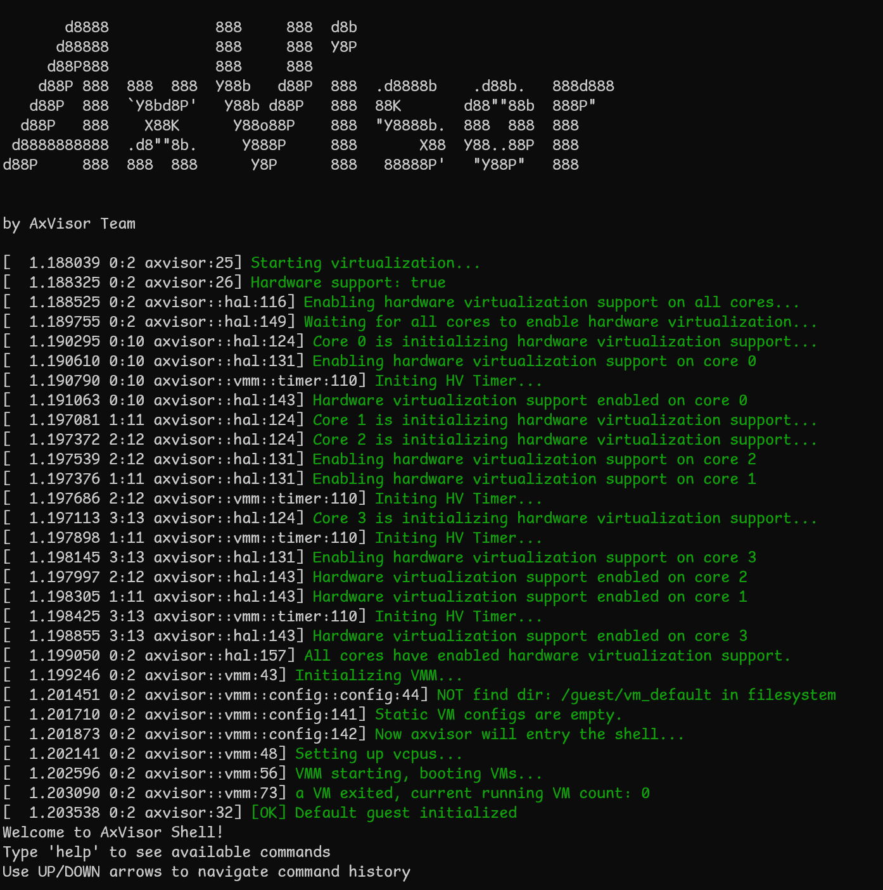

# QEMU
## 环境要求

### 硬件要求

- **主机系统**：支持 KVM 的 Linux 主机系统（可选，用于加速虚拟化性能）
- **内存**：至少 8GB 可用内存，以确保 AxVisor 和客户机操作系统能够流畅运行
- **存储空间**：至少 2GB 可用磁盘空间，用于存储源代码、构建产物和客户机镜像

### 软件要求

- **QEMU**：版本 8.0 或更高版本，以便完整模拟 AArch64 硬件平台。目前 CI 中使用的是 QEMU 10.1.x 版本
- **Rust 开发环境**：根据 Rust 官网介绍安装 Rust 开发环境，然后参考项目根目录的 `rust-toolchain.toml` 文件安装指定的编译工具链
- **Linux 操作系统**：推荐使用 Ubuntu 20.04 或更高版本
- **Git**：用于克隆源代码仓库
- **构建工具**：确保系统已安装基本的构建工具（如 make、gcc 等）

## AArch64

本文档介绍如何在 QEMU AArch64 环境中启动和验证 AxVisor 项目。在 QEMU AArch64 环境中，AxVisor 支持同时启动运行多个客户机操作系统，以下将启动 ArceOS 和 Linux 两个客户机操作系统。

> **提示**：如果您希望跳过编译步骤快速体验，也可以使用我们提供的预构建镜像。请访问 [AxVisor 官方网站](https://arceos-hypervisor.github.io/axvisorbook/#hardware) 获取预构建的文件系统镜像，并直接跳转到[构建及启动](#构建及启动)章节

### 前期准备

在开始构建和启动 AxVisor 之前，需要完成以下准备工作：

#### 准备 AxVisor 源码

首先，需要使用 `git clone https://github.com/arceos-hypervisor/axvisor.git` 命令获取 AxVisor 的源代码并创建工作目录。然后，在 AxVisor 源码目录中创建一个 `tmp` 目录，用于存放配置文件和客户机镜像。

```bash
cd axvisor

# 创建工作目录
mkdir -p tmp/{configs,images}
```

#### 准备客户机镜像

为了便于验证 AxVisor 的功能，AxVisor 项目提供了预构建的客户机镜像，并在 AxVisor 构建系统中集成了客户机镜像管理功能，使用 `cargo xtask image` 相关命令就可以查看及下载客户机镜像。这里我们直接将适用于 QEMU AArch64 的客户机镜像下载到我们创建的 `tmp/images` 目录即可。

```bash
# 列出所有可用镜像
cargo xtask image ls

# 下载 ArceOS 镜像
cargo xtask image download qemu_aarch64_arceos --output-dir tmp/images

# 下载 Linux 镜像
cargo xtask image download qemu_aarch64_linux --output-dir tmp/images
```

#### 准备客户机配置文件

客户机配置文件定义了每个虚拟机的具体参数，包括内存布局、CPU 分配和设备访问等，相关客户机配置文件全部位于 `configs/vms` 目录下。我们需要将适用于 QEMU AArch64 的客户机配置文件复制到 `tmp/configs` 目录，并修改其中的 `kernel_path` 参数。

1. 复制客户机配置文件：

    ```bash
    cp configs/vms/arceos-aarch64-qemu-smp1.toml tmp/configs/

    cp configs/vms/linux-aarch64-qemu-smp1.toml tmp/configs/
    ```

2. 修改客户机配置文件中的 `kernel_path`，使其指向我们下载的客户机镜像：

    ```bash
    # 修改 ArceOS 客户机配置
    sed -i 's|image_location = ".*"|image_location = "fs"|g' tmp/configs/arceos-aarch64-qemu-smp1.toml
    sed -i "s|kernel_path = \"path/arceos-aarch64-dyn-smp1.bin\"|kernel_path = \"/guest/images/qemu-aarch64-arceos\"|g" tmp/configs/arceos-aarch64-qemu-smp1.toml

    # 修改 Linux 客户机配置
    sed -i 's|image_location = ".*"|image_location = "fs"|g' tmp/configs/linux-aarch64-qemu-smp1.toml
    sed -i "s|kernel_path = \"tmp/Image\"|kernel_path = \"/guest/images/qemu-aarch64-linux\"|g" tmp/configs/linux-aarch64-qemu-smp1.toml
    # 若需要同时启动两个客户机，需要修改 Linux 客户机配置文件中的 id 值，避免冲突
    sed -i 's/^id = 1$/id = 2/' tmp/configs/linux-aarch64-qemu-smp1.toml
    ```

AxVisor 所支持的客户机镜像的构建脚本和构建产物可以在 [axvisor-guest](https://github.com/arceos-hypervisor/axvisor-guest) 仓库中找到。

#### 添加客户机配置到根文件系统

在文件系统加载模式下，需要将客户机镜像和配置文件添加到根文件系统中。AxVisor 默认从 `/guest` 目录加载客户机文件。

> **提示**：如果您希望跳过编译步骤快速体验，也可以使用我们提供的预构建镜像。请访问 [AxVisor 官方网站](https://arceos-hypervisor.github.io/axvisorbook/#hardware) 获取预构建的文件系统镜像。

```bash
# 使用已有的rootfs.img
cp tmp/images/qemu_aarch64_arceos/rootfs.img ./tmp

# 先给镜像文件增加空间
dd if=/dev/zero bs=1M count=256 >> ./tmprootfs.img

# 检查并修复文件系统（重要！）
e2fsck -f rootfs.img

# 调整 ext4 文件系统大小以使用全部空间
resize2fs rootfs.img

# 创建挂载点
mkdir -p rootfs

# 挂载 rootfs.img
sudo mount ./tmp/rootfs.img rootfs

# 创建目录结构
sudo mkdir -p rootfs/guest/configs
sudo mkdir -p rootfs/guest/images

# 复制客户机配置文件
sudo cp <AXVISOR_PATH>/tmp/configs/arceos-aarch64-qemu-smp1.toml rootfs/guest/configs/
sudo cp <AXVISOR_PATH>/tmp/configs/linux-aarch64-qemu-smp1.toml rootfs/guest/configs/

# 复制客户机镜像
sudo cp <AXVISOR_PATH>/tmp/images/qemu_aarch64_arceos/qemu-aarch64 rootfs/guest/images/qemu-aarch64-arceos
sudo cp <AXVISOR_PATH>/tmp/images/qemu_aarch64_linux/qemu-aarch64 rootfs/guest/images/qemu-aarch64-linux

# 卸载
sudo umount rootfs
rm -rf rootfs
```

文件系统中的目录结构如下：
```
/guest/
   ├── configs/
   │   ├── arceos-aarch64-qemu-smp1.toml
   │   └── linux-aarch64-qemu-smp1.toml
   └── images/
       ├── qemu-aarch64-arceos
       └── qemu-aarch64-linux
```

#### 准备开发板配置文件

开发板配置文件定义了 AxVisor 在特定硬件平台上的基本运行参数。对于 QEMU AArch64 环境，配置文件位于 `configs/board/qemu-aarch64.toml`，我们直接使用这个配置文件，不需要改动。直接将开发板配置文件复制到 `tmp/configs` 目录即可。

```bash
# 复制开发板配置文件
cp configs/board/qemu-aarch64.toml tmp/configs/
```

然后修改 `./tmp/configs/qemu-aarch64.toml` 文件，启用文件系统相关特性：
```bash
# 在 features 数组中添加文件系统相关特性
sed -i '/^features = \[/,/^\]/c\
features = [\
    "fs",\
    "axstd/ext4fs",\
    "dyn-plat",\
    "ept-level-4",\
    "axstd/bus-mmio",\
]' ./tmp/configs/qemu-aarch64.toml
```

或者手动编辑 `./tmp/configs/qemu-aarch64.toml` 文件，将 `features` 字段修改为：
```toml
features = [
    "fs",
    "axstd/ext4fs",
    "ept-level-4",
    "axstd/bus-mmio",
    "dyn-plat",
]
```

#### 准备 QEMU 配置文件

QEMU 配置文件定义了 QEMU 的启动参数，包括 CPU 类型、内存大小、设备配置等。我们需要将 QEMU 配置文件复制到工作目录，并根据实际情况修改 rootfs 路径。

1. 复制 QEMU 配置文件：
    ```bash
    cp .github/workflows/qemu-aarch64.toml tmp/configs/qemu-aarch64-info.toml
    ```

2. 修改 QEMU 配置文件中的 rootfs 路径：

    ```bash
    # 获取 rootfs.img 的绝对路径
    ROOTFS_PATH="$(pwd)/tmp/rootfs.img"

    # 更新配置文件中的路径
    sed -i 's|file=${workspaceFolder}/tmp/rootfs.img|file='"$ROOTFS_PATH"'|g' tmp/configs/qemu-aarch64-info.toml
    # 将 success_regex 改为空数组
    sed -i '/success_regex = \[/,/\]/c\success_regex = []' tmp/configs/qemu-aarch64-info.toml

    # 验证修改
    grep "rootfs.img" tmp/configs/qemu-aarch64-info.toml
    ```

### 构建及启动

完成前期准备后，我们可以开始构建和启动 AxVisor。

#### 启动 AxVisor

使用以下命令启动 AxVisor，该命令会自动编译 AxVisor 及其依赖项，并在 QEMU AArch64 环境中运行：

```bash
cargo xtask qemu \
    --build-config tmp/configs/qemu-aarch64.toml \
    --qemu-config tmp/configs/qemu-aarch64-info.toml
```

### 运行验证

完成部署后，需要对 AxVisor 的运行状态进行验证，确保虚拟化系统正常工作。本节将详细介绍启动过程验证以及常见问题的处理方法。

#### 启动过程验证

##### AxVisor 启动信息

开发板上电后，应该能看到以下启动信息：



##### 启动客户机

进入 AxVisor shell 后，可以通过以下命令创建和启动客户机：

```bash
# 列出可用的客户机配置
ls /guest/configs/

# 创建 ArceOS 客户机实例
vm create /guest/configs/arceos-aarch64-qemu-smp1.toml

# 启动客户机（VM ID 为 1）
vm start 1

# 创建 Linux 客户机实例
vm create /guest/configs/linux-aarch64-qemu-smp1.toml

# 启动客户机（VM ID 为 2）
vm start 2
```

> **限制说明**：当前版本中，Linux 客户机启动后无法返回 AxVisor shell，如需操作其他客户机需要重启开发板。

##### 客户机运行状态

**ArceOS 客户机启动信息：**
```
axvisor:/$ vm create /guest/configs/arceos-aarch64-qemu-smp1.toml
Positional args: ["/guest/configs/arceos-aarch64-qemu-smp1.toml"]
Creating VM from config: /guest/configs/arceos-aarch64-qemu-smp1.toml
[ 49.569576 0:2 axfs::fs::ext4fs:66] FileWrapper new EXT4_DE_REG_FILE /guest/configs/arceos-aarch64-qemu-smp1.toml
[ 49.592123 0:2 axfs::fs::ext4fs:66] FileWrapper new EXT4_DE_REG_FILE /guest/images/qemu-aarch64-arceos
[ 49.596091 0:2 axvisor::vmm::fdt::parser:50] Found 4 host CPU nodes
[ 49.596422 0:2 axvisor::vmm::fdt::parser:64] CPU node: cpu@0, phys_cpu_id: 0x0
[ 49.596797 0:2 axvisor::vmm::fdt::parser:64] CPU node: cpu@1, phys_cpu_id: 0x1
[ 49.597001 0:2 axvisor::vmm::fdt::parser:64] CPU node: cpu@2, phys_cpu_id: 0x2
[ 49.597287 0:2 axvisor::vmm::fdt::parser:64] CPU node: cpu@3, phys_cpu_id: 0x3
[ 49.597742 0:2 axvisor::vmm::fdt::parser:129] Calculated phys_cpu_sets: [1]
[ 49.598544 0:2 axvisor::vmm::fdt:59] VM[1] DTB not found, generating based on the configuration file.
[ 49.608235 0:2 axvisor::vmm::fdt::device:56] Phase 1 completed: Found 62 new descendant device names
[ 49.618682 0:2 axvisor::vmm::fdt::device:100] Phase 2 completed: Found 0 new dependency device names
[ 49.619287 0:2 axvisor::vmm::fdt::device:119] Found 0 descendant paths for /pcie@10000000
[ 49.619560 0:2 axvisor::vmm::fdt::device:136] Found excluded devices: ["/pcie@10000000"]
[ 49.619963 0:2 axvisor::vmm::fdt::device:145] Removing 1 excluded devices from the list
[ 49.620338 0:2 axvisor::vmm::fdt::device:155] Excluding device: /pcie@10000000
[ 49.621336 0:2 axvisor::vmm::fdt::device:165] Passthrough devices analysis completed. Total devices: 61 (added: 60)
[ 49.655971 0:2 axvisor::vmm::fdt::parser:324] skipping node intc@8000000 to use vGIC
[ 49.656125 0:2 axvisor::vmm::fdt::parser:324] skipping node its@8080000 to use vGIC
[ 49.657280 0:2 axvisor::vmm::config:180] Creating VM[1] "arceos-qemu"
[ 49.658693 0:2 axvm::vm:152] VM created: id=1
[ 53.023494 0:2 axvisor::vmm::config:198] VM[1] created success, loading images...
[ 53.023797 0:2 axvisor::vmm::images:65] Loading VM[1] images into memory region: gpa=GPA:0x42c00000, hva=VA:0x42c00000, size=1 GiB
[ 53.025629 0:2 axvisor::vmm::images::fs:222] Loading VM images from filesystem
[ 53.026239 0:2 axfs::fs::ext4fs:66] FileWrapper new EXT4_DE_REG_FILE /guest/images/qemu-aarch64-arceos
[ 53.053643 0:2 axvisor::vmm::fdt::create:256] Adding memory node with value: 0x[0, 42c00000, 0, 40000000]
[ 53.054573 0:2 axvisor::vmm::fdt::create:347] Updating FDT memory successfully
[ 53.055328 0:2 axvisor::vmm::fdt::create:354] New FDT will be loaded at GPA:0x62a00000, size: 0x1a57
[ 53.065643 0:2 axvm::vm:288] Failed to assign SPIs: No VGicD found in device list
[ 53.066292 0:2 axvm::vm:335] VM setup: id=1
✓ Successfully created VM[1] from config: /guest/configs/arceos-aarch64-qemu-smp1.toml
Successfully created 1 VM(s)
Use 'vm start <VM_ID>' to start the created VMs.
axvisor:/$ vm start 1
[ 59.732344 0:2 axvisor::vmm::vcpus:341] Initializing VM[1]'s 1 vcpus
[ 59.732730 0:2 axvisor::vmm::vcpus:390] Spawning task for VM[1] VCpu[0]
[ 59.733456 0:2 axvisor::vmm::vcpus:405] VCpu task Task(14, "VM[1]-VCpu[0]") created cpumask: [0, ]
[ 59.734083 0:2 axvm::vm:416] Booting VM[1]
✓ VM[1] started successfully
axvisor:/$ [ 59.735232 0:14 axvisor::vmm::vcpus:428] VM[1] boot delay: 0s
[ 59.735539 0:14 axvisor::vmm::vcpus:431] VM[1] VCpu[0] waiting for running
[ 59.735996 0:14 axvisor::vmm::vcpus:434] VM[1] VCpu[0] running...
fdt                     : 0x62a00000
EL                      : 1
_start                  : 0xffff800000000000
stack                   : 0xffff800000088000
loader                  : [0x42c34000, 0x42c443c0)
BootTable space         : [0x42cefa57 --)
code                    : [0xffff800000000000, 0xffff800020000000) -> [0x42c00000, 0x62c00000)
ram                     : 0xffff900042c00000-> 0x42c00000
debug                   : 0xffff900009000000-> 0x9000000
eq                      : [0x0, 0x8000000000)
Table                   : 0x0000000042cf0000
Table size              : 0x95a9
jump to                 : 0xffff800000002494
SomeHAL booting...
Power management method : SMC
Goto main...

       d8888                            .d88888b.   .d8888b.
      d88888                           d88P" "Y88b d88P  Y88b
     d88P888                           888     888 Y88b.
    d88P 888 888d888  .d8888b  .d88b.  888     888  "Y888b.
   d88P  888 888P"   d88P"    d8P  Y8b 888     888     "Y88b.
  d88P   888 888     888      88888888 888     888       "888
 d8888888888 888     Y88b.    Y8b.     Y88b. .d88P Y88b  d88P
d88P     888 888      "Y8888P  "Y8888   "Y88888P"   "Y8888P"

arch = aarch64
platform = aarch64-dyn
target = aarch64-unknown-none-softfloat
build_mode = release
log_level = info
smp = 1

[ 59.765481 axruntime:136] Logging is enabled.
[ 59.766396 axruntime:137] Primary CPU 0 started, arg = 0x42cee000.
[ 59.767827 axruntime:140] Found physcial memory regions:
[ 59.768066 axruntime:142]   [PA:0x9000000, PA:0x9001000) mmio (READ | WRITE | DEVICE | RESERVED)
[ 59.768456 axruntime:142]   [PA:0x42c00000, PA:0x42c01000) reserved (READ | WRITE | RESERVED)
[ 59.768661 axruntime:142]   [PA:0x42c01000, PA:0x42c2c000) .text (READ | EXECUTE | RESERVED)
[ 59.768806 axruntime:142]   [PA:0x42c2c000, PA:0x42c45000) .rodata (READ | RESERVED)
[ 59.768962 axruntime:142]   [PA:0x42c45000, PA:0x42c48000) .data .tdata .tbss .percpu (READ | WRITE | RESERVED)
[ 59.769119 axruntime:142]   [PA:0x42c88000, PA:0x42cc8000) boot stack (READ | WRITE | RESERVED)
[ 59.769259 axruntime:142]   [PA:0x42cc8000, PA:0x42cee000) .bss (READ | WRITE | RESERVED)
[ 59.769390 axruntime:142]   [PA:0x42cee000, PA:0x42cfa000) reserved (READ | WRITE | RESERVED)
[ 59.769529 axruntime:142]   [PA:0x42cfa000, PA:0x82c00000) free memory (READ | WRITE | FREE)
[ 59.769744 axruntime:220] Initialize global memory allocator...
[ 59.769916 axruntime:221]   use TLSF allocator.
[ 59.772974 axmm:101] Initialize virtual memory management...
[ 59.814574 axruntime:160] Initialize platform devices...
[ 59.892770 axruntime:198] Primary CPU 0 init OK.
Hello, world!
[ 59.893760 0:14 axvisor::vmm::vcpus:513] VM[1] run VCpu[0] SystemDown
[ 59.894061 0:14 axvm::vm:453] Shutting down VM[1]
[ 59.894335 0:14 axvisor::vmm::vcpus:564] VM[1] VCpu[0] stopping because of VM stopping
[ 59.894622 0:14 axvisor::vmm::vcpus:570] VM[1] VCpu[0] last VCpu exiting, decreasing running VM count
[ 59.894860 0:14 axvisor::vmm::vcpus:574] VM[1] state changed to Stopped
[ 59.895223 0:14 axvisor::vmm::vcpus:584] VM[1] VCpu[0] exiting...
```

**Linux 客户机启动信息：**
```
axvisor:/$ vm create /guest/configs/linux-aarch64-qemu-smp1.toml
Positional args: ["/guest/configs/linux-aarch64-qemu-smp1.toml"]
Creating VM from config: /guest/configs/linux-aarch64-qemu-smp1.toml
[134.440975 0:2 axfs::fs::ext4fs:66] FileWrapper new EXT4_DE_REG_FILE /guest/configs/linux-aarch64-qemu-smp1.toml
[134.444916 0:2 axfs::fs::ext4fs:66] FileWrapper new EXT4_DE_REG_FILE /guest/images/qemu-aarch64-linux
[134.446498 0:2 axvisor::vmm::fdt::parser:50] Found 4 host CPU nodes
[134.446624 0:2 axvisor::vmm::fdt::parser:64] CPU node: cpu@0, phys_cpu_id: 0x0
[134.446752 0:2 axvisor::vmm::fdt::parser:64] CPU node: cpu@1, phys_cpu_id: 0x1
[134.446873 0:2 axvisor::vmm::fdt::parser:64] CPU node: cpu@2, phys_cpu_id: 0x2
[134.447017 0:2 axvisor::vmm::fdt::parser:64] CPU node: cpu@3, phys_cpu_id: 0x3
[134.447288 0:2 axvisor::vmm::fdt::parser:129] Calculated phys_cpu_sets: [1]
[134.447420 0:2 axvisor::vmm::fdt:59] VM[2] DTB not found, generating based on the configuration file.
[134.451490 0:2 axvisor::vmm::fdt::device:56] Phase 1 completed: Found 62 new descendant device names
[134.455780 0:2 axvisor::vmm::fdt::device:100] Phase 2 completed: Found 0 new dependency device names
[134.455990 0:2 axvisor::vmm::fdt::device:136] Found excluded devices: []
[134.456118 0:2 axvisor::vmm::fdt::device:165] Passthrough devices analysis completed. Total devices: 62 (added: 61)
[134.481919 0:2 axvisor::vmm::fdt::parser:324] skipping node intc@8000000 to use vGIC
[134.482070 0:2 axvisor::vmm::fdt::parser:324] skipping node its@8080000 to use vGIC
[134.482793 0:2 axvisor::vmm::config:180] Creating VM[2] "linux-qemu"
[134.482935 0:2 axvm::vm:152] VM created: id=2
[135.322085 0:2 axvisor::vmm::config:198] VM[2] created success, loading images...
[135.322243 0:2 axvisor::vmm::images:65] Loading VM[2] images into memory region: gpa=GPA:0x82e00000, hva=VA:0x82e00000, size=256 MiB
[135.322649 0:2 axvisor::vmm::images::fs:222] Loading VM images from filesystem
[135.323179 0:2 axfs::fs::ext4fs:66] FileWrapper new EXT4_DE_REG_FILE /guest/images/qemu-aarch64-linux
[139.019976 0:2 axvisor::vmm::fdt::create:256] Adding memory node with value: 0x[0, 82e00000, 0, 10000000]
[139.020353 0:2 axvisor::vmm::fdt::create:347] Updating FDT memory successfully
[139.020686 0:2 axvisor::vmm::fdt::create:354] New FDT will be loaded at GPA:0x92c00000, size: 0x1e87
[139.040021 0:2 axvm::vm:288] Failed to assign SPIs: No VGicD found in device list
[139.040274 0:2 axvm::vm:335] VM setup: id=2
✓ Successfully created VM[2] from config: /guest/configs/linux-aarch64-qemu-smp1.toml
Successfully created 1 VM(s)
Use 'vm start <VM_ID>' to start the created VMs.
axvisor:/$ vm start 2
[146.109519 0:2 axvisor::vmm::vcpus:341] Initializing VM[2]'s 1 vcpus
[146.109661 0:2 axvisor::vmm::vcpus:390] Spawning task for VM[2] VCpu[0]
[146.109814 0:2 axvisor::vmm::vcpus:405] VCpu task Task(15, "VM[2]-VCpu[0]") created cpumask: [0, ]
[146.110116 0:2 axvm::vm:416] Booting VM[2]
✓ VM[2] started successfully
axvisor:/$ [146.110323 0:15 axvisor::vmm::vcpus:428] VM[2] boot delay: 5s
[151.110439 0:15 axvisor::vmm::vcpus:431] VM[2] VCpu[0] waiting for running
[151.110652 0:15 axvisor::vmm::vcpus:434] VM[2] VCpu[0] running...
[    0.000000] Booting Linux on physical CPU 0x0000000000 [0x410fd083]
[    0.000000] Linux version 6.18.0-rc6-gfd95357fd8c6 (runner@s1lqc) (aarch64-linux-gnu-gcc (Ubuntu 13.3.0-6ubuntu2~24.04) 13.3.0, GNU ld (GNU Binutils for Ubuntu) 2.42) #7 SMP PREEMPT Thu Nov 27 10:23:37 CST 2025
[    0.000000] KASLR enabled
[    0.000000] random: crng init done
[    0.000000] Machine model: linux,dummy-virt
[    0.000000] efi: UEFI not found.
[    0.000000] OF: reserved mem: Reserved memory: No reserved-memory node in the DT
[    0.000000] NUMA: Faking a node at [mem 0x0000000082e00000-0x0000000092dfffff]
[    0.000000] NODE_DATA(0) allocated [mem 0x92d7f300-0x92d8197f]
[    0.000000] Zone ranges:
[    0.000000]   DMA      [mem 0x0000000082e00000-0x0000000092dfffff]
[    0.000000]   DMA32    empty
[    0.000000]   Normal   empty
[    0.000000] Movable zone start for each node
[    0.000000] Early memory node ranges

..........................

[    1.385156] Run /init as init process
test pass!
/bin/sh: can't access tty; job control turned off
~ #
```

## x86_64

本部分介绍在 QEMU x86_64 环境中部署 AxVisor 项目，用于在文件系统中启动 NimbOS 客户机操作系统。

> **提示**：如果您希望跳过编译步骤快速体验，也可以使用我们提供的预构建镜像。请访问 [AxVisor 官方网站](https://arceos-hypervisor.github.io/axvisorbook/#hardware) 获取预构建的文件系统镜像，并直接跳转到[构建及启动](#构建及启动)章节

### 前期准备

在开始构建和启动 AxVisor 之前，需要完成以下准备工作：

#### 准备 AxVisor 源码

首先，需要使用 `git clone https://github.com/arceos-hypervisor/axvisor.git` 命令获取 AxVisor 的源代码并创建工作目录。然后，在 AxVisor 源码目录中创建一个 `tmp` 目录，用于存放配置文件和客户机镜像。

```bash
cd axvisor

# 创建工作目录
mkdir -p tmp/{configs,images}
```

#### 准备客户机镜像

为了便于验证 AxVisor 的功能，AxVisor 项目提供了预构建的客户机镜像，并在 AxVisor 构建系统中集成了客户机镜像管理功能，使用 `cargo xtask image` 相关命令就可以查看及下载客户机镜像。这里我们直接将适用于 QEMU x86_64 的客户机镜像下载到我们创建的 `tmp/images` 目录即可。

```bash
# 列出所有可用镜像
cargo xtask image ls

# 下载 NimbOS 镜像
cargo xtask image download qemu_x86_64_nimbos --output-dir tmp/images
```

AxVisor 所支持的客户机镜像的构建脚本和构建产物可以在 [axvisor-guest](https://github.com/arceos-hypervisor/axvisor-guest) 仓库中找到。

#### 准备客户机配置文件

客户机配置文件定义了每个虚拟机的具体参数，包括内存布局、CPU 分配和设备访问等，相关客户机配置文件全部位于 `configs/vms` 目录下。我们需要将适用于 QEMU x86_64 的客户机配置文件复制到 `tmp/configs` 目录。

1. 复制客户机配置文件：

```bash
cp configs/vms/nimbos-x86_64-qemu-smp1.toml tmp/configs/
```

2. 修改客户机配置文件，设置为文件系统加载模式：
```bash
# 修改 NimbOS 客户机配置
sed -i "s|kernel_path = \".*\"|kernel_path = \"/guest/images/qemu-x86_64-nimbos\"|g" tmp/configs/nimbos-x86_64-qemu-smp1.toml
sed -i "s|bios_path = \".*\"|bios_path = \"/guest/images/axvm-bios.bin\"|g" tmp/configs/nimbos-x86_64-qemu-smp1.toml
```

#### 添加客户机配置到根文件系统

在文件系统加载模式下，需要将客户机镜像和配置文件添加到根文件系统中。AxVisor 默认从 `/guest` 目录加载客户机文件。

```bash
# 创建一个 256MB 的 FAT32 文件系统镜像
dd if=/dev/zero of=./tmp/rootfs.img bs=1M count=256
mkfs.fat -F 32 ./tmp/rootfs.img

# 创建挂载点
mkdir -p rootfs

# 挂载 rootfs.img
sudo mount ./tmp/rootfs.img rootfs

# 创建目录结构
sudo mkdir -p rootfs/guest/configs
sudo mkdir -p rootfs/guest/images

# 复制客户机配置文件
sudo cp <AXVISOR_PATH>/tmp/configs/nimbos-x86_64-qemu-smp1.toml rootfs/guest/configs/

# 复制客户机镜像
sudo cp <AXVISOR_PATH>/tmp/images/qemu_x86_64_nimbos/axvm-bios.bin rootfs/guest/images/axvm-bios.bin
sudo cp <AXVISOR_PATH>/tmp/images/qemu_x86_64_nimbos/qemu-x86_64_usertests rootfs/guest/images/qemu-x86_64-nimbos

# 卸载
sudo umount rootfs
rm -rf rootfs
```

文件系统中的目录结构如下：
```
/guest/
   ├── configs/
   │   └── nimbos-x86_64-qemu-smp1.toml
   └── images/
       ├── axvm-bios.bin
       └── qemu-x86_64-nimbos
```

#### 准备开发板配置文件

开发板配置文件定义了 AxVisor 在特定硬件平台上的基本运行参数。对于 QEMU x86_64 环境，配置文件位于 `configs/board/qemu-x86_64.toml`，我们直接使用这个配置文件，不需要改动。直接将开发板配置文件复制到 `tmp/configs` 目录即可。

```bash
# 复制开发板配置文件
cp configs/board/qemu-x86_64.toml tmp/configs/
```

然后修改 `./tmp/configs/qemu-x86_64.toml` 文件，启用文件系统相关特性：
```bash
# 在 features 数组中添加文件系统相关特性
sed -i '/^features = \[/,/^\]/c\
features = [\
    "fs",\
    "ept-level-4",\
    "axstd/myplat",\
]' ./tmp/configs/qemu-x86_64.toml
```

或者手动编辑 `./tmp/configs/qemu-x86_64.toml` 文件，将 `features` 字段修改为：
```toml
features = [
    "axstd/myplat",
    "ept-level-4",
    "fs",
]
```

**注意：** 文件系统加载模式下，`vm_configs` 保持为空数组 `[]`。

#### 准备 QEMU 配置文件

QEMU 配置文件定义了 QEMU 的启动参数，包括 CPU 类型、内存大小、设备配置等。我们需要将 QEMU 配置文件复制到工作目录，并根据实际情况修改 rootfs 路径。

1. 复制 QEMU 配置文件：
    ```bash
    cp .github/workflows/qemu-x86_64.toml tmp/configs/qemu-x86_64-info.toml
    ```

2. 修改 QEMU 配置文件中的 rootfs 路径：
    ```bash
    # 获取 rootfs.img 的绝对路径
    ROOTFS_PATH="$(pwd)/tmp/rootfs.img"
    
    # 更新配置文件中的路径
    sed -i 's|file=${workspaceFolder}/tmp/rootfs.img|file='"$ROOTFS_PATH"'|g' tmp/configs/qemu-x86_64-info.toml
    
    # 验证修改
    grep "rootfs.img" tmp/configs/qemu-x86_64-info.toml
    ```

### 构建及启动

完成前期准备后，我们可以开始构建和启动 AxVisor。

#### 启动 AxVisor

使用以下命令启动 AxVisor，该命令会自动编译 AxVisor 及其依赖项，并在 QEMU x86_64 环境中运行：

```bash
cargo xtask qemu \
    --build-config tmp/configs/qemu-x86_64.toml \
    --qemu-config tmp/configs/qemu-x86_64-info.toml
```

### 运行验证

完成部署后，需要对 AxVisor 的运行状态进行验证，确保虚拟化系统正常工作。本节将详细介绍连接方法、启动过程验证以及常见问题的处理方法。

#### 启动过程验证

##### AxVisor 启动信息

开发板上电后，应该能看到以下启动信息：


##### 启动客户机

进入 AxVisor shell 后，可以通过以下命令创建和启动客户机：

```bash
# 列出可用的客户机配置
ls /guest/configs/

# 创建 ArceOS 客户机实例
vm create /guest/configs/nimbos-x86_64-qemu-smp1.toml

# 启动客户机（VM ID 为 1）
vm start 1
```

> **限制说明**：当前版本中，Linux 客户机启动后无法返回 AxVisor shell，如需操作其他客户机需要重启开发板。

##### 客户机运行状态

**NimbOS 客户机启动信息：**
```
axvisor:/$ vm create /guest/configs/nimbos-x86_64-qemu-smp1.toml
Positional args: ["/guest/configs/nimbos-x86_64-qemu-smp1.toml"]
Creating VM from config: /guest/configs/nimbos-x86_64-qemu-smp1.toml
[  6.321501 0:2 axvisor::vmm::config:180] Creating VM[1] "nimbos"
[  6.322054 0:2 axvm::vm:152] VM created: id=1
[  6.325512 0:2 axvisor::vmm::config:198] VM[1] created success, loading images...
[  6.326221 0:2 axvisor::vmm::images:65] Loading VM[1] images into memory region: gpa=GPA:0x0, hva=VA:0xffff800000800000, size=16 MiB
[  6.327235 0:2 axvisor::vmm::images::fs:222] Loading VM images from filesystem
[  6.401584 0:2 x86_vcpu::vmx::vcpu:220] [HV] created VmxVcpu(vmcs: PA:0x73b000)
[  6.402348 0:2 axvm::vm:335] VM setup: id=1
✓ Successfully created VM[1] from config: /guest/configs/nimbos-x86_64-qemu-smp1.toml
Successfully created 1 VM(s)
Use 'vm start <VM_ID>' to start the created VMs.
axvisor:/$ vm start 1
[  9.796641 0:2 axvisor::vmm::vcpus:341] Initializing VM[1]'s 1 vcpus
[  9.797254 0:2 axvisor::vmm::vcpus:390] Spawning task for VM[1] VCpu[0]
[  9.797868 0:2 axvisor::vmm::vcpus:405] VCpu task Task(5, "VM[1]-VCpu[0]") created cpumask: [0, ]
[  9.798662 0:2 axvm::vm:416] Booting VM[1]
✓ VM[1] started successfully
axvisor:/$ [  9.799379 0:5 axvisor::vmm::vcpus:428] VM[1] boot delay: 0s
[  9.799914 0:5 axvisor::vmm::vcpus:431] VM[1] VCpu[0] waiting for running
[  9.800533 0:5 axvisor::vmm::vcpus:434] VM[1] VCpu[0] running...

NN   NN  iii               bb        OOOOO    SSSSS
NNN  NN       mm mm mmmm   bb       OO   OO  SS
NN N NN  iii  mmm  mm  mm  bbbbbb   OO   OO   SSSSS
NN  NNN  iii  mmm  mm  mm  bb   bb  OO   OO       SS
NN   NN  iii  mmm  mm  mm  bbbbbb    OOOO0    SSSSS
              ___    ____    ___    ___
             |__ \  / __ \  |__ \  |__ \
             __/ / / / / /  __/ /  __/ /
            / __/ / /_/ /  / __/  / __/
           /____/ \____/  /____/ /____/

arch = x86_64
platform = pc
build_mode = release
log_level = warn

Initializing kernel heap at: [0xffffff8000291d00, 0xffffff8000691d00)
Initializing IDT...
Loading GDT for CPU 0...
Initializing frame allocator at: [PA:0x692000, PA:0x8000000)
Mapping .text: [0xffffff8000200000, 0xffffff800021a000)
Mapping .rodata: [0xffffff800021a000, 0xffffff8000220000)
Mapping .data: [0xffffff8000220000, 0xffffff800028d000)
Mapping .bss: [0xffffff8000291000, 0xffffff8000692000)
Mapping boot stack: [0xffffff800028d000, 0xffffff8000291000)
Mapping physical memory: [0xffffff8000692000, 0xffffff8008000000)
Mapping MMIO: [0xffffff80fec00000, 0xffffff80fec01000)
Mapping MMIO: [0xffffff80fed00000, 0xffffff80fed01000)
Mapping MMIO: [0xffffff80fee00000, 0xffffff80fee01000)
Initializing drivers...

.......
```
