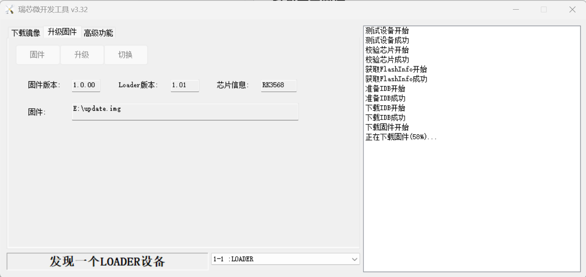
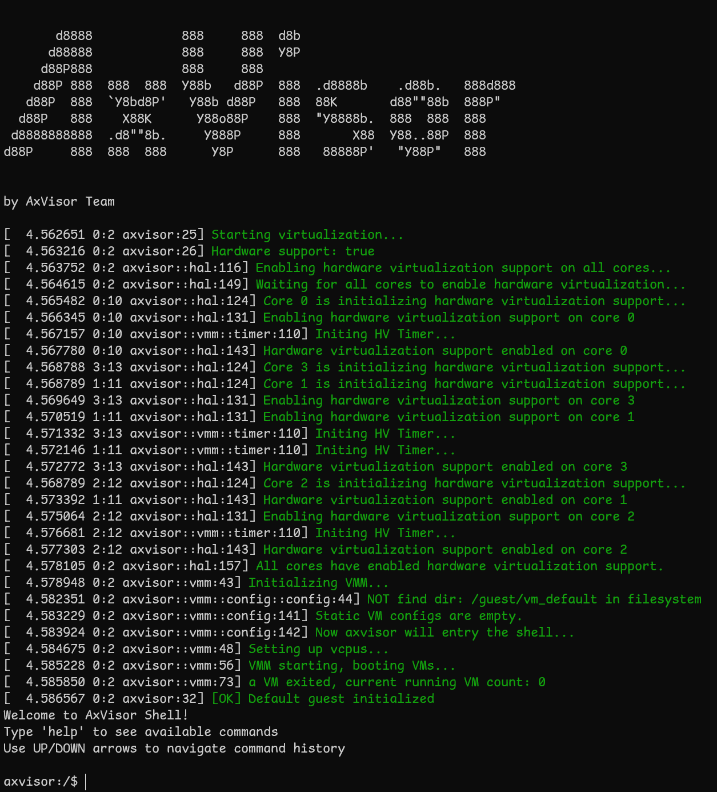

# ROC-RK3568-PC

本文档介绍如何在 ROC-RK3568-PC 开发板上启动和验证 AxVisor 项目，涵盖多种部署场景：

- **AxVisor + Linux 客户机**：在虚拟化环境中运行 Linux 系统
- **AxVisor + ArceOS 客户机**：在虚拟化环境中运行 ArceOS 系统
- **AxVisor + 多客户机**：同时运行多个不同类型的客户机系统

## 开发环境

AxVisor 及 ROC-RK3568-PC 的 SDK 仅支持在 Linux 系统中进行开发。本文档基于 **Ubuntu 24.04** 系统验证，其他 Linux 发行版可能需要相应调整。

### 系统要求

- Linux 操作系统（推荐 Ubuntu 20.04+）
- Git 工具
- Rust 工具链（用于编译 AxVisor）
- 基本的 Linux 命令行操作能力

> **注意**：ROC-RK3568-PC 的 SDK 对 Python 环境有特殊要求，详见后续章节。

## 构建准备

### 准备 AxVisor 源码

首先，使用 `git clone` 命令获取 AxVisor 的源代码并创建工作目录：
```bash
git clone https://github.com/arceos-hypervisor/axvisor.git
cd axvisor

# 创建工作目录
mkdir -p tmp/{configs,images}
```

### 准备设备树文件

设备树文件可以通过在开发板上运行 Linux 系统导出，也可以下载项目提供的设备树文件使用。

项目提供的 Linux 镜像文件夹中包含设备树文件，可直接下载到 `tmp/images` 目录：

```bash
# 下载包含设备树的 Linux 镜像
cargo xtask image download roc-rk3568-pc_linux --output-dir tmp/images
```

### 准备客户机镜像

AxVisor 项目提供了预构建的客户机镜像，方便用户快速验证和体验功能。通过 `cargo xtask image` 命令可以方便地管理这些镜像。

```bash
# 下载 ArceOS 客户机镜像
cargo xtask image download roc-rk3568-pc_arceos --output-dir tmp/images

# 下载 Linux 客户机镜像
cargo xtask image download roc-rk3568-pc_linux --output-dir tmp/images

# 列出所有可用镜像
cargo xtask image ls
```

AxVisor 所支持的客户机镜像的构建脚本和构建产物可以在 [axvisor-guest](https://github.com/arceos-hypervisor/axvisor-guest) 仓库中找到。

### 准备开发板配置文件

开发板配置文件定义了 AxVisor 在 RK3568 硬件平台上的基本运行参数。配置文件位于 `configs/board/roc-rk3568-pc.toml`，直接复制到工作目录即可：

```bash
# 复制开发板配置文件
cp configs/board/roc-rk3568-pc.toml tmp/configs/
```

## 部署到开发板

### 部署方式概述

AxVisor 支持两种客户机加载方式：

**方式一：内存加载部署**

编译时将客户机镜像打包进 AxVisor 二进制文件中，AxVisor 启动后直接从内存中加载客户机镜像。客户机配置文件设置 `image_location = "memory"`。

**方式二：文件系统加载部署**

客户机镜像独立存放在开发板的文件系统中，AxVisor 启动后从文件系统加载客户机镜像。客户机配置文件设置 `image_location = "fs"`。

---

由于瑞芯微提供的 SDK 对整个部署方式进行了预定义，难以实现自定义部署方式，因此我们通过构建后编辑瑞芯微原生镜像的方式来实现部署。整个部署操作要求在 ROC-RK3568-PC 的 SDK 目录中执行相关命令，以便直接使用 SDK 生成的各种镜像和工具。

### 方式一：内存加载部署

#### 准备客户机配置文件

复制客户机配置文件模板到工作目录：

```bash
# 复制 ArceOS 客户机配置文件
cp configs/vms/arceos-aarch64-rk3568-smp1.toml tmp/configs/

# 复制 Linux 客户机配置文件
cp configs/vms/linux-aarch64-rk3568-smp1.toml tmp/configs/
```

修改客户机配置文件，设置为内存加载模式：

```bash
# 修改 ArceOS 客户机配置
sed -i 's|image_location = ".*"|image_location = "memory"|g' tmp/configs/arceos-aarch64-rk3568-smp1.toml
sed -i "s|kernel_path = \".*\"|kernel_path = \"../images/roc-rk3568-pc_arceos/roc-rk3568-pc\"|g" tmp/configs/arceos-aarch64-rk3568-smp1.toml

# 修改 Linux 客户机配置
sed -i 's|image_location = ".*"|image_location = "memory"|g' tmp/configs/linux-aarch64-rk3568-smp1.toml
sed -i "s|kernel_path = \".*\"|kernel_path = \"../images/roc-rk3568-pc_linux/roc-rk3568-pc\"|g" tmp/configs/linux-aarch64-rk3568-smp1.toml
```

#### 配置构建文件

使用 `cargo xtask defconfig roc-rk3568-pc` 命令设置 ROC-RK3568-PC 为默认构建配置。这个命令会将 `configs/board/roc-rk3568-pc.toml` 复制为 `.build.toml`，作为默认的构建配置：

```bash
cargo xtask defconfig roc-rk3568-pc
```

然后指定要打包进 AxVisor 的客户机配置文件，修改 `.build.toml` 中的 `vm_configs` 字段：

**启动单个 ArceOS 客户机：**

```bash
sed -i 's|vm_configs\s*=.*|vm_configs = ["tmp/configs/arceos-aarch64-rk3568-smp1.toml"]|g' .build.toml
```

**启动单个 Linux 客户机：**

```bash
sed -i 's|vm_configs\s*=.*|vm_configs = ["tmp/configs/linux-aarch64-rk3568-smp1.toml"]|g' .build.toml
```

**启动多个客户机：**

```bash
sed -i 's|vm_configs\s*=.*|vm_configs = ["tmp/configs/arceos-aarch64-rk3568-smp1.toml", "tmp/configs/linux-aarch64-rk3568-smp1.toml"]|g' .build.toml
```

#### 编译 AxVisor

编译 AxVisor：

```bash
cargo xtask build
```

编译完成后，AxVisor 镜像位于 `target/aarch64-unknown-none-softfloat/release/axvisor.bin`。

#### 修改 boot.img

使用 ROC-RK3568-PC 的 SDK 会生成一个独立的 `boot.img`，其中存放了 Linux 内核镜像、设备树等文件。我们需要将其中的 Linux 内核镜像替换成 AxVisor 镜像。
```bash
# 进入 SDK 的固件输出目录
cd <SDK_PATH>/output/firmware

# 创建挂载点
mkdir -p boot

# 挂载 boot.img
sudo mount boot.img boot

# 复制 AxVisor 镜像，覆盖原有的 Linux 内核镜像
sudo cp <AXVISOR_PATH>/target/aarch64-unknown-none-softfloat/release/axvisor.bin boot/Image-5.10.198

# 卸载
sudo umount boot
```

#### 打包完整固件

在 SDK 目录中执行：
```bash
./build.sh updateimg
```

打包完成后，固件位于 `<SDK_PATH>/output/update/Image/update.img`。

#### 烧写固件

使用烧写工具（如瑞芯微的 AndroidTool）将完整的 `update.img` 固件烧写到开发板。

烧写统一固件 update.img 的步骤如下:

1. 切换至`升级固件`页。
2. 按`固件`按钮，打开要升级的固件文件。升级工具会显示详细的固件信息。
3. 按`升级`按钮开始升级。
4. 如果升级失败，可以尝试使用[切换升级存储器](https://wiki.t-firefly.com/zh_CN/ROC-RK3568-PC/03-upgrade_firmware_with_flash.html#gu-jian-xia-zai-dao-emmc)里面的方法



烧写完成后，重新上电启动开发板即可运行 AxVisor。

### 方式二：文件系统加载部署

#### 准备客户机配置文件

复制客户机配置文件模板到工作目录：
```bash
# 复制 ArceOS 客户机配置文件
cp configs/vms/arceos-aarch64-rk3568-smp1.toml tmp/configs/

# 复制 Linux 客户机配置文件
cp configs/vms/linux-aarch64-rk3568-smp1.toml tmp/configs/
```

修改客户机配置文件，设置为文件系统加载模式：
```bash
# 修改 ArceOS 客户机配置
sed -i 's|image_location = ".*"|image_location = "fs"|g' tmp/configs/arceos-aarch64-rk3568-smp1.toml
sed -i "s|kernel_path = \".*\"|kernel_path = \"/guest/images/arceos.bin\"|g" tmp/configs/arceos-aarch64-rk3568-smp1.toml

# 修改 Linux 客户机配置
sed -i 's|image_location = ".*"|image_location = "fs"|g' tmp/configs/linux-aarch64-rk3568-smp1.toml
sed -i "s|kernel_path = \".*\"|kernel_path = \"/guest/images/linux.bin\"|g" tmp/configs/linux-aarch64-rk3568-smp1.toml
```

#### 配置构建文件

使用 `cargo xtask defconfig roc-rk3568-pc` 命令设置 ROC-RK3568-PC 为默认构建配置：
```bash
cargo xtask defconfig roc-rk3568-pc
```

然后修改 `.build.toml` 文件，启用文件系统相关特性：
```bash
# 在 features 数组中添加文件系统相关特性
sed -i '/^features = \[/,/^\]/c\
features = [\
    "fs",\
    "axstd/ext4fs",\
    "driver/rk3568-clk",\
    "driver/sdmmc",\
    "dyn-plat",\
    "axstd/bus-mmio",\
]' .build.toml
```

或者手动编辑 `.build.toml` 文件，将 `features` 字段修改为：
```toml
features = [
    "fs",
    "axstd/ext4fs",
    "driver/rk3568-clk",
    "driver/sdmmc",
    "dyn-plat",
    "axstd/bus-mmio",
]
```

**注意：** 文件系统加载模式下，`vm_configs` 保持为空数组 `[]`，不需要指定客户机配置文件。

#### 编译 AxVisor

编译 AxVisor：

```bash
cargo xtask build
```

编译完成后，AxVisor 镜像位于 `target/aarch64-unknown-none-softfloat/release/axvisor.bin`。

#### 修改 boot.img

将 boot.img 中的 Linux 内核镜像替换为 AxVisor 镜像：
```bash
# 进入 SDK 的固件输出目录
cd <SDK_PATH>/output/firmware

# 创建挂载点
mkdir -p boot

# 挂载 boot.img
sudo mount boot.img boot

# 复制 AxVisor 镜像
sudo cp <AXVISOR_PATH>/target/aarch64-unknown-none-softfloat/release/axvisor.bin boot/Image-5.10.198

# 卸载
sudo umount boot
```

#### 添加客户机配置到 rootfs.img

在文件系统加载模式下，需要将客户机镜像和配置文件添加到根文件系统中。AxVisor 默认从 `/guest` 目录加载客户机文件。
```bash
# 创建挂载点
mkdir -p rootfs

# 挂载 rootfs.img
sudo mount rootfs.img rootfs

# 创建目录结构
sudo mkdir -p rootfs/guest/configs
sudo mkdir -p rootfs/guest/images

# 复制客户机配置文件
sudo cp <AXVISOR_PATH>/tmp/configs/arceos-aarch64-rk3568-smp1.toml rootfs/guest/configs/
sudo cp <AXVISOR_PATH>/tmp/configs/linux-aarch64-rk3568-smp1.toml rootfs/guest/configs/

# 复制客户机镜像
sudo cp <AXVISOR_PATH>/tmp/images/roc-rk3568-pc_arceos/roc-rk3568-pc rootfs/guest/images/roc-rk3568-pc-arceos
sudo cp <AXVISOR_PATH>/tmp/images/roc-rk3568-pc_linux/roc-rk3568-pc rootfs/guest/images/roc-rk3568-pc-linux

# 卸载
sudo umount rootfs
```

文件系统中的目录结构如下：
```
/guest/
├── configs/
│   ├── arceos-aarch64-rk3568-smp1.toml
│   └── linux-aarch64-rk3568-smp1.toml
└── images/
    ├── roc-rk3568-pc-arceos
    └── roc-rk3568-pc-linux
```

#### 打包完整固件

在 SDK 目录中执行：
```bash
./build.sh updateimg
```

打包完成后，固件位于 `<SDK_PATH>/output/update/Image/update.img`。

#### 烧写固件

使用烧写工具将完整的 `update.img` 固件烧写到开发板。

烧写统一固件 update.img 的步骤如下:

1. 切换至`升级固件`页。
2. 按`固件`按钮，打开要升级的固件文件。升级工具会显示详细的固件信息。
3. 按`升级`按钮开始升级。
4. 如果升级失败，可以尝试使用[切换升级存储器](https://wiki.t-firefly.com/zh_CN/ROC-RK3568-PC/03-upgrade_firmware_with_flash.html#gu-jian-xia-zai-dao-emmc)里面的方法


烧写完成后，重新上电启动开发板即可运行 AxVisor。

## 运行验证

完成部署后，需要对 AxVisor 的运行状态进行验证，确保虚拟化系统正常工作。本节将详细介绍连接方法、启动过程验证以及常见问题的处理方法。

### 串口连接

在验证运行状态之前，需要通过串口连接到 ROC-RK3568-PC 开发板。

#### 安装串口工具

在主机上安装串口通信工具：

```bash
# Ubuntu/Debian 系统
sudo apt install picocom minicom

# 或者使用 minicom
sudo apt install minicom
```
#### 连接设置

ROC-RK3568-PC 的串口参数：
- 波特率：1500000 (1.5Mbps)
- 数据位：8
- 停止位：1
- 校验位：无

使用 picocom 连接：
```bash
# 查看串口设备
ls /dev/ttyUSB*

# 连接串口（根据实际设备调整）
picocom -b 1500000 --imap lfcrlf /dev/ttyUSB0
```

使用 minicom 连接：
```bash
# 配置 minicom
sudo minicom -s

# 或者直接连接
sudo minicom -D /dev/ttyUSB0 -b 1500000
```

**退出 picocom：** `Ctrl+A` 然后按 `Ctrl+X`
**退出 minicom：** `Ctrl+A` 然后按 `Q`

### 启动过程验证

#### AxVisor 启动信息

开发板上电后，应该能看到以下启动信息：



#### 文件系统加载模式验证

如果使用文件系统加载部署，需要手动创建和启动客户机：

```bash
# 进入 AxVisor shell
# AxVisor>

# 列出可用的客户机配置
ls /guest/configs/

# 创建客户机实例
vm create /guest/configs/arceos-aarch64-rk3568-smp1.toml

# 启动客户机（VM ID 为 1）
vm start 1

# 创建第二个客户机
vm create /guest/configs/linux-aarch64-rk3568-smp1.toml

# 启动第二个客户机（VM ID 为 2）
vm start 2
```

#### 客户机运行状态

**Linux 客户机启动信息：**
```
axvisor:/$ vm start 2
[206.542173 0:2 axvisor::vmm::vcpus:341] Initializing VM[2]'s 1 vcpus
[206.542853 0:2 axvisor::vmm::vcpus:390] Spawning task for VM[2] VCpu[0]
[206.543573 0:2 axvisor::vmm::vcpus:405] VCpu task Task(15, "VM[2]-VCpu[0]") created cpumask: [0, ]
[206.544495 0:2 axvm::vm:416] Booting VM[2]
✓ VM[2] started successfully
axvisor:/$ [206.545313 0:15 axvisor::vmm::vcpus:428] VM[2] boot delay: 5s
[211.545942 0:15 axvisor::vmm::vcpus:431] VM[2] VCpu[0] waiting for running
[211.546673 0:15 axvisor::vmm::vcpus:434] VM[2] VCpu[0] running...
[  211.551621] Booting Linux on physical CPU 0x0000000000 [0x412fd050]
[  211.551643] Linux version 5.10.198 (runner@s1lqc) (firefly: 34d433bc5e75/2511210905) (sdk version: rk356x_linux5.10_release_20241220_v1.4.0c.xml) (aarch64-none-linux-gnu-gcc (GNU Toolchain for the A-profile Architecture 10.3-2021.07 (arm-10.29)) 10.3.1 20210621, GNU ld (GNU Toolchain for the A-profile Architecture 10.3-2021.07 (arm-10.29)) 2.36.1.20210621) #16 SMP Fri Nov 21 09:05:49 CST 2025

................

Ubuntu 20.04.6 LTS firefly ttyFIQ0

firefly login: root (automatic login)

/etc/update-motd.d/30-sysinfo: line 152: cannot create temp file for here-document: Read-only file system
/etc/update-motd.d/30-sysinfo: line 153: cannot create temp file for here-document: Read-only file system
/etc/update-motd.d/30-sysinfo: line 172: cannot create temp file for here-document: Read-only file system
/etc/update-motd.d/30-sysinfo: line 173: cannot create temp file for here-document: Read-only file system
/etc/update-motd.d/30-sysinfo: line 174: cannot create temp file for here-document: Read-only file system
/etc/update-motd.d/30-sysinfo: line 186: cannot create temp file for here-document: Read-only file system
/etc/update-motd.d/30-sysinfo: line 187: cannot create temp file for here-document: Read-only file system
/etc/update-motd.d/30-sysinfo: line 189: cannot create temp file for here-document: Read-only file system
/etc/update-motd.d/30-sysinfo: line 190: cannot create temp file for here-document: Read-only file system
 _____ _           __ _
|  ___(_)_ __ ___ / _| |_   _
| |_  | | '__/ _ \ |_| | | | |
|  _| | | | |  __/  _| | |_| |
|_|   |_|_|  \___|_| |_|\__, |
                        |___/
Welcome to Ubuntu 20.04.6 LTS (GNU/Linux 5.10.198 aarch64)

 * Documentation:  http://wiki.t-firefly.com
 * Management:     http://www.t-firefly.com

System information as of Mon Oct 20 02:53:58 UTC 2025

Up time:
IP:

The programs included with the Ubuntu system are free software;
the exact distribution terms for each program are described in the
individual files in /usr/share/doc/*/copyright.

Ubuntu comes with ABSOLUTELY NO WARRANTY, to the extent permitted by
applicable law.

The programs included with the Ubuntu system are free software;
the exact distribution terms for each program are described in the
individual files in /usr/share/doc/*/copyright.

Ubuntu comes with ABSOLUTELY NO WARRANTY, to the extent permitted by
applicable law.

root@firefly:~#
```

**ArceOS 客户机启动信息：**
```
axvisor:/$ vm start 1
[146.447613 0:2 axvisor::vmm::vcpus:341] Initializing VM[1]'s 1 vcpus
[146.448295 0:2 axvisor::vmm::vcpus:390] Spawning task for VM[1] VCpu[0]
[146.449009 0:2 axvisor::vmm::vcpus:405] VCpu task Task(14, "VM[1]-VCpu[0]") created cpumask: [2, ]
[146.449928 0:2 axvm::vm:416] Booting VM[1]
✓ VM[1] started successfully
axvisor:/$ [146.458789 2:14 axvisor::vmm::vcpus:428] VM[1] boot delay: 0s
[146.459412 2:14 axvisor::vmm::vcpus:431] VM[1] VCpu[0] waiting for running
[146.460146 2:14 axvisor::vmm::vcpus:434] VM[1] VCpu[0] running...
fdt                     : 0x1aa00000
EL                      : 1
_start                  : 0xffff800000000000
stack                   : 0xffff800000088000
loader                  : [0xac34000, 0xac443c0)
BootTable space         : [0xad09698 --)
code                    : [0xffff800000000000, 0xffff800020000000) -> [0xac00000, 0x2ac00000)
ram                     : 0xffff90000ac00000-> 0xac00000
debug                   : 0xffff9000fe660000-> 0xfe660000
eq                      : [0x0, 0x8000000000)
Table                   : 0x000000000ad0a000
Table size              : 0x8968
jump to                 : 0xffff800000002494
SomeHAL booting...
Power management method : SMC
Goto main...

       d8888                            .d88888b.   .d8888b.
      d88888                           d88P" "Y88b d88P  Y88b
     d88P888                           888     888 Y88b.
    d88P 888 888d888  .d8888b  .d88b.  888     888  "Y888b.
   d88P  888 888P"   d88P"    d8P  Y8b 888     888     "Y88b.
  d88P   888 888     888      88888888 888     888       "888
 d8888888888 888     Y88b.    Y8b.     Y88b. .d88P Y88b  d88P
d88P     888 888      "Y8888P  "Y8888   "Y88888P"   "Y8888P"

arch = aarch64
platform = aarch64-dyn
target = aarch64-unknown-none-softfloat
build_mode = release
log_level = info
smp = 1

[146.915558 axruntime:136] Logging is enabled.
[146.916058 axruntime:137] Primary CPU 0 started, arg = 0xacee000.
[146.916725 axruntime:140] Found physcial memory regions:
[146.917307 axruntime:142]   [PA:0xac00000, PA:0xac01000) reserved (READ | WRITE | RESERVED)
[146.918168 axruntime:142]   [PA:0xac01000, PA:0xac2c000) .text (READ | EXECUTE | RESERVED)
[146.919023 axruntime:142]   [PA:0xac2c000, PA:0xac45000) .rodata (READ | RESERVED)
[146.919818 axruntime:142]   [PA:0xac45000, PA:0xac48000) .data .tdata .tbss .percpu (READ | WRITE | RESERVED)
[146.920822 axruntime:142]   [PA:0xac88000, PA:0xacc8000) boot stack (READ | WRITE | RESERVED)
[146.921700 axruntime:142]   [PA:0xacc8000, PA:0xacee000) .bss (READ | WRITE | RESERVED)
[146.922534 axruntime:142]   [PA:0xacee000, PA:0xad13000) reserved (READ | WRITE | RESERVED)
[146.923399 axruntime:142]   [PA:0xad13000, PA:0x1ac00000) free memory (READ | WRITE | FREE)
[146.924261 axruntime:142]   [PA:0xfe660000, PA:0xfe661000) mmio (READ | WRITE | DEVICE | RESERVED)
[146.925180 axruntime:220] Initialize global memory allocator...
[146.925825 axruntime:221]   use TLSF allocator.
[146.926435 axmm:101] Initialize virtual memory management...
[146.935554 axruntime:160] Initialize platform devices...
[147.031697 axruntime:198] Primary CPU 0 init OK.
Hello, world!
[147.032345 2:14 axvisor::vmm::vcpus:513] VM[1] run VCpu[0] SystemDown
[147.033035 2:14 axvm::vm:453] Shutting down VM[1]
[147.033570 2:14 axvisor::vmm::vcpus:564] VM[1] VCpu[0] stopping because of VM stopping
[147.034389 2:14 axvisor::vmm::vcpus:570] VM[1] VCpu[0] last VCpu exiting, decreasing running VM count
[147.035331 2:14 axvisor::vmm::vcpus:574] VM[1] state changed to Stopped
[147.036050 2:14 axvisor::vmm::vcpus:584] VM[1] VCpu[0] exiting...
```

> **当前版本的 AxVisor 存在以下限制：**
> 
> 1. **Shell 切换限制**：Linux 客户机启动后，无法返回 AxVisor shell，需要重启开发板
