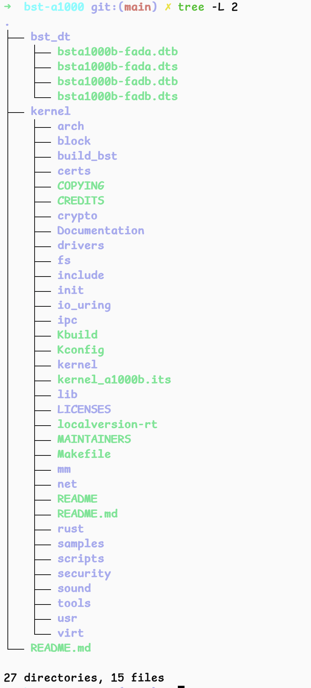

# A1000域控制器

本文详细介绍 AxVisor + Linux 客户机在 A1000 域控制器上的构建、部署及运行！

## 开发环境

本文中的构建及部署环境均采用 Ubuntu 22.04 作为开发环境。

## 构建

### 构建 Linux 客户机镜像

#### 获取 SDK

``` bash
git clone git@github.com:arceos-hypervisor/bst-a1000.git
```



#### 构建过程

1. 进入项目目录并赋予内核文件夹执行权限：
    ```bash
    cd bst-al000
    sudo chmod -R 755 ./kernel/
    ```

2. 配置内核

    使用交叉编译工具链配置内核，根据需要选择 release 或 debug 版本：
    ```bash
    # Release 版本
    make CROSS_COMPILE=aarch64-linux-gnu- ARCH=arm64 O=build_bst \
        bsta1000b_release_defconfig CC=aarch64-linux-gnu-gcc-9

    # 或 Debug 版本
    make CROSS_COMPILE=aarch64-linux-gnu- ARCH=arm64 O=build_bst \
        bsta1000b_debug_defconfig CC=aarch64-linux-gnu-gcc-9
    ```

    

3. 编译内核

    执行多线程编译，加速构建过程：
    ```bash
    make CROSS_COMPILE=aarch64-linux-gnu- ARCH=arm64 O=build_bst \
        -j$(nproc) CC=aarch64-linux-gnu-gcc-9
    ```

    > 提示：`-j$(nproc)` 参数会自动使用所有可用的 CPU 核心进行并行编译

    

4. 编译产物

    编译成功后，内核镜像文件位于：
    ```
    build_bst/arch/arm64/boot/Image
    ```

## 构建 AxVisor 镜像

以下以 **A 核**为例演示构建过程，若使用 B 核，请相应调整配置文件和 DTB 文件。
### 步骤 1：编译客户机设备树

#### 1.1 准备设备树源文件

AxVisor 源码的 `configs/vms` 目录下提供了适用于 A1000 域控制器的设备树源文件：

- **A 核**：`linux-aarch64-a1000-smp8-fada.dts`
- **B 核**：`linux-aarch64-a1000-smp8-fadb.dts`

#### 1.2 编译设备树

客户机设备树文件记录了传递给客户机的硬件设备信息（CPU、内存、外设等），这些信息**必须与客户机配置文件保持一致**。

使用 `dtc` 工具编译设备树：
```bash
# 编译 A 核设备树
cd configs/vms
dtc -I dts -O dtb \
    -o linux-aarch64-a1000-smp8-fada.dtb \
    linux-aarch64-a1000-smp8-fada.dts
```

> **提示**：若使用 B 核，请将文件名替换为 `linux-aarch64-a1000-smp8-fadb.dts`。

---

### 步骤 2：配置客户机参数

#### 2.1 选择配置文件

AxVisor 源码的 `configs/vms` 目录下提供了配置文件模板：
```
configs/vms/linux-aarch64-a1000_smp8.toml
```

客户机配置文件记录了以下信息：
- 客户机 ID 和基本信息
- 镜像及设备树的加载位置
- CPU 核心分配
- 内存大小
- 设备资源等等

#### 2.2 选择镜像加载方式

AxVisor 支持两种客户机镜像加载方式，根据使用场景选择合适的方式：

| 加载方式 | 配置参数 | 路径类型 |
|---------|---------|---------|
| 从文件系统加载 | `image_location = "fs"` | 域控制器文件系统中的绝对路径 |
| 从内存加载 | `image_location = "memory"` | 本地构建环境中的绝对路径 |

#### 2.3 编辑配置文件

打开配置文件 `configs/vms/linux-aarch64-a1000-smp8.toml`，根据选择的加载方式进行配置：

**方式一：从文件系统加载**
```toml
# 镜像加载方式
image_location = "fs"

# 内核镜像加载地址
kernel_load_addr = 0x1_ce80_0000
# 内核镜像在域控制器文件系统中的路径
kernel_path = "/guest/Image"

# 设备树加载地址
dtb_load_addr = 0x1_cef0_0000
# 设备树在域控制器文件系统中的路径
dtb_path = "/guest/linux-aarch64-a1000-smp8-fada.dtb"
```

**配置说明：**
- `kernel_path`：指向域控制器中部署的客户机内核镜像（对应前面编译的 `build_bst/arch/arm64/boot/Image`）
- `dtb_path`：指向域控制器中部署的设备树文件（对应步骤 1 编译的 `.dtb` 文件）

---

**方式二：从内存加载**
```toml
# 镜像加载方式
image_location = "memory"

# 内核镜像加载地址
kernel_load_addr = 0x1_ce80_0000
# 内核镜像在本地构建环境中的路径
kernel_path = "./Image"

# 设备树加载地址
dtb_load_addr = 0x1_cef0_0000
# 设备树在本地构建环境中的路径
dtb_path = "./configs/vms/linux-aarch64-a1000-smp8-fada.dtb"
```

**配置说明：**
- `kernel_path`：使用相对路径时，需将客户机内核镜像复制到 AxVisor 根目录
- `dtb_path`：指向本地编译生成的设备树文件
- 镜像将在编译时嵌入到 AxVisor 镜像中

> **重要提示：**
> - 若使用 B 核，将 `dtb_path` 修改为 `linux-aarch64-a1000-smp8-fadb.dtb`
> - 其他配置项（如 CPU、内存等）可根据需求修改，未修改的配置项将使用默认值

---

### 步骤 3：编译 AxVisor 镜像

```bash
./axvisor.sh build \
    --plat aarch64-generic \
    --arceos-args "LOG=off,SMP=8" \
    --vmconfigs "configs/vms/linux-aarch64-a1000-smp8.toml"
```

参数说明：
- `--plat`：指定目标平台为 AArch64 通用平台
- `--arceos-args`：ArceOS 参数配置（日志级别、SMP 核心数等）
- `--vmconfigs`：客户机配置文件路径

### 步骤 4：生成可烧写镜像

切换到 `bst-al000` 目录，编辑镜像配置文件 `tools/a1000b/bsta1000b-fada-arceos.its`，修改以下数据路径：
```its
images {
    kernel {
        description = "ArceOS for BST A1000B";
        data = /incbin/("../../axvisor_aarch64-generic.bin");
    ...
fdt-fada {
    description = "bsta1000b-fada fdt";
    data = /incbin/("/home/yanlien/Workspace/project_check/a1000/host/bsta1000b-fada.dtb");
    ...
fdt-fadb {
    description = "bsta1000b-fadb fdt";
    data = /incbin/("/home/yanlien/Workspace/project_check/a1000/host/bsta1000b-fadb.dtb");
    ...
```

**路径配置说明**

需要修改的 `data` 字段包括：

1. **Axvisor 内核镜像路径**
```its
   data = /incbin/("../../axvisor_aarch64-generic.bin");
```
   - 指向 AxVisor 编译生成的二进制镜像文件
   - 默认相对路径为 AxVisor 根目录下的 `axvisor_aarch64-generic.bin`

2. **A 核设备树路径**
```its
   data = /incbin/("path/to/bsta1000b-fada.dtb");
```
   - 替换为 A 核 Host 设备树的实际路径
   - 示例：`"/home/username/workspace/bst-al000/bsta1000b-fada.dtb"`

3. **B 核设备树路径**
```its
   data = /incbin/("path/to/bsta1000b-fadb.dtb");
```
   - 替换为 B 核 Host 设备树的实际路径
   - 示例：`"/home/username/workspace/bst-al000/bsta1000b-fadb.dtb"`

> **重要提示：**
> - 所有路径必须使用**绝对路径**或相对于 `bst-al000` 目录的相对路径
> - 确保所有文件路径真实存在，否则 `mkimage` 打包将失败
> - 路径中不能包含中文字符或特殊字符

切换到bst-al000目录下，把bsta1000b-fada-arceos.its文件中的

修改完成后保存文件，即可进行下一步的镜像打包操作。

使用 `mkimage` 工具生成最终的可烧写镜像文件：
```bash
./tools/a1000b/mkimage \
    -f ./tools/a1000b/bsta1000b-fada-arceos.its \
    Image.itb
```

编译成功后，将在当前目录生成 `Image.itb` 镜像文件。

---

## 部署

### 替换 Host 设备树

#### 1. 准备工作

- 使用串口调试线将域控制器与上位机连接
- 确保已安装并配置好 ADB 调试工具
- **建议使用 Linux 主机**进行操作

#### 2. 配置串口监控

使用 `picocom` 连接串口以监控设备输出：
```bash
picocom -b 115200 --imap lfcrlf /dev/ttyUSB0 
```

> **重要**：若操作涉及不同的 CPU 核心（A 核/B 核），请切换至对应的串口：
> - A 核 → 串口 0（`/dev/ttyUSB0`）
> - B 核 → 串口 1（`/dev/ttyUSB1`）

#### 3. 挂载存储设备

进入设备的 Shell 环境并挂载启动分区：
```bash
adb shell
mount /dev/mmcblk0p1 /mnt
```

#### 4. 推送设备树文件

在上位机终端执行以下命令，将新的 Host 设备树文件推送至域控制器：
```bash
# 推送 A 核设备树
adb push bsta1000b-fada.dtb /mnt/bsta1000b-fada.dtb

# 推送 B 核设备树
adb push bsta1000b-fadb.dtb /mnt/bsta1000b-fadb.dtb
```

---

### 烧写 AxVisor 镜像

#### 1. 准备工作

确保已完成上一步的设备树替换，并准备好编译生成的 `Image.itb` 镜像文件。

#### 2. 配置串口监控

使用 `minicom` 连接对应的串口：
```bash
sudo minicom -D /dev/ttyUSB0 -b 115200
```

> **重要**：根据目标 CPU 核心选择正确的串口（A 核用 ttyUSB0，B 核用 ttyUSB1）。

#### 3. 挂载存储设备

进入设备的 Shell 环境并挂载启动分区：
```bash
adb shell
mount /dev/mmcblk0p1 /mnt
```

#### 4. 推送镜像文件

在上位机终端执行以下命令，将新的内核镜像推送至域控制器：
```bash
adb push Image.itb /mnt/Image.itb
```

#### 5. 重启设备

传输完成后，按以下步骤重启设备：

1. **断电**：切断设备电源
2. **等待**：断电后等待 **4-5 秒**
3. **上电**：重新接通电源启动设备

> **警告**：切勿立即重启，必须等待足够时间以确保写入操作完全完成。

---

## 注意事项

### ⚠️ 内核替换失败恢复

若内核替换失败或烧写了不兼容的系统（如 ArceOS），可通过 U-Boot 恢复模式恢复：

1. 设备上电启动时，**快速按下 `Ctrl + C`** 进入 U-Boot 命令行
2. 依次输入以下三条命令进入恢复模式：
```bash
setenv rollback 'ext4load mmc 0:2 0x85000000 /uEnv.txt;env import -t 0x85000000 $filesize;setenv boot_rollback 1;run bootcmd_cmd;reset;'
saveenv
run rollback
```

3. 系统将回滚到上一个可用版本，完成后可重新烧写内核

### ⚠️ A 核与 B 核切换注意事项

黑芝麻 A1000 平台存在 **A 核**和 **B 核**两种不同的 SoC 核心，进行核心操作时请注意：

| 目标核心 | ADB 连接端口 | 串口设备 | 设备树文件 |
|---------|------------|---------|-----------|
| A 核 | A 核对应的 ADB 端口 | `/dev/ttyUSB0` | `bsta1000b-fada.dtb` |
| B 核 | B 核对应的 ADB 端口 | `/dev/ttyUSB1` | `bsta1000b-fadb.dtb` |

**关键要点**：
- 切换 ADB 端口时，必须**同步切换对应的串口**以正确显示输出
- 确保使用正确的设备树文件和配置文件

### ⚠️ 断电重启注意事项

- 断电后**必须等待 4-5 秒**再重新上电
- 过快重启可能因断电保护机制导致镜像替换失败
- 建议在串口监控下观察启动过程，确认系统正常启动
