# EVM3588

本文详细介绍 AxVisor + Linux 客户机、AxVisor + ArceOS 客户机 以及 AxVisor + Linux 客户机 和 ArceOS 客户机三种情况在 EVM3588 开发板上的构建、部署及运行！

## 开发环境

AxVisor 及 EVM3588 的 SDK 仅支持在 Linux 系统进中进行开发。本文中的构建及部署环境均采用 Ubuntu 24.04 系统作为开发环境。

1. 官方 SDK 完成度较低，其中有很多缺失、错误，在实际构建中会给出相关修改

2. EVM3588 的 SDK 本身不支持使用 Python3 来构建，需要稍加修改，文中会给出相关修改

3. **如果不使用 Python3 环境，则需要手动安装 Python2 环境**，因为很多新的 Linux 发行版本，例如， Ubuntu 24.04，默认已经不提供 Python2 的相关包了

## 构建

准备 AxVisor 镜像 + Linux 客户机镜像。或者**可以直接从 https://github.com/arceos-hypervisor/axvisor-guest/releases 下载预编译好的 AxVisor 镜像 + Linux 客户机镜像以及相关文件！**

### 构建 Linux 客户机镜像

根据 EVM3588 开发板官方文档，构建 Linux 客户机镜像。或者直接 `wget https://github.com/arceos-hypervisor/axvisor-guest/releases/latest/download/evm3588_linux.tar.gz` 下载预编译好的 Linux 客户机镜像及相关文件！

#### 获取 SDK

从英码嵌入式官方的百度网盘中下载提供的 SDK `evm3588_linux_sdk-rkr3_v1.0.3-ab_v98.tar.gz`。下载的 SDK 实际上是一个仓库的源码的压缩包，直接使用 `tar xvf evm3588_linux_sdk-rkr3_v1.0.3-ab_v98.tar.gz` 解压即可，其中的 `build.sh` 就是构建入口。

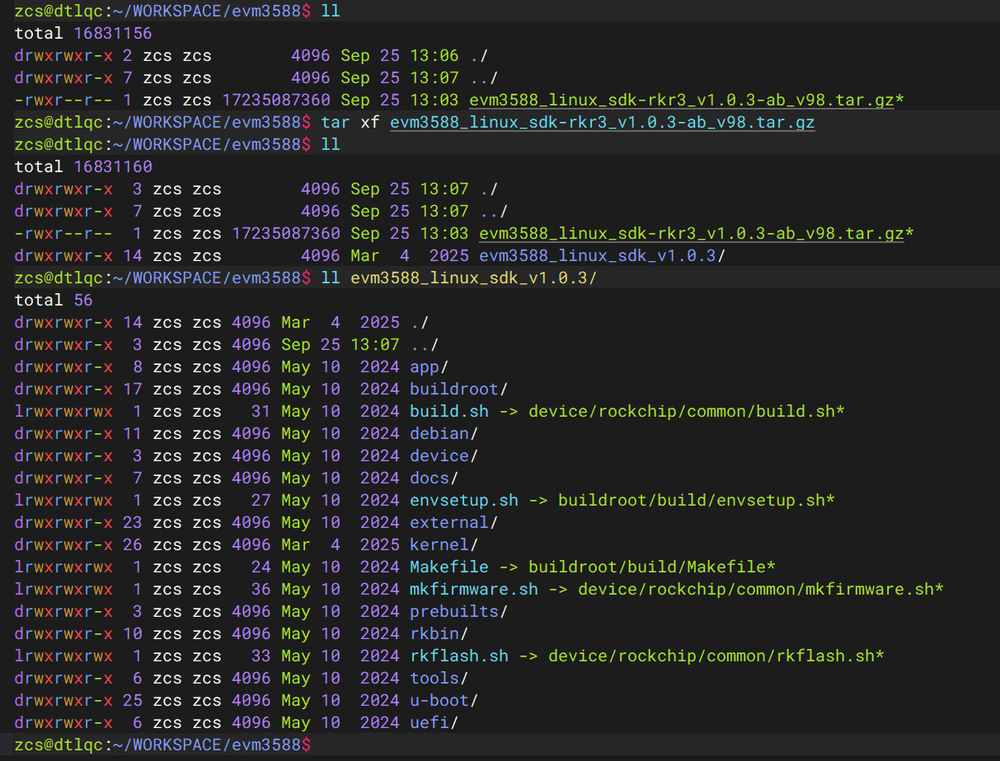

#### 移植适配

由于 EVM3588 的 SDK 不支持使用 Python3 来构建，如果当前构建环境系统中 Python 版本是 Python3 版本，则需要做如下修改：

1. 修改 U-Boot 源码中的 `u-boot/make.sh` 文件，其中的如下位置来取消对于 Python2 的检测即可：

	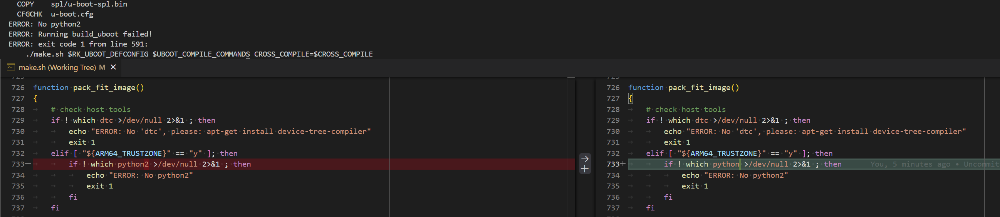

2. 修改 U-Boot 源码中的  `u-boot/arch/arm/mach-rockchip/decode_bl31.py` 文件，直接将开头的 `#!/usr/bin/env python2` 改为 `#!/usr/bin/env python3` 即可

	> 实际上，U-Boot 源码中还有大量基于 Python2 的脚本文件，在默认的构建中没有用的，因此这里不再继续修改

3. 修改 Kernel 源码中的 `kernel/scripts/mkmultidtb.py`，直接改为如下内容：
	```python
	#!/usr/bin/env python3
	# SPDX-License-Identifier: (GPL-2.0+ OR MIT)
	# Copyright (c) 2018 Fuzhou Rockchip Electronics Co., Ltd
	#


	"""
	Multiple dtb package tool

	Usage: scripts/mkmultidtb.py board
	The board is what you defined in DTBS dictionary like DTBS['board'],
	Such as: PX30-EVB, RK3308-EVB

	"""
	import os
	import sys
	import shutil
	from collections import OrderedDict

	DTBS = {}

	DTBS['PX30-EVB'] = OrderedDict([('px30-evb-ddr3-v10', '#_saradc_ch0=1024'),
					('px30-evb-ddr3-lvds-v10', '#_saradc_ch0=512')])

	DTBS['RK3308-EVB'] = OrderedDict([('rk3308-evb-dmic-i2s-v10', '#_saradc_ch3=288'),
					('rk3308-evb-dmic-pdm-v10', '#_saradc_ch3=1024'),
					('rk3308-evb-amic-v10', '#_saradc_ch3=407')])

	#_saradc_ch5=3750 => evm3588 b1
	DTBS['evm3588'] = OrderedDict([('evm3588', '#_saradc_ch5=2048'),
					('evm3588-b1', '#_saradc_ch5=3754')])

	def main():
		if (len(sys.argv) < 2) or (sys.argv[1] == '-h'):
			print (__doc__)
			sys.exit(2)

		BOARD = sys.argv[1]
		TARGET_DTBS = DTBS[BOARD]
		target_dtb_list = ''
		default_dtb = True

		for dtb, value in TARGET_DTBS.items():
			if default_dtb:
				ori_file = 'arch/arm64/boot/dts/rockchip/' + dtb + '.dtb'
				board_name = dtb
				shutil.copyfile(ori_file, "rk-kernel.dtb")
				target_dtb_list += 'rk-kernel.dtb '
				default_dtb = False
			new_file = board_name + value + '.dtb'
			ori_file = 'arch/arm64/boot/dts/rockchip/' + dtb + '.dtb'
			shutil.copyfile(ori_file, new_file)
			target_dtb_list += ' ' + new_file

		print(' '.join(target_dtb_list))
		os.system('scripts/resource_tool logo.bmp logo_kernel.bmp ' + target_dtb_list)
		os.system('rm ' + target_dtb_list)

	if __name__ == '__main__':
		main()
	```
3. 默认的构建采用的是 Buildroot 来构建 rootfs，而默认配置中会使用 Buildroot 来构建一个内置的编译工具链，版本为 gcc11.3，然而 gcc11.3 的文档比较旧，与新版本的 `texinfo` 工具不兼容（报错：`extend.texi:2490: @itemx should not begin @table`)，因此需要对 gcc11.3 的源码进行 patch，直接将 patch 放到 `buildroot/package/gcc/11.3.0/` 目录下即可：

	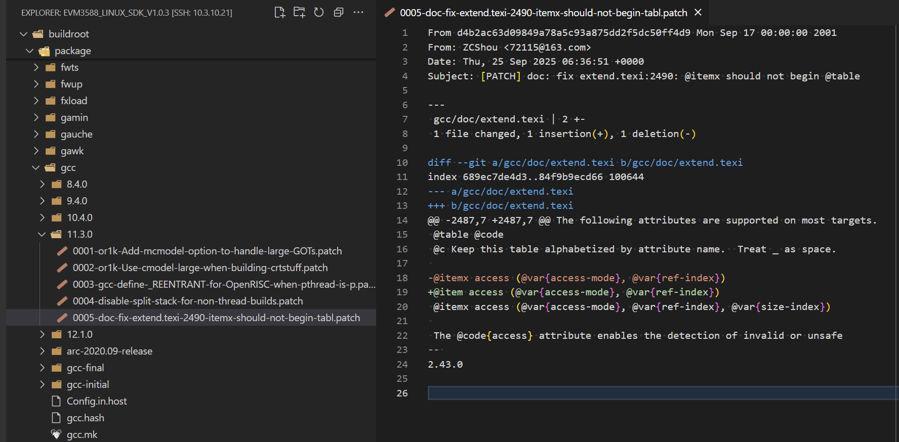

	patch 需要我们 `git clone https://gcc.gnu.org/git/gcc.git`，然后 `git checkout releases/gcc-11.3.0`，然后修改 `extend.texi` 并提交，最后 `git format-patch --subject-prefix='PATCH' HEAD^` 来生成：
	```
	From d4b2ac63d09849a78a5c93a875dd2f5dc50ff4d9 Mon Sep 17 00:00:00 2001
	From: ZCShou <72115@163.com>
	Date: Thu, 25 Sep 2025 06:36:51 +0000
	Subject: [PATCH] doc: fix extend.texi:2490: @itemx should not begin @table

	---
	gcc/doc/extend.texi | 2 +-
	1 file changed, 1 insertion(+), 1 deletion(-)

	diff --git a/gcc/doc/extend.texi b/gcc/doc/extend.texi
	index 689ec7de4d3..84f9b9ecd66 100644
	--- a/gcc/doc/extend.texi
	+++ b/gcc/doc/extend.texi
	@@ -2487,7 +2487,7 @@ The following attributes are supported on most targets.
	@table @code
	@c Keep this table alphabetized by attribute name.  Treat _ as space.
	
	-@itemx access (@var{access-mode}, @var{ref-index})
	+@item access (@var{access-mode}, @var{ref-index})
	@itemx access (@var{access-mode}, @var{ref-index}, @var{size-index})
	
	The @code{access} attribute enables the detection of invalid or unsafe
	-- 
	2.43.0
	```
4. 修改 `buildroot/package/rockchip/libv4l-rkmpp/libv4l-rkmpp.hash` 中的 sha256 值为 `35eefaec3cec77144368c1bb2d860457cefcf7609b54745e90bc417d3ad1eeb6`，默认的是错误的

	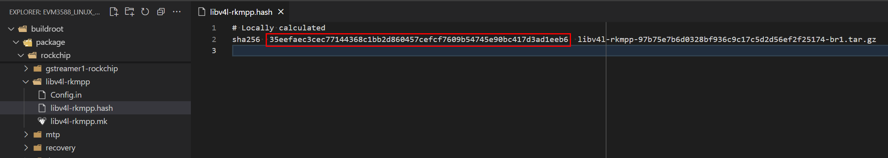

5. 修改 `buildroot/package/stressapptest/stressapptest.hash` 中的 sha256 值为 `cc35d5687c40cb368b7aa7704928285e1d756928bb4c5bab13c230efc0abc540`，默认的是错误的

	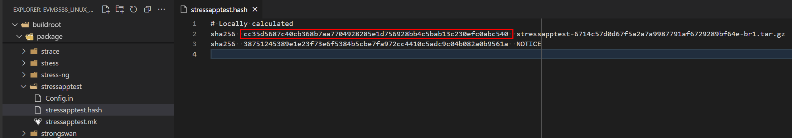

<!-- 6. 如果要编译 debain 的 rootfs 则需要修改 `debian/ubuntu-build-service/bullseye-base-arm64/Makefile` 和 `debian/ubuntu-build-service/bullseye-desktop-arm64/Makefile` 如下：

	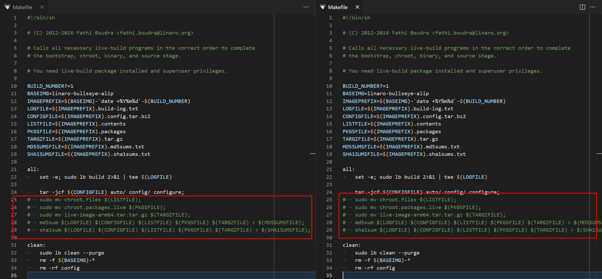
 -->

#### 构建过程

在初次执行 `./build.sh xxx` 时会强制选择开发板板型号，选择之后会创建符号链接 `device/rockchip/.BoardConfig.mk` 指向 `device/rockchip/rkxxx` 目录下的配置文件，后续构建时就会默认使用此配置文件（可以通过 `./build.sh lunch` 再次选择）。

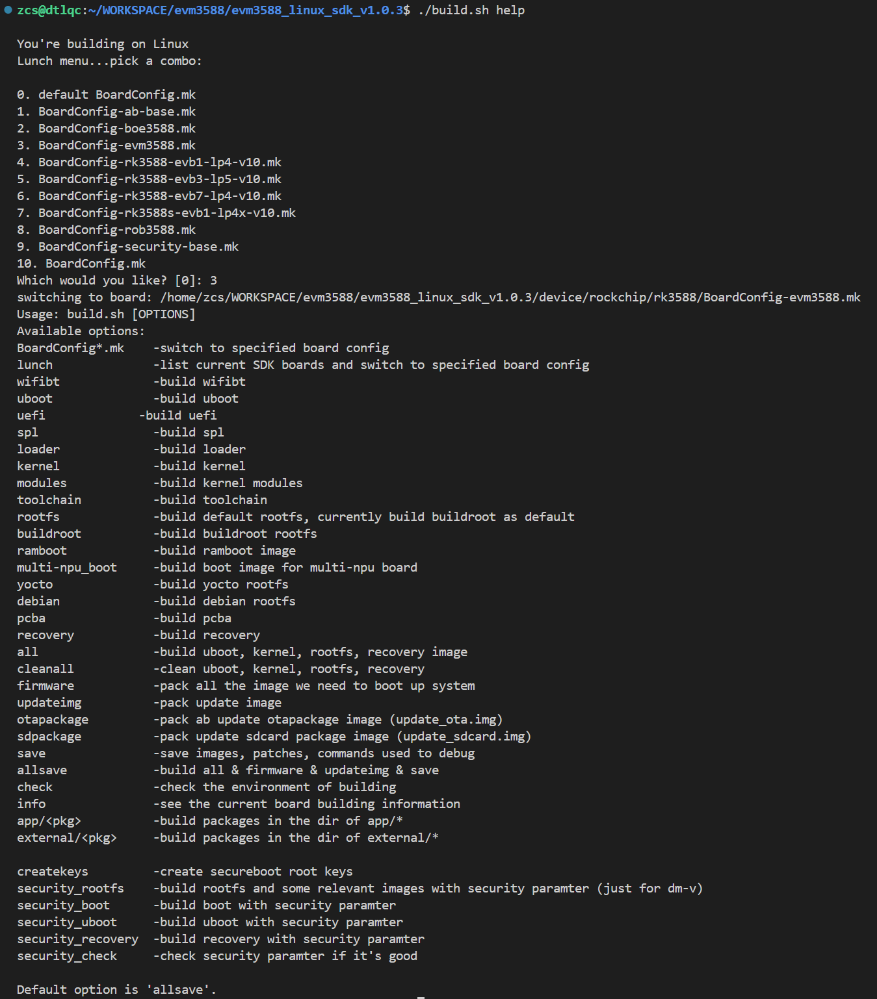

官方 SDK 除了支持单独编译 U-Boot、Linux kernel 等组件之外，还支持编译 debian 系统、Buildroot 系统以及 Ubuntu 系统三种 rootfs，默认编译 Buildroot 系统。

1. 首先 `sudo apt install git ssh make gcc libssl-dev liblz4-tool expect expect-dev g++ patchelf chrpath gawk texinfo chrpath diffstat binfmt-support qemu-user-static live-build bison flex fakeroot cmake gcc-multilib g++-multilib unzip device-tree-compiler ncurses-dev libgucharmap-2-90-dev bzip2 expat cpp-aarch64-linux-gnu libgmp-dev libmpc-dev bc python-is-python3` 安装依赖工具包。
	> 如果使用 Python2 环境，则不要安装 `python-is-python3` 这个包

2. 执行 `./build.sh` 然后选择 `BoardConfig-evm3588.mk` 对应的编号 `3`（仅在第一次执行时需要选择）就可以启动构建，默认构建所有镜像。正常编译完成之后就会在 `rockdev` 目录下生成相关镜像（符号链接到各个组件）

	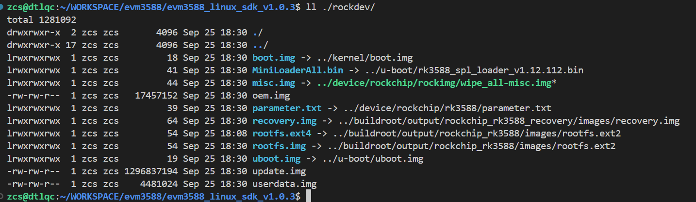

3. **【可选】** 全编译时非常耗时，可根据需要执行 `./build.sh uboot`、`./build.sh kernel`、`./build.sh debian 或 buildroot` 等命令来只编译必要的组件。

	1. `./build.sh yocto` 无法使用，因为默认的 SDK 中缺失了 yocto 部分的内容

		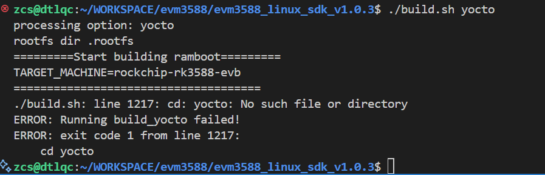

	2. `./build.sh debian` 会报错如下：

		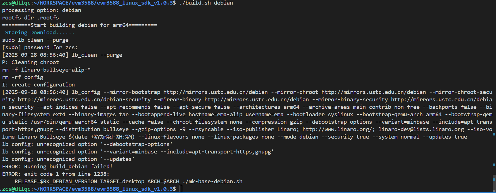

		这是由于 Debian 使⽤ live build，当前 Ubuntu 24.04 软件仓库中默认提供的 live-build 版本 `3.0~a57-1ubuntu` 不兼容，而从 `3.0~a67-1` 开始已经修复该问题，因此我们需要升级 live-build 即可。
		
		直接从 https://pkgs.org/download/live-build 下载最新版 live-build_20250814_all.deb，然后 `sudo dpkg -i live-build_20250814_all.deb` 安装即可

### 构建 ArceOS 客户机镜像

根据 ArceOS 文档，构建 ArceOS 客户机镜像。或者直接 `wget https://github.com/arceos-hypervisor/axvisor-guest/releases/download/v0.0.11/evm3588_arceos.tar.gz` 下载预编译好的 ArceOS 客户机镜像及相关文件！

1. 直接 `git clone https://github.com/arceos-hypervisor/arceos -b hypervisor` 获取源码

2. 执行 `make A=examples/helloworld PLATFORM=aarch64-dyn SMP=1 LOG=info` 构建 ArceOS 镜像。注意，其中的参数 `SMP=1` 需要与客户机配置文件中分配的 CPU 数量一致！

### 构建 AxVisor 镜像

根据 AxVisor 文档，构建 AxVisor 镜像。

#### 准备客户机设备树

在 AxVisor 源码的 `configs/vms` 目录下有适用于 EVM3588 开发板的设备树源码文件 `linux-aarch64-evm3588_smp1.dts`、`linux-aarch64-evm3588_smp2.dts`、`arceos-aarch64-evm3588_smp1.dts`、`arceos-aarch64-evm3588_smp2.dts`，根据需要选择即可。

1. 客户机设备树也是一个文件文件，其中记录了实际传递给客户机的设备信息，其中的 CPU、内存、设备信息等必须与客户机配置文件中的相对应。

2. 使用命令 `dtc -I dts -O dtb -o configs/vms/linux-aarch64-evm3588_smp1.dtb configs/vms/linux-aarch64-evm3588_smp1.dts` 编译为 DTB 来使用

#### 准备客户机配置文件

客户机配置文件是一个文本文件，其中不但记录了客户机的 ID 、镜像及设备树位置等基本信息，还记录了分配给它的 CPU 号、内存、设备等信息，AxVisor 根据客户机配置文件中的信息来加载启动客户机镜像。

在 AxVisor 源码的 `configs/vms` 目录下有适用于 EVM3588 开发板的客户机配置文件 `linux-aarch64-evm3588_smp1.toml`、`linux-aarch64-evm3588_smp2.toml`、`arceos-aarch64-evm3588_smp1.toml`、`arceos-aarch64-evm3588_smp2.toml`，根据需要选择即可。

当前，AxVisor 支持从文件系统加载客户机镜像和从内存中加载客户机镜像两种方式，通过客户机配置文件中的 `image_location` 配置项进行区分，我们需要根据需求来修改配置文件。

-  从文件系统加载时，则确保如下配置项内容：
	- `image_location = "fs"`
	- `kernel_path = "/guest/Image"`， 这里需要配置为客户机镜像在 EVM3588 开发板中的文件系统中的绝对路径，客户机镜像就是上一步 **构建 Linux 客户机镜像** 生成的 Linux 内核镜像 `kernel/arch/arm64/boot/Image`
	- `dtb_path = "/guest/linux-aarch64-evm3588_smp1.dtb"`，这里配置为客户机设备树在 EVM3588 开发板中的文件系统中的绝对路，客户机设备树就是上一步 **准备客户机设备树** 中构建的 DTB 文件

- 从内存加载时，则确保如下配置项内容：
	- `image_location = "memory"`
	- `kernel_path = "客户机镜像在当前构建环境中的绝对路径"`，客户机镜像就是上一步 **构建 Linux 客户机镜像** 生成的 Linux 内核镜像 `kernel/arch/arm64/boot/Image`
	- `dtb_path = "客户机设备树在当前构建环境中的绝对路径"`，客户机设备树就是上一步 **准备客户机设备树** 中构建的 DTB 文件

其他配置项根据需要自行修改，否则直接采用默认值即可！

#### 构建过程

1. 执行 `./axvisor.sh defconfig` 以设置开发环境并生成 AxVisor 配置文件 `.hvconfig.toml`。

2. 编辑生成的 `.hvconfig.toml`，将 `vmconfigs` 项设置为指向 Linux 的客户机配置文件（可同时设置多个），例如：
	```toml
	# Platform for Axvisor
	plat = "aarch64-generic"
	# Build arguments for ArceOS
	arceos_args = ["BUS=mmio", "LOG=debug"]
	# ArceOS additional features
	arceos_features = []
	vmconfigs = [ "configs/vms/linux-aarch64-evm3588_smp1.toml",]
	```

3. 执行 `./axvisor.sh build` 构建 AxVisor 镜像。

## 部署

由于瑞芯微提供的 SDK 对整个部署方式进行了预定义，难以实现自定义部署方式，因此，我们通过构建后编辑瑞芯微原生镜像的方式来实现部署。

***整个部署操作要求在上面构建的 Linux 客户机镜像的 SDK 的根目录中来执行相关命令，以便直接借用 SDK 生成的各种镜像和工具。***

### 从文件系统部署

从文件系统部署是指将 AxVisor 镜像和 Linux 客户机镜像及其设备树独立部署在 EVM3588 开发板上的 eMMC 存储器中，AxVisor 启动后从文件系统中加载 Linux 客户机镜像及其设备树进而启动 Linux 客户机的方式。

#### 修改 boot.img

使用 EVM3588 的 SDK 默认会生成一个独立的 `boot.img`，其中存放了 Linux 内核镜像、设备树等相关文件。我们需要将 `boot.img` 中的 Linux 内核镜像替换成我们的 AxVisor 的镜像，以此就可以实现让 Bootloader 加载运行 AxVisor 镜像。

`boot.img` 实际是一个 U-Boot 定义的 fitImage 格式的文件，不过，SDK 中并没有使用现成的 `.its` 配置文件来生成，而是调用 `kernel/scripts/mkimg` 脚本来生成 `boot.img`，直接使用该脚本会由于缺少某些环境变量而报错，这里我们就直接使用 `.its` 配置文件来生成 `boot.img`，效果是一样的。

1. 将 AxVisor 镜像复制到 SDK 根目录

2. 通过 `cat > boot.its` 创建一个 `kernel.its`，然后输入以下内容并按 Enter，最后使用 Ctrl + D 保存即可。其中指定了我们的 AxVisor 镜像（路径根据实际情况修改），设备树及其他文件都是直接借用 SDK 生成的相关文件
	```plaintext
	/*
	 * Copyright (C) 2021 Rockchip Electronics Co., Ltd
	 *
	 * SPDX-License-Identifier: GPL-2.0
	 */

	/dts-v1/;
	/ {
		description = "U-Boot FIT source file for arm";

		images {
			fdt {
				data = /incbin/("kernel/arch/arm64/boot/dts/rockchip/evm3588.dtb");
				type = "flat_dt";
				arch = "arm64";
				compression = "none";
				load = <0xffffff00>;

				hash {
					algo = "sha256";
				};
			};

			kernel {
				data = /incbin/("axvisor_aarch64-dyn.bin");
				type = "kernel";
				arch = "arm64";
				os = "linux";
				compression = "none";
				entry = <0xffffff01>;
				load = <0xffffff01>;

				hash {
					algo = "sha256";
				};
			};

			ramdisk {
				data = /incbin/("kernel/ramdisk.img");
				type = "ramdisk";
				arch = "arm64";
				os = "linux";
				compression = "none";
				load = <0xffffff02>;

				hash {
					algo = "sha256";
				};
			};

			resource {
				data = /incbin/("kernel/resource.img");
				type = "multi";
				arch = "arm64";
				compression = "none";

				hash {
					algo = "sha256";
				};
			};
		};

		configurations {
			default = "conf";

			conf {
				rollback-index = <0x00>;
				fdt = "fdt";
				kernel = "kernel";
				ramdisk = "ramdisk";
				multi = "resource";

				signature {
					algo = "sha256,rsa2048";
					padding = "pss";
					key-name-hint = "dev";
					sign-images = "fdt", "kernel", "ramdisk", "multi";
				};
			};
		};
	};
	```
3. 直接使用 `mkimage -f boot.its boot.img` 生成 fitImage 即可

#### 添加客户机配置

我们需要在根文件系统中添加客户机的镜像及设备树文件。直接以 ext4 格式挂载 `output/firmware/rootfs.img` 镜像文件，然后新建 `/guest` 目录中存放客户机配置文件、客户机镜像等文件，Hypervisor 默认会从 `/guest` 目录中加载客户机的文件进而启动客户机

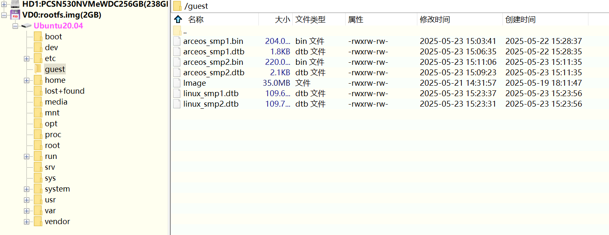

1. `mkdir rootfs`

2. `sudo mount rockdev/rootfs.ext4 rootfs`

3. `sudo mkdir rootfs/guest`

4. 复制相关客户机文件到 rootfs/guest 目录下即可

5. `sudo umount rootfs`

#### 烧写

替换完成相关文件之后，分别将修改之后的 `rootfs.img` 和 `boot.img` 烧写的对应的位置即可。最后上电启动开发板即可

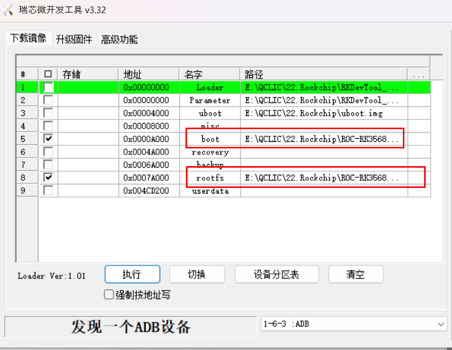

### 从内存部署

从内存部署是指在构建时已经将 AxVisor 镜像与 Linux 客户机镜像及其设备树打包在了一起，而只需要将 AxVisor 本身部署在 EVM3588 开发板上的 eMMC 存储器中，AxVisor 启动后从内存中加载 Linux 客户机镜像及其设备树进而启动 Linux 客户机的方式。

#### 修改 boot.img

使用 EVM3588 的 SDK 默认会生成一个独立的 `boot.img`，其中存放了 Linux 内核镜像、设备树等相关文件。我们需要将 `boot.img` 中的 Linux 内核镜像替换成我们的 AxVisor 的镜像，以此就可以实现让 Bootloader 加载运行 AxVisor 镜像。

`boot.img` 实际是一个 U-Boot 定义的 fitImage 格式的文件，不过，SDK 中并没有使用现成的 `.its` 配置文件来生成，而是调用 `kernel/scripts/mkimg` 脚本来生成 `boot.img`，直接使用该脚本会由于缺少某些环境变量而报错，这里我们就直接使用 `.its` 配置文件来生成 `boot.img`，效果是一样的。

1. 将 AxVisor 镜像复制到 SDK 根目录

2. 通过 `cat > boot.its` 创建一个 `kernel.its`，然后输入以下内容并按 Enter，最后使用 Ctrl + D 保存即可。其中指定了我们的 AxVisor 镜像（路径根据实际情况修改），设备树及其他文件都是直接借用 SDK 生成的相关文件
	```plaintext
	/*
	 * Copyright (C) 2021 Rockchip Electronics Co., Ltd
	 *
	 * SPDX-License-Identifier: GPL-2.0
	 */

	/dts-v1/;
	/ {
		description = "U-Boot FIT source file for arm";

		images {
			fdt {
				data = /incbin/("kernel/arch/arm64/boot/dts/rockchip/evm3588.dtb");
				type = "flat_dt";
				arch = "arm64";
				compression = "none";
				load = <0xffffff00>;

				hash {
					algo = "sha256";
				};
			};

			kernel {
				data = /incbin/("axvisor_aarch64-dyn.bin");
				type = "kernel";
				arch = "arm64";
				os = "linux";
				compression = "none";
				entry = <0xffffff01>;
				load = <0xffffff01>;

				hash {
					algo = "sha256";
				};
			};

			ramdisk {
				data = /incbin/("kernel/ramdisk.img");
				type = "ramdisk";
				arch = "arm64";
				os = "linux";
				compression = "none";
				load = <0xffffff02>;

				hash {
					algo = "sha256";
				};
			};

			resource {
				data = /incbin/("kernel/resource.img");
				type = "multi";
				arch = "arm64";
				compression = "none";

				hash {
					algo = "sha256";
				};
			};
		};

		configurations {
			default = "conf";

			conf {
				rollback-index = <0x00>;
				fdt = "fdt";
				kernel = "kernel";
				ramdisk = "ramdisk";
				multi = "resource";

				signature {
					algo = "sha256,rsa2048";
					padding = "pss";
					key-name-hint = "dev";
					sign-images = "fdt", "kernel", "ramdisk", "multi";
				};
			};
		};
	};
	```
3. 直接使用 `mkimage -f boot.its boot.img` 生成 fitImage 即可

#### 烧写

将上一步生成的 `boot.img` 以及用 SDK 生成原始的 `rootfs.img`（Linux 客户机启动之后会使用）烧写的对应的位置即可。最后上电启动开发板即可


