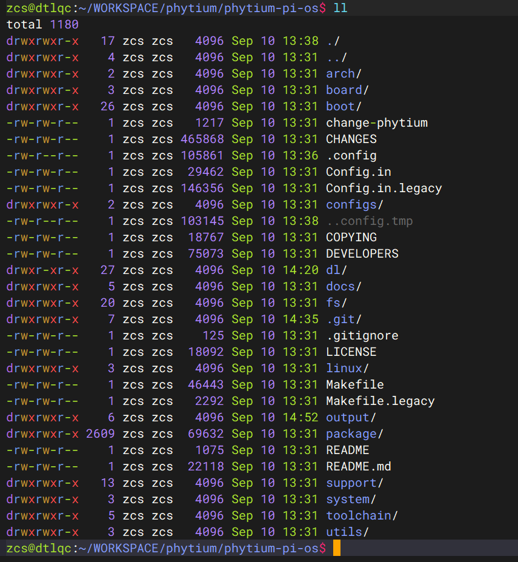
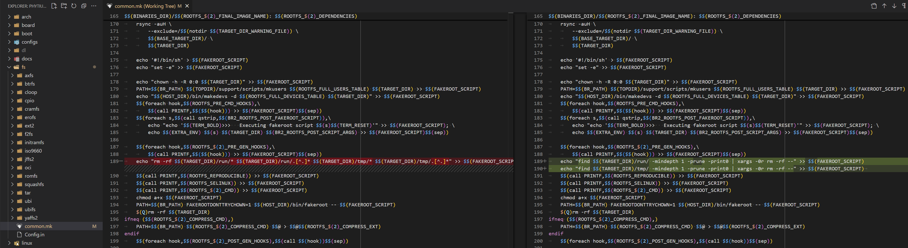
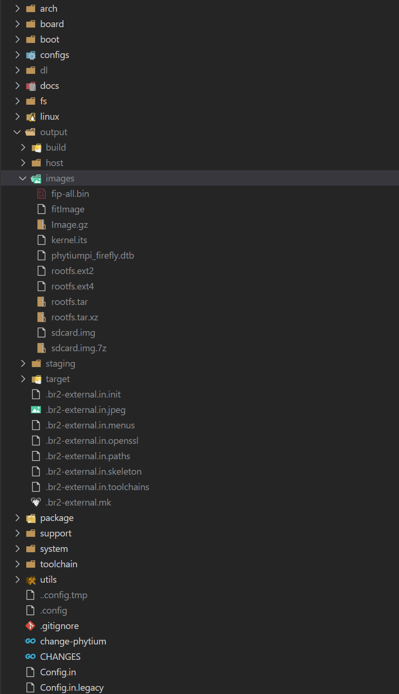

# 飞腾派

本文详细介绍 AxVisor + Linux 客户机、AxVisor + ArceOS 客户机 以及 AxVisor + Linux 客户机 和 ArceOS 客户机三种情况在飞腾派开发板上的构建、部署及运行！

## 开发环境

AxVisor 及飞腾派的 SDK 仅支持在 Linux 系统进中进行开发。本文中的构建及部署环境均采用 Ubuntu 24.04 系统作为开发环境。

## 构建

准备 AxVisor 镜像 + Linux 客户机镜像 + ArceOS 镜像。

### 构建 Linux 客户机镜像

根据飞腾派开发板官方文档，构建 Linux 客户机镜像。

#### 获取 SDK

从飞腾官方 Gitee 仓库下载飞腾派官方 OS 构建系统 `git clone https://gitee.com/phytium_embedded/phytium-pi-os.git` 以此来构建相关镜像，下载的 Phytium-Pi-OS 实际上是基于 Buildroot 移植适配的构建系统。



其中，master 分支是基于 Buildroot 2022.02 版本的，默认适配了 Linux 5.10 和 Linux 4.19 内核版本，而 2024.02 分支是基于 Buildroot 2024.02 版本的，默认适配了 Linux 6.6 内核版本。

#### 构建过程

1. 执行 `make phytiumpi_desktop_defconfig` 生成配置文件。官方 SDK 给出了多种不同配置文件，根据需要选择即可。

2. master 分支的 Buildroot 版本比较旧，在 Ubuntu 24.04 上构建会出错，需要如下修复

    

3. 执行 `make` 启动构建，整个系统基于 Debian 构建的，构建完成后 `output` 目录下生成相关镜像
 
    

### 构建 ArceOS 客户机镜像

1. 直接 `git clone https://github.com/arceos-hypervisor/arceos -b hypervisor` 获取源码

2. 执行 `make A=examples/helloworld PLATFORM=aarch64-dyn SMP=1 LOG=info` 构建 ArceOS 镜像。注意，其中的参数 `SMP=1` 需要与客户机配置文件中分配的 CPU 数量一致！

### 构建 AxVisor 镜像

#### 准备客户机设备树

在 AxVisor 源码的 `configs/vms` 目录下有适用于飞腾派开发板的设备树源码文件 `linux-aarch64-e2000_smp1.dts`、`linux-aarch64-e2000_smp2.dts`、`arceos-aarch64-e2000_smp1.dts`、`arceos-aarch64-e2000_smp2.dts`，根据需要选择即可。

1. 客户机设备树也是一个文件文件，其中记录了实际传递给客户机的设备信息，其中的 CPU、内存、设备信息等必须与客户机配置文件中的相对应。

2. 使用命令 `dtc -I dts -O dtb -o configs/vms/linux-aarch64-e2000_smp1.dtb configs/vms/linux-aarch64-e2000_smp1.dts` 编译为 DTB 来使用

#### 准备客户机配置文件

客户机配置文件是一个文本文件，其中不但记录了客户机的 ID 、镜像及设备树位置等基本信息，还记录了分配给它的 CPU 号、内存、设备等信息，AxVisor 根据客户机配置文件中的信息来加载启动客户机镜像。

在 AxVisor 源码的 `configs/vms` 目录下有适用于 ROC-e2000-PC 开发板的客户机配置文件 `linux-aarch64-e2000_smp1.toml`、`linux-aarch64-e2000_smp2.toml`、`arceos-aarch64-e2000_smp1.toml`、`arceos-aarch64-e2000_smp2.toml`，根据需要选择即可。

当前，AxVisor 支持从文件系统加载客户机镜像和从内存中加载客户机镜像两种方式，通过客户机配置文件中的 `image_location` 配置项进行区分，我们需要根据需求来修改配置文件。

- 从文件系统加载时，则确保如下配置项内容：
	- `image_location = "fs"`
	- `kernel_path = "/guest/Image"`， 这里需要配置为客户机镜像在 ROC-e2000-PC 开发板中的文件系统中的绝对路径，客户机镜像就是上一步 **构建 Linux 客户机镜像** 生成的 Linux 内核镜像 `kernel/arch/arm64/boot/Image`
	- `dtb_path = "/guest/linux-aarch64-e2000_smp1.dtb"`，这里配置为客户机设备树在 ROC-e2000-PC 开发板中的文件系统中的绝对路，客户机设备树就是上一步 **准备客户机设备树** 中构建的 DTB 文件

- 从内存加载时，则确保如下配置项内容：
	- `image_location = "memory"`
	- `kernel_path = "客户机镜像在当前构建环境中的绝对路径"`，客户机镜像就是上一步 **构建 Linux 客户机镜像** 生成的 Linux 内核镜像 `kernel/arch/arm64/boot/Image`
	- `dtb_path = "客户机设备树在当前构建环境中的绝对路径"`，客户机设备树就是上一步 **准备客户机设备树** 中构建的 DTB 文件

其他配置项根据需要自行修改，否则直接采用默认值即可！

#### 构建过程

1. 执行 `./axvisor.sh defconfig` 以设置开发环境并生成 AxVisor 配置文件 `.hvconfig.toml`。

2. 编辑生成的 `.hvconfig.toml`，将 `vmconfigs` 项设置为指向 Linux 的客户机配置文件（可同时设置多个），例如：
	```toml
	# Platform for Axvisor
	plat = "aarch64-generic"
	# Build arguments for ArceOS
	arceos_args = ["BUS=mmio", "LOG=debug"]
	# ArceOS additional features
	arceos_features = []
	vmconfigs = [ "configs/vms/linux-aarch64-e2000_smp1.toml",]
	```

3. 执行 `./axvisor.sh build` 构建 AxVisor 镜像。

## 部署

飞腾固件以及 U-boot 并不开源，Phytium-Pi-OS 中默认以二进制文件的形式提供飞腾固件 + U-Boot 固件组合体 `fip-all.bin`，`fip-all.bin` 会被直接写导入最终 IMAGE 镜像的开头位置。

### 从文件系统部署

从文件系统部署是指将 AxVisor 镜像和 Linux 客户机镜像及其设备树独立部署在飞腾派开发板上的 SD 存储器中，AxVisor 启动后从文件系统中加载 Linux 客户机镜像及其设备树进而启动 Linux 客户机的方式。

#### 修改 fitImage

对于飞腾派，Phytium-Pi-OS 默认使用 fitImage 作为内核格式。其会根据 `package/phyuboot/src/kernel.its` 中的描述用 mkimage 工具将相关镜像打包生成 fitImage 镜像。对于我们想要运行 AxViosr，则只需要修改 kernel.its 将 AxViosr 的镜像放进去，重新打包成 fitImage 即可

1. 修改 `kernel.its` 如下所示
    ```plaintext
    /*
    * Compilation:
    * mkimage -f fit_kernel_dtb.its fit_kernel_dtb.itb
    *
    * Files in linux build dir:
    * - arch/arm/boot/Image (zImage-old-ok)
    * - arch/arm/boot/dts/ft.dtb
    *
    * fatload usb 0:1 0x90100000 fit_kernel_dtb.itb
    * bootm 0x90100000#e2000
    *
    */

    /dts-v1/;
    / {
        description = "U-Boot fitImage for Phytium Phytiumpi";
        #address-cells = <1>;

        images {
            kernel {
                description = "AxViosr";
                data = /incbin/("axvisor_aarch64-dyn.bin");
                type = "kernel";
                arch = "arm64";
                os = "linux";
                compression = "none";
                load =  <0x80080000>;
                entry = <0x80080000>;
                hash-1 {
                    algo = "sha1";
                };
            };

            fdt-phytium {
                description = "FDT phytiumpi";
                data = /incbin/("phytiumpi_firefly.dtb");
                type = "flat_dt";
                arch = "arm64";
                compression = "none";
                hash-1 {
                    algo = "sha1";
                };
            };
        };

        configurations {
            default = "phytium@cecport";

            phytium {
                description = "phytimpi";
                kernel = "kernel";
                fdt = "fdt-phytium";
                hash-1 {
                    algo = "sha1";
                };
            };

        };
    };
    ```
2. 直接使用 `../host/bin/mkimage_phypi -f kernel.its ./input/fitImage` 生成 fitImage 即可

#### 生成 sdcard.img

对于飞腾派，phytium-linux-buildroot 其会根据 `board/phytium/genimage-sd.cfg` 中的描述用 genimage 工具来生成 sdcard.img。

1. 手动使用 `genimage` 来生成 sdcard.img 需要修改 `genimage-sd.cfg` 文件
    ```
    image sdcard.img {
            hdimage {
            }

            partition uboot {
                    in-partition-table = no
                    offset = 0
                    image = "fip-all.bin"
                    size = 4M
                    holes = {"(0; 512)"}
            }
            partition bootload {
                    in-partition-table = no
                    offset = 4M
                    image = "fitImage"
                    size = 60M
            }

            partition root {
                    partition-type = 0x83
                    image = "rootfs.ext2"
                    size = 5G
            }

    }
    ```

2. 执行 `../host/bin/genimage --inputpath ./input --outputpath ./output --config genimage-sd.cfg --tmppath ./tmp --rootpath ./root` 生成 `./output/sdcard.img`。注意，`./input` 中存放需要的 `fip-all.bin`、`fitImage`、`rootfs.ext2` 这三个镜像，`./tmp`、`./root` 及 `./output` 需要手动创建，在生成过程中会用到。

#### 添加客户机配置

我们需要在根文件系统中添加客户机的镜像及设备树文件。直接以 ext4 格式挂载 `output/firmware/sdcard.img` 镜像文件，然后在其中添加客户机配置文件即可

新建 `/guest` 目录中存放客户机配置文件、客户机镜像等文件，Hypervisor 默认会从 `/guest` 目录中加载客户机的文件进而启动客户机

#### 烧写

替换完成相关文件之后，将生成的 sdcard.img 烧写到 SD 卡后启动开发板即可

### 从内存部署

从内存部署是指在构建时已经将 AxVisor 镜像与 Linux 客户机镜像及其设备树打包在了一起，而只需要将 AxVisor 本身部署在 ROC-RK3568-PC 开发板上的 eMMC 存储器中，AxVisor 启动后从内存中加载 Linux 客户机镜像及其设备树进而启动 Linux 客户机的方式。

#### 修改 fitImage

对于飞腾派，Phytium-Pi-OS 默认使用 fitImage 作为内核格式。其会根据 `package/phyuboot/src/kernel.its` 中的描述用 mkimage 工具将相关镜像打包生成 fitImage 镜像。对于我们想要运行 AxViosr，则只需要修改 kernel.its 将 AxViosr 的镜像放进去，重新打包成 fitImage 即可

1. 修改 `kernel.its` 如下所示
    ```plaintext
    /*
    * Compilation:
    * mkimage -f fit_kernel_dtb.its fit_kernel_dtb.itb
    *
    * Files in linux build dir:
    * - arch/arm/boot/Image (zImage-old-ok)
    * - arch/arm/boot/dts/ft.dtb
    *
    * fatload usb 0:1 0x90100000 fit_kernel_dtb.itb
    * bootm 0x90100000#e2000
    *
    */

    /dts-v1/;
    / {
        description = "U-Boot fitImage for Phytium Phytiumpi";
        #address-cells = <1>;

        images {
            kernel {
                description = "AxViosr";
                data = /incbin/("axvisor_aarch64-dyn.bin");
                type = "kernel";
                arch = "arm64";
                os = "linux";
                compression = "none";
                load =  <0x80080000>;
                entry = <0x80080000>;
                hash-1 {
                    algo = "sha1";
                };
            };

            fdt-phytium {
                description = "FDT phytiumpi";
                data = /incbin/("phytiumpi_firefly.dtb");
                type = "flat_dt";
                arch = "arm64";
                compression = "none";
                hash-1 {
                    algo = "sha1";
                };
            };
        };

        configurations {
            default = "phytium@cecport";

            phytium {
                description = "phytimpi";
                kernel = "kernel";
                fdt = "fdt-phytium";
                hash-1 {
                    algo = "sha1";
                };
            };

        };
    };
    ```
2. 直接使用 `../host/bin/mkimage_phypi -f kernel.its ./input/fitImage` 生成 fitImage 即可

#### 生成 sdcard.img

对于飞腾派，phytium-linux-buildroot 其会根据 `board/phytium/genimage-sd.cfg` 中的描述用 genimage 工具来生成 sdcard.img。

1. 手动使用 `genimage` 来生成 sdcard.img 需要修改 `genimage-sd.cfg` 文件
    ```
    image sdcard.img {
            hdimage {
            }

            partition uboot {
                    in-partition-table = no
                    offset = 0
                    image = "fip-all.bin"
                    size = 4M
                    holes = {"(0; 512)"}
            }
            partition bootload {
                    in-partition-table = no
                    offset = 4M
                    image = "fitImage"
                    size = 60M
            }

            partition root {
                    partition-type = 0x83
                    image = "rootfs.ext2"
                    size = 5G
            }

    }
    ```

2. 执行 `../host/bin/genimage --inputpath ./input --outputpath ./output --config genimage-sd.cfg --tmppath ./tmp --rootpath ./root` 生成 `./output/sdcard.img`。注意，`./input` 中存放需要的 `fip-all.bin`、`fitImage`、`rootfs.ext2` 这三个镜像，`./tmp`、`./root` 及 `./output` 需要手动创建，在生成过程中会用到。

#### 烧写

替换完成相关文件之后，将生成的 sdcard.img 烧写到 SD 卡后启动开发板即可
