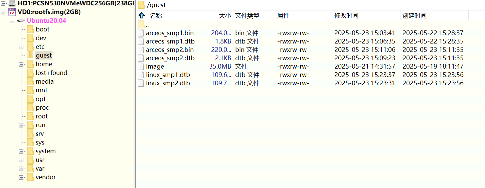

# ROC-RK3568-PC

本文详细介绍 AxVisor + Linux 客户机、AxVisor + ArceOS 客户机 以及 AxVisor + Linux 客户机 和 ArceOS 客户机三种情况在 ROC-RK3568-PC 开发板上的构建、部署及运行！

## 开发环境

AxVisor 及 ROC-RK3568-PC 的 SDK 仅支持在 Linux 系统进中进行开发。本文中的构建及部署环境均采用 Ubuntu 24.04 系统作为开发环境。

1. ROC-RK3568-PC 的 SDK 本身不支持使用 Python3 来构建，需要稍加修改，文中会给出相关修改

2. **如果不使用 Python3 环境，则需要手动安装 Python2 环境**，因为很多新的 Linux 发行版本，例如， Ubuntu 24.04，默认已经不提供 Python2 的相关包了

## 构建

准备 AxVisor 镜像 + Linux 客户机镜像。

### 构建 Linux 客户机镜像

根据 ROC-RK3568-PC 开发板[官方文档](https://wiki.t-firefly.com/ROC-RK3568-PC/index.html)，构建 Linux 客户机镜像。

#### 获取 SDK

下载 Firefly 提供的 [SDK](https://www.t-firefly.com/doc/download/107.html)（整个文件夹）。下载的 SDK 实际上是由 `repo` 工具管理的一个仓库的源码的压缩包（一个 TAG 版本）及相关说明文档，需要解压之后再使用 `repo` 命令来恢复 SDK 的内容。


1. 执行 `chmod +x ./sdk_tools.sh` 给脚本执行权限。 

2. 执行 `mkdir ../firefly_rk3568_sdk` 在当前压缩包的上一级目录创建一个文件夹，存放实际 SDK 内容。

3. 执行 `./sdk_tools.sh --unpack -C ../firefly_rk3568_sdk` 解压 SDK 仓库压缩包。其中实际上只有一个 `.repo` 文件夹，需要进一步恢复 SDK 内容

	

4. 使用 `./sdk_tools.sh --sync -C ../firefly_rk3568_sdk` 命令恢复 SDK 内容。
	

	也可以 `cd ../firefly_rk3568_sdk` 之后，手动执行如下命令：
    ```bash
    .repo/repo/repo sync -l
    .repo/repo/repo start firefly --all
    ```
    **注意：** 如果当前构建环境系统中 Python 版本是 3.12 及以上，由于 SDK 中的 `repo` 版本比较旧，则需要进行修改才能适配 Python 的 3.10 及以上版本
    1. 编辑 `../firefly_rk3568_sdk/.repo/repo/main.py` 中的如下所示的内容(`imp` 在 Python 的 3.4 版本中被标记为过时（由 `importlib` 代替），并最终在 3.12 版本中被删除)：

		

    2. 新建 `.repo/repo/formatter.py` 文件（Python 3.10 及以上版本中 `formatter.py` 过时已经被删除），并在其中输入以下内容：
		```python
		"""Generic output formatting.
		Formatter objects transform an abstract flow of formatting events into
		specific output events on writer objects. Formatters manage several stack
		structures to allow various properties of a writer object to be changed and
		restored; writers need not be able to handle relative changes nor any sort
		of ``change back'' operation. Specific writer properties which may be
		controlled via formatter objects are horizontal alignment, font, and left
		margin indentations. A mechanism is provided which supports providing
		arbitrary, non-exclusive style settings to a writer as well. Additional
		interfaces facilitate formatting events which are not reversible, such as
		paragraph separation.
		Writer objects encapsulate device interfaces. Abstract devices, such as
		file formats, are supported as well as physical devices. The provided
		implementations all work with abstract devices. The interface makes
		available mechanisms for setting the properties which formatter objects
		manage and inserting data into the output.
		"""
		 
		import sys
		import warnings
		warnings.warn('the formatter module is deprecated', DeprecationWarning,
		              stacklevel=2)
		 
		 
		AS_IS = None
		 
		 
		class NullFormatter:
		    """A formatter which does nothing.
		    If the writer parameter is omitted, a NullWriter instance is created.
		    No methods of the writer are called by NullFormatter instances.
		    Implementations should inherit from this class if implementing a writer
		    interface but don't need to inherit any implementation.
		    """
		 
		    def __init__(self, writer=None):
		        if writer is None:
		            writer = NullWriter()
		        self.writer = writer
		    def end_paragraph(self, blankline): pass
		    def add_line_break(self): pass
		    def add_hor_rule(self, *args, **kw): pass
		    def add_label_data(self, format, counter, blankline=None): pass
		    def add_flowing_data(self, data): pass
		    def add_literal_data(self, data): pass
		    def flush_softspace(self): pass
		    def push_alignment(self, align): pass
		    def pop_alignment(self): pass
		    def push_font(self, x): pass
		    def pop_font(self): pass
		    def push_margin(self, margin): pass
		    def pop_margin(self): pass
		    def set_spacing(self, spacing): pass
		    def push_style(self, *styles): pass
		    def pop_style(self, n=1): pass
		    def assert_line_data(self, flag=1): pass
		 
		 
		class AbstractFormatter:
		    """The standard formatter.
		    This implementation has demonstrated wide applicability to many writers,
		    and may be used directly in most circumstances.  It has been used to
		    implement a full-featured World Wide Web browser.
		    """
		 
		    #  Space handling policy:  blank spaces at the boundary between elements
		    #  are handled by the outermost context.  "Literal" data is not checked
		    #  to determine context, so spaces in literal data are handled directly
		    #  in all circumstances.
		 
		    def __init__(self, writer):
		        self.writer = writer            # Output device
		        self.align = None               # Current alignment
		        self.align_stack = []           # Alignment stack
		        self.font_stack = []            # Font state
		        self.margin_stack = []          # Margin state
		        self.spacing = None             # Vertical spacing state
		        self.style_stack = []           # Other state, e.g. color
		        self.nospace = 1                # Should leading space be suppressed
		        self.softspace = 0              # Should a space be inserted
		        self.para_end = 1               # Just ended a paragraph
		        self.parskip = 0                # Skipped space between paragraphs?
		        self.hard_break = 1             # Have a hard break
		        self.have_label = 0
		 
		    def end_paragraph(self, blankline):
		        if not self.hard_break:
		            self.writer.send_line_break()
		            self.have_label = 0
		        if self.parskip < blankline and not self.have_label:
		            self.writer.send_paragraph(blankline - self.parskip)
		            self.parskip = blankline
		            self.have_label = 0
		        self.hard_break = self.nospace = self.para_end = 1
		        self.softspace = 0
		 
		    def add_line_break(self):
		        if not (self.hard_break or self.para_end):
		            self.writer.send_line_break()
		            self.have_label = self.parskip = 0
		        self.hard_break = self.nospace = 1
		        self.softspace = 0
		 
		    def add_hor_rule(self, *args, **kw):
		        if not self.hard_break:
		            self.writer.send_line_break()
		        self.writer.send_hor_rule(*args, **kw)
		        self.hard_break = self.nospace = 1
		        self.have_label = self.para_end = self.softspace = self.parskip = 0
		 
		    def add_label_data(self, format, counter, blankline = None):
		        if self.have_label or not self.hard_break:
		            self.writer.send_line_break()
		        if not self.para_end:
		            self.writer.send_paragraph((blankline and 1) or 0)
		        if isinstance(format, str):
		            self.writer.send_label_data(self.format_counter(format, counter))
		        else:
		            self.writer.send_label_data(format)
		        self.nospace = self.have_label = self.hard_break = self.para_end = 1
		        self.softspace = self.parskip = 0
		 
		    def format_counter(self, format, counter):
		        label = ''
		        for c in format:
		            if c == '1':
		                label = label + ('%d' % counter)
		            elif c in 'aA':
		                if counter > 0:
		                    label = label + self.format_letter(c, counter)
		            elif c in 'iI':
		                if counter > 0:
		                    label = label + self.format_roman(c, counter)
		            else:
		                label = label + c
		        return label
		 
		    def format_letter(self, case, counter):
		        label = ''
		        while counter > 0:
		            counter, x = divmod(counter-1, 26)
		            # This makes a strong assumption that lowercase letters
		            # and uppercase letters form two contiguous blocks, with
		            # letters in order!
		            s = chr(ord(case) + x)
		            label = s + label
		        return label
		 
		    def format_roman(self, case, counter):
		        ones = ['i', 'x', 'c', 'm']
		        fives = ['v', 'l', 'd']
		        label, index = '', 0
		        # This will die of IndexError when counter is too big
		        while counter > 0:
		            counter, x = divmod(counter, 10)
		            if x == 9:
		                label = ones[index] + ones[index+1] + label
		            elif x == 4:
		                label = ones[index] + fives[index] + label
		            else:
		                if x >= 5:
		                    s = fives[index]
		                    x = x-5
		                else:
		                    s = ''
		                s = s + ones[index]*x
		                label = s + label
		            index = index + 1
		        if case == 'I':
		            return label.upper()
		        return label
		 
		    def add_flowing_data(self, data):
		        if not data: return
		        prespace = data[:1].isspace()
		        postspace = data[-1:].isspace()
		        data = " ".join(data.split())
		        if self.nospace and not data:
		            return
		        elif prespace or self.softspace:
		            if not data:
		                if not self.nospace:
		                    self.softspace = 1
		                    self.parskip = 0
		                return
		            if not self.nospace:
		                data = ' ' + data
		        self.hard_break = self.nospace = self.para_end = \
		                          self.parskip = self.have_label = 0
		        self.softspace = postspace
		        self.writer.send_flowing_data(data)
		 
		    def add_literal_data(self, data):
		        if not data: return
		        if self.softspace:
		            self.writer.send_flowing_data(" ")
		        self.hard_break = data[-1:] == '\n'
		        self.nospace = self.para_end = self.softspace = \
		                       self.parskip = self.have_label = 0
		        self.writer.send_literal_data(data)
		 
		    def flush_softspace(self):
		        if self.softspace:
		            self.hard_break = self.para_end = self.parskip = \
		                              self.have_label = self.softspace = 0
		            self.nospace = 1
		            self.writer.send_flowing_data(' ')
		 
		    def push_alignment(self, align):
		        if align and align != self.align:
		            self.writer.new_alignment(align)
		            self.align = align
		            self.align_stack.append(align)
		        else:
		            self.align_stack.append(self.align)
		 
		    def pop_alignment(self):
		        if self.align_stack:
		            del self.align_stack[-1]
		        if self.align_stack:
		            self.align = align = self.align_stack[-1]
		            self.writer.new_alignment(align)
		        else:
		            self.align = None
		            self.writer.new_alignment(None)
		 
		    def push_font(self, font):
		        size, i, b, tt = font
		        if self.softspace:
		            self.hard_break = self.para_end = self.softspace = 0
		            self.nospace = 1
		            self.writer.send_flowing_data(' ')
		        if self.font_stack:
		            csize, ci, cb, ctt = self.font_stack[-1]
		            if size is AS_IS: size = csize
		            if i is AS_IS: i = ci
		            if b is AS_IS: b = cb
		            if tt is AS_IS: tt = ctt
		        font = (size, i, b, tt)
		        self.font_stack.append(font)
		        self.writer.new_font(font)
		 
		    def pop_font(self):
		        if self.font_stack:
		            del self.font_stack[-1]
		        if self.font_stack:
		            font = self.font_stack[-1]
		        else:
		            font = None
		        self.writer.new_font(font)
		 
		    def push_margin(self, margin):
		        self.margin_stack.append(margin)
		        fstack = [m for m in self.margin_stack if m]
		        if not margin and fstack:
		            margin = fstack[-1]
		        self.writer.new_margin(margin, len(fstack))
		 
		    def pop_margin(self):
		        if self.margin_stack:
		            del self.margin_stack[-1]
		        fstack = [m for m in self.margin_stack if m]
		        if fstack:
		            margin = fstack[-1]
		        else:
		            margin = None
		        self.writer.new_margin(margin, len(fstack))
		 
		    def set_spacing(self, spacing):
		        self.spacing = spacing
		        self.writer.new_spacing(spacing)
		 
		    def push_style(self, *styles):
		        if self.softspace:
		            self.hard_break = self.para_end = self.softspace = 0
		            self.nospace = 1
		            self.writer.send_flowing_data(' ')
		        for style in styles:
		            self.style_stack.append(style)
		        self.writer.new_styles(tuple(self.style_stack))
		 
		    def pop_style(self, n=1):
		        del self.style_stack[-n:]
		        self.writer.new_styles(tuple(self.style_stack))
		 
		    def assert_line_data(self, flag=1):
		        self.nospace = self.hard_break = not flag
		        self.para_end = self.parskip = self.have_label = 0
		 
		 
		class NullWriter:
		    """Minimal writer interface to use in testing & inheritance.
		    A writer which only provides the interface definition; no actions are
		    taken on any methods.  This should be the base class for all writers
		    which do not need to inherit any implementation methods.
		    """
		    def __init__(self): pass
		    def flush(self): pass
		    def new_alignment(self, align): pass
		    def new_font(self, font): pass
		    def new_margin(self, margin, level): pass
		    def new_spacing(self, spacing): pass
		    def new_styles(self, styles): pass
		    def send_paragraph(self, blankline): pass
		    def send_line_break(self): pass
		    def send_hor_rule(self, *args, **kw): pass
		    def send_label_data(self, data): pass
		    def send_flowing_data(self, data): pass
		    def send_literal_data(self, data): pass
		 
		 
		class AbstractWriter(NullWriter):
		    """A writer which can be used in debugging formatters, but not much else.
		    Each method simply announces itself by printing its name and
		    arguments on standard output.
		    """
		 
		    def new_alignment(self, align):
		        print("new_alignment(%r)" % (align,))
		 
		    def new_font(self, font):
		        print("new_font(%r)" % (font,))
		 
		    def new_margin(self, margin, level):
		        print("new_margin(%r, %d)" % (margin, level))
		 
		    def new_spacing(self, spacing):
		        print("new_spacing(%r)" % (spacing,))
		 
		    def new_styles(self, styles):
		        print("new_styles(%r)" % (styles,))
		 
		    def send_paragraph(self, blankline):
		        print("send_paragraph(%r)" % (blankline,))
		 
		    def send_line_break(self):
		        print("send_line_break()")
		 
		    def send_hor_rule(self, *args, **kw):
		        print("send_hor_rule()")
		 
		    def send_label_data(self, data):
		        print("send_label_data(%r)" % (data,))
		 
		    def send_flowing_data(self, data):
		        print("send_flowing_data(%r)" % (data,))
		 
		    def send_literal_data(self, data):
		        print("send_literal_data(%r)" % (data,))
		 
		 
		class DumbWriter(NullWriter):
		    """Simple writer class which writes output on the file object passed in
		    as the file parameter or, if file is omitted, on standard output.  The
		    output is simply word-wrapped to the number of columns specified by
		    the maxcol parameter.  This class is suitable for reflowing a sequence
		    of paragraphs.
		    """
		 
		    def __init__(self, file=None, maxcol=72):
		        self.file = file or sys.stdout
		        self.maxcol = maxcol
		        NullWriter.__init__(self)
		        self.reset()
		 
		    def reset(self):
		        self.col = 0
		        self.atbreak = 0
		 
		    def send_paragraph(self, blankline):
		        self.file.write('\n'*blankline)
		        self.col = 0
		        self.atbreak = 0
		 
		    def send_line_break(self):
		        self.file.write('\n')
		        self.col = 0
		        self.atbreak = 0
		 
		    def send_hor_rule(self, *args, **kw):
		        self.file.write('\n')
		        self.file.write('-'*self.maxcol)
		        self.file.write('\n')
		        self.col = 0
		        self.atbreak = 0
		 
		    def send_literal_data(self, data):
		        self.file.write(data)
		        i = data.rfind('\n')
		        if i >= 0:
		            self.col = 0
		            data = data[i+1:]
		        data = data.expandtabs()
		        self.col = self.col + len(data)
		        self.atbreak = 0
		 
		    def send_flowing_data(self, data):
		        if not data: return
		        atbreak = self.atbreak or data[0].isspace()
		        col = self.col
		        maxcol = self.maxcol
		        write = self.file.write
		        for word in data.split():
		            if atbreak:
		                if col + len(word) >= maxcol:
		                    write('\n')
		                    col = 0
		                else:
		                    write(' ')
		                    col = col + 1
		            write(word)
		            col = col + len(word)
		            atbreak = 1
		        self.col = col
		        self.atbreak = data[-1].isspace()
		 
		 
		def test(file = None):
		    w = DumbWriter()
		    f = AbstractFormatter(w)
		    if file is not None:
		        fp = open(file)
		    elif sys.argv[1:]:
		        fp = open(sys.argv[1])
		    else:
		        fp = sys.stdin
		    try:
		        for line in fp:
		            if line == '\n':
		                f.end_paragraph(1)
		            else:
		                f.add_flowing_data(line)
		    finally:
		        if fp is not sys.stdin:
		            fp.close()
		    f.end_paragraph(0)
		 
		 
		if __name__ == '__main__':
		    test()
		```

1. 更新 SDK。上面的 4 个步骤只需要执行一次，后续更新则都在 `firefly_rk3568_sdk` 目录中执行 `.repo/repo/repo sync -c --no-tags`

	

#### 构建过程

1. 首先 `sudo apt install git ssh make gcc libssl-dev liblz4-tool expect expect-dev g++ patchelf chrpath gawk texinfo chrpath diffstat binfmt-support qemu-user-static live-build bison flex fakeroot cmake gcc-multilib g++-multilib unzip device-tree-compiler ncurses-dev libgucharmap-2-90-dev bzip2 expat cpp-aarch64-linux-gnu libgmp-dev libmpc-dev bc python-is-python3` 安装依赖工具包。
	> 如果使用 Python2 环境，则不要安装 `python-is-python3` 这个包

2. 默认的构建使用官方预编译（SDK 不支持从源码构建）的 Ubuntu 的 rootfs 来打包相关镜像。因此需要首先下载并放置到 SDK 根目路的 `prebuilt_rootfs` 文件夹中
	1. 从 https://www.t-firefly.com/doc/download/107.html 中给出网盘中下载任意一个 rootfs 镜像，例如 `Ubuntu20.04-xxx_RK3568_KERNEL-5.10_xxx.7z`
	2. 执行 `7z x Ubuntu20.04-xxx_RK3568_KERNEL-5.10_xxx.7z` 解压到 SDK 根目录的 `prebuilt_rootfs`（需自行创建） 中，并将其命名为 `rk356x_ubuntu_rootfs.img`

3. ROC-RK3568-PC 的 SDK 不支持使用 Python3 来构建，如果当前构建环境系统中 Python 版本是 Python3 版本，则需要修改 `u-boot/make.sh` 中的如下位置来取消对于 Python2 的检测即可：
	

4. 直接 `make` 或者 `./build.sh`，然后选择 `firefly_rk3568_roc-rk3568-pc_ubuntu_defconfig` 对应编号 30 号进行构建即可。正常编译完成之后，就会在 `output` 目录下生成各个镜像文件，我们需要编辑某些镜像，将其中的文件替换或添加成我们自己的文件
	

### 构建 ArceOS 客户机镜像

1. 直接 `git clone https://github.com/arceos-hypervisor/arceos -b hypervisor` 获取源码

2. 执行 `make A=examples/helloworld PLATFORM=aarch64-dyn SMP=1 LOG=info` 构建 ArceOS 镜像。注意，其中的参数 `SMP=1` 需要与客户机配置文件中分配的 CPU 数量一致！

### 构建 AxVisor 镜像

#### 准备客户机设备树

在 AxVisor 源码的 `configs/vms` 目录下有适用于 ROC-RK3568-PC 开发板的设备树源码文件 `linux-aarch64-rk3568_smp1.dts`、`linux-aarch64-rk3568_smp2.dts`、`arceos-aarch64-rk3568_smp1.dts`、`arceos-aarch64-rk3568_smp2.dts`，根据需要选择即可。

1. 客户机设备树也是一个文件文件，其中记录了实际传递给客户机的设备信息，其中的 CPU、内存、设备信息等必须与客户机配置文件中的相对应。

2. 使用命令 `dtc -I dts -O dtb -o configs/vms/linux-aarch64-rk3568_smp1.dtb configs/vms/linux-aarch64-rk3568_smp1.dts` 编译为 DTB 来使用

#### 准备客户机配置文件

客户机配置文件是一个文本文件，其中不但记录了客户机的 ID 、镜像及设备树位置等基本信息，还记录了分配给它的 CPU 号、内存、设备等信息，AxVisor 根据客户机配置文件中的信息来加载启动客户机镜像。

在 AxVisor 源码的 `configs/vms` 目录下有适用于 ROC-RK3568-PC 开发板的客户机配置文件 `linux-aarch64-rk3568_smp1.toml`、`linux-aarch64-rk3568_smp2.toml`、`arceos-aarch64-rk3568_smp1.toml`、`arceos-aarch64-rk3568_smp2.toml`，根据需要选择即可。

当前，AxVisor 支持从文件系统加载客户机镜像和从内存中加载客户机镜像两种方式，通过客户机配置文件中的 `image_location` 配置项进行区分，我们需要根据需求来修改配置文件。

-  从文件系统加载时，则确保如下配置项内容：
	- `image_location = "fs"`
	- `kernel_path = "/guest/Image"`， 这里需要配置为客户机镜像在 ROC-RK3568-PC 开发板中的文件系统中的绝对路径，客户机镜像就是上一步 **构建 Linux 客户机镜像** 生成的 Linux 内核镜像 `kernel/arch/arm64/boot/Image`
	- `dtb_path = "/guest/linux-aarch64-rk3568_smp1.dtb"`，这里配置为客户机设备树在 ROC-RK3568-PC 开发板中的文件系统中的绝对路，客户机设备树就是上一步 **准备客户机设备树** 中构建的 DTB 文件

- 从内存加载时，则确保如下配置项内容：
	- `image_location = "memory"`
	- `kernel_path = "客户机镜像在当前构建环境中的绝对路径"`，客户机镜像就是上一步 **构建 Linux 客户机镜像** 生成的 Linux 内核镜像 `kernel/arch/arm64/boot/Image`
	- `dtb_path = "客户机设备树在当前构建环境中的绝对路径"`，客户机设备树就是上一步 **准备客户机设备树** 中构建的 DTB 文件

其他配置项根据需要自行修改，否则直接采用默认值即可！

#### 构建过程

1. 执行 `./axvisor.sh defconfig` 以设置开发环境并生成 AxVisor 配置文件 `.hvconfig.toml`。

2. 编辑生成的 `.hvconfig.toml`，将 `vmconfigs` 项设置为指向 Linux 的客户机配置文件，例如：
	```toml
	# Platform for Axvisor
	plat = "aarch64-generic"
	# Build arguments for ArceOS
	arceos_args = ["BUS=mmio", "LOG=debug"]
	# ArceOS additional features
	arceos_features = []
	vmconfigs = [ "configs/vms/linux-aarch64-rk3568_smp1.toml",]
	```

3. 执行 `./axvisor.sh build` 构建 AxVisor 镜像。

## 部署

由于瑞芯微提供的 SDK 对整个部署方式进行了预定义，难以实现自定义部署方式，因此，我们通过构建后编辑瑞芯微原生镜像的方式来实现部署。

### 从文件系统部署

从文件系统部署是指将 AxVisor 镜像和 Linux 客户机镜像及其设备树独立部署在 ROC-RK3568-PC 开发板上的 eMMC 存储器中，AxVisor 启动后从文件系统中加载 Linux 客户机镜像及其设备树进而启动 Linux 客户机的方式。

#### 修改 boot.img

使用 ROC-RK3568-PC 的 SDK 默认会生成一个独立的 `boot.img`，其中存放了 Linux 内核镜像、设备树等相关文件。我们需要将 `boot.img` 中的 Linux 内核镜像替换成我们的 AxVisor 的镜像，以此就可以实现让 Bootloader 加载运行 AxVisor 镜像。

`boot.img` 实际是一个 ext4 文件系统镜像，直接以 ext4 格式挂载 `output/firmware/boot.img` 镜像文件，然后在其中添加客户机配置文件即可

1. 挂载 boot.img。`mkdir boot`，`sudo mount boot.img boot`

2. 复制 AxVisor 镜像。`sudo cp axvisor_aarch64-generic.bin boot/Image-5.10.198`，这里我们直接重命名 AxVisor 镜像并覆盖原有的 Linux 内核镜像！

3. 卸载。`sudo umount boot`

#### 添加客户机配置

我们需要在根文件系统中添加客户机的镜像及设备树文件。直接以 ext4 格式挂载 `output/firmware/rootfs.img` 镜像文件，然后在其中添加客户机配置文件即可



新建 `/guest` 目录中存放客户机配置文件、客户机镜像等文件，Hypervisor 默认会从 `/guest` 目录中加载客户机的文件进而启动客户机

#### 烧写

替换完成相关文件之后，分别将修改之后的 `rootfs.img` 和 `boot.img` 烧写的对应的位置即可。最后上电启动开发板即可


### 从内存部署

从内存部署是指在构建时已经将 AxVisor 镜像与 Linux 客户机镜像及其设备树打包在了一起，而只需要将 AxVisor 本身部署在 ROC-RK3568-PC 开发板上的 eMMC 存储器中，AxVisor 启动后从内存中加载 Linux 客户机镜像及其设备树进而启动 Linux 客户机的方式。

#### 修改 boot.img

使用 ROC-RK3568-PC 的 SDK 生成了一个独立的 `boot.img`，其中存放了 Linux 内核镜像、设备树等相关文件。我们需要将 `boot.img` 中的 Linux 内核镜像替换成我们的 AxVisor 的镜像，以此就可以实现让 Bootloader 加载运行 AxVisor 镜像。

`boot.img` 实际是一个 ext4 文件系统镜像，直接以 ext4 格式挂载 `output/firmware/boot.img` 镜像文件，然后在其中添加客户机配置文件即可

1. 挂载 boot.img。`mkdir boot`，`sudo mount boot.img boot`

2. 复制 AxVisor 镜像。`sudo cp axvisor_aarch64-generic.bin boot/Image-5.10.198`，这里我们直接重命名 AxVisor 镜像并覆盖原有的 Linux 内核镜像！

3. 卸载。`sudo umount boot`

#### 烧写

替换完成相关文件之后，分别将修改之后的 `rootfs.img` 和用 SDK 生成原始的 `boot.img`（Linux 客户机启动之后会使用） 烧写的对应的位置即可。最后上电启动开发板即可


